===========================
云时代的软件
===========================

.. container:: center

   CZUG.org 

   易度网： everydo.com

   潘俊勇

   广州Python沙龙 - 2009/11/13

.. footer:: 广州Python沙龙 易度工作平台 everydo.com - 2009/11/14

回望动荡的软件革命历史（一）
==================================
每次革命，意味着牺牲的发生，久的体系淘汰，新的登上舞台

.. class:: incremental

- 石器时代： 计算机改变世界

- 桌面软件： 个人电脑改变世界

  比如office，杀毒、游戏。

- C/S 软件: 网络改变世界

  最早都是数据库软件，需要安装服务器。

回望动荡的软件革命历史（二）
==================================

.. class:: incremental

- B/S 结构: 浏览器改变世界

- 手机软件: 移动网络改变世界

  手机成为新的软件终端平台。

- 云计算软件: 互联网改变世界

  所有的软件都可以放到互联网上来运行

云 ？
=================

.. container:: center

   .. image:: img/cloud.png

   .. class:: incremental

   - 云 就是 网络
   - 云 就是 互联网

计算 ？
======================
.. class:: incremental

- 计算机系统
- 硬件： 

  - cpu 
  - 存储 ...

- 软件：

  - 操作系统
  - 应用软件
  - 应用服务器
  - 开发平台 ...

云计算 ？
================
.. class:: incremental

潘氏定义：

.. class:: incremental

   将传统的计算机系统的部分或全部，以网络(互联网)服务的方式提供

   这是因为互联网的发展，而导致的软件的一次新革命

   对软件的开发、部署、商业模式，乃至整个软件生态圈，将产生重大的变革。

   开发商、程序员、用户、集成商，都将面临新的挑战。

革谁的命 ?
============================
.. class:: incremental

- 包括你我吗？
- 同时也是机会！

迎接云时代
=====================
演讲内容

.. class:: incremental

- 云发展史

- 云供应商

- 未来云世界

- 云商业模式的转变

- 云产品的转变

- 云开发模式的转变

- PaaS中的脚本开发

云的发展趋势
=========================
.. class:: incremental

- 由单一到多种： 软件套件
- 由应用到平台： SaaS -> PaaS
- 由应用到低层： 开发环境
- 由软件到硬件

云的发展史：前云
=========================
.. class:: incremental

- email:  hotmail
- ASP时代：商务领航
- web2.0 社区: remember the milk、忙吧...

云的发展史：SaaS
============================
.. class:: incremental

- SaaS软件： Software as a service

  租用模式的软件，软件运营

  - 个人软件：在线office、在线日程
  - 工具软件：传真发送
  - 企业软件：CRM、进销存

- SaaS套件：同时做多个产品，天然集成

  37信号、伟库、用友、xtools

云的发展史：平台化
============================
.. class:: incremental

- SaaS超市：第三方的SaaS运营平台

  阿里软件，神码在线、橙子在线、风云在线

- PaaS平台： **脚本开发** ，想要多少做多少

  salesforce、 netsuite、易度、800客

云的发展史：重建根基
================================
.. class:: incremental

- 基础开发环境云化：

  - Google : GAE， python/java
  - MS : Azure， .net

- 硬件云化：

  - 主机和存储租用：Amazon，世纪互联
  - 企业云计算平台: vmware

认识云时代先驱: 国外
=======================
.. class:: incremental

- 亚马逊： 云母
- Google： 云中的未来天空之城
- 微软：   不甘落后的前统治者
- Salesforce： 当代云帝
- netsuite：ERP领域的云王
- zoho：   超大动力者
- 37信号： 为小公司服务的小公司

salesforce
=================
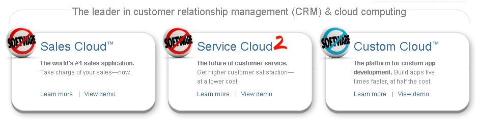

zoho
==================

37singals
=================
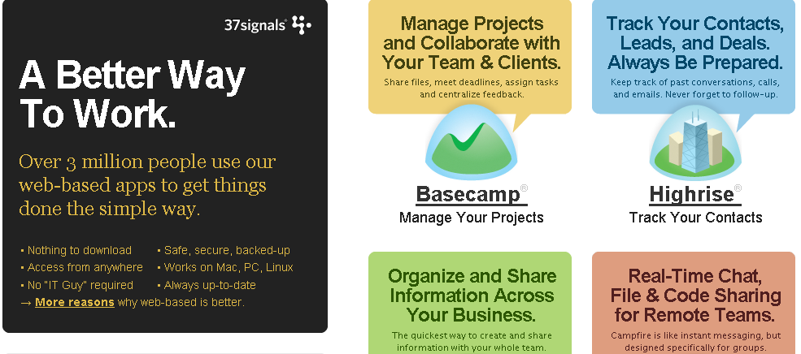

国内的云先驱
=====================
.. class:: incremental

- 阿里软件 ： 互联网软件超市、外贸版
- xtools：企业维生素 / crm
- **易度** ：工作平台，套件产品，PaaS
- 金蝶友商 ：
- 用友伟库 ：
- 800客： 类salesforce，PaaS

未来云世界
====================
.. class:: incremental

- 类salesforce这样的SaaS/PaaS平台商，成为王者

- 平台商外围大批的插件开发商

  类似iphone的手机应用商店，脚本开发为主

- 平台商外围大批的咨询服务商：定制、咨询、培训

- 优质的独立SaaS服务商

  使用google/ms/Amazon的服务，通过和平台集成谋得生成生存

云商业模式的转变
===================================
.. class:: incremental

- 软件服务化：交钥匙

  .. class:: incremental

  - 按需使用
  - 企业还需要IT部门吗  （革命）
  - 企业IT外包会更盛行  （机会）
  - 让用户更开心

- 产业链分工细化 （向游戏学习）

  .. class:: incremental

  - 关注最需要关注的
  - 开发成本大大降低
  - 服务质量大大提升
  - 开发商更开心
  - 革命：传统软件供应商
  - 机会：新的云服务商

云产品的转变
=========================================
软件的各个领域都在云化

.. class:: incremental

- 操作系统: ?
- 数据库系统： sql server
- 个人桌面软件： office、
- 工具软件：photoshop
- 群组协作软件： notes、outlook
- 企业管理软件：crm、进销存、文档管理
- web框架 : django
- 开发工具： powerbuilder、access

云开发模式的转变
===================================
.. class:: incremental

- PaaS: 基于平台的脚本开发成为重头戏
- 基于平台：软件天然集成
- 开放接口API：软件集成更容易

  google apps和salesforce已经集成

- 接口会逐步标准化，统一化：如认证接口

- 支持手机访问，是必然的趋势

PaaS中的脚本开发
===================================
目录：

.. class:: incremental

- 认识平台和脚本
- PaaS产品

  - zoho creator
  - force.com
  - 易度应用

- 存在的问题

平台和脚本: python
==============================
.. class:: incremental

- python是脚本语言
- 平台是python解释器以及整个操作系统
- 中蟒：人人皆可写程序员
- python语言够简单
- python运行环境够强大

平台和脚本： 批处理命令
=======================================
回顾：你的第一个实用程序是什么？

.. class:: incremental

- 批处理是脚本
- 很快实现，很快有成就感
- 非开发人员都会
- 批处理够简单
- 操作系统：够强大

平台与脚本: 其他
========================
.. class:: incremental

- Excel: vbscript
- 浏览器：javascript
- GIMP : 脚本画图
- 游戏逻辑脚本的开发
- 数据库开发：PowerBuilder
- Domino
- SAP

平台与脚本：归纳一下
==========================
.. class:: incremental

- 平台和脚本对应出现

  .. class:: incremental

  - 强大的平台
  - 简单易用的脚本

- 脚本开发

  .. class:: incremental

  - 依托于平台，面向特定应用进行开发
  - 简便快速，容易掌握
  - 适合普通企业IT人员

web脚本开发
====================
.. class:: incremental

- php差不多就是这样
- Zope 2: 当年的web 脚本开发之王

  和现在最新的zoho creator、force.com类似

  - 强大的脚本开发能力
  - 插件产品导入、导出

- 号称新手2-3天的培训就能上手

脚本开发人员：杂牌军吗？
======================================
.. class:: incremental

- 我们有歧视quick and dirty程序员的惯例
- 脚本开发：快速达到结果。quick很重要，dirty与否不那么重要。
- 留出时间，需要关注更多需求的理解
- 让特定应用的开发：够简单

脚本开发的困境
================================
.. class:: incremental

- 严重依赖平台，不够通用
- 平台费用不菲
- 平台还是很复杂的

云脚本开发新契机
=========================
.. class:: incremental

- 平台租用，无价格障碍
- 平台开放，因为用户众多，而成为标准
- 免费战略和利润分成，能吸引大量小开发商

PaaS产品：zoho creator
========================
.. class:: incremental

- 新的脚本开发语言：@#$%^……&*
- 明确定位：access的web版本
- 非常强的web开发环境
- 拖拖放放构建应用

zoho creator
=================

zoho creator sample
================================

PaaS产品：force.com
========================
.. class:: incremental

- 新的脚本开发语言：@#$%^……&*
- 更通用的定位，但仍以数据库为主
- 拖拖放放构建应用

PaaS产品：易度应用
=============================
.. class:: incremental

- 使用python为开发语言 （RestrictedPython）
- 参考了轻量级开发框架的结构
- 参考了Zope/Plone

易度应用：会议室预订
============================

易度应用：工时管理
============================
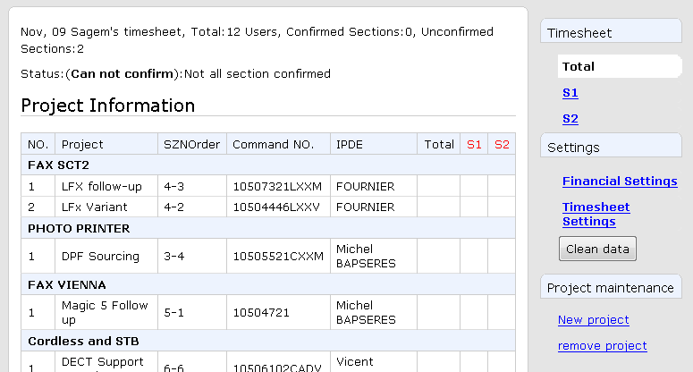

易度应用：开发环境
===================
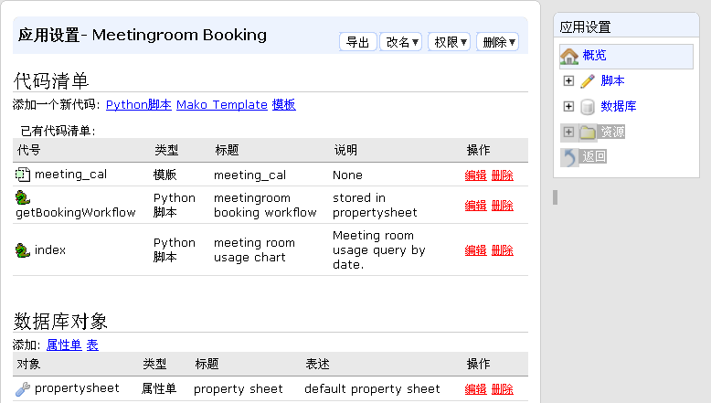

易度应用：代码加亮显示
=======================
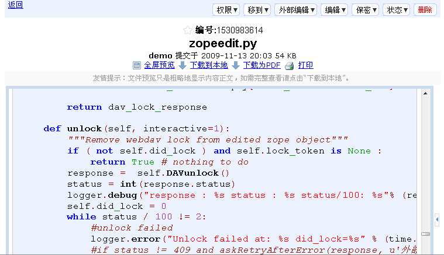

易度应用：代码版本比较
=======================
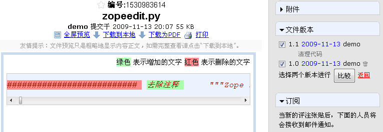

易度应用：配置文件
==========================
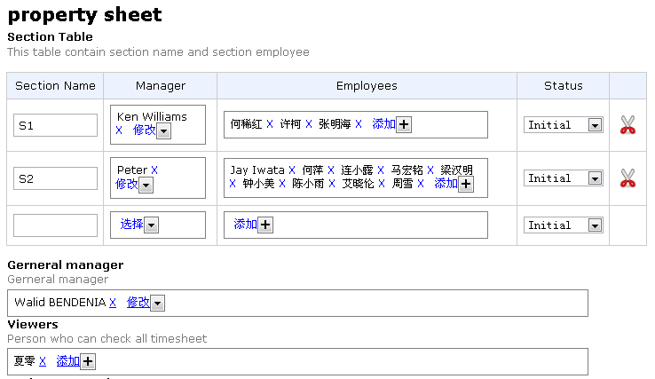

易度应用：字段定义
==========================
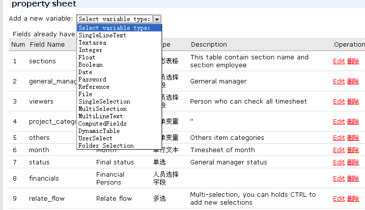

易度应用：自动checkout
============================
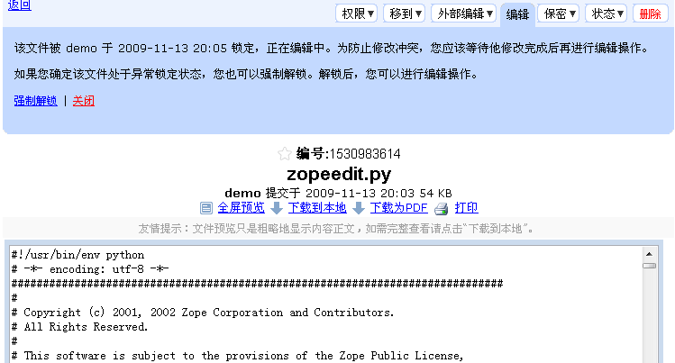

易度应用：控件
===============================
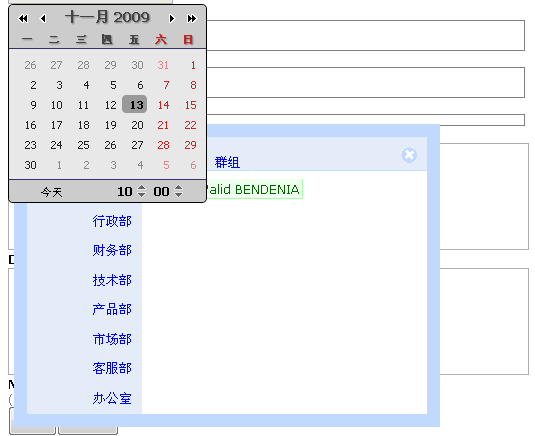

易度应用：数据库定义
=====================
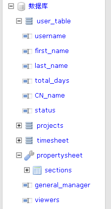

易度应用：错误校验
=========================
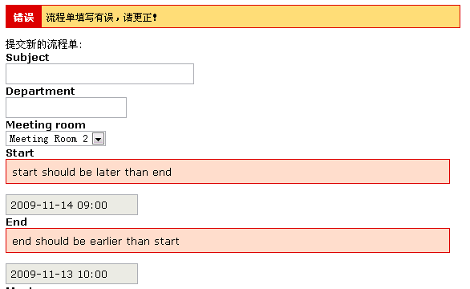

易度应用的状态
===========================
- 地址： http://everydo.com/apps
- 还未正式发布
- 静候佳音....

