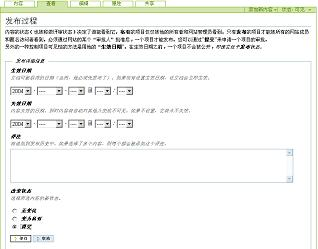
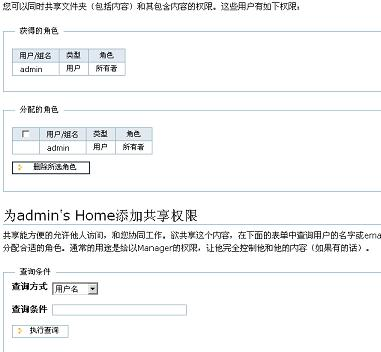

:作者: 赵玉勇
:版本: $Revision: 0.1 $
:版权: This document has been placed in the public domain.

.. contents::

工作流（Workflow）定义了Plone系统管理内容对象的过程。以发布一则公司新闻为例：一个员工撰写了一则公司新闻，然后提交给编辑审查，审查通过后，由编辑将该新闻发布到网站上。这个新闻审查流程就是一个工作流，网站管理员管可利用这个流程来确保网站内容的正确性。Plone系统拥有一个强大、灵活的工作流引擎系统，其核心元素是对象状态（Object States）与用户角色（User Roles）。

对象状态（Object States）
======================

对象状态与权限相关。对象状态决定了可以访问该对象的用户类型、决定了当前可进行的操作，如可被设置的其它不同状态、是否可以进行修改等。Plone缺省的文档发布工作流包括四个状态： **可见（visible）** 、 **待审（pending）** 、 **发布（published）** 与 **私有（private）** 。管理员与开发人员可以通过ZMI增加定制工作流状态。

* 缺省情况下，页面文档创建后即处于 **可见**  状态，这使得其它Plone网站成员也可以访问该文档内容。可见状态的文档内容并不在导航树中显示，但用户可以直接通过其URL访问该文档内容。可见状态的文档内容也可以通过查询检索得到，即使是位于私有的文件夹也可以被检索到。

* 处于 **待审**  状态的对象，是用户为了最终发布而提交审批的对象。对于一般用户来说，对象处于 **待审** 状态还是处于 **可见** 状态并没有什么不同。区别在于 **待审** 对象被标记要求审查；而系统会敦促站点的审核者及时审查、进而发布或拒绝'待审'的对象内容。只有管理员可以编辑修改处于 **待审** 状态的对象。

* 所有Plone站点用户都可以访问处于 **发布** 状态的对象内容，这些对象会出现在导航树中。如果是一个新闻类型的内容被发布，该新闻将出现在Plone站点首页的新闻面板中，以及 '新闻' 页首标签页面内。只有管理员可以编辑修改处于'发布'状态的对象。如对象的创建人需要编辑修改，他可以通过收回操作，使得该对象的状态改变为 **可见** 后，再进行编辑修改。

* 对处于 **私有** 状态的对象，只允许被它的创建者查看修改，对对象具有管理员权限的用户也可以。处于 **私有** 状态的对象不会出现在查询结果以及导航目录树中。

注意：虽然大部分对象具有自己的状态，但也有一些类型的内容对象，它们的状态继承自其父对象。

用户角色（User Roles）
==================

Plone用户角色实际上是可以进行不同操作的用户类别。这是Plone权限管理机制的基础。缺省安装的Plone站点中，包括匿名用户（anonymous）、成员（member）、拥有者（owner）、审核者（reviewer）、管理员（manager）这5种用户角色。

* 任何未登录、但正在访问浏览系统的用户，都被系统认为是 **匿名用户（anonymous）** 。在Plone缺省安装的权限策略中，匿名用户可以访问发布、待审、可见的内容；如果设置站点的权限策略为私有，则匿名用户将不能看到任何内容。

* 已经登录系统的用户都是 **成员（Members）** ，成员角色用户可以在自己的个人文件夹中添加内容，并提交审查以便发布。In public sites, members can see the same content as anonymous users. In private sites, members have access to published, pending and visible content. Members may also set their own preferences.

* 作为 **审核者（reviewer）** ，你可以发布或拒绝发布由其它成员提交待审的内容，如果有需要审核的内容，在个人工具栏上将出现一个 "待审(#)" 的提示信息，#代表需要审查的内容条目数。在Plone站点右面板中，也会出现一个待审清单。审核者拥有与成员一样的访问权限。

* 成员将自动称为由自己创建的内容的 **拥有者（Owner）** ，这使得他们可以对内容进行编辑、提交或收回、或设置其为私有的操作。不推荐为其它用户手工分配拥有者角色。

* 站点 **管理员（manager）** 可以看到处于任意状态的内容对象，除了具有成员、审核者的操作权限外，管理员还可以添加、删除、修改、移动对象内容。管理员还可以添加、删除、修改用户信息，为他们分配角色。

Plone继承了Zope的角色机制，可以阅读 用户和权限管理__ 一章来了解更多内容。

__ <a href="http://www.czug.org/docs/zope/zopebook/X_e7_94_a8_e6_88_b7_e5_92_8c_e6_9d_83_e9_99_90_e7_ae_a1_e7_90_86">http://www.czug.org/docs/zope/zopebook/X_e7_94_a8_e6_88_b7_e5_92_8c_e6_9d_83_e9_99_90_e7_ae_a1_e7_90_86</a>

变迁（Transitions） - 改变对象状态
=========================

**拥有者（owner）** 与 **管理员（manager）** 可以改变内容对象的状态。而预先定义的变迁（Transitions）决定了可以设置的目的状态。例如， **Owner** 用户可以提交可见的内容对象审查（此时状态为待审）、或者使其状态为私有； **reviewer** 用户可以发布或拒绝提交审查的对象内容，具体以可见状态的内容对象为例，在其状态设置页面下部（如下图），'提交审批'、'变为私有' 等允许用户设置的选项，就对应于可见状态（visible）下的所允许的变迁（Transitions）操作。

改变内容对象状态的基本操作在 **使用Plone** 一章中的 `发布文档`__ 一节中已经介绍了。这里再介绍另外一种方式：

在内容对象所处的文件夹内容清单界面（如图），选中内容对象后点击 '改变状态' 按钮，打开与直接操作内容对象类似的界面，完成状态设置。用这种方式可以批量设置内容对象的状态。

.. image:: Plone2ContentList

__  <a href="http://www.czug.org/docs/plone/plonebook/X_e4_bd_bf_e7_94_a8Plone2#id16">http://www.czug.org/docs/plone/plonebook/X_e4_bd_bf_e7_94_a8Plone2#id16</a>

本地角色（Local Roles）
==================

针对特定的内容对象，如文件夹、文档内容等，管理员（Manager）或对象的拥有者（Owner）可以为其它用户分配额外的角色-- **本地角色（Local Roles）** 。被分配用户将以该本地角色（ Local roles）身份来操作这个内容对象。

分配、取消本地角色的操作是在 **共享** 内容标签页面内（如下图）进行的。

分配本地角色的操作步骤如下：

* 打开内容对象 '共享' 标签页；

* 在 查询条件 栏内，查找搜索用户信息；

* 在查询结果中选中用户；

* 从下拉列表中为该用户选择本地角色；

* 点击“为选择的用户添加本地角色”按钮，完成设置。

取消本地角色设置的操作也在同一界面内完成。步骤如下：

* 在 分配的角色 栏目内，选择欲取消分配的的用户；

* 点击“删除所选角色”按钮，取消为用户分配的本地角色。

对象发布（Publishing an object）
============================

改变内容对象状态的基本操作在 **使用Plone** 一章中的 `发布文档`__ 一节中已经介绍了。

__  <a href="http://www.czug.org/docs/plone/plonebook/X_e4_bd_bf_e7_94_a8Plone2#id16">http://www.czug.org/docs/plone/plonebook/X_e4_bd_bf_e7_94_a8Plone2#id16</a>

对象审批（Reviewing objects）
==========================

如果你拥有审查的权限，在登录系统后，系统将提醒你是否有需要审查的内容对象。这个提示信息显示在个人工具栏中。

.. image:: <a href="http://plone.org/documentation/book/images/slots/review_top.jpg">http://plone.org/documentation/book/images/slots/review_top.jpg</a>

编辑已发布对象内容
==================

管理员可以编辑修改处于任何状态的对象内容。成员不可再对已 **发布** 的内容对象进行修改编辑，但可以通过将其状态重新设置为可见后，再进行编辑修改。在内容对象的状态设置菜单中，成员用户可选择 '收回' 菜单项可将状态从 **发布** 改变为 **可见** 。

在修改完成后，成员可以再次提交申请发布，这使得在每次修改后，可以确保对修改内容进行必要的审查。

