`按此觀看繁體版本 <X_e5_80_8b_e4_ba_ba_e5_8c_96_e5_9f_ba_e6_9c_ac_e8_a8_ad_e5_ae_9a>`__

Plone 的安装完成后，便要设定一个能应付自己问题和有个人风格的Plone了。 

首先，在Plone Controller 按"Zope Management Interface" 启动Zope的管理介面(ZMI) 

.. image::zopestart.jpg 
  :align: center 

键入你的起始用者和密码便可登入ZMI 

此页内容包括： 

- 基本外观_: 网站标题图案, 和外观颜色。 

  1 `网站标题图案`_: 网站左上方的图示 

  2 `个人风格设定 - base_properties`_: 最简单的方案 

  3 `个人风格设定 - css`_: 最全面方案 

- 个人喜好设定_: 网站面板和格子 

  1 `slots 面板`_: 设定基本组件 

  2 `tabs 格子`_: 细致的修改 

基本外观 
========== 

网站标题图案 
------------- 

在ZMI 浏览至Plone的文件夹位置 

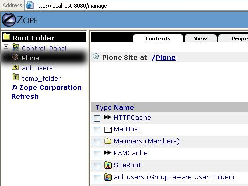

在右上方的选择项中选取Image, 然后在新出现的页面，Id 键入"logo.jpg". 在File 栏开启你要的图像档案，可以是任何图案格式, 如.jpg, .bmp, .png 

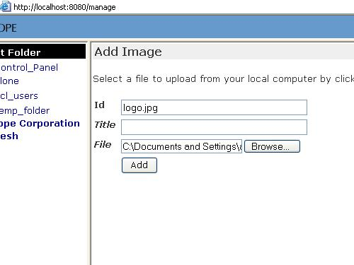

**完成** 

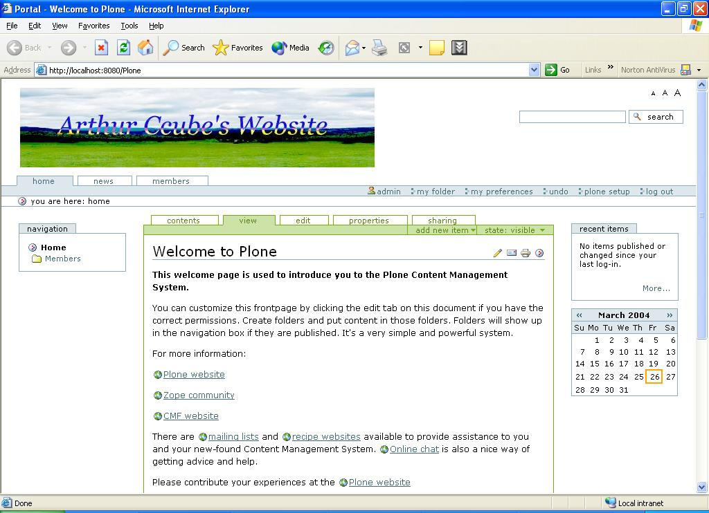

个人风格设定 - base_properties 
--------------------------------------

base_properties 是为了让管理员不改动编码也可设定外观而设。方便得很。 

在zmi浏览至Plone>portal_skins>plone_styles, 选取"base_properties" 

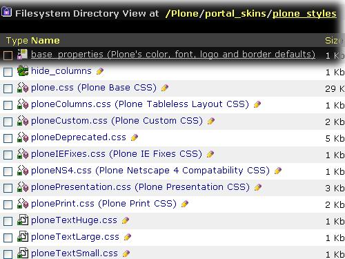

按"customize"键, base_properties便会自动放在custom 文件夹内。 

你可以设定每项外观的相关值，建议先尝试将backgroundColor改为"Blue" 

.. image:: zmi_base_properties.jpg 
   :align: center 

此外，我还改动其他颜色，结果 

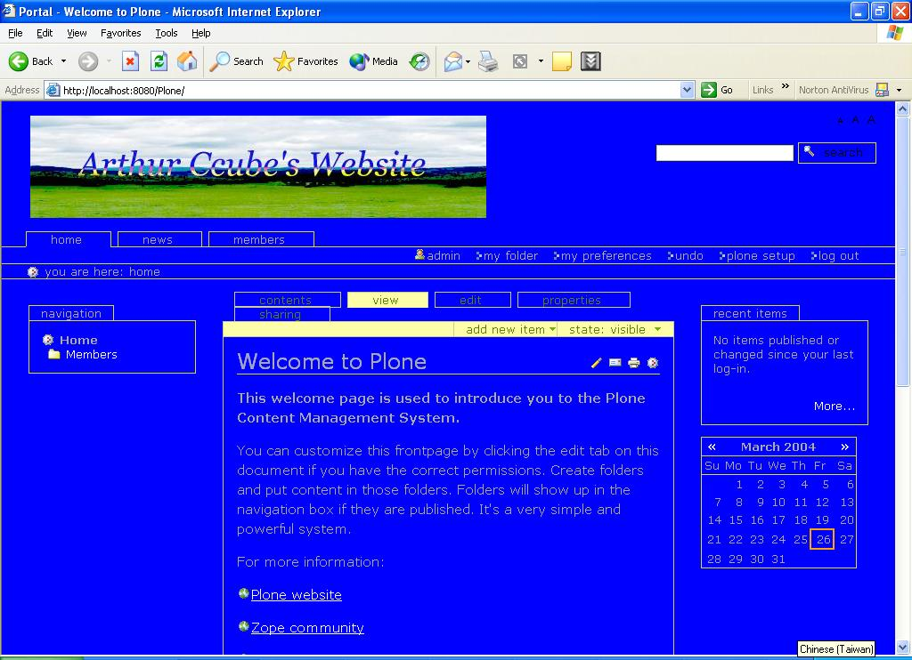

个人风格设定 - css 
------------------- 

CSS 是Plone外观的核心，你学懂CSS 后，便可控制每部份的位置，排位等设定。 

在ZMI 浏览至 Plone>portal_skins>custom 的文件夹位置 (custom 是主要放置自己编码的地方) 

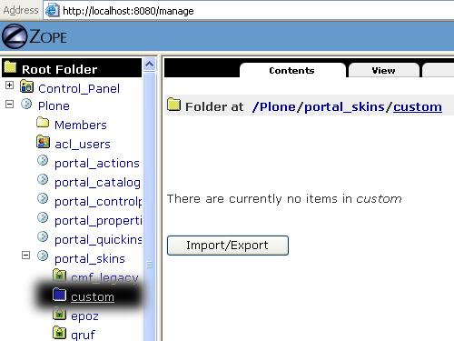

在选取项中选择DTML Method 

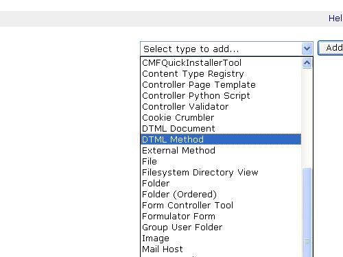

在新的页面Id栏键入"ploneCustom.css" 然后按"Add and Edit" 

.. image::zmiploneCustom.jpg 
   :align: center 

你的新StyleSheet将会产生，你所要做的是在文字栏中键入你的外观设定 CSS 编码 例如:: 

  body { 
  background:blue; 
  } 

修改完成后按"Save"键便可 

我"偷取"了czug.org 的ploneCustom.css用在自己的网站上(这是很强的功能，你可以直接取下其他网站的.css 留为己用，再作修改。当然，一定要得站长同意，否则，版权自付) 

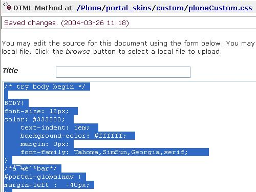

**结果** 

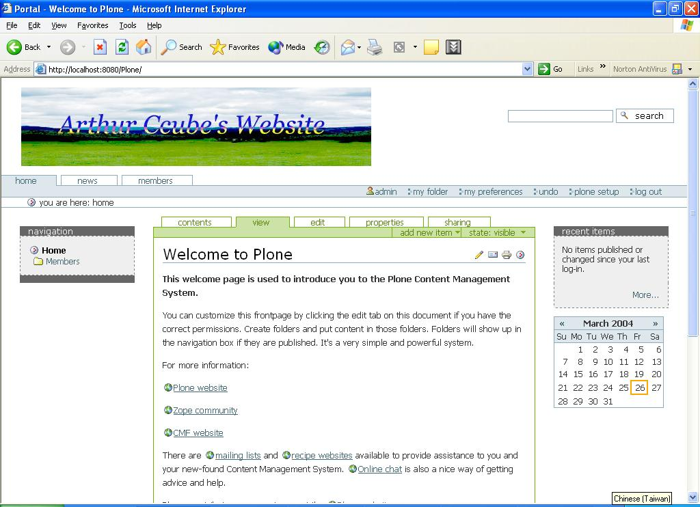

**注意** 

如果在custom文件夹内同时有ploneCustom.css 和base_properties，结果一般可以假设成 **优先使用ploneCustom.css** ，因为ploneCustom.css 会覆盖掉大部份外观设定。即是假如你在css 和base_properties 中也有background color 的设定，base_properties便未必能发挥效用了。 

按此至Plone外观定制实战_ 

.. _按此至Plone外观定制实战: <a href="http://www.czug.org/docs/plone/skin-guide">http://www.czug.org/docs/plone/skin-guide</a> 

个人喜好设定 
============ 

slots 面板 
------------ 

面板是指网站左面和右面一个个的"盒子"。你可以在自己的网站使用/停用预设的面板。 

在ZMI 浏览至Plone 文件夹，然后按"properties" 格 

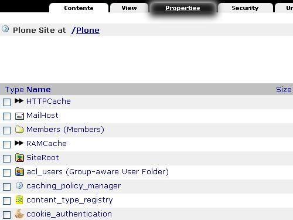

左面的面板是left_slots, 右的便是right_slots。你可以尝试将右面的calendar_slot 放在左面的面板中 

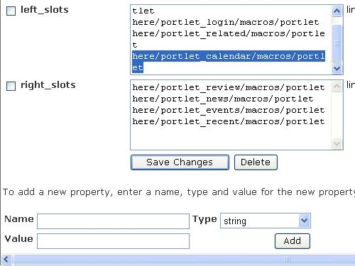

结果右面的月历便会走到左面了！ 

可在此找到 `面板详情 <http://www.czug.org/docs/plone/plonebook/X_e5_ae_9a_e5_88_b6Plone2/view>`__

你还可以 `建立自己的面板 <http://www.czug.org/docs/plone/plonebook/X_e9_a1_b5_e9_9d_a2_e6_a8_a1_e6_9d_bf_e6_8a_80_e6_9c_af>`__

tabs 格子 
----------- 

有没有留意czug 上的主页、文档、产品等格子，和你的网站是不同的。其实你可以加入自己的格子。 

浏览至Plone>portal_actions 

移至最下方，键入以下数值 

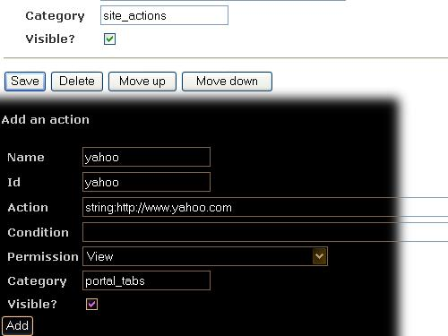

按"Add"键后便可有一个雅虎连结了！ 

你还可以修改其他数值，看看有什么变化！(小心Permission和condition的设定，可能令你难以返回相关位置) 

相关 
======= 

- 修改tabs: http://www.czug.org/docs/plone/howto/HowToChangeTheTabs/view

- Plone Book Chapter 6(Style): http://plone.org/documentation/book/6
