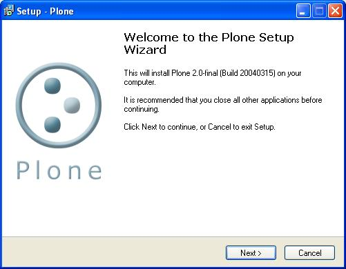
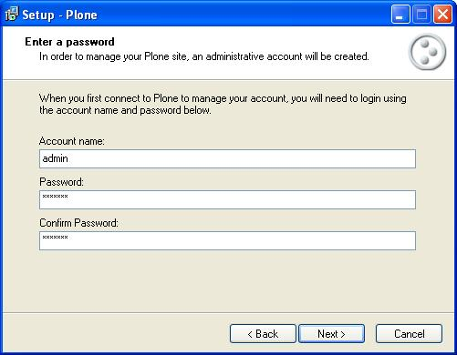
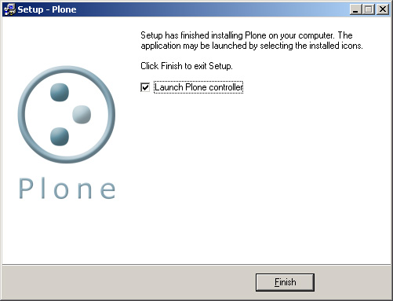
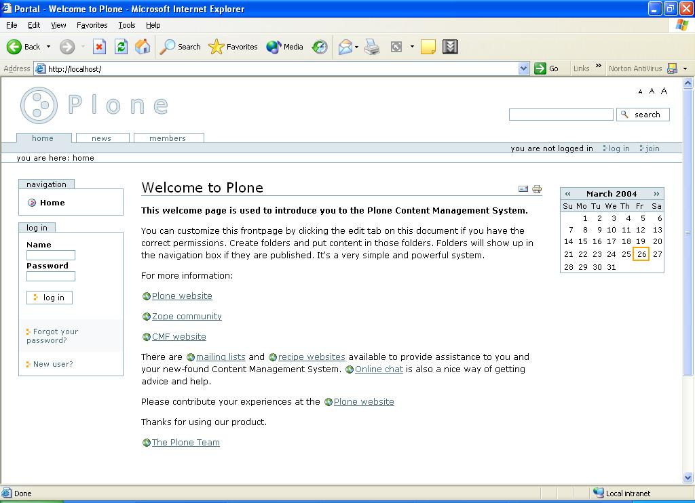
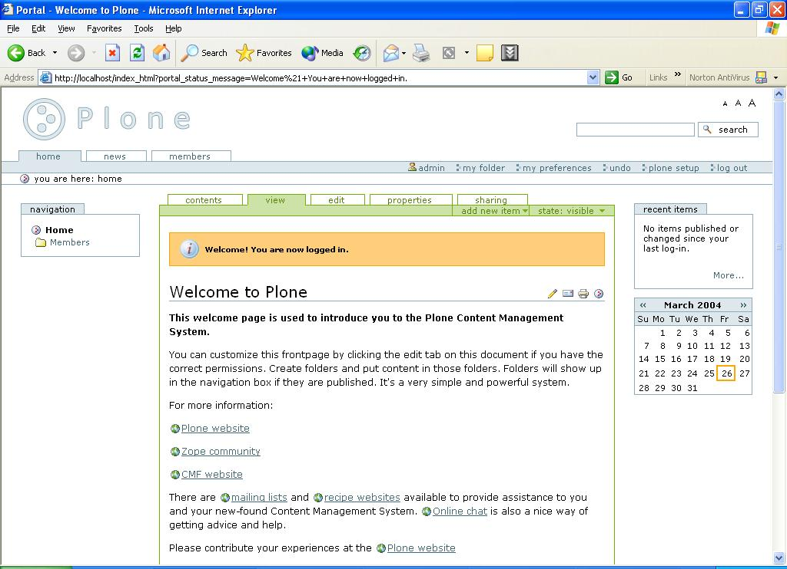

按此觀看繁體版本_ 

.. _按此觀看繁體版本: X_e5_ae_89_e8_a3_9dPlone 

目的: Plone 安装在Windows versions 9x, ME, NT 3.51+, 2000 或 XP内。 

.. Contents:: 内容提要

准备功夫 
===============

1　一台电脑，基本是CPU: 500MHz, RAM:64MB, 硬碟：50MB。当然，越强越快。 

2　用administrator 或有足够安装权限的用户登入windows 

3 `到此下载 <http://www.plone.org/download>`__

基本安装 
===============

1 双按下载档案 

2 然后跟着一般的安装步骤按"下一步"，直至输入密码页面出现 

- 这是起始用户(也是超级用户)的密码，记着它。建议使用"admin"用户名称 

3 安装过程大概几分钟，最后出现 

- 选取"Launch Plone Controller"然后按完成。 

执行 - 使用Plone Controller 
========================================= 

1 在程式集中选取Plone Controller。 

  .. image:: icon.jpg 
     :align: center 

2 在 Status格按下start 键启动Plone 

  .. image:: stopped.jpg 
     :align: center 

**注意**:: 

       若起始运作时间过长，Plone可能会自动Time Out，这个bug 在将来的Plone会解决。 

- 问题记录，如果你还是有不明的问题，其实可以查询Plone的错误记录，打开以下档案:: 

      C:\Program Files\Plone 2\Data\log 

3 如你的端口设定正确，当Plone运作后，可按"View Plone"键来浏览Plone. 按"Zope Management Interface.."可以浏览Zope管理介面(ZMI) (暂可不理)。 

  .. image:: started.jpg 
     :align: center 

按 "Ports" 可设定端口，在相应的栏位填上端口值，空白端口值可关闭该服务。一般来说，用缺省的值便可，除非你的电脑有其他程序占用该端口。假如你的电脑有IIS, Apache, PWS一类的程式，请确定Plone的端口和它们使用的不同。 

执行 - 其他方法 
==================

1 Windows NT, 2000, XP的用户 

    可以用Service模式执行Plone, Service 模式可以在ZMI restart Plone 及在Windows 控制台或用指令句启动和关闭Plone ("net start Plone", "net stop Plone"). 

2 Windows 95, 98, ME的用户 

    只可使用"Windows 95/98"模式。可以在System tray的图示启动/关闭Plone 及Plone Controller 

**完成！** 

- 打开浏览器，在网址列键入 <a href="http://localhost">http://localhost</a> (如你的Plone Http 端口不是80, 如4321, 你便要键入 <a href="http://localhost:4321">http://localhost:4321</a> 

- 用admin用户登入后可看到 

相关 
===============

- 官方主页: http://plone.org/

- 安装资料：http://plone.org/downloads

- CZUG相关: http://www.czug.org/plone/plonebook/X_e5_ae_89_e8_a3_85Plone2/view

- sourceforge 下载: http://sourceforge.net/projects/plone

