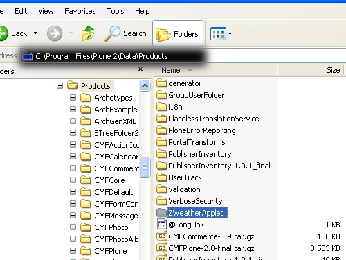
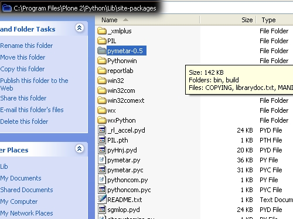
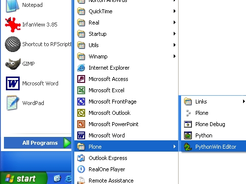
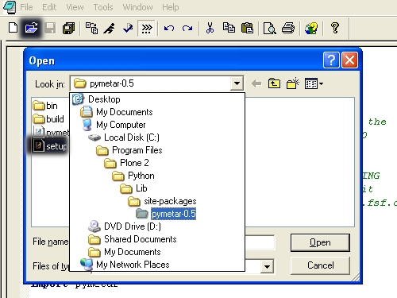
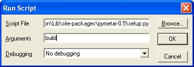
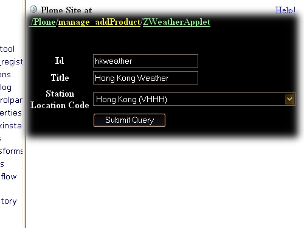
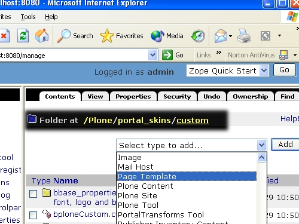
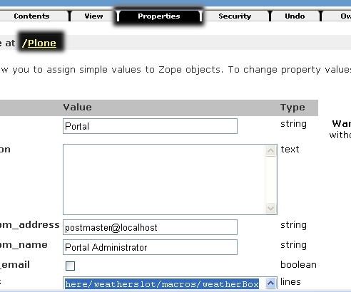
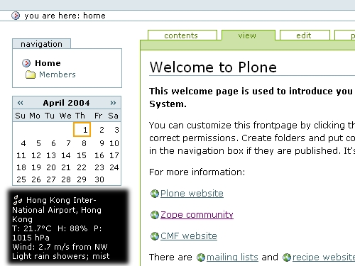

按此觀看繁體版本_ 

.. _按此觀看繁體版本: X_e5_ae_89_e8_a3_9dZope_e7_9a_84_e7_94_a2_e5_93_81 

安装Plone 的产品一般都是很方便，可参看前一章 安装产品_ 。但是，有时候有些Zope产品很好用，我们可否加至Plone之中呢？ 

.. _安装产品: X_e5_ae_89_e8_a3_85_e4_ba_a7_e5_93_81

答案是yes和 no, 一般来说，是可以的，但要看情况才知怎样修改。这里我试范怎样将ZWeatherApplet 这个Zope 的天气报告加至你的Plone之中，你可以从中获得一些怎样在Plone使用其他Zope产品的头绪。 

.. Contents:: 内容提要

准备 
=================

- `下载ZWeatherApplet <http://zope.org/Members/jerome_alet/ZWeatherApplet/1.51/ZWeatherApplet-1.51.tar.gz>`__ (Zope Product) 

- 将下载档案解压至:: 

    C:\Program Files\Plone 2\Data\Products 
  

- `下载pymetar <http://www.schwarzvogel.de/pkgs/pymetar-0.5.tar.gz>`__ (Python Module) 

- ZWeatherAppleat 还未支援最新的版本，建议使用这个0.5版本 

- 将下载档案解压至:: 

    C:\Program Files\Plone 2\Python\Lib\site-packages 

安装 
==== 

好了，准备了所有档案。可以安装了。 

- 打开pythonwin.exe 

- 打开pymetar setup 档, 

- 按"Ctrl + R" 打开pythonWin 执行视窗。在Arguments及debugging栏键入"build" 及 "No debugging"，然后按 "OK" 

- 重覆上一步，按"Ctrl + R" 打开pythonWin 执行视窗。不过在Arguments 栏键入"install" debugging 键入 "No debugging"，然后按 "OK" 

- restart Zope 

- 在ZMI浏览至Plone，然后加上一个"ZWeatherApplet"。在新跳出的表格填上以下资料(在将来你可修改为适合你的资料)，然后按 "Sumbit Query" 

将Zope产品加入Plone的Slot面板中 
=============================== 

- 浏览至 Plone > portal_skins > custom ，加入一个新的 page_template 

- 键入id 为weatherslot，然后按"Add and Edit"。在新的文字栏贴上以下资料，然后按"Save":: 

		<html xmlns:tal="http://xml.zope.org/namespaces/tal"
		xmlns:metal="http://xml.zope.org/namespaces/metal"
		i18n:domain="plone">
		
		<body>
		

		
 
                customize your code here, read README in ZWeatherApplet
		

		

                </body>
                </html>

- 浏览至Plone，按Properties格，在left_slots键入:: 

    here/weatherslot/macros/weatherBox 

完成 
==== 

啊，今天下雨呢！ 

