=====================
Plone外观风格定制 
=====================

.. Contents::
.. sectnum::
   :prefix: 5.

用Plone做一个站点，往往需要定制站点的外观风格，而不希望千篇一律地使用Plone默认的外观。本章将展示如何使用Plone定制个性化的网站外观。你将了解到Plone外观定制的原理、操作方法、内部结构和一些具体的实例。

Plone的皮肤定制有很多方式，有些书中强调这部分工作不能叫做定制皮肤，而应称为定制Plone的主题(Theme)，这种形式是需改动模板和增加一些脚本，但本章中介绍的是外观风格定制，不涉及开发的内容。
对于网站前台开发人员，只需要掌握基本的CSS，通过本章的学习，就可以轻松地定制Plone的风格外观。如果你想对Plone皮肤进行更多的改进，你可以结合后面《Plone脚本开发》章节的学习就可以做到。

本章学习重点：

- 认识Plone皮肤
- 了解Plone皮肤基本原理 
- 深入学习Plone皮肤定制
- 结合案例，定制Plone的外观风格

了解Plone皮肤
==================
皮肤是内容之上的一个视觉上的包装，它也可能包括和视觉表现直接相关的少量逻辑部分。要生成用户看到的样子，皮肤有很多元素，包括静态的，如图片；和动态的，如脚本。

一旦安装完Plone，就会看到一个缺省的皮肤。这个皮肤是绝大多数用户所熟悉的，也就是你在 http://plone.org 和其他网站上可看到的那个带着简捷的浅蓝色和绿色的用户界面。但是Plone未必一定要在外观上千篇一律，或者依稀可以认出是一个Plone站点；其观感全然取决与你。你可以选用已有皮肤来随意整合出你想要的新皮肤给Plone。你可以仅做少许修改或者给出一些较大的改动，【Plone空间】http://plonespace.net就是个例子，尽管它还是有着类似的Plone外观。

如果将一个Plone站点进行完全的定制，你甚至将很难识别出是否是Plone站点。在 ``http://plone.org/about/sites`` 中，有一个Plone网站实例清单，他们大都有非常个性化的定制外观。

Plone网站能够轻松地在多个皮肤中切换，提供给用户不同的皮肤。很多网站在内部管理时仍然使用Plone的标准界面，这个界面功能强大而且很灵活，他们能很方便的添加和编辑内容；但与此同时，他们提供了一个完全不同的外部最终用户界面。

快速示例
==================
下面，对常用的Plone网站定制操作先做一个快速的介绍。

更换标识图片(logo)
--------------------
最常问到的问题是：“我该如何改变网站的左上角的标识logo？”，可如下操作。

【例 5.1】 更换logo的操作步骤

#. 在ZMI中的 portal_skins 中，进入 plone_images 
#. 在清单中找到logo.jpg，单击进入

   
   .. figure:: img/theme/logo_before.png
      :alt: 定制logo

      图 5.1 找到logo.jpg，开始定制logo
   
#. 如上图 5.1 ，点击 'Customize' (定制)按钮
#. 使用浏览表单，上载一个新的图片，点击 'Upload' ，完成上载，如下图 5.2。

   .. figure:: img/theme/logo_after.png
      :alt: 定制logo

      图 5.2 浏览上传图片，定制logo

这样，回到Plone界面，使用 Ctrl-F5 刷新浏览器，这个logo图片已经更改了，十分简单。

调整字体显示
------------------
默认的Plone的字体大小不适合中文显示，需调大些。

【例 5.2】 调整字体显示的操作步骤

#. 在ZMI中的 portal_skins 中，进入 plone_style
#. 在清单中找到 base_properties 对象，进入 base_properties 对象，如下图 5.3 。

   .. figure:: img/theme/base_properties.png
      :alt: base_properties

      图 5.3 base_properties对象

#. 点击 'Customize' (定制)按钮
#. 修改属性值::
 
     fontBaseSize : 75%
     fontSmallSize : 95%

保存后回到Plone界面，中文的显示字体大小就符合中文显示了。

base_properties中还可对字体颜色，边框等设置，下表中对base-properties中的属性有具体说明：

.. csv-table:: 【表 5.1】 base_properties 中属性说明
   :header: "属性", "说明"    

   "logoName", "logo的名字（通过更改这里的名字，也是定制logo的另外一种方法）"
   "fontFamily", "备选字体族"
   "fontBaseSize", "基础的字体大小，控制整个Plone的字体"
   "fontColor", "字体颜色"
   "fontSmallSize", "小字体的大小"
   "backgroundColor", "背景颜色"
   "linkColor", "链接颜色"
   "linkActiveColor", "激活链接颜色"
   "linkVisitedColor", "访问过的链接颜色"
   "borderWidth", "边框宽"
   "borderStyle", "边框风格"
   "borderStyleAnnotations", "注释的边框类型"
   "globalBorderColor", "全局边框颜色"
   "globalBackgroundColor", "全局背景颜色"
   "globalFontColor", "全局字体颜色"
   "headingFontFamily", "大标题备选字体族"
   "headingFontBaseSize", "大标题基础大小"
   "contentViewBorderColor", "内容上方标签的边框颜色"
   "contentViewBackgroundColor", "内容上方标签的背景颜色"
   "contentViewFontColor", "内容上方标签的字体颜色"
   "inputFontColor", "输入框字体的颜色"
   "textTransform", "文本转换方法"
   "evenRowBackgroundColor", "偶数行的背景颜色"
   "oddRowBackgroundColor", "奇数行的背景颜色"
   "notifyBorderColor", "通知的边框颜色"
   "notifyBackgroundColor", "通知的背景颜色"
   "discreetColor", "离散区的颜色"
   "helpBackgroundColor", "提示的背景颜色"
   "portalMinWidth", "网站最小宽度"
   "columnOneWidth", "左边面板的宽"
   "columnTwoWidth", "右边面板的宽"

.. note:: 这里需说明一下，定制后在Custom目录中的base-properties实际上是一个空的文件夹，定制的这些属性位于Properties标签页。

Plone皮肤基本原理
=======================
前面的章节中我们已经知道了，在Plone的控制面板中有几种皮肤供我们选择使用。而这， Plone是如何实现的呢？在上面的示例中，更换logo及调整字体、颜色和间距，这些是什么内在机制呢？当然，如果不明白Plone皮肤的原理，这样的问题还有很多，现在我们介绍Plone的皮肤原理。

portal_skins工具管理皮肤
-----------------------------
Plone是通过ZMI中的portal_skins管理皮肤的。portal_skins工具同时还提供了创建和使用皮肤的服务以及应用编程接口(API)。进入portal_skins，看到如图5.4所示。

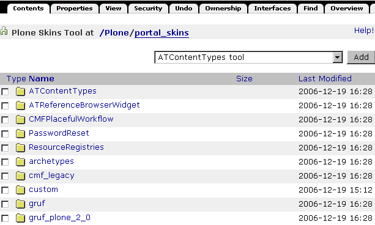

   图 5.4 Plone中的portal_skins工具的内容视图

图中显示了位于portal_skins工具中所有的文件夹，但其中包括有2种不同的文件夹。其中的custom文件夹是标准的Zope文件夹，内容存储在ZODB数据库，可以添加和修改文件夹中的内容的；另外一种是文件系统文件夹视图(File System Directory View)，如下图5.5所示，其内容是存储在文件系统上的，它是一个只读的文件夹。文件系统文件夹视图中的文件可以在Plone安装的文件系统中找到。

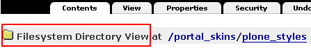

   图 5.5 文件系统文件夹视图文件夹

.. hint::
   Plone 2.5没有对两种类型的文件夹图标做区分显示，Plone 2.1及之前的版本从文件夹图标上就可辨别不同类型的文件夹，Plone 2.5的版本可将鼠标移至文件夹图标上，提示信息注明了文件夹的类型。

在皮肤中使用层
--------------------
皮肤是由一系列显示元素，逻辑相关的模板(templates)元素，以及脚本(scripts)元素集所构成的。这些元素存放在portal_skins下的文件夹中，被称作皮肤的层(layers)。每一个层就是一个文件夹，这些文件夹中保存着皮肤的构成元素。一个皮肤由一系列有序排列的层组成。

进入portal_skins的properties标签页，如图5.6所示。

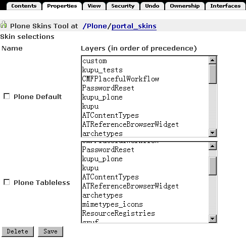

   图 5.6 Plone安装中的皮肤与层

在这里我们很直观地看到Plone中默认使用的Plone_Default和Plone_tableless两种皮肤，它们都拥有很多层，在层(layers)属性旁注释说明它们是按优先级编排(in order of precedence)，即排在上面的优先级最高。

如Plone_Default皮肤包含下述层：

::
 
 custom, kupu_tests, CMFPlacefulWorkflow, PasswordReset ...

这个层列表是Plone赖以寻找其元素的主要依据。当需要某个皮肤元素，如显示logo.jpg这个图片，Plone就会遍历Plone中这些层来查找这个元素。皮肤首先从它第一个层(本例中， custom)中开始寻找。如果皮肤不能在第一个层中找到这个元素，它转向第二个层(本例中，kupu_tests)。它会不断在这个层列表中依次查找直到找到所需的元素。如果找不到该元素，将会抛出一个404错误返回给浏览器。

这和许多系统中PATH环境变量的概念相类似。当敲入一条命令或查找某个程序，操作系统会依照PATH环境变量对文件系统上的目录进行遍历查找。层的作用与之相近，它指出了用于寻找资源的位置。

Plone的各层中，一般将custom放在最前面，因此这个文件夹的优先级最高。如果需要定制某些Plone皮肤的元素，那么可以在更高的层中提供定制的版本。皮肤的各层中如果有相同的元素，优先级最高的那个层中的元素会被选用。

另外，Plone皮肤的各层中的元素，都可以在直接在Plone站点的根目录中调用，而不必在URL中指定皮肤中的具体路径。比如，可直接访问http://localhost:8080/logo.jpg来查看定制的logo图片。

这就是Plone中皮肤的基本原理，总结下来有下面四点：

- 一个皮肤由优先级不同的多个层组成
- 多个层中可能包含相同名称的元素
- 有相同名称的元素，皮肤中排在前面的层中的元素会被使用
- 皮肤中各层的元素，可以直接在Plone根下调用

更换logo示例解释
------------------
先看看皮肤"Plone Default"的各层. 第一层是"custom", 它是在portal_skins的custom文件夹。另外一个层是plone_images层，它是一个文件系统目录视图，Plone默认的logo.jpg图片就在这里。定制这个图片的时候，在下列菜单中，给出了缺省的文件夹"custom"，单击"customize"，实际上是将在custom文件夹下得到这个图片，复制到了custom文件夹，并直接把这个复制后的图片显示给你。如果你仔细观察，将发现图片的路径变化了，现在是位于Custom目录，而在这里是可以编辑的。

这样，custom层位于plone_images层之前，现在拷贝后的这个图片首先被查找到，最终也将返回这个图片。
现在在上面的第4步中，上载一个新的图片。它更改了logo.jpg，因此这个图片会在清单中首先被找到。

深入Plone皮肤定制
=======================
在Plone皮肤(Portal_skin)下还有很多层及其的子对象。虽然它们是Plone皮肤的构成部分，但各自又是起什么作用的呢？以及我们想定制外观风格，比如想定制显示的字体，在哪里去定制呢？下面就来对Plone的皮肤定制做详细介绍。

皮肤中的各层
-------------------
portal_skin中很多对象，这里给个简单的介绍。另外，这一章节中只用到了其中的plone_images, plone_styles层。

.. csv-table:: 【表 5.2】 plone_skin 中各层的介绍
   :header: "名称", "说明"  
   
   "plone_templates", "网站的模板"
   "plone_portlets", "网站的面板组件"
   "plone_content", "内容相关的页面模板"
   "plone_form", "网站的一些表单页面"
   "plone_images", "网站皮肤的图片"
   "plone_deprecated", "标记为过时的一些外观元素， 如is_folderish是为了其它旧的脚本中使用而保留，但通常会在下一个版本被删除。"
   "plone_scripts", "和表单无关的功能型脚本"
   "plone_form_scrip", "Plone表单处理的script（python），包括一些表单输入校验脚本"
   "plone_styles", "网站皮肤风格样式，一些CSS文件"
   "plone_prefs", "网站控制面板相关的页面和脚本"  
   "plone_login", "登录的脚本和页面"
   "plone_ecmascript", "JavaScript脚本"
   "cmf_legacy", "沿用CMF的脚本,如TitleOrId用于与旧的CMF框架中需要的脚本"
   "plone_3rdParty", "第三方产品的皮肤"
   "plone_wysiwyg", "所见即所得的web编辑器"
   "plone_tableless", "无表格皮肤"

Plone中的样式表
------------------------
Plone的外观风格是由样式表控制的，通过配置这些样式表，你能在根本上改变Plone的风格外观。在portal_skins中的plone_styles层有以下样式表。

.. csv-table:: 【表 5.3】plone_styles 中的样式表说明
   :header: "CSS文件名", "功能说明"    

   "base.css", "基本html元素相关的css，如 p, a"
   "base_properties", "这个不是css，而是css中需要用到的属性变量，前面对此有讲解"
   "public.css", "和内容编辑无关的、最终用户的查看效果"
   "portlet.css", "面板显示相关的css"
   "columns.css", "中间三列表格的css"
   "authoring.css", "和编辑相关的css"
   "member.css", "影响登陆用户的一些css"
   "mobile.css", "手机上观看使用的css"
   "presentation.css", "幻灯演示的时候使用的css"
   "print.css", "打印的时候使用的css"
   "ploneCustom.css", "用于定制的空白css"
   "generated.css", "自动生成的css, 包括图标等"
   "IEFixes.css", "修正IE bug的css"
   "NS4.css", "兼容Netscape4的css"
   "RTL.css", "阿拉伯文等需要支持右至左书写"
   "deprecated.css", "用于兼容上版本，已过时" 

在plone_styles层中还有调整字体、颜色和间距的base_properties对象，它包含了在上面样式表中使用的颜色、字体、大小的实际定义。所以通过改变base_properties中属性便可改变样式表中相关变量，从而改变显示样式。定制这些属性是更改外观的一个非常简单的方法。上面的快速示例中我们已经操作看到了定制效果。

portal_css工具合并样式表
--------------------------
前面介绍到Plone有很多个样式表，到这里有这样几个问题。

- Plone每个页面都同时加载所有的CSS，这会导致页面很重
- 一个页面加载这么多的CSS，每次加载要重新发起请求，完全加载一个页面会耗费很多时间

Plone用了合并样式表的机制避免了上面的两个问题，它可将CSS文件在Plone注册，几个CSS压缩合并成一个CSS文件，这样就避免了每次请求都要请求多个CSS文件；页面请求的时候，只需加载需要的合并后的CSS文件。这个合并样式表的工具是ZMI中的portal_css，进入portal_css，如图5.7所示。

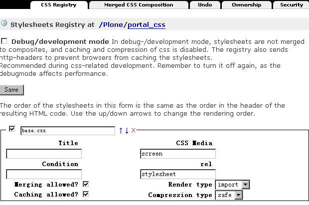

   图 5.7 Plone合并样式表工具－－portal_css

这个页面中可看到注册了很多CSS，这正是样式表中的CSS。上方有一个选择“调试/开发模式(Debug/development mode)”，默认是没有激活的。当我们需要调试/开发CSS时，可开启“调试/开发模式”，这时候就不会对CSS进行合并。

先看一看默认的压缩合并模式的CSS是怎么合并的，进入到Merged CSS Composition标签页，如图5.8所示。

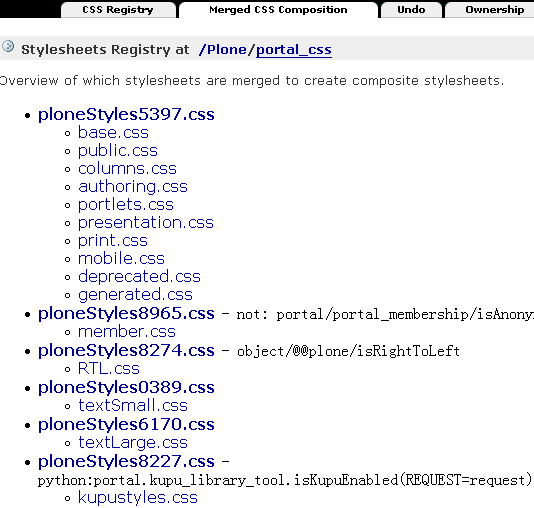

   图 5.8 CSS的合并模式

图5.7中可看到站点的一些基本CSS合并成了一个ploneStyles5397.css（这个名字是随机变的）；其它的member.css，或者Kupu用到的一些CSS单独合并成不同的CSS文件，它们是用到时才会加载的。这是合并模式下的效果，再看看使用调试/开发模式下的效果。在portal_css的CSS Registry标签页中，选择Debug/development mode，单击Save按钮。再回到Merged CSS Composition标签页，如图5.9所示。

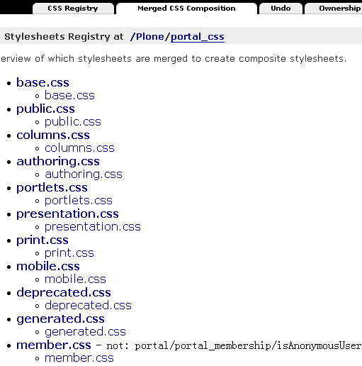

   图 5.9 调试/开发模式下的CSS

图5.9中可看到它们是一个个单独的CSS文件，而且是按照CSS Registry标签页中的编排顺序。当然这种模式下也并不是Plone每个页面都加载所有的CSS，有些CSS注册进来是通过条件(condition)来让Plone加载或不加载。

.. hint:: 关闭调试/开发模式，可再次进入合并模式。这时你会发现合并后的CSS文件名与上一次合并的名字都不同，它是随机产生的名字。这样可以强制让从前浏览器缓存的css失效。

再来看如何注册一个CSS到Plone中？在portal_css的CSS Registry标签页下方可以增加注册一个新的样式表，如图5.10所示。

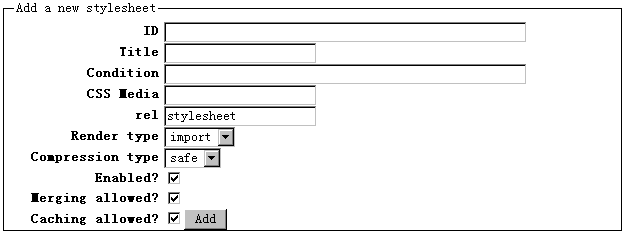

   图 5.10 注册一个新的样式表
   
填写新的样式表的文件名作为ID，然后单击 Add 按钮就可以增加注册一个新的样式表。也可以调整已注册的样式表中的排列顺序，这样来调整CSS的优先级。添加CSS的时候，还有一些其他的选项，比如Condition表示选用这个CSS的条件，
允许合并（Merging allowed）就是在合并的模式下是否合并成新的CSS，允许缓存(Caching allowed)加速是Plone自身提供缓存加速功能（《CacheFu缓存加速》章节中会具体介绍）是否将新的CSS进入缓存加速。

.. hint:: Plone自身的缓存加速功能是能知道Plone中的某个CSS发生改变，所以定制某个样式表，可直接应用到外观上。但如果用到其它外部的缓存加速工具（比如Squid/Apache）再对Plone进行缓存加速，就不能马上看到样式的改变，你可能需要重新合并一下样式表。

定制Plone的外观风格
=====================
从前面的Plone的皮肤介绍和Plone外观定制介绍中我们了解到Plone皮肤的定制的原理。现在结合具体的例子来深入地探讨定制Plone的外观风格。

我们以【Plone空间】作为案例来介绍定制Plone的外观风格。【Plone空间】目前是一个公益性站点，它的外观是一个典型的定制Plone外观风格的案例。

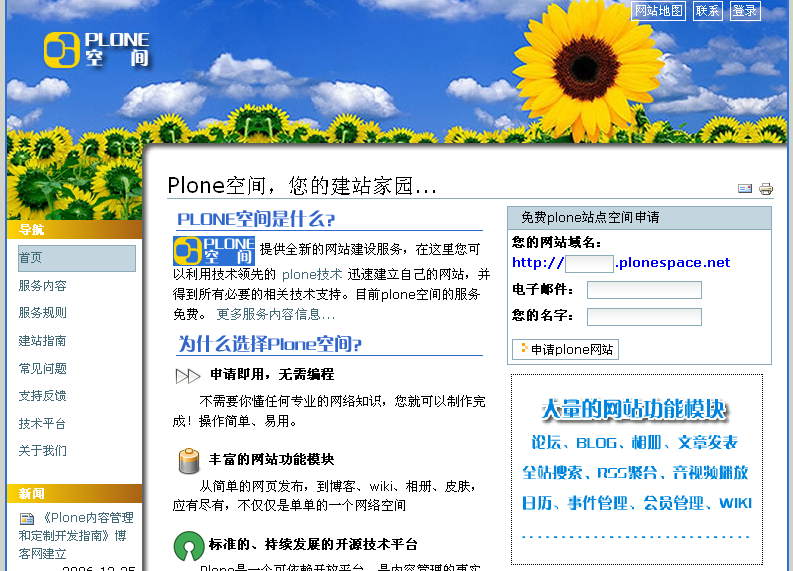
   
   图 5.11 案例介绍，Plone空间

下面将从一个初始的站点通过外观风格定制，初步深入完成定制过程。

介绍定制外观风格方法
-----------------------
这里先介绍定制Plone外观风格的方法，包括常使用的一些工具。

对于一般的外观风格定制，比如现在介绍的案例－－【Plone空间】，一般保留Plone的编辑，表单方面等的一些CSS，比如base.css, generated.css , portlet.css , public.css这几个CSS 文件中，可定制或重定义这些CSS文件。

如果仅仅是很少的改动，可定制ploneCustom.css文件。ploneCustom.css是一个空CSS文件，专门用于存放定制的CSS。当然，如果为了反复使用定制的CSS，也可创建新的css文件，并在portal_css中注册。下面的例子是直接在ploneCustom.css文件中定制内容，下图5.12是plonecustom.css的截图，这是采用DTML method对象编写的CSS。

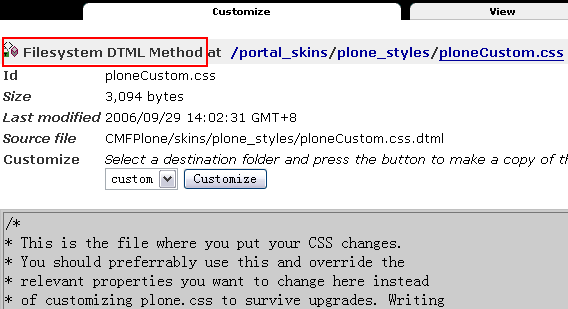

   图 5.12 ploneCustom.css

在ploneCustom.css中可看到一些提示信息，并提示定制CSS的代码所放的位置： 

::

 /* <dtml-with base_properties> (do not remove this :) */
 /* <dtml-call "REQUEST.set('portal_url', portal_url())"> (not this either :) */

 /* DELETE THIS LINE AND PUT YOUR CUSTOM STUFF HERE */

 /* </dtml-with> */

按提示说明，要定制CSS代码时便删除中间一行，将定制代码放在那里。注意：其他行不要删除，否则可能会破坏DTML的结构，不能使用base_properties中的变量。同时这个文件提示信息告诉我们，定制CSS的时候可以用到base_properties中的一些属性变量，在提示中列出了所有变量及各自起什么作用（上文中有这些变量的中文说明）。在代码中使用，比如:

::

 myLink {
   color: &dtml-fontColor;;
  }
   
上面的代码不是单纯的CSS代码，它是结合DTML Method对象的CSS。关于DTML语言在《访问关系数据库》章节有介绍，使用变量的方法十分的简单，其它的写法和常规的CSS写法一样。

有时候我们知道CSS的某个元素，但不知道它具体在哪个文件中定义。这里介绍中ZMI中查找内容。如图5.13所示。

.. figure:: img/theme/portal_skin_find.png
   :alt: portal_skin

   图 5.13 在ZMI中查找元素

可以定义类型，所在的皮肤或层，修改前/后，是否递归子文件夹等对内容的id或任一内容信息进行查找。上图中的例子就是对内容进行查找，可看到查找的内容中有" * "号注释的表明是当前使用的皮肤，否则则不是当前使用的皮肤。这就很方便了要去找某一元素在哪个文件中，并且知道它属不属于当前使用的皮肤。

另外，要定制CSS的时候，有一些工具辅助定制工作，这将事半功倍。比如FireFox的插件Dom Inspector，常用的还有Web Developer，Firebug等。IE上也有类似这样的插件DevToolBar。

下面是Dom Inspector插件的截图，其它介绍的工具笔者也都试用过，都是很好用的，大大辅助了定制工作。

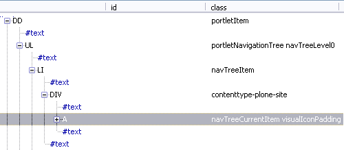

   图 5.14 DOM Inspector

定制字体、颜色和间距
---------------------- 
在base_properties定制字体，颜色和间距。将portal_skin中的plone_styles找到base_properties，将它定制(Customize)出来（前面介绍Plone的样式表中有介绍，同时介绍了base_properties中的属性说明），这里改变字体显示大小和左侧栏宽度： 

::

 fontBaseSize : 75%
 fontSmallSize : 95%
 columnOneWidth : 12em

作为中文站点，对于默认显示的字体大小一般需调大一些显示。

去除右列
---------------
【Plone空间】，不需要站点的右侧栏。

进入站点 ZMI 的根目录，到properties标签页。删掉right_slots属性或清空属性值。这个在《深入Plone设置与管理》章节中有介绍。Plone3.0使用管理面板来控制左右列显示，在第3章《使用Plone》中有详细介绍。

去除皮肤中多余的元素
----------------------
【Plone空间】，不需要显示页首标签，路径栏，个人栏，快速搜索区，页脚的Colophon信息。

通过前面提到的Dom Inspector工具等很容易的知道各个位置是由哪个CSS的修饰元素所控制。在ploneCustom.css中这样定义，代码如下：

::
 
 /*去除页首标签，路径栏，个人栏，快速搜索区，页脚的Colophon信息等元素*/
 
 #portal-globalnav,
 #portal-breadcrumbs,
 #portal-personaltools-wrapper, 
 #portal-searchbox, 
 #portal-colophon {
    display: none; 
 }
 
去除这些元素后，页面的显示效果如图5.15所示。

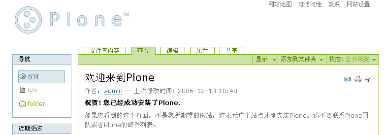

   图 5.15 去除多余元素后的效果

网站结构调整
-------------
去除一些元素后，要根据设计好的网站样式图定制外观了。

需要定制站点的显示宽度为780px，站点居中显示，同时设置站点显示内容区的背景色和边框，CSS定制代码如下：

::

 /*设置站点显示宽度为780px,且居中显示;设置背景色和边框*/
 
 #visual-portal-wrapper{
    width: 780px !important;
    background-color: white;
    border: 2px solid #2D70D7;
    margin: 0 auto;
   }

同时设置站点的背景色，代码如下：

::

 /*设置站点背景*/
 body{
   background: #D1D2CA;
  }

站点的基本轮廓到这里已经基本勾画出来了，下面将设计的网站样式图做的切片上传到站点中去。通常会在portal_skin中的Custom目录中建立一个images的文件夹，将图片上传到这个目录中，下面展示出定制皮肤所用到的图片。

   
   图 5.16 站点头部背景图 - top-nav.gif

   图 5.17 站点logo - logo.jpg

.. figure:: img/theme/nav-blue-bar.jpg

   图 5.18 面板标题处背景 - nav-blue-bar.jpg

页首显示调整
---------------
下面先定制站点的logo，从portal_skin的plone_images中找到logo.jpg, 将它定制替换成【Plone空间】的logo，定制logo的步骤这里不重复介绍了。

然后定制【Plone空间】的“向日葵”部分：

::

 /*设置站点头部背景及显示高度*/
 #portal-header {
   background: url('&dtml-portal_url;/images/top.gif') no-repeat;
   height: 160px;
  }

其中， &dtml-portal_url; 表示网站根的路径，采用DTML语法在表示portal_url变量。

定制后，看看显示后的效果，如下图站点的“向日葵”部分截图。 

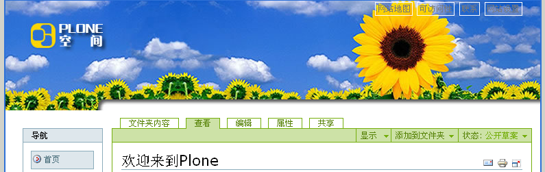
   
   图 5.19 定制站点“向日葵”部分截图

对站点的标签项需做一点细化工作，将字体颜色定制为白色：

::

 /*设置站点标签项字体颜色*/
 #portal-siteactions li a {
     color: white;
  }

填补上站点的“向日葵”左侧部分设置，同时对正文左侧部分加阴影效果，使用 |left-line| (left-line.gif)在y轴上循环加阴影：

  .. |left-line| image:: img/theme/left-line.gif

::

 /*站点外观显示调整*/
 #portal-column-one {
   background: url('&dtml-portal_url;/images/top-nav.gif') no-repeat;
  }
 #portal-column-one .visualPadding {
   padding: 5em 0 1em 0;  
  }
 #portal-column-content {
   background:   url('&dtml-portal_url;/images/left-line.gif') repeat-y;
  }

调整后的站点显示效果如图5.20所示。 

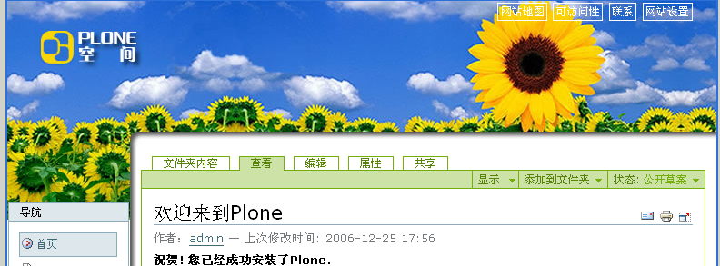
 
   图 5.20 调整后的站点显示效果

侧栏面板显示调整
------------------
侧栏面板的显示也需做一定的调整，因调整部分并不多，且面板的样式与默认显示还比较接近，所以可以到 ploneCustom.css 中调整显示。当然如果对侧栏面板显示调整较大的，可定制 portelet.css 重新定义面板显示样式。下面根据【Plone空间】的侧栏面板显示要求做一些显示调整。

首先调整左侧栏面板头部背景和面板头部字体的颜色并加粗显示，同时去掉面板头部外边框，代码如下：

::

 /*左侧栏面板头部背景和面板头部字体的颜色并加粗显示，同时去掉面板头部外边框*/
 #portal-column-one dt.portletHeader {
    color: white;
    border-style: none;
    font-weight: bold;
    background: url('&dtml-portal_url;/images/nav-blue-bar.jpg') no-repeat;
  }

因新闻等面板的面板头部字体是在标签<a>中，调整代码如下：

::  
  
 /*新闻面板的字体是在标签<a>中，调整字体代码如下*/ 
 #portal-column-one dt.portletHeader a{
    color: white;
    font-weight: bold;
  }

去掉面板的一些边框，调整代码如下： 

::  
  
 /*去掉面板的dl部分外边框*/
 #portal-column-one dl.portlet {
    border-style: none;
  }
  
 /*去掉面板的dd列表部分外边框并调整显示*/
 #portal-column-one  dd.portletItem {
    padding:0.5em 0.5em 0.5em 1em;
    border-style: none;
  }
  
 /*去掉面板的dd面板脚部分左右边框并填充新的底部边框*/
 #portal-column-one dd.portletFooter {
    border-right:none;
    border-left:none;
    border-bottom: solid 1px #7A7A7A;
  }

调整导航面板中内容左对齐，调整代码如下：

::

 /*导航面板中内容左对齐*/
 #portlet-navigation-tree .visualIconPadding{
    padding-left: 0px;
  }

设置导航条和网站地图中不显示图标(icon)，因生成图标的CSS（generated.css）定义的CSS是随类型不同而显示图标不同，CSS中引入了DTML定义类型变量，这里给出导航条中不显示图标的代码： 

::

 /*设置导航条中不显示icon*/
 <dtml-in "getPortalTypeList()">
   <dtml-let item=sequence-item
             type_id="item['id']"
             type_icon="item['icon']">
      #portlet-navigation-tree .contenttype-&dtml-type_id;,    
      #portlet-navigation-tree .contenttype-&dtml-type_id; a:hover, 
      #portlet-navigation-tree .contenttype-&dtml-type_id; a.navTreeCurrentItem {
         background-image: none;
         background-position: 0% 3px;
       }
    </dtml-let>
 </dtml-in>
 
再来看看定制后的效果，如图5.21所示。

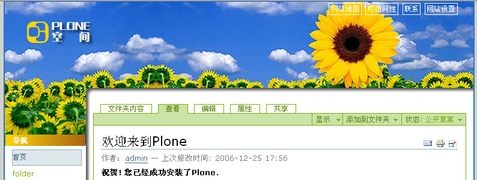

   图 5.21 最终定制后的效果
   

页脚的定制
-------------
定制的工作做到这里应该很有成就感了，的确，我们已经将Plone的默认外观做了很个性化的改变。还需要定制一下页脚部分。

可在portal_skins的plone_templates中找到footer，它便是页脚显示脚本。这个脚本是用ZPT写的，在《页面模板》章节中会有详细介绍，这类脚本也是支持HTML的，下面将<body>脚本中换成下面类似的HTML脚本： 

::

 

      
<a href="http://plonespace.net/">【Plone空间】版本所有</a>

 

注意代码中的： 

::

 metal:define-macro="portal_footer"

是要保留的，否则Plone就认不出这是页脚的脚本了。到这里，定制【Plone空间】的外观风格就完成了。

小结
==============
定制Plone的外观风格，掌握定制的方法是最重要的，通过本章的学习，掌握了Plone皮肤的基本知识，Plone皮肤的基本原理。一个典型的皮肤外观风格定制案例－－【Plone空间】皮肤的定制，可以学习到Plone皮肤的定制过程；结合《Zope模板学习》章节的学习，Plone皮肤的定制工作将会是非常的得心就手。

