=========================
深入Plone设置与管理
=========================

.. sectnum::
   :prefix: 4.

上一章介绍了通过Plone控制面板对网站的基本设置与管理。如果需要对站点进行更多的管理维护和定制，仅仅使用Plone控制面板是不能满足要求的，我们需要更深入地了解Plone的设置和管理操作。

本章针对网站管理员、系统管理员和系统集成人员，深入介绍Plone站点的设置与管理。脚本开发人员和扩展开发人员也可以通过本章的学习了解Plone内部的工作原理。

本章学习重点：

- 熟悉站点的属性设置
- 熟悉站点的操作项设置
- 了解Plone站点的内容类型管理
- 了解Plone站点的成员管理
- 熟悉和掌握Plone站点的索引维护
- 掌握Plone站点的升级方法
- 掌握Plone设置数据的管理方法
- 了解其它工具对象

ZMI介绍
==================
Zope管理界面（Zope Management Interface）简称 ZMI 。这是一个管理Zope内部对象的界面，适合系统集成人员和开发人员使用。在这个界面中，可以对各个对象进行精细的调整，并可以了解Plone内部的工作原理。

初步认识ZMI
-------------------
进入ZMI的方法：用站点管理员登录 -> 网站设置 -> Zope管理界面，便进入了ZMI。另外一种方法是，在地址栏中站点地址后加 */manage* 即可进入。比如站点地址是 *http://localhost:8080/Plone* 在地址栏中这样输入::
 
 http://localhost:8080/Plone/manage

进入ZMI后，显示如图4.1所示。

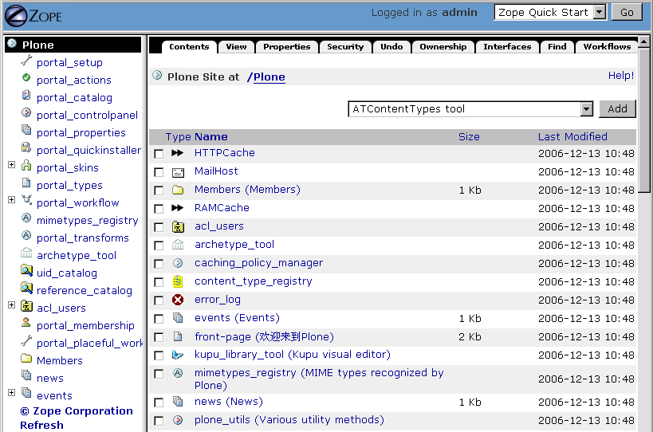

   图 4.1 Zope管理界面

ZMI界面与Plone、Plone控制面板的界面完全不同，界面上不如Plone控制面板友好。ZMI是提供给网站管理员、系统管理员、系统集成人员进行设置管理和维护站点所使用的，脚本开发人员也可以通过这里进行定制开发工作。

我们来初步地了解一下ZMI，ZMI有两大特征：

特征一：又一个类Windows资源管理器

在上一章介绍的使用Plone时，对比了Plone界面与Windows资源管理器界面，Plone界面非常类似Windows资源管理器界面。现在再看 ZMI ，发现也有类似的结构：左侧是导航，中间是主体内容（列出目录中对象）；在主体内容下方可以对一个或多个对象进行重命名、复制、剪贴、粘贴、删除等操作；在主体内容右上方可以添加对象。

特征二：看到更多的对象

一旦进入 ZMI ，便看到在Plone看不到的一些对象。从右上方的添加对象的下拉菜单中可清楚地看到，如下图4.2所示。

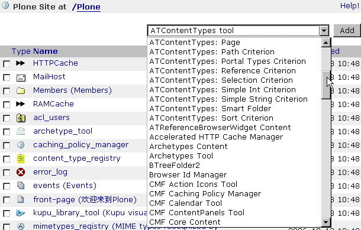

   图 4.2 ZMI中添加内容

可将这些对象按以下分类：

- 内容对象：文件，文件夹，页面等。包括 Zope 内容对象和 Plone 内容对象。
- 工具对象：提供某些服务的工具。Zope工具，比如数据库连接、CMF/Plone网站工具。
- 代码脚本：包括显示模板的代码脚本，如ZPT、DTML、逻辑脚本、Python脚本。   

注意，Plone安装后的这些对象，属于自带系统对象，如果删除可能会导致Plone不能正确运行。

对象的导入导出
--------------------
ZMI主体内容下方有一排按钮，可对一个或多个对象进行重命名、复制、剪贴、删除等操作，还有一个导入/导出（Import/Export）的按钮，在ZMI中可对内容做导入/导出操作。

导入/导出操作可供在Plone站点间交换数据。 操作很简单，图4.3是导入/导出的界面。

.. figure:: img/setting/import_export.png
   :alt: 导入/导出界面

   图 4.3 导入/导出界面

图中，上半部分是进行导出操作，下半部分是进行导入操作。

导出对象的操作步骤：

#. 选择在ZMI目录中选择该对象，点击Import/Export按钮进行导入/导出操作

#. 进入了导入/导出页面后，看到页面导出部分中已经选择了导出对象的id 

#. 选择导出方式：

   - 下载到本地计算机或保存文件至服务器
   - 选择是否以XML格式

#. 单击Export（导出）按钮

#. 导出操作完成，以ZEXP格式文件保存在本地计算机或服务器

导入对象的操作步骤：

#. 将ZEXP格式文件（提供的导出后的文件）存放至实例目录中的import文件夹中
   
#. 进入ZMI要导入内容的目录，点击Import/Export按钮进行导入/导出操作

#. 在导入/导出页面的导出部分选择导入文件的文件名

#. 选择是以除去导入对象的所有者权限或保持原有所有者权限的方式导入

#. 点击Import按钮导入，对象导入Plone站点中

.. hint:: 如不想手工上传ZEXP格式文件或考虑系统的安全性，可以使用Zope的插件产品QuickImporter(下载地址：http://zope.org/Members/mojix/QuickImporter) 来上传ZEXP格式文件

ZMI 标签页介绍
-----------------
在 ZMI 主体页面的顶部有一排标签页，如图4.4中Content，View，Properties，Security等。

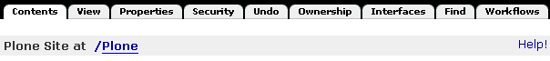
   
   图 4.4 ZMI 标签页
   
Properties标签页：对象的属性
.................................
Properties标签页是管理对象属性的。属性一般有这几种类型：

- boolean: 逻辑(True/False)
- string: 字符串
- lines: 多行列表，每行一个条目
- date: 日期 (yyyy/mm/dd hh/mm/ss)
- int: 整型

Propeites标签页提供了属性设置的界面，可直接添加、修改、删除对象的属性。通过属性，可保存对象的一些设置。下文4.2节中将介绍Plone站点中的一些常用的属性设置。

Security标签页：对象安全
............................
对于对象安全，一般的理解是控制各个访问的用户拥有什么样的权限，这里以角色来区分不同的用户。在对象安全标签页展示的列表中，每一个权限项都有一个 Acquire permission settings? 的复选框选项，它表示是否获取上一级权限设定，选中它则表示获取上一级设定。

这个界面不够友好，如果在这里进行权限设置，将会相当复杂，在Plone中已经将常用的权限项抽象出来以简化权限的设置，在《用户和权限设置》一章中将会介绍Plone权限设置的相关内容。

Undo标签页：撤销
......................
在Undo标签页可撤销事务。

典型的用途：如果不小心删除了某个对象，或者做了错误的设置，可在这里撤销前面的操作，恢复以前的数据。

站点属性设置
=====================
站点属性设置包含两个位置，一个在站点根目录和各级目录的porperties标签页中的属性设置，另一个是ZMI中 portal_porperties 目录下的设置。

网站的基本信息
-------------------------------
看一下根目录下的properties标签中的属性，根目录以下的目录都会继承根目录的这些属性，除非对该属性进行了另外的设置。常用的有default_page，left_slots，right_slots，default_page是设置默认页面，left_slots 、right_slots 则是设置左右侧栏。如下图4.5所示：

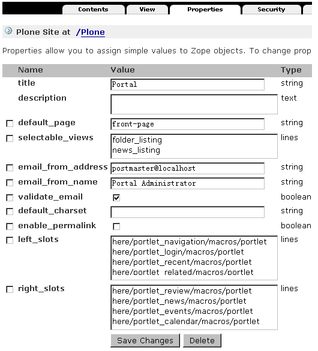

   图 4.5 站点属性(properties标签页)

在这个页面中还有可在Plone控制面板的【网站设置】中设置的站点名称、站点描述、站点的寄信人姓名、站点的寄信人地址等设置项，也就是说可以在这里设置以上属性。在Plone3.0中使用管理面板来控制左右列面板，不再使用网站属性的left_slots和right_slots来控制。
   
手工设置默认页面
----------------------------
我们知道，通过设置文件夹页面上【显示】操作中的【选择一个条目作为默认视图】，可以选取某一页面设置为默认页面。下面来介绍在ZMI中实现设置默认页面的方法。

例 4.1 在ZMI中设置默认页面

某一特殊的页面模版，id为template_view，想设置它为当前文件夹stuff的默认页面，操作方法如下：

#. 在ZMI中，进入stuff文件夹，选择Properties标签
#. 在下方添加新属性区域，分别设置下面对应的内容： ::
 
    - Name: default_page
    - Type: string
    - Value: template_view

#. 单击 Add 按钮添加

这样便实现了以template_view页面为文件夹的默认页面。

左右面板列的设置
---------------------
还有比较常见的设置，比如：在Folder1文件夹上不显示右侧栏，或不显示右侧栏某个面板。设置方法也如同上例，在Folder1文件夹的Properties标签下添加right_slots属性，注意类型选择 lines ，添加后在这个属性中不给属性值或添加想要显示的属性值即可。这里列出左右侧面板（left_slot/right_slot）的属性值对照表。

.. csv-table:: 【表 4.1】 左右侧面板属性值对照表
   :header: "属性值", "面板"   

    "here/portlet_calendar/macros/portlet", "日历面板"
    "here/portlet_events/macros/portlet", "事件面板"
    "here/portlet_favorites/macros/portlet", "收藏面板"
    "here/portlet_login/macros/portlet", "登录面板"
    "here/portlet_navigation/macros/portlet", "导航面板"
    "here/portlet_news/macros/portlet", "新闻面板"
    "here/portlet_recent/macros/portlet", "近期更改面板"
    "here/portlet_related/macros/portlet", "相关内容面板"
    "here/portlet_review/macros/portlet", "待审内容面板"
    "here/portlet_prefs/macros/portlet", "网站设置面板"

.. hint:: Plone3.0中提供了像Plone控制面板一样可直接在Plone站点页面中设置面板管理的工具，用管理员登录就可以轻松地管理这些面板的显示。

portal_porperties 中其它属性设置
------------------------------------
portal_porperties是集中存放各种属性设置的文件夹。site_properties是站点其它属性设置，navtree_properties是导航属性设置。

进入site_properties页面，可看到很多属性，下面的表中有具体的介绍：

.. csv-table:: 【表 4.2】 site_properties属性说明
   :header: "属性", "属性说明"   

   "auth_cookie_length", "一次登录后，cookie的保留天数，多少天内不必再次登陆？"
   "allowAnonymousViewAbout", "匿名用户能否看到byline信息"
   "localTimeFormat/localLongTimeFormat", "时间显示的长短格式"
   "default_language", "元数据的缺省语言"
   "default_charset", "缺省的网页编码字符集"
   "ext_editor", "是否使用外部编辑器"
   "available_editors", "可获得的编辑器，如Kupu等"
   "allowRolesToAddKeywords", "哪些角色可以在元数据中添加关键字"
   "calendar_starting_year", "日历的起始年"
   "calendar_future_years_available", "日历中可使用未来几年的年份"
   "invalid_ids", "哪些id不能使用"
   "default_page", "文件夹的缺省页面的名字"
   "search_results_description_length", "查询结果中描述部分显示字数"
   "ellipsis", "省略号"
   "typesLinkToFolderContentsInFC", "在文件夹内容页面中，链接到另外一个文件夹内容页面的内容类型"
   "use_folder_contents", "在导航树中哪些使用folder_contents"
   "allow_sendto", "是否允许页面发送功能"
   "disable_folder_sections", "自动定层文件夹做页首标签"
   "use_folder_tabs", "在内容标签中，同时显示category为folder的action"
   "typesUseViewActionInListings", "在folder_listing中使用view的类型，如file、image"

navtree_properties是导航属性设置，Plone控制面板中已经支持设置导航的这些属性。

操作项设置
======================
操作项设置是指站点操作项和Plone控制面板操作项设置，下面逐一介绍。

认识站点操作项
----------------------
站点操作项是指影响Plone站点页面的一些元素，如站点操作链接（站点右上角的【网站地图】、【联系】、【网站设置】等）、网站标签（如【新闻】、【事件】、【成员】）、个人栏、内容标签（如【查看】、【编辑】、【属性】等），还有内容操作菜单、工作流等。

站点操作项是由 ZMI 中的 portal_actions 统一管理，进入 portal_actions ，如图4.6所示。

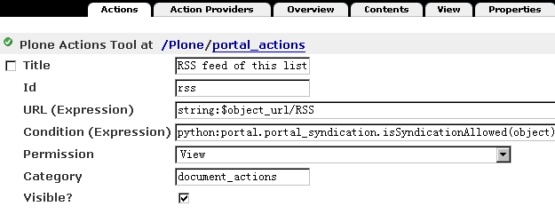

   图 4.6 站点操作项(portal_actions)
   
可以看到这些操作项都包括下面这些属性：

.. csv-table:: 【表 4.3】站点操作项(portal_actions)属性说明
   :header: 属性, 属性说明   
   
   Title, 显示名
   Id, 标识代号
   URL(Expression), 链接URL。这是一个TALES表达式，语法将在后面章节介绍。
   Condition(Expression), 显示这个操作项的条件。这是一个TALES表达式，语法将在后面章节介绍。
   Permission, 用户对当前对象需要拥有什么权限，才能显示。
   Category, 类别，不同分类会在不同的地方显示，详细见下节介绍
   Visible, 是否显示

站点操作项类别
------------------------
每一个站点操作项是通过类别(category)属性来确定操作项属于站点页面上哪块位置，下表是对操作项的类别(category)的说明。

.. csv-table:: 【表 4.4】网站操作项类别对照表
   :header: "类别", "类别说明" 

    "portal_tabs", "页首标签页: 如新闻、成员等"
    "document_actions", "内容区右上方的工具条的链接: 如打印、发送等"
    "site_actions", "站点链接, 网站右上方的链接"
    "object", "内容的标签: 如查看、编辑等"
    "folder_buttons", "在文件夹内容管理界面中的按钮, 如拷贝、键切、粘贴等"
    "user", "个人栏"
    "object_buttons", "针对对象的操作菜单"
    "workflow", "工作流"
   
站点操作项源
--------------------
每一个站点操作项都对应着它的操作项源，在 portal_action 页面的 Action Providers 标签页可看到，它包括：portal_workflow（工作流工具）、portal_actions（站点操作项）、portal_membership（用户管理）、portal_registration（用户注册）、portal_discussion（讨论）、portal_undo（撤消）、portal_syndication（聚合）、portal_properties（站点属性）、portal_types（内容类型）

.. Note:: 站点操作项源太过于分散，追溯起来很繁琐。在 Plone 3.0 版本中操作项源会集中于 portal_actions 。

Plone控制面板操作项
-------------------------
前面介绍了Plone控制面板，以及控制面板中的各个设置；在 portal_controlpanel 中可找到对应的操作项。进入 portal_controlpanel ，如图4.7所示。

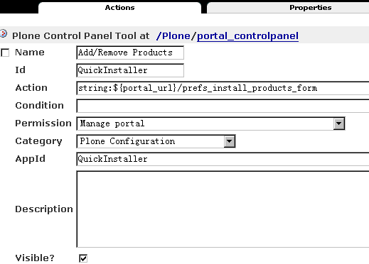

   图 4.7 Plone控制面板操作项(portal_controlpanel)
   
每个操作项中也包括一些属性，它们也有分类，分类包括：

- Plone Configuration: Plone设置
- Add-on Products Configuration: 附加产品设置
- Member Preferences: 用户选项 

在portal_controlpanel的Properties标签页中可以看到有一个 groups 的属性，列出的就是这三个分类。

.. Note:: ZMI中的 portal_controlpanel 包括用户选项的分类，从这里也可了解Plone控制面板不仅仅只包括网站设置，用户的个人设置也是它的组成部分。

操作项图标
--------------------
ZMI中 portal_actionicons 统一管理内容操作项、Plone控制面板操作项的图标。如图4.8是portal_actionicons页面。

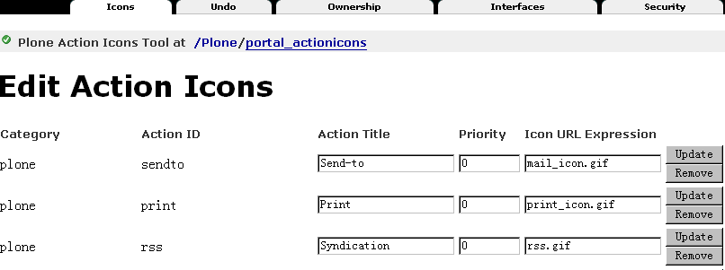

   图 4.8 操作项图标(portal_actionicons)

通过每个操作项(action)的category和action id，都可以在这里找到相应的图标；你也可以更改或删除。

内容类型管理
========================
在【添加内容】的下拉菜单中可以看到不同的内容类型，它们都有自己的名字、图标，和各自的视图。

常见的问题有：某个类型比如页面，能改掉它的名字或图标吗？或者：能更换文件夹的默认视图吗？如果你使用FTP、WebDev上传或编辑内容到Plone站点，可能会问上传的文件类型是如何对应于Plone站点中的某种内容类型的？

这些问题都是属于Plone的内容类型管理。
Plone提供了一套很成熟的内容类型管理机制。具体包括Plone内部的内容类型注册、内容创建控制，以及从FTP、WebDev等上传或编辑的文件类型与Plone中内容类型的映射。
如果了解了这套机制，这些问题都将会迎刃而解。

内容类型注册(portal_types)
------------------------------
内容类型注册是 Plone 管理内部的内容类型和它的所有属性的地方，属性包括标题、图标、有哪几种视图、默认的视图等等。

  .. |basic_type| image:: img/setting/basic_type.jpg

  .. |extend_type| image:: img/setting/extend_type.jpg

ZMI中portal_types就是对内容类型注册的统一管理，进portal_types可以看到很多内容类型，如图4.9所示。

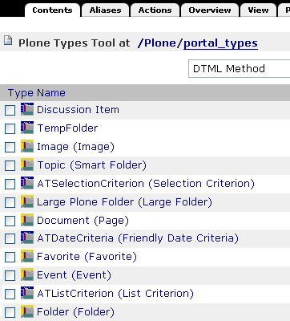

   图 4.9 内容类型注册(portal_type)

在portal_types中有两类不同的管理类型，图4.9中以图标 |basic_type| 表示的是基本的内容类型，以图标 |extend_type| 表示的是扩展后的内容类型，扩展后的内容类型有动态的视图，而基本内容类型没有。

这里主要关注扩展后的内容类型，也就是Plone的基本内容，如下方的Document(Page)、Event(Event)、File(File)、Folder(Folder)等。进入某一内容类型，发现有这么些属性（其它的也是如此，但在基本内容类型中没有Default view method和Available view methods属性，这正是它们的区别），如图4.10是Folder类型的Properties标签页。

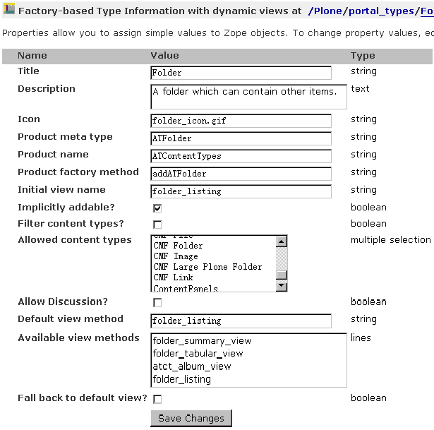

   图 4.10 Folder类型属性页

这些内容类型的属性是可以设置的，比如你可能要设置某个内容类型的默认视图。下表是对这些属性简单说明。

.. csv-table:: 【表 4.5】内容类型属性介绍
   :header: "内容类型属性", "属性说明"

   "Title", "标题"
   "Description", "描述"
   "Icon", "内容的显示图标"
   "Product meta type", "产品的元类型"
   "product name", "产品名：该类型是属于哪个产品"
   "Product factory method", "创建方法"
   "Initial view name", "对象创建后的初始显示视图(Plone中暂未使用)"
   "Implicitly addable", "是否默认在文件夹的添加菜单中出现"
   "Filter content types", "是否过滤内容类型"
   "Allowed content types", "是否允许内容类型"
   "Allow Discussion", "是否允许讨论"
   "Default view method", "默认视图"
   "Available view method", "此类型可用的显示视图清单"
   "Fall back to default view", "如果设置的视图不存在，则回退到默认视图；否则报告NotFound异常"

当进入Folder类型的页面中，上图4.10中，Properties标签页旁还有Aliases标签页和Actions标签页。进入Aliases标签页，如图4.11所示。

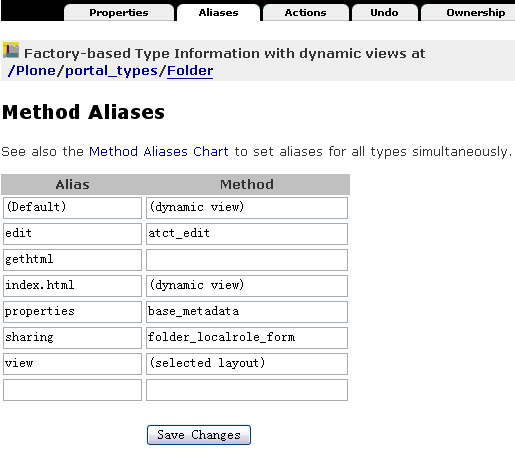

   图 4.11 内容类型Aliases标签页

这是控制内容类型的一些别名方法，如图4.11中，Folder类型的编辑方法是atct_eidt，对应的别名（Alias）是edit，还有属性方法（base_metadata）别名是properties，共享方法（folder_localrole_form）别名是sharing，查看的方法是经选择后的默认页方法别名是view 。Plone中使用别名的方式统一内容类型的基本操作方法名称，利用别名指向相应的方法，这一点也方便Plone某操作方法的升级或替换。可单击如图4.11中的Method Aliases Chart链接，以查看Plone全部内容类型的别名制表。

内容类型的Actions标签页是管理内容类型的一些操作项，比如：在Folder类型的Actions标签页中可看到查看（View）、编辑（Edit）、属性（Properties）、共享（Share）、文件夹内容（Folder Listing）的操作项；而Image类型的Actions中可看到转换（Transform）的操作项。   
   
内容创建控制(portal_factory)
--------------------------------
Plone的早期版本存在一个问题：如果用户仅仅点击创建某个内容的菜单项，而不真正进行编辑提交，文件夹中便会出现一个空的内容项。这显然不是我们所期望的。

为解决这个问题，Plone 中默认创建内容实际在内存中的“创建器”完成。你可能已经发现：在你创建内容时，在路径栏中的路径是 "http://.../portal_factory/..." 这种形式。创建内容其实并不是一下子将内容创建并到存放目录，而是先在“创建器”中创建内容，等你保存后才会真正将内容存放到目录。

ZMI中的portal_factory可以设置某种内容类型是否采用“创建器”来创建。进入portal_factory页面的Factory Types标签页，可以看到哪些内容类型是通过内容创建控制所管理的。如图4.12所示。

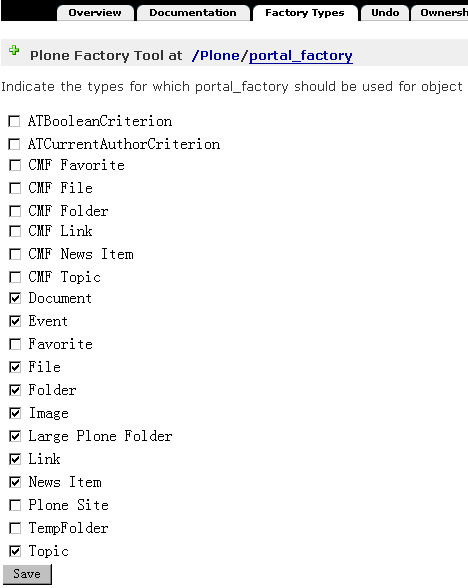

   图 4.12 内容创建控制(portal_factory)

在这个页面中，可选择需要采用创建器控制的内容类型，单击Save按钮保存；这种内容类型就可通过“创建器”来完成创建内容。

内容和文件映射(content_type_registry)
-------------------------------------------------
前面在介绍内容类型的管理的时候提到Plone能自动处理使用FTP，WebDev等上传或编辑的文件与Plone中内容的映射。那么它是怎么做到的呢？

ZMI中的content_type_registry是对内容和文件映射的统一管理。进入content_type_registry，如图4.13所示。

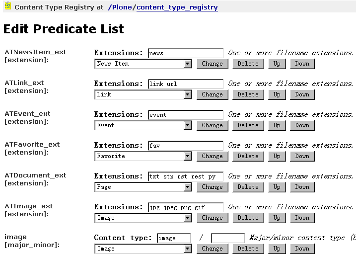

   图 4.13 内容和文件映射(content_type_registry)
   
Plone通过一组规则来实现上传文件的类型与Plone中的内容类型映射。
比如，文件后缀名为txt、stx、rst、py等映射为ATDocument（页面类型），以jpg、jpeg、png、gif后缀的文件映射为ATImage类型。

各种规则详细说明见表4.6。

.. csv-table:: 【表 4.6】内容和文件映射规则
   :header: "规则", "规则说明"

   "extension", "用文件扩展名来匹配"
   "major_minor", "它采取两部分（或任一部分）去反向匹配传入的Multipurpose Internet Mail Extensions (MIME)类型文件。如果你留下或者部分空白，那么它将匹配类型的一切。比如：用major_minor匹配图片（它后面所填部分是空白），它将匹配image/jpeg, image/gif, image/png, 等等。"
   "mimetype_regex", "用类型的正则表达式来匹配"
   "name_regex", "用名字的正则表达式来匹配"

站点成员管理
==================

成员注册
----------------
在ZMI中有一个 portal_registration 的对象工具，它是提供用户登记注册以及注册时的动作。在默认Plone中，只有一个动作【注册】。

在portal_registration的Configure标签页中，是对用户注册用户名的规则控制，默认的规则是这样的： ::

 ^[A-Za-z][A-Za-z0-9_]*$

这是一个正则表达式，表示必须以字母开头，后跟数字、字母或下划线，这限定了注册用户名的规则，可在Custom member ID pattern定义新的规则，下面是允许以邮件名作为注册用户名的例子。

例 4.1 允许用邮件名作为注册用户名

#. 进入ZMI中的portal_registration的Configure标签页
#. 在Custom member ID pattern中定义新的规则： ::
 
    # 以字母、数字和 @ 字符作为注册用户名
    [@\.A-Za-z0-9_-]+

#. 单击Change保存设置

这样就允许用邮件名作为注册用户名。
    
成员管理
--------------
在ZMI中的portal_membership提供成员管理。包括：外部用户文件夹的角色映射，是否为新成员创建个人区，个人区的类型，设置成员个人区，以及个人栏的操作项。先进入portal_membership中看一看，如图4.14所示。

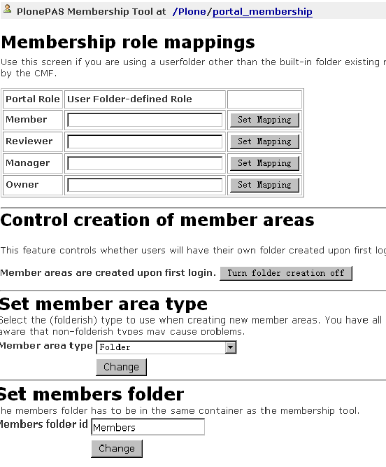

   图 4.14 成员管理(portal_membership)

这个页面包括4部分提交表单；上面第一部分是设置外部用户文件夹的角色映射(很少使用)；
第二部分是是否自动为新成员创建个人区，如果不希望用户随便提交内容占用网站空间，可在这里关闭此功能；
第三部分是如果自动创建个人区，应该使用那种内容类型做为个人区文件夹，比如设置博客文件夹做为用户的个人文件夹就非常有用；
第四部分是设置成员个人区的文件夹id，默认是Members。

再进入portal_membership的porperties标签页，如图4.15所示。

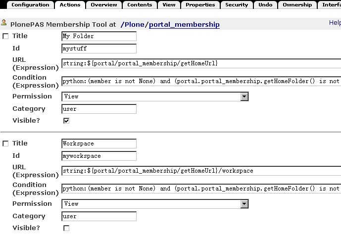

   图 4.15 个人栏中的操作项（portal_membership的action标签页）

这里是提供设置个人栏的操作项，比如未登录状态下的【登录】操作项，登录后【我的文件夹】和【选项】操作项。你可以添加你想加的操作项，或不显示当前的某个操作项。

portal_membership的Properties标签页中，看到它有一个title和user_search_keywords 性。在这里可以回顾一下，进入站点的个人空间(Members)标签，查找网站成员的页面中就是通过user_search_keywords中的关键字做为搜索条件。

portal_membership的Portraits标签页用于维护网站成员的像片，在这里可以删除错误的成员像片文件。

成员数据管理
-----------------
ZMI 中的portal_memberdata提供了成员数据管理，它类似一个存放了成员信息的数据库。进入portal_memberdata的Properties标签页，如图4.16所示。

.. figure:: img/setting/portal_memberdata.png
   :alt: portal_memberdata
   
   图 4.16 成员数据管理(portal_memberdata)

图4.16中，可看到一些属性项，这些属性项便是【个人选项】中的属性项，包括属性项的默认值，如：默认编辑器：Kupu 。Plone通过portal_memberdata对象对各个成员的数据进行管理，这样用户就可以改变自己的某个属性值从而改变他在Plone站点中的环境。

portal_memberdata的Contents标签页中，可在这里维护成员数据。比如在数据库中删除了某个用户，但用户的一些属性记录可能还保存在站点中，这时候需要清除冗余的用户数据。在portal_memberdata的Contents标签页中可看到提示，如图4.17所示。

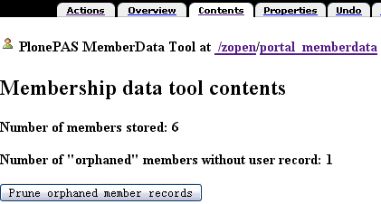
   
   图 4.17 维护成员数据 

第一行提示站点现在有多少用户存储，第二行提示站点上有多少条用户冗余记录。如果有冗余记录，单击Prune orphaned member records按钮就可以清除冗余数据。

站点成员管理还包括acl_user对象，它存储和连接其它用户数据源，关于这些会在《用户和权限设置》章节具体地介绍。

内容目录(portal_catalog)
============================
Plone的所有内容都是以对象的形式存在。如果需要在整个网站进行搜索，则需要对Plone的所有内容建立一个目录。
内容目录具有类似于黄页中目录的作用，直接从内容目录中查找对象，会大大提高内容查找的速度。
在 Plone 中其实大部分的界面都是以索引的形式来生成的，比如文件夹的页面，默认显示的是其文件夹的内容，以及各个内容的属性。还有查询集的页面、搜索出来的内容页面等。

Plone通过portal_catalog对象，提供内容的目录服务。
portal_catalog相当于一个关系数据库的表，独立存放内容索引。包括：索引字段（index），它是指可在搜索条件中使用的字段；列字段（metadata），指搜索结果中可使用的字
段；以及数据（catalog）。

目录数据
----------------
portal_catalog的Catalog标签页中记录的是全部的目录数据，如图4.18所示。

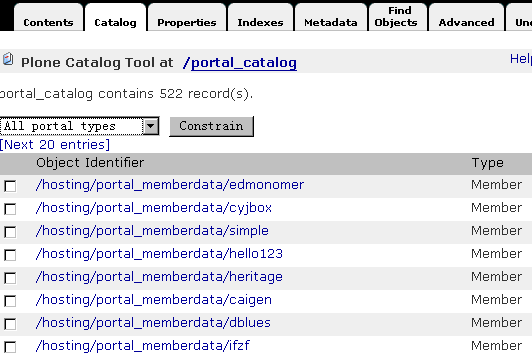

   图 4.18 索引数据(portal_catalog的Catalog标签页)

在这个页面中可以按类型分类查看目录数据（一页包含20条索引），也可查看单个目录条目页面，你可对一条或多条索引进行手工维护、删除或更新。   

目录索引(index)
------------------
图4.19是portal_catalog的Indexes标签页的界面。

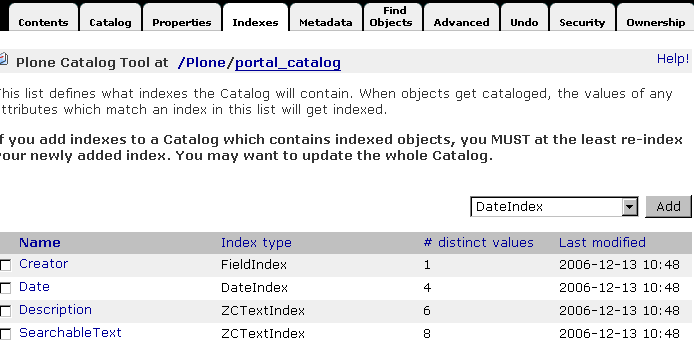

   图 4.19 portal_catalog 的Indexes标签页的界面

portal_catalog的Indexes标签页显示的是索引字段，每条索引都包含着这些字段。
下表4.7是索引类型说明。

.. csv-table:: 【表 4.7】索引类型说明
   :header: "索引", "说明"

   "ZCTextIndex", "如果你需要作全文检索的话就要用这个(而不是TextIndex)。他提供布尔运算、括号优先运算、通用字搜寻、词组搜寻等功能。"
   "FieldIndex", "当你的字段是特定的值的话可以用这个，它会将整个值的内容都存起来。"
   "KeywordIndex", "这类 index 可以与 lines 型式的 property 搭配，他可以记录一个序列的关键词，每个关键词都像 FieldIndex 一样整个被记录起来，不过只要搜寻条件符合其中一个或一个以上的关键词就会被当作的符合条件的。"
   "PathIndex", "搜寻对象的路径，如果你的对象是依照目录来作分类的话，可以考虑使用这个。"
   "DateIndex", "类似 FieldIndex 的运作，但有针对 DateTime 的值作优化。"
   "DateRangeIndex", "针对时间区段的搜寻所使用的。"

索引提供条件查询，并显示查询结果。在portal_catalog的Indexes标签页看到了便是各种索引的可用的查询条件，下表中给出各查询条件的简单说明。

.. csv-table:: 【表 4.8】索引查询条件说明
   :header: "查询条件(Index)", "索引类型", "说明"

   "Creator", "FieldIndex", "创建人"
   "Date", "DateIndex", "日期" 
   "Description", "ZCTextIndex", "描述"
   "SearchableText", "ZCTextIndex", "可查找的文本"
   "Subject", "KeywordIndex", "关键字"
   "Title", "ZCTextIndex", "标题"
   "Type", "FieldIndex", "类型"
   "allowedRolesAndUsers", "KeywordIndex", "允许的角色和用户"
   "created", "DateIndex", "创建时间"
   "end", "DateIndex", "结束时间"
   "effective", "DateIndex", "生效时间"
   "effectiveRange", "DateRangeIndex", "生效时间区域"
   "expires", "DateIndex", "失效时间"
   "getEventType", "KeywordIndex", "获得事件类型"
   "getId", "FieldIndex", "获得对象Id"
   "getObjPositionInparent", "FieldIndex", "获得对象的父级对象"
   "getRawRelatedItems", "KeywordIndex", "获得相关内容列表"
   "id", "FieldIndex", "对象的ID（Name）"
   "in_reply_to", "FieldIndex", "回复的ID号，None表示顶层"
   "is_default_page", "FieldIndex", "是否是默认页面"
   "is_folderish", "FieldIndex", "是否是文件夹"
   "meta_type", "FieldIndex", "CMF的内容类型"
   "modified", "DateIndex", "修改时间"
   "path(indexed attributes:getPhysicalPath)", "ExtendedPathIndex", "路径（从根开始）"
   "portal_type", "FieldIndex", "CMF中的内容类型ID"
   "sortable_title", "FieldIndex", "可分类的标题"
   "review_state", "FieldIndex", "评审（工作流）状态" 
   "start", "DateIndex", "开始时间"

目录条目信息
----------------
在portal_catalog的Metadata标签页中，可看到CreationDate, Creator, Date, Description等等。
这是目录的元数据，也就是说每个内容的这些信息存储在目录中。如图4.20是portal_catalog的Metadata标签页。

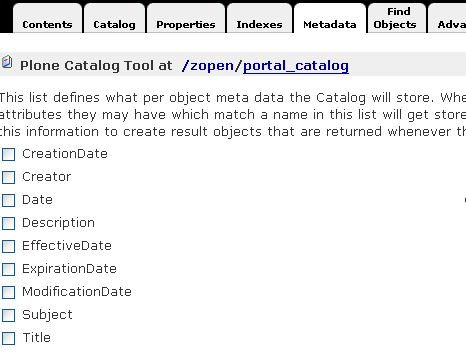
   
   图 4.20 portal_catalog的Metadata标签页
   

通过索引搜索出来的结果，包含了这些元数据信息。使用API开发的时候，可直接读取这些信息。

目录的维护
------------
在Plone中，新创建一个内容，它会自动地在索引中创建一条新的目录数据；修改或删除 Plone 站点中的某个内容，这个内容的索引信息也会自动进行更新或删除。也就是说， Plone会自动地更新维护索引。

如果出现异常，可能出现索引与内容不一致的情况。比如内容已经删除，而索引还在，或者反之。这时，就需要手动维护索引。在portal_catalog的Advanced标签页，可以对索引进行手工维护。如图4.21所示。

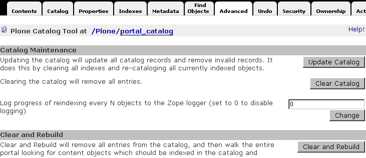

   图 4.21 索引的维护

在这个页面中，可以单击Update Catalog按钮对站点更新全部索引。这个过程当然可以清除站点中的错误索引。可以单击Clear Catalog按钮清除站点全部索引。可以单击Clear and Rebuild清除索引后重建索引。这些手工维护的方式，如果站点的内容较多的话，它的运行速度会非常慢。

.. Note:: 一个小技巧：如果你知道站点中某个内容在索引中是错误的，可在Catalog标签页中找到该内容的索引，手工对它删除或更新。

为了监视索引进展情况，可设置每完成一定数量的索引操作就在日志中记录一下(设置为0则表示不记录)。

UID 索引和相关内容索引
=============================
UID 是内容对象在整个站点的唯一标识。它与Id不同，Id是在某个目录下的标识，只能用于在所在目录下查找对象；而UID是内容对象在整个站点内的唯一标识。所以如果你用UID去关联某条内容对象时，即使这条内容对象发生了路径变化（移到其它的目录），它还是可以关联此内容的。而通过Id是做不到的。

在ZMI有一个uid_catalog对象和reference_catalog对象。这两个对象分别用于对内容UID做索引，以及对和内容相关的内容做索引，见图4.22所示。

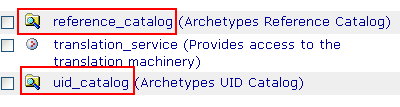
    
   图 4.22 UID 索引和相关内容索引

分别进入这两个对象的页面，可看到它们和portal_catalog非常之类似，也有自己的Indexes(索引条件)和Metadata(索引元数据)。uid_catalog和reference_catalog也可和portal_catalog一样，看成是独立的表，但是它们是通过一个或几个索引条件相互关联起来的。

网站升级
==================
从Plone的低版本升级到Plone的高版本的时候，必须手工对网站进行升级，确保网站在新的版本中能够正确运行。

Plone版本升级
----------------
在Plone的软件包升级后，进行ZMI时，可看到如图4.23所示。

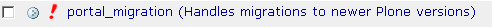

   图 4.23 portal_migration对象提示需升级实例版本

其中的红色惊叹号表示，实例版本与文件系统中的软件版本不一致，需要手工升级实例版本。

当ZMI中portal_migration对象提示需升级Plone版本，进入portal_migration，如图4.24所示。

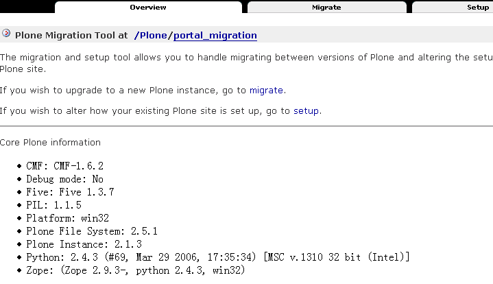

   图 4.24 portal_migration提示Plone实例版本与文件系统中软件版本不一致

可以看到提示::

  Plone File System: 2.5.1
  Plone Instance: 2.5-alpha1

文件系统中软件版本2.5.1与实例版本2.5-alpha1不一致。按提示信息进入portal_migration的Migrate标签页进行升级版本。

.. warning:: 升级前必须事先对网站数据库文件进行备份，以免发生不测，导致数据丢失或者破坏

进入portal_migration的Migrate标签页，如图4.25所示。

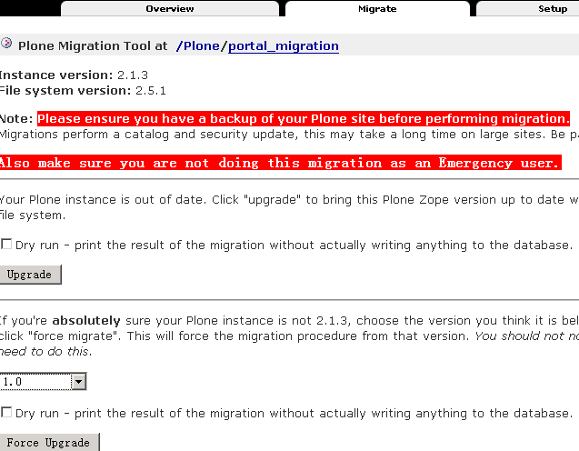

   图 4.25 portal_migration的Migrate标签页

看到两行红色的提示信息，一个是提示升级前确保对站点已做备份，另一个是提示不能以紧急用户的身份去升级。在确保都做到了两条提示的要求后，可以对站点进行版本升级。

选择Dry run表示不是真正地提交升级，仅仅检查是否可以正常升级。当这一步操作没提示错误时，则表明可以进行升级。目前Plone只对正式版本提供了升级路径，如果采用的不是正式版本，则需要在下方选择一个接近的正式版本单击Force Upgrade按钮来强制升级。

在选择Dry run后，单击Upgrade按钮没有出现提示错误，这时退回portal_migration的Migrate标签页直接单击Upgrade按钮，升级站点版本。当升级完成后再回到portal_migration中（portal_migration的Overview标签页），此时看到的Plone File System（Plone文件系统中软件版本）和Plone Instance（Plone实例）的版本应该是一致的。然后再回到ZMI中，portal_migration对象前面的惊叹号已经消失了。这表明Plone版本升级工作已顺利完成。

portal_migration的Setup标签页是升级一些具体的定制方法，在Plone 2.5版本时已过时，逐步被portal_setup替代。

内容类型升级
---------------------
另外，在Plone的软件包升级后，或将数据库迁移至更新版本的软件环境中。有的Plone版本需要对Plone中的内容进行单独的升级。

进入ZMI中还看到另一个惊叹号的对象，如图4.26所示。

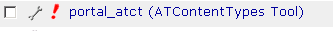

   图 4.26 portal_atct对象提示需升级内容类型

这是Plone软件包升级后，Plone提示实例版本与文件系统中的软件的内容类型版本不一致，需要手工升级实例版本的内容类型。这可在portal_atct中完成，进入portal_atct后，进入Version Migration标签页，如图4.27所示。

.. figure:: img/setting/portal_atct_version.png
   :alt: portal_atct

   图 4.27 portal_atct的Version Migration标签页

很醒目地提示实例版本（Instance version）和文件系统中软件版本（Filesystem version）的版本号，它们不一致。升级工作就如同Plone版本的升级。

portal_atct对象的Image scales标签页用于重新生成图片的缩略图。Type Migration标签页用于对类型升级，将CMF内容类型升级成ATCT内容类型，Plone 2.5版本已不需要此部分升级。 Recatalog标签页用于对内容重建索引，此功能也已过时。

设置数据管理
========================
所有前面的网站设置操作，都是在ZMI界面中手工完成，最终的设置数据实际上是保存在ZODB数据库的工具对象中。

这存在如下问题:

- 难以查找最近到底做了什么更改，不得不在各个界面上比较，更不大可能采用版本管理工具
- 难以发布配置数据，如不希望一系列站点都使用相同的设置，则可能需要逐个手工设置，这个操作非常繁杂，而且容易出错
- 软件接口经常发生变化，如果采用API来调整配置会非常麻烦

从Plone 2.5开始，Plone提供了 portal_setup 的设置数据管理工具。
可以将Plone大部分的设置数据(如邮件设置、内容类型设置、工作流等)导出为一组文本的设置文件（一般采用XML格式）；同时，也可将设置数据从文件系统中导入到Plone中。这样可解决上述的问题。

可在 ``CMFPlone/profiles/default`` 中查看Plone默认的网站设置。

设置数据上下文
-------------------

在portal_setup中，进行导入导出的时候，首先需要设置导入导出的上下文。导入导出的上下文决定了这次可导出哪些数据，需要在软件代码中预先设置。前面章节中，在创建Plone站点的时候，我们曾经选择过其中的Chinese Plone Site来支持中文。Chinese Plone Site的设置数据位于插件产品文件夹的 ``ZopeChinaPak/profiles/default/`` 中。设置上下文时会看到如图4.28所示。

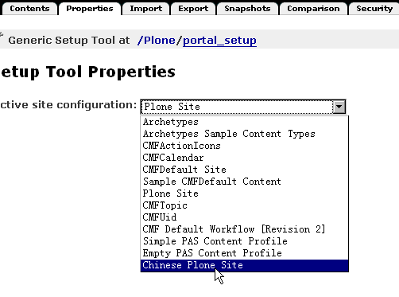

   图 4.28 设置数据上下文
   
设置数据导入/导出
------------------
当设置好数据上下文后，就可以到portal_setup的Import标签页和Export标签页导入/导出数据了。如图4.29中Import标签页。

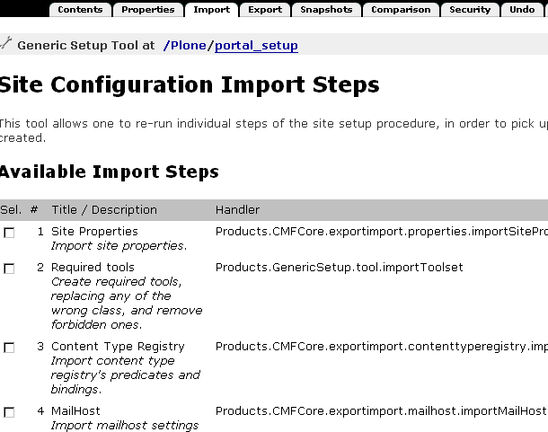

   图 4.29 数据导入/导出

数据导入是从文件系统的配置文件中导入数据上下文的设置，而数据导出是根据数据上下文导出当前的设置数据。注意：导出的数据并不是文件系统中的配置文件，一般是产生新的配置文件。

下表中对数据配置文件简单说明：

.. csv-table:: 【表 4.9】设置数据导入导出信息
   :header: "名字", "配置文件名", "说明"

   "Site Properties", "properties.xml", "网站的属性: 名字、描述、管理员名字、左右面板设置等"
   "Required tools", "toolset.xml", "创建必须的工具，替换错误的工具，清除禁止的工具"
   "Content Type Registry", "contenttyperegistry.xml", "content_type_registry的设置"
   "MailHost", "mailhost.xml", "邮件设置的设定"
   "Catalog Tool", "catalog.xml", "索引工具的子对象，索引字段等"
   "Control Panel", "controlpanel.xml", "控制面板的操作项"
   "Action Icons", "actionicons.xml", "操作项的图标(icon)"
   "Stylesheet registry", "cssregistry.xml", "样式表注册"
   "MemberData Properties", "memberdata_properties.xml", "用户数据的属性：注册时的姓名，用户名，邮件地址等"
   "Plone Properties", "propertiestool.xml", "Plone中属性对象包括子对象：比如站点扩展属性和导航属性"
   "Types Tool", "toolset.xml", "对象工具设置"  
   "Portal Factory Tool", "factorytool.xml", "创建内容控制器的设置"
   "Various Plone Setting", "plone_various.txt", "Plone 特殊的设置"
   "Workflow Tool", "workflow.xml", "工作流的定义和支撑的脚本"
   "Skins Tool", "skins.xml", "皮肤工具的FSDV和皮肤的路径定义"
   "Javascript registry", "jsregistry.xml", "注册的JavaScript"
   "Role / Permission Map", "rolemap.xml", "用户管理中的角色映射"
   "Content", "structure.xml", "站点的结构和内容"
   "Final Plone Config", "import_steps.xml", "最终Plone站点的配置信息"

导入/导出的数据配置文件就是表中的配置文件。因导入数据可能存在依赖关系，所以看到在 Import 标签页的 “导入所选项(Import selected steps)” 和 “导入所有项(Import all steps)” 按钮有一个 “包含依赖(Include dependencies)” 的选择，在导入数据时一般会默认选择“包含依赖” 。

快照和差异比较
-------------------
在portal_setup的Snapshots标签页中，是提供快照功能，也就是将当前上下文的数据设置文件创建一个快照，快照的结果（所有的数据设置文件）将保存在portal_setup的Content标签页中。同时在Snapshots标签页中可看到可用的快照，如图4.30所示。

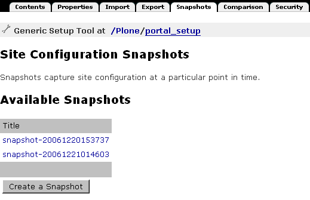

   图 4.30 数据设置文件快照

在这个标签页中可以创建一个新的快照。在portal_setup的Comparison标签页，可以对站点中保存的快照进行差异比较，当然，也可以将当前的快照和默认的，比如Chinese Plone Site比较。下面是一个两个快照差异比较的结果，如图4.31所示。 

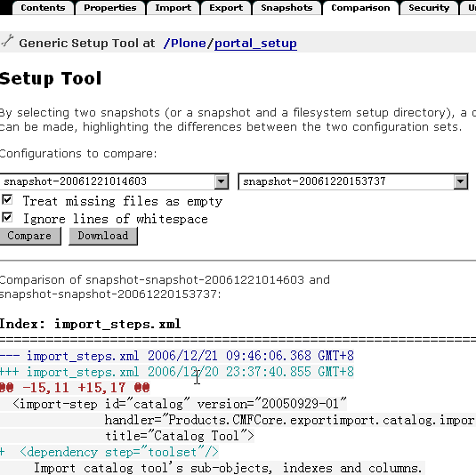
    
   图 4.31 快照差异比较

其他工具对象简介
=======================
- mimetypes_registry: 文件类型注册表。注册文件的后缀，是否是二进制、图标、mimetype等。

- portal_transform: 各种mime类型之间的内容转换。

- portal_discussion: 站点的评注引擎。

- portal_quickinstaller: 安装和卸载产品，重新安装。使用Plone控制面板中的【安装/卸载产品】也可以完成安装和卸载产品的工作。
   
- error_log: 错误日志。Plone控制面板中【错误日志】和 ZMI 中 error_log 都可完成查看每一个异常出错的相关信息的功能。
   
- MailHost: 邮件设置。Plone控制面板中【邮件设置】和 MailHost 都可完成对邮件的设置。

小结
==========
这一章介绍了 ZMI ，以及通过使用 ZMI 的各个工具对象来完成对站点的设置与管理。这一章介绍了 ZMI、站点属性设置、操作项设置、内容类型管理、站点成员管理、索引维护、网站升级，还包括其他工具对象的介绍，最后介绍 Plone 设置数据管理。理解和掌握本章的内容就可以完成对站点的深入设置与管理。

但是由于 ZMI 的界面不太友好，而且 ZMI 中的工具对象很多，有的还不容易理解。通过这一章的学习来完全掌握深入对 Plone 站点的设置与管理是很难的。这一章主要是介绍通过 ZMI 中的这些工具对象和它提供的功能来完成设置与管理站点的工作。当然，工具只是提供某些功能，而最终是需要管理员去利用这些工具去完成设置、管理以及定制工作。所以要更好的理解和掌握深入Plone站点的设置与管理，还需要系统管理员在具体的操作中去灵活运用。

