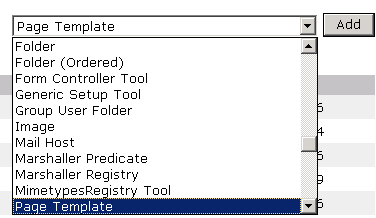
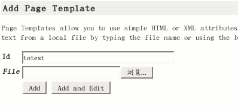
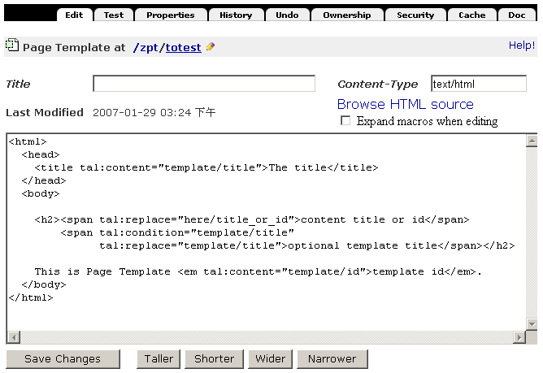
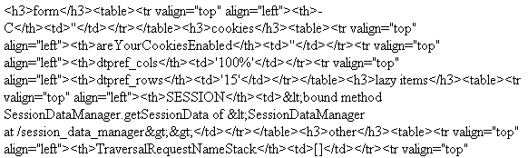
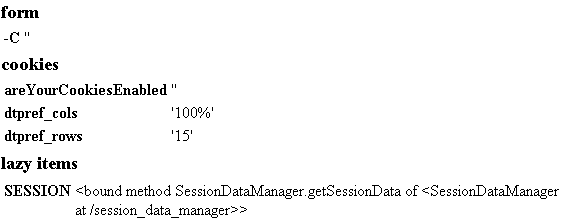
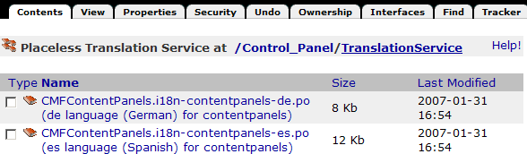
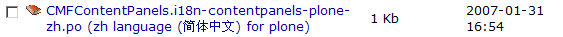
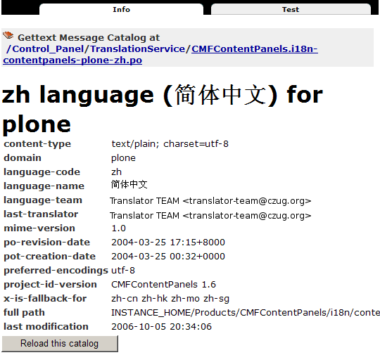

===================================================================
 Zope页面模版
===================================================================

.. .. include:: common.txt

.. Contents::
.. sectnum::
   :prefix: 12.

在当前的Zope/Plone应用中，几乎所有的Web页面都是使用Zope页面模板(Page Template) 来生成的。
Zope页面模版负责内容的展现形式。

这一章我们详细介绍页面模板的用途和用法。本章适合脚本开发人员和扩展开发人员阅读，读者要求掌握ZMI的基本使用方法，以及HTML语言。

本章学习重点：

- 了解页面模板的适用领域
- 理解TALES表达式的原理
- 掌握页面模板的用法
- 掌握模板宏和国际化的原理

什么是Zope页面模板
===========================

页面模板是一种类似于 ``asp/jsp/php`` 页面的技术，即包含有程序逻辑的页面结构。
它基于xhtml, 是xhtml的一个扩展。
由于它同时也是一种xml，因此需要生成xml数据显示的部分也可以使用页面模板。

页面模板是产生Web页面的工具，但Zope中使用这种技术有更多的好处是它能帮助程序员和设计师进行协同工作， 
在页面模板技术诞生以前也有一种称为 ``DTML`` 的显示动态页面的技术，但DTML的设计是没有考虑到有协同工作的需要，
它只是一种程序员才能使用的工具，因此现在已经被页面模板技术所淘汰了。
至今DTML技术在Zope中还存在只是为了生成一些非html/xml的页面。

一般地，在设计页面模板的过程中程序员与网页设计师的协同工作步骤是：

- 设计师使用所见即所得的编辑器制作一个模板；
- 程序员修改其中需要动态显示的地方；
- 设计师可以再次修改程序员修改的结果、程序员也可以再次修改设计师修改的结果，如此迭代式开发以达到最优。

在这个过程中，他们使用不同的工具修改页面模板的内容不会互相影响。

这种协同的原理是以xhtml标准为基础的。
因为Zope页面模板是作为一种xhtml扩展来实现的，程序员写的所有代码都在xhtml标记的属性中，
设计师只需要选择一种xhtml兼容的所见即所得编辑器，其再次工作不会破坏程序员在其中添加的代码。
当前大多数所见即所得编辑器如DreamWeaver都支持xhtml的规范。

使用Zope页面模版
==========================
页面模板主要用于生成动态页面, 将数据在页面上恰当的位置以恰当的形式显示出来，下面通过在界面上操作示例来说明它的使用方法。

创建一个页面模板
----------------------------
与添加Script(Python)一样，页面模板还只能从ZMI中进行添加，从添加下拉列表中选择Page Template。

   图 12.1 选择添加Page Template

可看到如图12.2所示的页面模版对象的添加表单。

   图 12.2 页面模板添加表单

在表单中可填写一个对象id，如totest，然后单击Add and Edit，可以看到如图12.3的画面。

   图 12.3 添加页面模板文件的默认内容

..
  TODO: 这里的例子的id应该是totest，保持一致，default也不不大合适

在这里，你可以任意修改代码，单击Save Changes保存，使用Test标签页来测试运行，
你还可以选择浏览器在新页面中打开Test标签页，这时在地址栏你可以看到真正的测试运行URL了::

 http://localhost:8080/zpt/totest

可以看到，在页面模板的id之前的一段就是添加的页面模板文件所在路径，最后的totest就是页面模板的id。
这样，你可以在浏览器的地址栏中直接输入这个URL来查看这个页面。

.. TODO
   编辑载图，测试，直接URL访问的方法，做好一个完整例子

接下来我们可以为这个页面模版增加一个标题，以便更好的说明这个页面模版的用途。
可在Title输入框中填写test ZPT，然后单击Save Changes按钮，
这样就增加了title属性值，在本章后面的例子中将会用到。

这个表单中还可以设置Content-Type属性，默认值是"text/html"，如果是生成XML文件，这里就应该更换为"text/xml"；
下面有一个"Browse HTML source"是一个链接，
打开这个链接可以在浏览器中查看页面模板的源文件直接作为HTML显示的效果；
下面的复选框"Expand macros when editing"是控制页面模板中的宏是否在编辑时替换，
当它被选中时，按保存按钮则其中的宏都会被替换成宏的内容，未选中时则不替换。
关于什么是宏(macro)在本章下文中有介绍。

..
  TODO: 介绍这个表单的其他功能和用途: 1) Browser HTML source 2) Expand macros when editing

认识Zope页面模板语法
--------------------------

再来看新建Page Template时生成的默认 Zope页面模板代码::

  <html>
    <head>
      <title tal:content="template/title">The title</title>
    </head>
    <body>

      <h2>content title or id
          optional template title</h2>

      This is Page Template <em tal:content="template/id">template id</em>.
    </body>
  </html>

测试运行后，可以在浏览器中看到运行结果，再查看所生成的HTML页面源代码::

 <html>
   <head>
     <title></title>
   </head>
     <body>
         
       <h2>test ZPT
           </h2>

       This is Page Template <em>totest</em>.
     </body>
 </html>

可以看到，除了其中有一些HTML标记中含有以"tal:"开头的属性消失了，替换成了更为具体的内容。

那么，这些从未见过的属性和它们的属性值分别是什么意思呢？

对于属性而言，这里出现了以"tal:"开头的三种属性，这些属性的属性值采用了一种叫做TALES动态的表达式。ZPT正是通过这一组特殊的扩展属性来实现动态效果的。比如：

- tal:content   表示以属性值填充HTML标记内容，上面例子中最后的em标记中使用了tal:content，以template/id这个路径表达式的值来替换其内容。
- tal:replace   表示以属性值替换HTML标记本身，在h2标记中可以看到两个span标记，但在输出结果中没有了，这就是因为被tal:replace所替换了。
- tal:conditon  是条件值，判断其真假，值为真时才显示这个标记，上面的例子的中在h2标记的第二个span中使用了这种表达，正因为其内容template/title是空的，所以被判定为假，因而整个span标记都没有输出。

后面我们将详细介绍这组扩展属性和TALES动态表达式的使用。从上面的例子中，我们可以看到，ZPT没有引入新的标记，而是主要通过扩展属性来实现动态效果，因此ZPT和HTML能够完全兼容。这是和传统的ASP/PHP/JSP最大的不同和优势之处。

除了基础的tal:属性，ZPT还包括metal:和i18n:属性，分别用于宏和国际化操作，在后面我们将逐一介绍。

XHTML代码编写规范
---------------------
zope页面模板是对xhtml的一个扩展，因此ZPT的编写需要符合xhmtl的编写规范。

而xhtml不仅仅是一种简单的html，而且是一个格式符合xml规范的语法更加严格的html。它与普通html的不同有：

- 所有的标记都必须要有一个相应的结束标记，如在html中常用的br标记一般不写结束标记，但在xhtml中就要写成 `` ``
- 所有标记和属性的名字都必须使用小写，有一些可视化编辑器会生成诸如"onMouseOver"之类的属性，在xhtml中要把它改为"onmouseover"
- 所有的XML标记都必须合理嵌套，不合理的嵌套在执行时会报告出错
- 所有的属性必须用引号""括起来，在HTML中一些数字属性值或无空格的字符串属性常常不加引号，但在xhtml中必须给属性都加上引号
- 所有<和&等特殊符号必须用编码表示，在非HTML标记处使用<和&等特殊字符不再是有效的，必须写为明确的引用形式，如 ``&lt;`` 和 ``&amp;``
- 所有属性都需要赋一个值，如html中的input有radio和checked类型都必须有值::

    <input type="checkbox" checked="checked" />

- 在注释内容中不能使用“--”，即注释以 ``<!-- some comments -->`` 出现，在注释内部不能再出现 ``--``

有这么多的不同看似给写作页面模板增加了难度，其实不然，
因为 HTML 技术发展到4.0以后已经是一个庞大的标准，还有各种兼容性的包袱，
页面模板技术选择了xhtml其实是对标准的一种简化。
同时这种严格的语法，在页面结构混乱的时候可以更加方便的定位到错位所在，这对页面查错是有益的。

TALES表达式
=======================
前面我们看到，在ZPT中扩展属性的动态部分采用TALES表达式完成。
TALES，其全称为模板属性语言表达式语法 (Template Attributes Language Expression Syntax).

TALES最早是专门用于页面模版的，现在TALES已经作为一个通用的表达式语言，在Zope/Plone的ZMI定制中大量使用。
比如我们前面在定制portal_actions工具中的操作项的时候，其中的condition、action，都是TALES表达式。

TALES表达式有三种基本形式: 路径表达式、字符串表达式和 Python 表达式。

路径表达式
----------------------
路径表达式的基本形态
.............................
在前面的例子中，我们已经看到动态表达式都是使用 "/" 操作符，表达式的书写和URL路径比较类似，因此叫做路径表达式。

比如:

- ``template/id`` 就是取出了页面模板本身的id，等同于Python 中的 ``template.id`` ，就是属性值为"totest"。
- ``context/title_or_id`` 也就是 Python 中的 ``context.title_or_id()`` ，这里的/表示调用一个函数

另外，以前的章节中在ZMI中定制各项属性时所使用的值，如在定义左列面板时 left_slots 是一个多行类型属性，其值为::

 here/portlet_navigation/macros/portlet
 here/portlet_login/macros/portlet
 here/left-panels/contentpanels_body

事实上这其中的每一行也都是路径表达式。

在前面的对象发布原理一章中，我们可以看到，直接通过URL的路径，可以定位Zope中的对象，并最终运行相关的方法。
Zope的路径表达式，正是利用对象发布的路径漫游的原理，直接对路径进行计算。

比如，要获得当前文件夹的 ``files`` 子文件夹中所有内容，可采用如下路径表达式::

 context/files/contentValues

这个路径实际上就是执行了下面的python语句::

 context.files.contentValues()

还有其它一些示例，见下表路径表达式示例说明。

.. csv-table:: 【表 12.1】 路径表达式示例说明
   :header: 路径表达式示例, 含义
   
   "context/title", "获得调用对象的标题字段，相当于调用context.title"
   "context/absolute_url", "当前调用对象的绝对URL字符串，相当于调用context.absolute_url()"
   "user/getUserName", "获得用户名称，相当于调用user.getUserName()"
   "context/main_template/macros/master", "调用master.html页面模板中的header宏，相当于调用context.main_template.macros['master']"
   "request/form/address", "表单中的address字段，相当于调用request.form[address]"
   "root/standard_look_and_feel.html", "获得Plone根目录下的standard_look_and_feel.html对象"

替代路径
...............
当每次使用模板时，路径表达式template/title是肯定存在的，尽管可能是一个空字符串。
但有一些路径，如request/form/x，在执行模板的过程中可能不存在。
这样就会在对路径表达式求值时引起错误。

这时可以使用一种替代路径的写法。这种语法使用竖线 ``|`` 的形式，如::

 request/form/x | context/x

这个语句首先检查竖线前面的路径表达式是否存在，如果存在则引用其值，如果不存在则使用竖线后面的路径表达式的值。

nocall扩展: 不运行可调用对象
.........................................

普通的路径表达式会按照路径漫游原理去找到它所到达的对象。
这意味着如果目标是一个函数，脚本，方法，或是其它可执行的对象，表达式将对它进行调用。

这通常是你所需要的，但并不总是。
例如当你想把一个脚本对象定义在一个变量(下文将介绍页面模板中也可以定义变量)中时，
以便下文去引用它的属性，但普通的路径表达式却做不到，
因为普通的路径表达式在对它进行漫游的过程中将它转换为了字符串。

这时你可以在路径表达式前面增加nocall:的声明，它阻止了可执行对象的执行，而仅仅是简单地返回这个对象，
如::

  nocall: context/someImage

..
  TODO: 例子不当！这不是路径表达式，这里也不要引入tal:define之类

not扩展: 逻辑取反
......................
在路径表达式前面增加not:前缀，便构成了not扩展表达式。not 表达式允许你对表达式求值的结果取反。
当 not 所应用的表达式取值为假时它返回真；
反过来，当not所应用的表达式返回真时 not 返回假。
如::

  not: context/message

这将对路径表达式"context/message"求值，并对结果取反。

在Zope中数字0值，空字符串，空序列，以及python的None对象都返回假，其余的都返回真。
而不存在的表达式既非真也非假，将not应用于不存在的表达式和不使用not时一样，会报告异常。

..
  如 ``not:doc/title`` ，当 title 属性为空时判断结果为真，这个通常用在需要判断的逻辑中。

exists扩展: 判断路径是否存在
...................................
exists 表达式在当路径存在时为真，而不存在时则为假，
这种表达式的特点就是只返回真或假，而不会报告异常。
如::

  exists:request/form/x
  
就是按照路径漫游原理去查找路径是否可达。
它的结果总是返回真或假，与 not 一样， exists 也通常用于判断逻辑中。

各种路径表达形式的合用
...................................
可将多种扩展合并在一起使用。如你想检查不存在一个路径的情况::

   not:exists:request/form/number

注意这个例子中不能使用这种形式， ``"not:request/form/number"`` ，因为如果表单中存在number，但其值是0时它将返回真。

字符串表达式
----------------
字符串表达式适合输出动态文本的场合。字符串表达式以string:前缀起始，使用起来非常简单。比如::

  string:Just text. There's no path here.

将直接返回字符串"Just text. There's no path here."。

也可以在字符串中包含一个动态的变量，比如::

  string:copyright $year, by me.

其中在变量名前使用 ``$`` 符号，表示是在引用一个变量，Zope在解释时会将它替换成变量的值。
这个例子中当year变量定义为2007时(本章后面会讲到在页面模板中定义变量)，最终结果会是"copyright 2007, by me."

有时变量与其它字符之间没有空格或标点符号等分隔符，这需要使用 ``{}`` 来显式地指出变量名称的部分，
如这个例子中变量vegetable会被替换成其值::

  string:Three ${vegetable}s, please.

引用的变量中还可以使用路径表达式，这种情况也同样需要显式地指出分隔部分::

  string:Your name is ${user/getUserName}!

如果在字符串中需要直接使用 ``$`` 符号，则需要多写一个 ``$`` 来转义，如::

  string: In $$US it costs ${context/myThing/cost}.

Python表达式
-----------------
Python表达式用于评估一行Python代码，这是在TALES中直接使用Python的表达式。
Python表达式以python:作为前缀，可以使用Python语言格式的表达式，使用非常灵活，功能也最强大。

如下面的例子返回当前调用对象的title属性::

  python:context.title

而这个例子则返回调用对象的的 ``files`` 子文件夹中的所有内容::

  python:context.files.contentValues()

但注意，Python表达式中不能使用象if和while这样的语句，
因为在Python中if和while是语句而不是表达式。

此外，Zope还对访问受保护的信息、更改安全数据和创建无限循环这样的错误进行一些安全限制。
更多信息，请参见前一章中关于Script(Python)的安全限制部分。
这些安全限制对于在页面模板中使用的python表达式也同样适用。

在Python表达式中，可使用一些高级的函数，可用于特殊的用途，见下表介绍的TALES中的一些高级Python函数。

.. csv-table:: 【表 12.2】TALES中常用的一些高级Python函数
   :header: "函数", "示例", "使用说明" 

   "test", "python:test(name=='Anonymous User', 'need to login', name)", "取值条件判断，相当于 if(name=='Anonymous User'):return 'need to log in' else return name"
   "path", "python:path('context/%s/thing' % foldername)", "运行一个路径表达式"
   "exist", "python:exists('request/form/x')", "判断路径是否存在"
   "string", "python:path(string('context/$foldername/thing'))", "执行string表达式"
   "nocall", "python:nocall('context/folderA')", "运行nocall方式的路径表达式"

注意，一些开发者并不建议在页面模板中使用Python表达式，
因为它意味在呈现的模板中添加了业务逻辑代码。
通常，作为一个开发者，对于每一段直接在页面模板中添加的Python代码，
都应该仔细思考是否要移出模板而写在单独的脚本中。
但这并不意味着必须将每一段Python代码都移出页面模板，
仅仅是说要在添加Python代码之前要慎重考虑。

**常见错误：混合的表达式**

新手常犯的一个错误是把各种表达式用法弄混淆了。
这几种表达式形式都是不同的，不能直接混合使用。
例如，你不能把路径表达式直接用在Python表达式中，
如这个表达式： ``python: here/Members/absolute_url + "/danae"``
是不会达到所想像的结果，路径表达式的结果与一个字符串相连接。
而事实是：这整个表达式将以Python来解释，
Python会试图对here, Members这些变量作除法，这当然会出错。
正确的做法是，将这作为使用字符串表达式的一个理想的例子，
注意字符串表达式中可以包含一个路径表达式。
所以，这个字符串正是所需要的： ``string: ${here/Members/absolute_url}/danae`` 。

TALES绑定变量
===============
上文中已经用到了context等页面模板中的几个变量，
实际上与脚本类似的是，页面模板中也有一组可用的绑定变量。

这是页面模板中可用的绑定变量的一个列表，见下表 12.3 。

.. csv-table:: 【表 12.3】页面模板中的绑定变量
   :header: "绑定变量", "含义" 

   "template", "指代页面模板对象本身"
   "context", "here 当前上下文，为了与 Script (Python) 保持一致也可以使用 context，注意到在Zope的下一代技术Zope3中的页面模板也只有context而无here变量，因此我们写的页面模板应该尽量使用context变量。"
   "default", "当在tal:replace, tal:content, 或者 tal:attributes里使用时，是一个指定的值。它保持文本不变"
   "nothing", "空值。与Python中的None对象是一致的"
   "options", "关键词参数，如果有的话，会传递给模板"
   "root", "Root对象。使用这个对象从某个固定的位置得到Zope对象，不管模板被放置在什么地方，或在什么地方调用"
   "user", "当前已登录用户"
   "request", "就是REQUEST变量，作为绑定变量更方便地用于获取用户输入"
   "attrs", "模板里当前标记符的属性字典。键名为属性名称，键值为属性在模板里最初的值。这个变量很少用"
   "container", "模板所在文件夹对象，这个变量也很少用到"
   "modules", "这是所有在页面模板中可用的modules列表，与 Script (Python) 中所有可导入的模块是等价的，如需要访问DateTime模块得到当前时间，可采用 ``
`` "
   "CONTEXTS", "这是一个所有可用的绑定变量的字典值"

我们知道TALES还可以在portal_actions和portal_workflow的ZMI设置中使用。在portal_actions中使用的时候，可使用包括下表中的绑定变量。

.. csv-table:: 【表 12.4】绑定变量说明
   :header: "绑定变量", "说明" 
   
   portal, 网站根对象 
   member, 当前登录成员 
   portal_url, 网站根的URL 
   folder_url, 所在文件夹的URL  
   object_url, 当前对象自身的URL 
   folder, 所在文件夹对象 
   object, 当前对象 
   request, 请求对象 
   modules, 模块对象

在portal_workflow中使用TALES的时候，可用的绑定变量包括here、container、state_change、transition、status、workflow、scripts、user等。

tal属性: html标记的操作
=========================
从这一节开始，我们将详细讨论ZPT的各种语法。首先我们从tal扩展属性开始。

tal属性是是对xhtml的一个扩展，这部分扩展用于对xhtml代码进行动态的操作，包括内容和属性的填充和替换、循环、条件、删除等。

tal:content/tal:replace: 内容替换
--------------------------------------
从最简单的需求开始，往一个静态的页面上添加动态的内容。

假设你有一个静态页面如下::

 <html>
  <body>
   <h2>title</h2>
   
the paragraph.

  </body>
 </html>

现在往上增加动态的内容，如将标题替换为页面标题，段落内容替换为模板的标题。
你可以在title标记和p标记上增加tal属性::

 <html>
  <body>
   <h2 tal:content="template/id">title</h2>
   
the paragraph.

  </body>
 </html>

..
  注意，这里的template和context是在所有页面模版中可直接使用的变量(绑定变量)，
  分别表示模版自身和调用模版的上下文对象。

在ZMI中添加一个页面模板并写入以上的内容，单击Test标签页来测试运行它，
你可以看到页面上模板的id出现在二级标题h2上，而调用的文件夹(zpt)的标题显示为段落内容。

在新页面中中打开测试页面，可以看到测试运行的URL::

  http://localhost:8080/zpt/totest

查看页面源文件如下::

 <html>
   <body>
     <h2>totest</h2>
     
zpt

   </body>
 </html>

可以看到使用tal作为动态生成的部分都被替换成了相应的内容。

由context变量的动态特性还可以知道：totest模板可以根据获取规则调用在不同的位置。
再回到这个文件夹中创建一个子文件夹 ``testfolder`` ，创建好后在上面单独的测试页面修改URL为::

  http://localhost:8080/zpt/testfolder/totest

再次查看页面源文件::

 <html>
   <body>
     <h2>totest</h2>
     
testfolder

   </body>
 </html>

根据获取规则你知道，由于在新建的文件夹还没有totest对象，它会找到上一级文件夹的totest对象，此时运行结果中包含
页面模板的标题没有变，但p标记段落中的内容变成了'testfolder'，

这个例子展示了tal:content的替换规则和context变量的用法，并再一次验证了获取规则所起的作用。
同时也展示了在ZMI中创建页面模板和测试运行的步骤，因此以下的例子中不再多写ZMI操作步骤，只需要照样操作即可测试。

tal:replace与tal:content类似，只不过替换更多了一层，连HTML标记一起替换掉，如::

    
the paragraph will be replaced.

可以直接将上面的例子中的tal:content替换为tal:replace，在测试运行时，
查看生成页面的源代码，
可以发现，结果页面上的p标记没有了，输出直接是"context/title_or_id"的内容。

如果在显示时不需要这多余的一层HTML标记，这时使用 ``tal:replace`` 就很有用处。

使用structure插入原始的HTML
............................
正常情况下，tal:replace和tal:content语句都将其内容中所有含有的HTML标记和内容以一种转义过的形式来展现，
这样以结果中就可以显示在纯文本段落中了，
例如你要显示的字符串含有'<','&'等各种符号时，
这些符号在转换过的页面源代码中将变为'&lt;'和'&amp;'。比如显示request变量::

 
request

显示的页面将是html的源代码，如图12.4所示，实际的页面很长，这里只取了开头的一部分：

   图 12.4 直接打印request变量

但是如果希望直接显示html，而非源代码，可以增加 ``structure`` 修饰，比如::

 
request

这样，我们可直接看到最终的html效果，如图12.5所示，实际的页面很长，这里只取了开头的一部分：

   图 12.5 使用structure修饰request

tal:attributes: 属性替换
-------------------------------
这个是用来作修改html标记的属性用的，如a标记的href，img标记的src属性，还有各种html标记的title属性等。

我们可以修改a标记链接地址，比如::

  <html>
    <body>
      <h2 tal:content="template/id"></h2>
      <a tal:attributes="href context/absolute_url">link to folder</a>
    </body>
  </html>

这一段内容在zpt中测试运行会生成如下的HTML代码::

  <html>
    <body>
        <h2>totest</h2>
        <a href="http://localhost:8080/zpt">link to folder</a>
    </body>
  </html>

可以看到a标记的href属性已被转换。

如果你试图写两个tal:attributes来替换两个不同的属性的话，可以看到在ZMI中保存时也提示出错，
事实上这也是 xhtml 的特性之一，它不允许一个标记有两个相同的属性，
解决方法是在一个tal:attributes语句中写多个属性，
它们之间以分号分隔开::

  

但在生成XML文件时，属性可以自由定义，可以使用XML名称空间随意定义需要的属性，例如::

  <Description
      dc:Creator="creator name"
      tal:attributes="dc:Creator context/owner/getUserName">
    Description</Description>

简单的把XML名称空间前缀放在属性名称前面，你可以用XML名称空间创建属性。

tal:condition: 条件判断
--------------------------------------
正如在开篇示例中所见，tal:condition用来作条件判断，是否显示所在的标记。这与程序逻辑中的 ``if`` 结构很类似。

如在表单控制的时候经常需要检查用户对某个域有没有输入。
下面这两个例子中检测request上是否有message变量，
其中前一个例子检测是否设置了message并测试它的值是否为真，
而后一个例子仅仅检测request/message是否存在::

  
message goes here

  
message goes here

 
..
  TODO: 这个例子不大好
  这里仅当context/title输出为真的时候，才显示
段落标记的内容；否则整条
段落标记将不显示。

  如果你想表达的是不存在 title 属性时才显示一段内容，参照上面的TALES表达式一段内容，可以知道not路径扩展表达式正是所需要的::

       
 ... 

tal:define: 定义变量
--------------------------------------
在程序结构中有一类型典型的用途就是要定义变量以方便在其它处使用，
在页面模板中使用tal:define也可以定义变量::

  

      ... <i tal:content="title">The title</i> ...
  

与attributes同样的，如果要定义多个变量可以写在同一个tal:define内部，将它们以分号分隔开::

 <ul tal:define="objs context/contentValues; ids context/contentIds">

注意，这里定义的变量也是有作用域的，就是说它只在定义的局部存在，
当定义它的HTML标记结束以后这个变量自动销毁，如下面这个例子中，
title变量是定义在p标记上，在p标记结束后继续使用title将会报错::

  

      ... <i tal:content="title">The title</i> ...
  

  <!-- 下面这一句会发生错误 -->
  ... <i tal:content="title">The title</i> ...

定义全局变量
................

如果要在标记封闭后继续使用这个变量，一般地解决方法是将变量定义在更为外层的HTML标记上，
还有另一种解决方法是将变量定义成全局的。
全局变量使用global前缀定义，如::

  

      ... <i tal:content="title">The title</i> ...
  

  <i tal:content="title">We still have a title</i>

全局的变量定义之后就可以在后面的标签中使用，而不管html标签是否封闭，它是直到页面结束才消失的。
在下面要讲到的宏的概念中，定义在宏内的全局变量可以用在使用这个宏的模板中，
这样相当于扩大了全局变量的作用域，增加了全局量的使用范围。
在后面一章要讲到的Plone的模板开发中，就是使用这种方法定义了很多全局变量，
使得Plone中的模板开发更为方便。

tal:repeat: 循环结构
--------------------------------------
在介绍了顺序结构和条件结构之后，剩下的就是第三种，循环结构，tal:repeat正是用于这个目的。

这是一个简单的例子，它以HTML无序列表的方式显示5个字符串::

  <ul> <li tal:repeat="i python:range(1,6)"
           tal:content="string:this is No.  $i"/> </ul>

运行结果是::

  <ul> <li>this is No. 1
       <li>this is No. 2
       <li>this is No. 3
       <li>this is No. 4
       <li>this is No. 5 </ul>

可以看到，tal:repeat相当于一种定义语句，每循环一次都在range(1, 6)中顺序取一个值定义给变量i，
直到循环结束。

这是一个稍复杂的例子，从context/objectValues上返回的是一个列表，
context是调用的文件夹，context/objectValues则返回这个文件夹中的所有对象组成的列表。

由于是在table的行上循环，可以看到测试运行的结果是一个有很多行的表格，每行显示一个标题。

这是它的源代码，很简短::

  <table>
    <tr tal:repeat="row context/objectValues">
        <td tal:content="row/title_or_id">Title</td>
    </tr>
  </table>

每次循环从context/objectValues上取一个值，定义给row变量，
在循环过程中从row变量上读出其title_or_id。

从repeat语句上还可以得到很多有用的变量，如可以读出循环的编号，
下面再给这个表格增加一列显示其编号::

  <table>
    <tr tal:repeat="row context/objectValues">
        <td tal:content="repeat/row/number">1</td>
        <td tal:content="row/title_or_id">Title</td>
    </tr>
  </table>

可以看到的结果是一个两列的表，在第一列中显示的是循环的编号，这是 ``repeat/row/number`` 所替换成的，

而 ``tal:content="repeat/row/number"`` 中的repeat是上面提到的绑定变量，
它是一个字典值，在repeat变量上以路径表达式漫游到row可以得到row循环变量，
在这个变量上可以读到一些有用的属性：

- index - 循环的序号，从0开始
- number - 循环的序号，从1开始
- even - 对于偶数序号(0, 2, 4, ...)为真。
- odd - 对于奇数序号(1, 3, 5, ...)为真。
- start - 对于起始循环为真(index 0)。
- end - 对于结尾或最终的循环为真
- length - 序列长度，就是循环总次数
- letter - 用小写字母计数，"a" - "z", "aa" - "az", "ba" - "bz", ..., "za" - "zz", "aaa" - "aaz"等等。
- Letter - 用大写字母计数。

如你想将这个表格中的编号改为从0开始可以将上面的代码改写为 ``tal:content="repeat/row/index"`` 。

既然都是从循环变量上读，为什么不能直接写成 "repeat/index" 是否更简单？
这是为了考虑循环嵌套的情况，在嵌套的循环中使用不同的循环变量可以在内层读出外层的循环变量。

这是一个嵌套循环的例子，显示了一个数学乘法表::

  <table border="1">
    <tr tal:repeat="x python:range(1, 13)">
      <tal:rep tal:repeat="y python:range(1, 13)">
        <td tal:content="python:'%d x %d = %d' % (x, y, x*y)">
          X x Y = Z
        </td>
      </tal:rep>
    </tr>
  </table>

注意这个例子中使用了简单的tal:rep标记，这个并不是有效的html标记，
它的作用仅仅是在Zope解释时作为一个循环控制结构，下文将有详细的介绍。

tal:repeat另外一个没有提供的有用的特性是排序。
如果你想对一个列表排序，你或者编写自己的排序脚本（在Python里是相当容易的）,
或者你可以使用sequence.sort工具函数。

以下是一个如何按照标题对一个列表排序，然后按照修改日期排序的例子::

  <table tal:define="contents context/contentValues;
                     sort_on python:(('title', 'nocase', 'asc'),
                                     ('bobobase_modification_time', 'cmp', 'desc'));
                     sorted_contents python:sequence.sort(contents, sort_on)">
    <tr tal:repeat="item sorted_contents">
      <td tal:content="item/title">title</td>
      <td tal:content="item/bobobase_modification_time">
        modification date</td>
    </tr>
  </table>

这个例子试图通过在sort函数外边定义sort参数。
在这个例子里，如何对序列排序的描述是在sort_on变量里定义的。
关于sequence.sort函数的更多信息请参见附录常用API参考。

tal:omit-tag: 去除标记
--------------------------
omit-tag的用法很简单，用途就是去除掉tag的保护，如::

  
This is some text

查看生成的HTML页面源文件，它生成的的输出中没有p标记::

  This is some text

作为可选的，omit-tag的属性值上可以写表达式，只有在判定其为真时才去除标记。
如这个例子中，属性值nothing为假，因而不会去除p标记::

  
This is some text

生成的输出如下::

  
This is some text

tal:on-error: 异常处理
-------------------------
在页面模板内的执行有时会出现意想不到的错误，如在循环内对所有对象调用某个方法时可能有一个对象不支持该方法，这时最简单的处理方法是使用on-error，它是一种相当于Python的异常处理机制在这里::

 

   ...
 

有时一个单纯的字符串代替错误不满足页面整体的要求，可以灵活地调用脚本实现。这是一个更灵活地处理错误的示例::

 

 ...
 

任何发生在div里的错误将调用handleError脚本。注意structure选项允许脚本返回HTML。你的错误处理脚本可以检测错误，并且根据错误的类型采取不同的处理方法。你的脚本访问错误是通过名称空间调用error变量。例如::

 ## Script (Python) "handleError"
 ##bind namespace=_
 ##
 error=_['error']
 if error.type==ZeroDivisionError:
     return "
Can't divide by zero.
"
 else
     return """
An error occurred.

               
Error type: %s

               
Error value: %s
""" % (error.type,
                                            error.value)

你的错误处理脚本可以采取各种处理方法，例如，它可以通过发送邮件记录错误。

tal:on-error语句并不能用来做一般的例外处理，如验证表单输入，应该使用脚本，这是因为脚本允许你完成强大的例外处理。
tal:on-error语句适合于处理执行模板时所发生的错误。

.. caution::
  但注意不要滥用on-error，这里执行的on-error就相当于Python中执行的except为空的句子，它会拦截所有错误，让你不知道错误究竟发生于何处，让你的本来应该崩溃的程序很安静的运行了，好像什么错误都没有，但是正确的值也没有出现，这时就需要查一查是否在错误的位置中使用了on-error。

tal执行顺序
--------------
当每个元素中只有一个tal语句时，执行的顺序是简单的。
从root元素开始，执行每个元素的语句，然后访问每个下级元素，按照这个顺序，执行他们的语句，依次类推。

可是，存在相同的元素拥有多个tal语句的情况。
除了tal:content和tal:replace语句不能结合在一起外，任何语句的结合都可能出现在相同的元素里边。

当一个元素有多个语句时，他们的执行顺序如下:

#. define
#. condition
#. repeat
#. content or replace
#. attributes
#. omit-tag

由于tal:on-error语句只有当发生错误时才会运行，因此，它不参与执行优先级排序。

注意condition位于repeat之前执行，在一些例子中，你可能想对循环变量进行判断，
如这个例子中，在10个数字上循环，但要跣过数字3，::

  <!-- 有错误的模板 -->
  <ul>
    <li tal:repeat="n python:range(10)"
        tal:condition="python:n != 3"
        tal:content="n">
      1
    </li>
  </ul>

但这个例子不会工作，因为condition会在repeat之前运行，此时变量n还没有定义，于是报告异常。
为此需要修改一下::

  <ul>
    <tal:rep repeat="n python:range(10)">
      <li tal:condition="python:n != 3"
          tal:content="n">
        1
      </li>
    </tal:rep>
  </ul>

在这里使用了tal:rep标记，它并不会显示在输出中。condition在repeat内层执行，因此是可以运行的。

使用tal扩展标记
--------------------
前面我们都是介绍tal属性，其实也可以直接使用tal标记的，比如::

  <tal:block define="objs context/objectValues">
      ...
  </tal:block>

tal标记就是指以tal:开头的标记，它使用了tal的名字空间，这也是利用了xml语言的扩展特性。
这里的tal:block仅仅用于表示一个结构，这个标记不会输出生成html。

另外，一旦使用tal形式的标记，则此标记的的tal属性名中的tal: 可省略不写，
上面例子中的define就表示tal:define。

以tal作为标记可以在冒号后面使用任何有意义的名称，如循环时可以使用::

  <tal:items repeat="val context/objectValues">
    ...
  </tal:items>

这种形式，不仅省去了写出不必要的标记的麻烦，还使用了有意义的名字，
增加了页面模板的可读性。

metal属性: 模版的宏操作
=====================================
在Zope应用中，可以发现大量需要重用的对象，如希望保持整个网站结构和风格的一致性，
这就是需要保持各个页面上页眉页脚还有css定义的一致性，这其中包含了大量需要重用的页面元素。

METAL(Macro Expansion Template Attributes Language)就是宏扩展模板属性语言，
其目的就是为了将需要重用的部分定义成宏(define-macro)，然后在需要的地方使用宏(use-macro)。

这一章中只对metal的用途一一介绍，在下一章plone皮肤分析中，你将看到宏和槽的大量运用。

宏(macro)的概念
--------------------------------------
到此为止，你已经看到了页面模板如何给独立的web页面加入动态的行为。页面模板的另外一个特性是许多页面可以重复使用外观和风格元素。

例如，使用页面模板，网站就可以有一致的外观和风格。不管页面的内容是什么，都将有一致的页眉，按钮条，页脚，以及其它的页面元素。对于web站点来说，这是一种非常普遍的要求。

你可以通过使用宏(macro)，可以在多个页面里重复使用表现元素。Macros定义了多个页面之间共性的部分。一个macro可以为一个整个页面，或者仅为页面的一部分，比如页眉或页脚。当你在一个页面模板里边定义一个或多个macro以后，就可以在其他页面模板里边使用它们。

定义和使用宏
--------------------------------------
你可以通过类似于TAL语句的标记符属性来定义macro。Macro标记符属性被称为macro扩展标记符属性语句（Macro Expansion Tag Attribute Language (METAL)）。以下是一个定义macro的例子::

  

    Copyright 2001, <em>Foo, Bar, and Associates</em> Inc.
  

其中的metal:define-macro语句定义了一个名为"copyright"的macro。这个macro由p 和内容（包括所有被包括的标记符）组成。

在页面模板里定义的macro存储在模板的macro属性里边。你可以通过指向在其他模板里定义的macro属性来使用macro。例如，假设 copyright这个macro位于一个名为"master_page"的页面模板里边，以下显示了如何在另外一个页面模板里调用这个macro::

  

  <b metal:use-macro="container/master_page/macros/copyright">
    Macro goes here
  </b>

在这个页面模板里，b标记符在Zope执行这个页面时将完全用macro替换::

  

  

     Copyright 2001, <em>Foo, Bar, and Associates</em> Inc.
  

如果你更改了macro（例如，名称变了），那么使用了这个macro的页面模板都会自动反映出这种变化。需要注意的是macro是如何在path表达式里通过使用metal:use-macro语句来识别的。metal:use-macro语句用macro替换语句的元素。

可以看到，运行test-use-macro模板的结果是显示出了第一个模板中定义的内容！

宏(Macro)细节
---------------
metal:define-macro 和 metal:use-macro语句还是相当易用的，但是有一些注意事项. Macro的名称在其被定义的页面模板里边必须是唯一的。你可以在一个模板里定义多个macro，但他们都需要是不同的名字。

一般你通过一个path表达式里用metal:use-macro语句来调用一个macro。然而，只要TALES表达式返回一个macro, 就可以使用任何类型的表达式::

 

   Replaced with a dynamically determined macro,
   which is located by the getMacro script.
 

使用表达式来定位macro，可以让你动态的确定模板使用那一个macro。

你可以通过metal:use-macro 语句使用default变量::

 

   This content remains - no macro is used
 

这个结果与使用tal:content 和 tal:replace 语句是一样的，语句元素不变。

如果你试图通过metal:use-macro使用nothing变量，会得到一个错误，这是由于nothing不是一个macro。如果你想使用nothing来有条件的包含一个macro,你应该用一个tal:condition语句合拢metal:use-macro语句。

Zope执行模板时会先处理macros，然后Zope对TAL表达式求值。例如，看以下的这个macro::

  

       template's title
  

当你使用这个macro,这里的tal:content将插入使用这个macro的那个模板的标题，而不是定义这个macro的模板的标题。换句话说，当你使用一个macro，就像是把macro的文字复制到模板里，然后执行你的模板。

如果你选中了页面模板在Edit视图里的Expand macros when editing选项，那么你使用的任何macro都将在模板源文件里展开。这是Zope的默认行为，并且通常这是需要的，这是由于它允许你编辑完整而有效的页面。但某些时候，特别是当你正在ZMI里编辑时，而不是使用WYSIWYG编辑工具，这时不展开则会更方便。此时，只要不选中这个选项就可以了。

定义和填充槽
--------------------------------------
当你使用macro时如果能够覆盖其中的某一部分，macro就更显得有用了。实现这个功能，可以通过在macro里定义slots的方式实现，这样当你使用模板时就可以填充它。例如，考虑一个栏目条macro::

 

    Links
    <ul>
         <li><a href="/">Home</a></li>
         <li><a href="/products">Products</a></li>
         <li><a href="/support">Support</a></li>
         <li><a href="/contact">Contact Us</a></li>
    </ul>
 

这个macro不错，但假设你希望在某些页面里的栏目条里加入一些附加信息。使用slots实现这个功能的一种方式是::

 

   Links
    <ul>
       <li><a href="/">Home</a></li>
       <li><a href="/products">Products</a></li>
       <li><a href="/support">Support</a></li>
       <li><a href="/contact">Contact Us</a></li>
    </ul>
    
 

当你使用这个macro，你可以这样来填充slot::

 

  <b metal:fill-slot="additional_info">
     Make sure to check out our <a href="/specials">specials</a>.
  </b>
 

当你执行这个模板，栏目条会包含你在slot里提供的额外信息::

 

   Links
    <ul>
        <li><a href="/">Home</a></li>
        <li><a href="/products">Products</a></li>
        <li><a href="/support">Support</a></li>
        <li><a href="/contact">Contact Us</a></li>
    </ul>
    <b>
     Make sure to check out our <a href="/specials">specials</a>.
    </b>
 

注意定义slot的span元素是如何被slot填充b元素的。

可以看到，直接定义的宏在使用的过程中不能修改其内容，
单独地定义和使用宏就相当于一个无参数的函数，调用它只能返回固定的结果；
使用了槽的概念后正是给它增加了灵活性，
添加了槽的运用就相当于给宏增加了一个可变的参数，更大地提高了宏的可重用性。

在一般的页面模板编程中，常常定义宏来搭起一个所有页面都共同遵守的页面框架，
供其它所有的页面模板来使用它；
同时又在其中需要灵活多变的地方定义槽，给其它页面在需要的地方填充槽，增加了页面表现的自由度。

i18n属性: 多语言翻译
================================
Zope/Plone是一个开放协作平台，目前经过全世界开发人员的贡献，其完善支持已超过35种语言，
其中多语言的支持正是通过i18n属性来实现的。

i18n是internationalization(国际化)的缩写，在首字母i与尾字母n之间有18个字母。

i18n原理
--------------------------------------
Plone上安装了很多产品，每个产品的每个文本可能对应多种翻译。
Plone内部为每个需要翻译的文本定义了一个内部的编号，通常叫做叫做消息号(msgid)。
为了区分不同的产品，Plone同时提供了一个翻译域的概念(domain)，
同一个domain内的msgid不能重复。

在支持国际化的产品包目录都存在一个i18n的子目录，
里面有很多个后缀为 .po 翻译文件，内部存放了各个domain、各种语言的翻译信息。
po文件内部主要是提供了msgid的翻译，下节会详细介绍。

与此同时，Plone的所有页面在需要显示文本的地方，都指出了对应的msgid。
这样，在Zope启动时加载这个产品，Zope的翻译引擎会自动将这些po文件加载进去，
并根据用户的浏览器设置和语言选项，在Zope页面模板中将msgid替换成对应语言的翻译。

po文件
--------------------------------------
po文件位于产品目录的i18n子目录中，这些翻译文件都是一些文本文件。

例如，我们取出CMFContentPanels产品的翻译文件来看，
在这个产品的i18n文件夹中有代表不同语言的翻译项，
其中有一个文件名为contentpanels-plone-zh.po是中文的翻译文件。
打开这个文件，里面全部是msgid和msgstr的配对段落，其中#开头的行表示注释。

下面只显示开头的两个段落::

  msgid ""
  msgstr ""
  "Project-Id-Version: ContentPanels 1.6\n"
  "POT-Creation-Date: 2004-03-25 01:43+0000\n"
  "PO-Revision-Date: 2003-07-03 16:16+0800\n"
  "Last-Translator: Translator TEAM <translator-team@czug.org>\n"
  "Language-Team: Translator TEAM <translator-team@czug.org>\n"
  "MIME-Version: 1.0\n"
  "Content-Type: text/plain; charset=utf-8\n"
  "Content-Transfer-Encoding: 8bit\n"
  "Plural-Forms: nplurals=1; plural=0\n"
  "Language-code: zh\n"
  "Language-name: Chinese\n"
  "Preferred-encodings: utf-8\n"
  "Domain: contentpanels\n"
  "X-Is-Fallback-For: zh-cn zh-hk zh-mo zh-sg\n"

  #: ../CMFContentPanels/skins/contentpanels/contentpanels_config_form.pt
  #. <input class="sameline" i18n:attributes="value" name="save" type="submit" value="Save"/>
  msgid "Save"
  msgstr "保存"

其中第一个段落的msgid是空，后面包括了一系列的参数，这个称为消息头。
在消息头中：

..
  TODO: 表格化说明

.. csv-table:: 【表 12.5】消息头的说明
  :header: 名称, 说明

  Project-Id-Verions, 指定项目名称和版本号
  Date相关项, 指定工作时间
  Translator相关项, 指定翻译者名字
  Plural-Forms, 指定此翻译文件的一些属性
  Content-Type, 文本类型，同时使用charset声明本po文件所使用的编码
  Content-Transfer-Encoding, 传输的编码，一般填写8bit
  Language-code, 语言的iso代码，中文是zh，大陆的中文是zh_cn
  Language-name, 语言的名字
  Preferred-encodings, 翻译文件自身的编码
  Domain, "用来指定翻译域，在本节后面的例子中都会使用到这个值。
  每个po文件必须指定一个翻译域，否则没有指定Domain的po文件将不会生效。"
  X-Is-Fallback-For, "用来指定此翻译文件也可以用在其它哪些语言环境中。"

这个例子中使用Language-code指定了是用于zh(中文)，
而X-Is-Fallback-For则声明了它也可以用于zh-cn(中国大陆简体中文)、
zh-hk(香港中文)、zh-mo(澳门中文)和zh-sg(新加坡中文)这些中文语言环境中。
注意X-Is-Fallback-For这个选项比使用Language-code指定的语言优先级要低。
就是说当对应的Language-code为zh-cn,zh-hk,zh-mo,zh-sg的翻译文件存在时，
将不会使用到这个contentpanels-plone-zh.po中的翻译项，
只有在缺失相应的语言翻译时才会用到这个po文件。
这个选项主要是为那些缺少相应语言翻译的环境下用来作替补的翻译。
如对于一个新加坡用户而言，一个产品很可能没有对应的zh-sg的翻译文件，
但有了这个zh的翻译总比没有任何中文翻译要好。

接下来就全都是msgid和msgstr的段落，
这分别称为消息id和消息字符串，每一个id对应一个字符串，
在Zope中主要用在为页面模板作翻译。
但翻译本身是Zope所提供的一项服务，
在其它可调用Zope服务的对象如Script(Python)中也可以调用翻译的服务。

翻译服务(Translation Service)
-------------------------------
只要产品中存在i18n文件夹，Zope启动时就会加载里面的翻译文件。
通过Zope管理界面还可以查看到这些翻译文件，
它在Zope的控制面板(Control_Panel)中，如图12.6所示。

   图 12.6 翻译服务

因为Plone支持全世界很多种语言，这个TranslationService表特别长，
其中每一项代表一个翻译(po)文件。
在下面可以找到contentpanels-plone-zh所对应的翻译文件，如图12.7所示。

   图 12.7 CMFContentPanels的简体中文翻译

打开它，可以看到Zope使用一个"Gettext Message Catalog"(翻译消息目录)对象来对应一个po文件：

   图 12.8 翻译消息目录

从图中还可以看到它读出了po文件消息头中的各项内容，
在这个界面上还有一个Test标签页用于测试po文件中的翻译项是否已生效，
这在调试时非常有用。
下面的"Reload this catalog"按钮用于重新加载这个po文件。

i18n属性
--------------------------------------
..
  产品有了多语言翻译项，就可以在页面模板中需要翻译的地方使用了。

翻译内容i18n:translate
.............................

翻译的使用也是用在HTML标记的属性中::

 username

一般是将要翻译的内容写在i18n:translate的属性值上，
上面这个例子将会替换为在po文件中定义的"help_description"翻译内容。

这个例子中对应着plone-zh-cn.po文件中的一个翻译项::

  msgid "help_description"
  msgstr "内容的一个简短描述"

因此在运行时生成的HTML是这样的::

 内容的一个简短描述

但如果没有写在属性值上，系统将使用其值作为要翻译的内容。
如这个例子中：

::

 title

因为i18n:translate的属性是空的，系统会将内容的默认值title作为待翻译内容。

注意i18n:domain这个属性用于指定翻译域，对应着po文件中的domain属性。
这个属性只需要在外层的html标记上使用一次声明即可，如::

  

    title
    ...
  

也就是：如果一个使用了翻译的html标记上没有声明i18n:domain，
则它会自动在外层标记上找domain属性，
如果内层标记需要与外层不同的domain属性，则可以单独声明，如::

  

    
      这一行会替换成contentpanels翻译域的title翻译
    
      这一行会替换成plone翻译域的title翻译
    ...
  

属性的翻译 i18n:attributes
...........................

有时要翻译的内容是在HTML标记的属性上，这时可以使用i18n:attributes：

::

 <input type="submit" value="save" title="submit" i18n:domain="plone"
        i18n:attributes="value Save; title Submit" />

在对应的po文件中的翻译项是::

 msgid "Save"
 msgstr "保存"

 msgid "Submit"
 msgstr "提交"

生成的HTML内容是这样的::

 <input type="submit" value="保存" title="提交">

同样，也可以将要翻译的id省去，系统会使用其值作为翻译id。
如写成这样的：

::

 <input type="submit" value="save" title="submit" i18n:domain="plone"
        i18n:attributes="value; title" />

则系统将对 value 和 title 属性的值进行翻译。

定义翻译名 i18n:name
....................
针对一个要翻译的句子，里面可能有需要变化的部分，如：

::

  
     Previous n items
  

这句一般翻译为"前n项"，问题是中间这个数字n是随tal语句的计算而变化的，
不可能为每一个可能的数字都做一个翻译消息。

针对这种特殊的情况，有一个"i18n:name"可以在翻译字符串中定义变量。
如上面这个例子可以写成这样：

::

  
     Previous n items
  

这种形式在待翻译项内定义了一个名称为 ``number`` 的项。
相应地，在po文件中可以看到这个翻译消息是：

::

  msgid "batch_previous_x_items"
  msgstr "前${number}项"

..
  这个过程实际上是翻译了两次，一次是将 "batch_previous_x_items" 翻译为了 "前${number}项" ，
  而第二次再将 ${number} 变量翻译成对应语言的数字。

翻译一个产品
------------
如果你发现一个好的产品没有你使用的语言的对应的翻译，那么我们可以给它加上翻译。

如果在它的i18n文件夹下有翻译模板(pot)文件，将它复制一份命名为"原文件名-你的语言.po"，然后编辑修改开始你的翻译。

由于po文件本身是一种纯文本文件，可以使用任何编辑器作翻译工作，
但也有一些编辑器如poEdit，可针对po文件翻译作了一些改善易用性的工作，推荐使用。
编辑这个复制的po文件，修改里面的Translator信息、Language信息，并翻译其中每一项msgstr的内容。

翻译结束后，需要重新启动Zope，再次到TranslationService中查看，
如果一切顺利，这里就可以看到你添加的po文件，
还可以在Test标签页上测试你的翻译项。
如果你添加的po文件没有出现，则说明po文件中没有生效，需要回来检查错误。

对于不存在i18n文件夹的情况，说明它还没有计划多语言翻译，
首先需要确认该产品的skins中的ZPT页面，已经全部采用i18n属性添加了国际化支持。如果没有做这个工作，那么需要你自己去做一些产品的皮肤修补工作了。修补完产品，最好能够再次提交到原始作者，合并到产品中。

如果ZPT中已经有了国际化支持，则可手工制作pot文件。这个工作可能比较费时。
Plone提供了一个叫做i18ndude的工具。使用这个工具，可自动生成翻译pot模版文件，同时可以支持翻译文件的合并功能。

i18ndude(http://plone.org/products/i18ndude)是一个纯Python的包，安装这个包之后就有了一个命令行运行的i18ndude工具。
这个工具可以根据zpt文件，找出需要进行国际化的字符串，
自动生成翻译模板文件(pot)。i18ndude的详细使用方法，可参看该产品自带的帮助文件。

小结
====
本章介绍了Zope中应用广泛的用于生成动态html/xml的页面模板技术，并使用示例展示了在ZMI界面中的操作过程。

..
  通过

  但页面模板并不仅仅能在ZMI上添加和编辑，它也可以写在文件系统上以进行更好的代码维护操作，
  这也是页面模板开发的更深入一步定制。

  同时简单介绍了用于重用页面代码的宏和槽技术，为下一章介绍Plone皮肤分析作好铺垫。
