=============================
管理工作流
=============================

.. Contents::
.. sectnum::
   :prefix: 7.

工作流(Workflow)是Plone中一个非常重要的组件，它是内容管理（content management）核心的一部分。本章将对此进行详细的介绍。

这一章主要针对系统集成人员和网站管理员。通过这部分的学习，可掌握工作流相关的概念，深入地了解Plone工作流的内部机制，并完成一个定制内部网工作流的实例。本章最后还简单介绍基于过程的工作流。

本章学习重点：

- 工作流原理
- 深入了解Plone的工作流
- 学习定制工作流的案例
- 工作流附加工具的使用
- 了解基于过程的工作流

什么是工作流？
=================
工作流是一条由动作或事件组成，用于完成一个对象的动作/事件链。工作流经常用于表现现有的业务规则。每一个公司的业务都有不同的规则和策略，例如：

- 在一个雇员的工作计时单被批准之前，必须有一个主管对它进行审批。
- 在一个配送中心，货物的配送需要按照一定的配送流程，而配送的每一步完成或改变都需要通知给相关人员。
- 在一个Web页面被发布到网站之前，这个网页必须被市场部，网管部门审核批准，并翻译成其它语言。

工作流可以把这些商业规则中的逻辑分离开，并将其中所涉及的概念规范化表示出来。
由于具有独立的逻辑，企业就容易修改应该程序去适应新的业务规则。
但如果工作流是硬编码到应用程序中，这样应用程序会强制某项业务使用这种工作流，会限制业务的发展。而作为工作流的设计和实现，往往需要灵活、容易更改，以满足多样，复杂或简单的业务。

理解Plone的工作流
=====================
Plone中的工作流提供了某些特性和局限性，这些特性和局限性是理解Plone中的工作流的关键。Plone中采用的工作流产品是DCWorkflow ，它是Zope公司发行的开源产品，DCWorkflow 是一个易用、足以提供绝大部分用户所需功能的强大的工作流。

DCWorkflow假设在一个工作流的目标系统中有一个对象（内容），它进一步假设所有相同类型的对象采用同样的工作流。通过重新定制内容类型与工作流匹配，实现不同类型的内容采用不同的工作流。

建立工作流的概念
------------------------------
在解释什么是工作流之前，先来解释几条简单的术语：状态（states）和转换（transitions）。

状态是某个特定时刻下、关于内容对象的信息。状态的例子有公开草案、发布、 私有。所有的工作流至少有一个开始状态，它是所有内容的初始状态。工作流会通过用户交互的方式、或者通过某些自动过程的方式，让内容在一系列状态间移动。当内容到达某个结束状态时，它会保持在该状态一段很长的时间（通常是永远保存这个状态）。在一个工作流的处理过程中，内容可以到达一个或者多个不同的结束状态。

对于要从一个状态改变到另一个状态的内容，需要一次转换。转换连接着起始状态和结束状态。转换可以拥有许多和自身相关的不同特征，这一点在后面会看到，不过此时，你只需要知道转换让内容在两个状态间的改变。通常转换有某些外力触发，比如用户点击网页中的某个按钮，或者通过某个页面交互的一个脚本。

这里可以回想一下在使用Plone过程中，当添加一个页面后，这个页面为公开草案状态，而页面通常有公开草案、发布、私有和待审各个状态，这里公开草案即为页面采用的工作流的初始状态。

可对这个页面变更到各个状态中的任何一个状态，比如，可以将公开草案的页面变更为待审状态。其实这是通过一个动作实现的－“提交” ，“提交”就是从公开草案状态到待审状态间的转换，是它完成了这次状态的变更。由此知道 变为私有、发布、拒绝、收回等操作，这些都是不同状态间的转换。

理解工作流中的角色和权限
-------------------------
在复杂系统中，都会有各种角色的用户和用户组。这些角色使得Plone在安全控制上具有很大灵活性，这也使它变得更加复杂。在前一章已经了解了用户/组、角色和安全，章节中提到，这些与工作流密切相关。

当某项内容从工作流的一个状态转到另一个状态时，工作流处理程序可以修改这项内容的安全设置。安全设置决定了什么用户可以对什么内容执行什么动作。通过使用工作流来设置安全权限，你可以让一个内容的安全设置在他的生命周期中发生变化。某些用户常常会感觉到困惑，因为他们使用的某些静态系统中所有的内容在他们的整个生命周期中的安全设置都是一样的，比如说，某个内容匿名用户是不能访问的，而某些内容是所有用户都能访问的，通常这些内容会一直保持这样的安全设置。

在Plone中: 内容在不同的状态下，某一角色的用户/组拥有内容的权限通常是不同的；不同角色的用户/组，在某一状态下的内容拥有的权限通常也是不同的。举例子来描述一下，比如，某一个页面，它在公开草案、在私有、在审批、在发布的各个状态下，对于这个页面的所有者拥有的权限是不同的。在公开草案，在私有的状态下，他可以对内容有编辑的权限；而在内容审批和发布的状态下，他只有查看的权限；同样，页面在公开草案的状态下，所有用户都有查看的权限，但只有这个页面的所有者和管理员才能编辑它。从文字上描述和理解工作流中的角色和权限是比较费劲的，可以查看下文中的工作流对应的权限明细表。

Plone中的工作流介绍
---------------------
Plone自带了为Plone站点设计的一系列工作流。这些工作流提供了在Plone站点中改变内容相关信息的逻辑方法。标准的Plone站点有两种工作流：默认工作流和文件夹工作流。下面将依次介绍这两种工作流。

默认工作流
..................
在前面的章节中介绍内容的发布，内容的权限设置，附带介绍了Plone中一般内容（比如页面，文件，图片等）工作流及状态变更的实现，也讨论了工作流中每一种状态的安全及其设置。Plone中一般内容采用的工作流是Plone默认工作流，一幅图胜过千言万语，下面通过Plone默认工作流的状态图（图7.1中展示）来介绍默认工作流的状态及状态间的转换。

.. figure:: img/workflow/plone_workflow.png
   :alt: plone_workflow

   图 7.1 默认工作流状态图

这是默认工作流的UML状态图，这里清晰地标明了默认工作流的状态有Publish Draft（公开草案）、Pending（待审）、Private（私有）、Published（发布），以及状态间的转换有sumbit（提交）、publish（发布）、reject（拒绝）、retract（收回）、hide（变为私有）、show（变为可见），（图中有两处转换因方向一致会看似成一条转换线），还可以看到工作流中的角色与权限。比如图7.1中 Member make content visible 这条转换，即在界面上看到的“变为可见”，可以执行这“变为可见”的角色只有所有者（Owner），在图中标明的 guard_roles:Owner 。

其实在UML状态图中可以标识工作流控制的所有角色和权限的关系，比如，在公开草案（Publish Draft）状态所有角色都有查看（View）的权限，只有所有者和管理员才有编辑（Modify portal content）的权限，图7.1这一点无法展示。下表7.1对Plone中一般内容采用的默认工作流的权限和角色有一个明细关系。

默认工作流中各种状态下，不同角色拥有的权限如下：

.. csv-table:: 【表 7.1】 Plone默认工作流所控制的权限与角色明细表
   :header: "状态", "匿名用户", "成员", "所有者", "审批人", "管理员"  

   "公开草案", "查看", "查看", "编辑", "查看", "编辑"
   "待审", "查看", "查看", "查看", "编辑", "编辑"
   "发布", "查看", "查看", "查看", "查看", "编辑"
   "保密", "－", "－", "编辑", "－", "编辑"

上表中，“查看”表示对内容具有查看的权限，“编辑”表示对内容有编辑的权限，“－”表示没有权限。另外因认证用户是包含除匿名用户以外的所有角色，表中没有对此角色列出相应权限。

文件夹工作流
...............
在《使用Plone》的章节中介绍发布内容的时候，管理可以对文件夹发布，文件夹的工作流状态中没有审批的流程，这很显然，Plone使用对文件夹的工作流与一般内容使用的工作流不同，下面也通过Plone文件夹工作流的状态图（图7.2中展示）来介绍文件夹工作流的状态及状态间的转换。

.. figure:: img/workflow/folder_workflow.png
   :alt: folder_workflow

   图 7.2 文件夹工作流状态图

文件夹工作流的UML状态图，清晰地标明了默认工作流的状态有Publish Draft（公开草案）、Private（私有）、Published（发布），以及状态间的转换有publish（发布）、retract（收回）、hide（变为私有）、show（变为可见）和工作流中的角色与权限。下表7.2对Plone中文件夹采用的文件夹工作流的权限和角色有一个明细关系。

文件夹工作流中各种状态下，不同角色拥有的权限如下：

.. csv-table:: 【表 7.2】 文件夹权限表
   :header: "状态", "匿名用户", "成员", "所有者", "审批人", "管理员"  

   "公开草案", "查看", "查看", "编辑", "查看", "编辑"
   "发布", "查看", "查看", "查看", "查看", "编辑"
   "保密", "－", "－", "编辑", "－", "编辑"
 

其他形式的工作流
.....................
对于Plone站点而言，有许多种工作流可用，包括私有工作流、单步发布工作流、会签工作流等等。Plone官方上有很多插件产品都有自己的工作流，比如Poi（社区中一个用户友好的，轻量级的问题追踪器产品），Quills（一个Blog产品）等等都有自己的工作流。他们都是在Plone中定义了某一个新的类型，并让它使用预先定义的工作流。

深入了解Plone的工作流
=======================
Plone控制工作流的工具是portal_workflow。我们可以在ZMI中认识这个工具，并通过它了解对对工作流的各种设置。

针对内容类型设置工作流
---------------------------
进入ZMI中的portal_workflow中，你会看到工作流分配的列表。DCWorkflow的一个特性就是每种内容类型有且只有一种工作流分配给它。图7.3中显示了这样的分配。

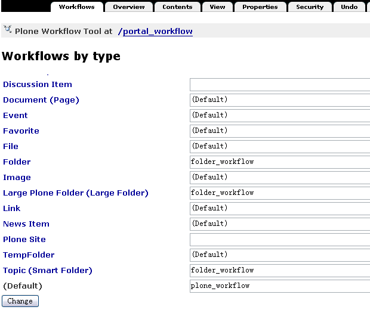
  
   图 7.3 工作流按类型列表

在这个页面中，你会看到每种内容类型、及其所用工作流的列表。如果没有指定工作流（换句话说，就是其值为空），这种内容就没有应用任何工作流。例如，门户网站这种内容类型的默认设置就是空的。如果输入框中的值是(default)，那么页面最下方的默认工作流就会应用于对应的内容类型。如图7.3所示，对与Topic（查询集）和Folder（文件夹）类型，使用folder_workflow工作流。其他类型的内容，都使用plone_workflow工作流。 工作流的名字指通过工作流工具中创建或导入的工作流对象的名字。可选择Contents标页签查看已设好的工作流的更多信息，它会列出Plone中使用的工作流列表，见图7.4所示。

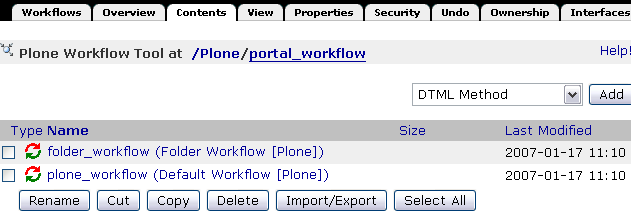

   图 7.4 查看Plone中使用的工作流列表

这里folder_workflow就是文件夹的工作流定义，而plone_workflow就是一般内容的工作流定义。

在这个页面，可以通过右上角的下拉菜单中选择workflow添加工作流，下文的定制内部网实例中会详细介绍。

工作流的状态
----------------------
下面来看看工作流中的状态以及初始状态是怎么定义的，进入工作流列表中的某一工作流，这里以plone_workflow为例，选择plone_workflow的State标签页查看，如图7.5所示。

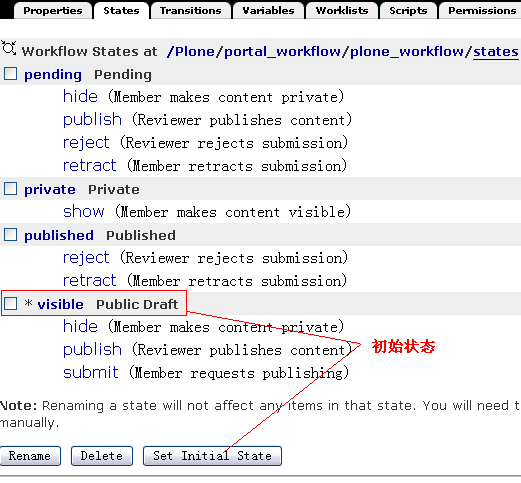
   
   图 7.5 工作流中的状态
   
在上文中讨论的默认工作流拥有的几个状态，如待审（Pending），私有（Private）等都显示在这个页面里了；在公开草案状态（Public Draft）状态的旁有一个 “*” 号，这表明公开草案状态是默认工作流的初始状态。选择状态旁的复选框然后点击设定初始状态按钮（Set Initial State），就可以为工作流设置初始状态。
所有使用这个工作流的内容在被创建时都会进入这个初始状态。如果流程定义的初始状态发生改变，在重新设置初始状态之前已经创建的内容仍将保持它原有的状态，而不受影响。你可以为每个工作流只设置一个初始状态。

工作流的转换
-----------------------
在工作流的状态页中，上图7.5中看到每个状态下方都列出了可能发生的转换，如：公开草案状态（Public Draft）有hide, publish, submit可能发生的转换。其实在Transitions标签页中罗列了这个工作流的所有转换，如下图7.6是plone_workflow的Transitions标签页。

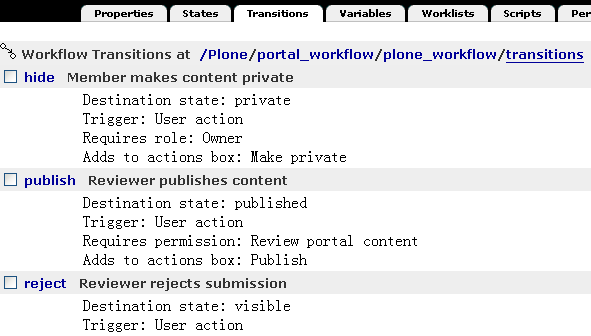

   图 7.6 工作流的转换

每个转换都有自己的摘要页面，其中含有一些变量（variables）。若要添加一个转换，在转换页面下方输入ID并点击添加按钮（Add），如图7.7是publish转换的摘要页面，以这个页面来介绍转换的相关属性。

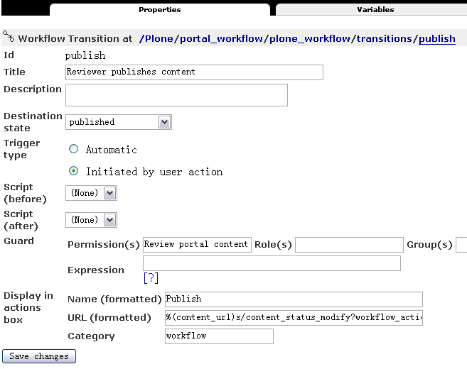

   图 7.7 工作流转换的摘要页面

工作流转换的摘要页面中包括以下这些属性：

- 标题（Title）： 转换的标题。

- 描述（Description）：关于该转换的详细描述。

- 目标状态（Destination state）：目标状态是这个转换发生时所要抵达的状态，可以把它理解为转换的目标。把携带了目标状态的转换分配给状态后，状态才被真正定义下来。

- 触发器类型（Trigger type）：指出转换如何被触发。自动式表示内容一旦移至该状态，这个转换就会自动发生；而通过用户动作触发是最通常的选择，意味着某个用户点击一个链接时就能触发这个转换。

- 脚本（之前）（Script before）：在这个转换发生之前执行脚本。

- 脚本（之后）（Script after）：在这个转换发生之后执行脚本。

- 安全（Guard）：该状态的安全设置，也就是谁能够执行这个转换。

- 动作箱中的显示方式（Display in actions box）：是指这个转换在Plone中如何显示。在这里输入值也可以确保把这个转换作为一个用户操作项(action)来启动。你可以通过查询portal_actions中的操作项作来获得这个转换。

在上面罗列的各项中，目标状态（destination state）很重要。上文中已经介绍过转换通常会改变状态，但这不是必需的。因为任何转换都会去执行脚本、向历史记录中写入一些东西，有时候这个会很有用。转换并不一定会改变状态，有的只是在转换发生之前或发生之后运行某个脚本。一个转换可以有多个开始点，但只能有一个目标（状态）；如果你需要多个目标状态，你必须设置多个转换。

在转换开始执行之前，安全设置将检验所有的转换来确保执行转换的使用者有权限进行操作。安全设置由三部分组成：

- 许可Permission(s)：包含了必需的许可。多个许可之间应该用分号分隔开。

- 角色Role(s)：包含了必需的角色。多个角色之间应该用分号分隔开。

- 表达式Expression：是一个工作流表达式（workflow expression），它采用TALES语法(详细在页面模板一章中介绍)。在转换执行之前，对于每一个已被指定的值，安全设置都要对其进行评估，以确保正确。如果对其中任一值的评估测试失败，这个转换将不能执行。通常你会发现大多数安全设置只有一或两个被指定好的值。

工作流中的变量
---------------------
变量标签罗列出所有在工作流中被创建或被更改的变量。

通常情况下并不赞成尝试着将所有可用的信息汇集在一起并只运用状态和转换来表达－这样做也是不太可能的。取而代之，你可以用变量来存储与工作流相关的信息。举个例子，我们想看到内容提交审批后最后修改的时间，或者由谁提交的。这些状态转变时附属的一些变量信息称之为工作流中的变量，变量的作用就是持有一些在每个转换与状态之间发生改变的元素。

现在，返回到工作流的主页面，进入变量（Variables）标签页就能得到一个包含所有变量的列表。如图7.8所示。需要添加变量时，在变量标签页的下方可以输入变量ID，然后点击页面下方的添加（Add）按钮。DCWorkflow在一个变量中保存着对象目前所处的状态，这样就可以在任何时候去查看此对象的状态了。这个变量的默认名称是review_state。

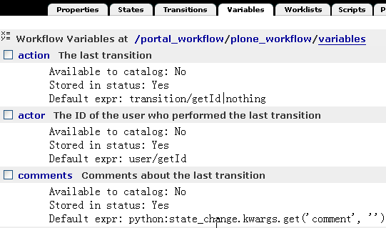

   图 7.8 工作流的变量

再来看看变量的摘要页面，进入变量列表中的某一个变量的摘要页面，可以看到每个工作流变量含有下列属性：

- 描述（Description）：对变量自身的描述文字。

- 在目录中有效（Make available to catalog）：此项属性表明这些变量会存在于目录（catalog）中，可供搜索之用。变量在目录中有效，并不意味着向目录中添加了索引（indexes）或元数据（metadata），这个工作还是需要手工完成。

- 存储在工作流中（Store in workflow）：此项属性会检查信息是否被保存在工作流中，或是附加在对象上。

- 变量更新模式（Variable update mode）：此项属性检查什么时候来更新变量。

- 默认值（Default value）：此项属性认为默认值是一个字符串，对其进行检查。

- 默认表达式（Default expression）：此项属性中的默认值是一个表达式。如果它出现在此，就会被用来替代默认值。这也是一个TALES表达式。

- 信息安全设置（Info guard）：此项属性包含了访问变量时所定义的安全设置。这些安全设置和转换中的安全设置很相似；但是这里说到的安全性检查是在访问变量时才会发生的。

工作流中的工作列表
--------------------
工作流中所有被分配的工作列表，是由工作列表（Worklists）标签页来提供对它们的访问。工作列表是一种用于查询工作流中特定信息的方法，它被用来查询存在于工作流中的对象数目的信息。例如，默认工作流中需要列出站点中待审的内容清单。下图7.9是plone_workflow的工作列表标签页。

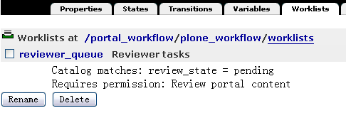
    
   图 7.9 工作流的工作列表

在工作流列表标签页下方可添加工作列表，输入ID并点击Add（添加）按钮。每个工作列表含有下列属性：

- 描述（Description）：对工作列表自身的描述文字。

- 编成目录的变量匹配（Cataloged variable matches）：此项属性包含的是工作列表必须匹配的值，此值被添加在这个工作列表中。进行匹配的变量是变量列表中给出的工作流状态变量（workflow state variable）（这个变量的默认名称是review_state）。

- 在动作箱中的显示（Display in actions box）：此项属性包含的东西将会以某种形式在用户界面上表现出来。在这里输入值也可以确保转换会以一个动作作为开始。然后你就可以通过查询动作来获取这个转换。

- 安全设置（Guard）：此项属性包含了访问工作列表时所定义的安全设置。

尽管工作列表是存储此类信息的便利方式，但是Plone并不使用这些信息，它以另一种方式－ZCatalog 替代工作列表。Plone直接用 ZCatalog 查询那些处于某些状态的对象。从DCWorkflow使用索引工具，最终的结果都是一样的。

工作流中的脚本
----------------
脚本标签页列出了工作流中所使用的有效的脚本。这个列表实际上是ZMI中的标准文件夹，你几乎可以在这里添加任何东西。在这里添加脚本主要用于转换，一般只应该添加脚本（Python）对象或外部方法（External Method）。

典型的用途包括执行转换的时候，自动发送通知邮件，或者将内容从一个地方转移到另外一个地方等。《附录: Plone 常用API参考》章节中有一个写工作流中的脚本的例子。

如何编辑Python脚本和如何使用外部方法在《Python脚本》的章节中有详细介绍，这里需说明当脚本执行时，是转换的用户在启动脚本。如果需要使用其他权限来执行，你可以把代理人角色（proxy roles）分配到脚本中。每个脚本可分配到多个转换的Script before或者Script after中执行。

工作流中的权限设置
-------------------------------------
权限标签页（Permissions）列出了可被这个工作流管理的所有权限项。工作流中的权限理解为在某个工作流状态中角色与权限的相互关系，在上一章中提到的工作流所控制的权限便就是权限标签页中所列出的权限项。下图7.10是plone_workflow的Permissions（权限项）标签页。

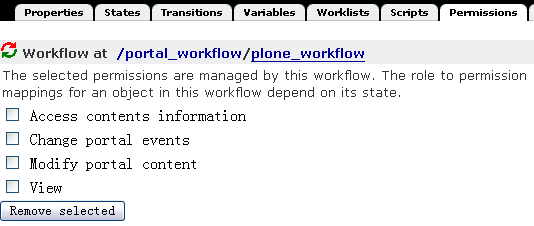

   图 7.10 工作流的权限项

在这个标签页中，建立了一系列可供管理的权限项，它们存在于各种状态下。若要添加一个权限项，在这个标签页的下方从下拉菜单中选择权限项进行添加。权限项是存在于状态中角色与权限间的映射，返回例子中的 plone_workflow 页面，进入状态标签页（State），选择某一状态进入它的权限标签页（Permissions），下图7.11是plone_workflow的公开草案状态的权限标签页。
   
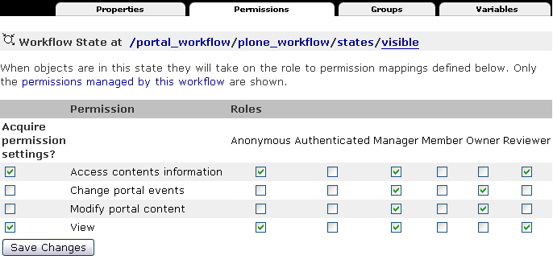

   图 7.11 公开草案状态的权限标签页

从这个页面你可能一下子就了解清楚了公开草案状态下不同角色所拥有的权限关系。最显而易见的是Modify portal content权限，即内容的修改权限，在公开草案状态下有管理员和所有者能修改内容。   
   

更改工作流中状态权限设置
--------------------------
刚才介绍的工作流的权限设置，这是工作流中很重要的部分，可能你现在就有这样的问题，“能不能更改工作流的权限设置，比如想设置公开草案状态让匿名用户没有查看的权限。”

工作流中的设置控制着站点角色的查看和编辑等权限，可以设置工作流中的权限来满足权限设置工作的需要，下面的例子是设置公开草案状态的内容（文件夹除外），匿名用户没有查看的权限。

【例 7.1】设置公开草案状态的内容（文件夹除外），匿名用户没有查看的权限

#. 选择进入 portal_workflow 中的 plone_workflow 
#. 选择进入 plone_workflow 的 State 标签页
#. 选择进入公开草案状态（Publish Draft）的 权限（Permissions）标签页
#. 对 View 权限项设置  Acquire （获取）复选框为空，设置 View 权限项的 Anonymous 复选框为空，选择 View 权限项的 Authenticated 复选框
#. 单击 Save Changes 按钮，保存设置
#. 返回 portal_workflow 页面，单击 Update security settings 按钮，更新设置

这样就实现了公开草案状态下的内容匿名用户没有查看的权限，例7.1中保存设置后需返回portal_workflow页面，单击Update security settings按钮，更新设置是因为调整工作流状态的权限映射后，需要更新设置站点采用此工作流的所有对象。

实例: 定制一个内部网的工作流
==================================
从上文中了解的Plone的工作流，应该对工作流相关概念，及工作流中的许可设置应该很清晰了，下面是定制一个内部网工作流的实例，先了解内部网工作流的需求，然后一起完成它的定制步骤。

内部网工作流的需求
----------------------
在企业内部网工作流中仅只有内部网成员才能访问到站点内容；一个内部的页面也可以做为公司或组织的正式地内部发布出去。默认情况下，所有的内容创建后对于所有的内部网成员是可见的。对于只有发布后的事件，新闻等才会出现在相应的面板中。对于文件夹的工作流是非常简单的：所有的文件夹对于内部网成员都是可访问的。

下面是针对内容采用的内部网工作流的状态，角色与权限间的关系。

- 私有：仅对于所有者和管理员可访问。

- 内部：对于站点所有成员可访问；所有者和管理员可编辑。

- 待审：等待审批人批准，对于站点所有成员可访问；待审内容出现在审批清单。

- （内部）发布：在内部发布，对于站点内部成员可访问，新闻、事件出现在相应的面板，发布的内容不能编辑。作为部署在内部网的Plone站点对于匿名用户是不可访问的。

定制步骤
------------
内容网工作流的需求与默认工作流很接近，所以可以以默认工作流做为基础来实现定制。下面是定义内部网工作流的定义步骤。

进入ZMI中的portal_workflow的Contents标签页，在添加对象的下拉菜单中选择workflow添加（见上文中的图7.4）。

在添加页面中填上ID为Intranet，选择一个预设的工作流，选择Plone Site的plone_workflow，如图7.12所示。设置好后，单击Add按钮保存。

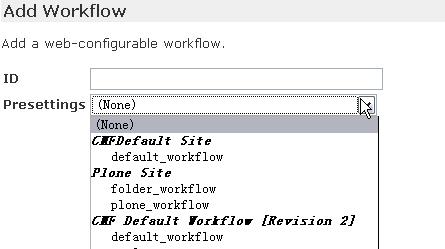

   图 7.12 选择预设定添加工作流

于是返回了portal_workflow的Contents标签页，进入刚添加的Intranet工作流（Properties标签页），更改Intranet工作流的标题（Title）为Intranet workflow。

进入Intranet工作流的States标签页，于是看到了与plone_workflow一样的状态定义（因为其实只是将plone_workflow复制后换了ID而已），这里删掉visible和published状态，在States标签页的下方添加internal和published状态，设置internal状态为初始状态，并进入相应的状态页选择状态的转换，设置后的内部网状态页如图7.13所示。

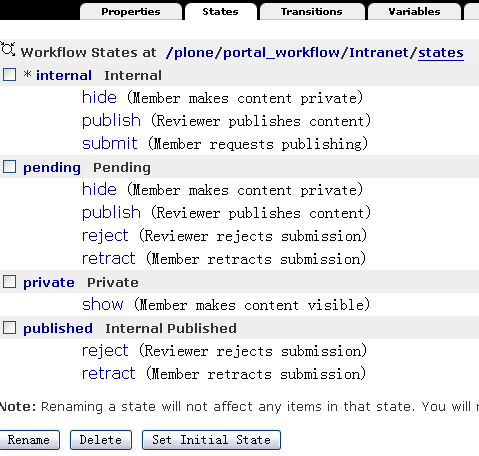

   图 7.13 设置后的内部网状态页

分别进入internal状态和published状态的Permissions标签页，设置它们的权限，设置好后的页面如图7.14，图7.15所示。

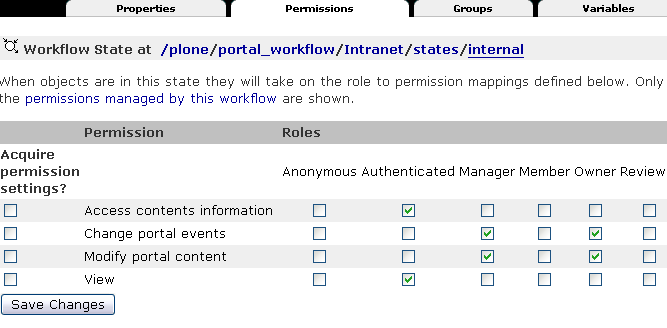

   图 7.14 设置internal状态的许可

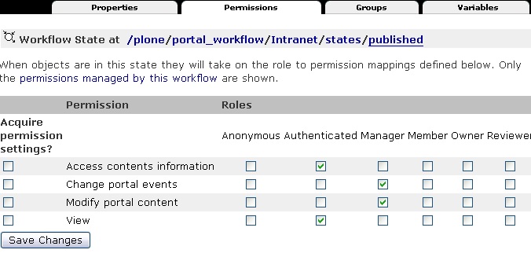

   图 7.15 设置published状态的许可

也需设置pending状态的许可，设置去掉选择获取（Acquire），去掉Anonymous的Access contents information和View权限项，选择允许Authenticated  Access contents information和View权限项，保存更改。

这样，内部网（Intranet）工作流相关设置就完成了，下面需要返回portal_workflow页面，设置Default（定义默认工作流）项为Intranet（工作流）。   
 

工作流附加工具
================================
社区中很有一些工作流的附加工具，比如：从Plone 2.5开始，CMFPlacefulWorkflow产品进入Plone的核心，这是工作流的附加工具，接下来，来介绍类似这样的附加工具。

位置相关的工作流
-------------------------
DCWorkflow的每种内容类型只能对应一种工作流，比如，所有的文件类型的流畅，都只能采用一种工作流。如果要采用其他的工作流，必须先定制出一种新的文件内容类型。

其实通常的需求是，希望能站点的某一文件夹下使用新的流程映射。Plone 2.5开始引入了位置相关工作流的产品————CMFPlacefulWorkflow。CMFPlacefulWorkflow产品是对默认的DCWorkflow的一个扩展，可以针对每个站点文件夹或者内容，单独定义内容类型和工作流的匹配关系，也就是一个全新的工作流策略。

在Plone控制面板的附加产品配置中有一个位置相关的工作流的配置工具，在这里可以定义工作流匹配策略。如图7.16所示。

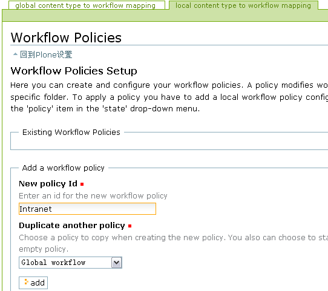

   图 7.16 定义工作流匹配策略

进入位置相关工作流配置后，这个页面有两个标签页，直接进入的是本地内容类型工作流映射（local content type to workflow mapping）标签页，另一个是全局内容类型工作流映射（global content type to workflow mapping）标签页。在全局内容类型工作流映射标签页可看到默认的内容类型与工作流的映射关系，这和在ZMI中的 portal_workflow 看到映射关系是一致的（图 7.3 所示）；在本地内容类型工作流映射标签页中可以定义新的工作流匹配策略，仅仅用于某个站点的某个局部位置。

在图7.16中定义新的策略ID，可选择复制某个现有的策略，可以选择空(即 No policy duplicated)，也可以选择全局的默认策略(即Global workflow)，设置好后单击Add按钮添加，下一步需设置新添加的策略，如图7.17所示。

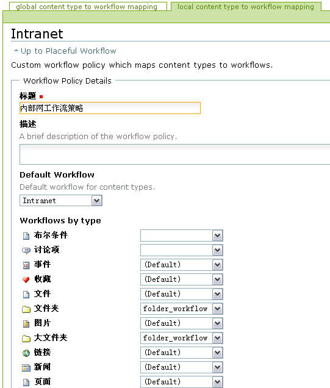

   图 7.17 设置定义的策略

需设置新的策略的标题，描述，默认工作流（Default workflow），接着设置内容类型与工作流的映射关系。设置好后单击【保存】保存设置。

上面的步骤已经添加了一个新的策略，接下来就是针对具体的文件夹来设置使用定义的策略。在站点某个文件夹中，选择状态下拉菜单中的策略，如图7.18所示。

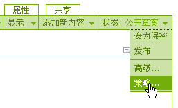

   图 7.18 选择状态下拉菜单中的策略

于是就进入了配置管理本地工作流策略页面，在这里来配置选择使用的策略。如图7.19所示。

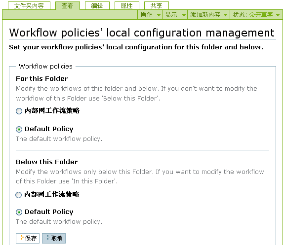

   图 7.19 配置管理本地工作流策略

在配置管理本地工作流策略页面中可以设定当前文件夹所使用的策略（图7.19 For this Folder 区域），可设定此文件夹以下的内容使用的策略（图7.19 Below this Folder 区域）。设定好后，单击【保存】完成设置。这样，此文件夹或是此文件夹及文件夹以下的内容就可以使用定义后的工作流策略。

在ZMI中，有一个portal_placeful_workflow对象，你也可以在这里管理和配置工作流策略。在portal_placeful_workflow中的Contents标签页中管理着定义过的工作流策略，也可以在这里添加新的工作流策略。

其它工具
----------------
位置相关工作流工具灵活了Plone中使用工作流的某些束缚，社区中还有一些工作流的附加工具，这里介绍一个辅助工作流查看的工具。

社区中有一个可查看工作流图的辅助工具————DCWorkflowGraph，下图7.20是安装DCWorkflowGraph工具后查看folder_workflow的graph标签页（没安装此工具没有这个标签页）看到的folder_workflow的工作流图。

.. figure:: img/workflow/workflow_graph.png
   :alt: workflow_graph

   图 7.20 查看folder_workflow的工作流图

社区中还有其它的一些附加工具，比如DCWorflowDump，它可导出工作流定义，不过在《深入Plone设置与管理》章节中介绍的 portal_setup 已经能够实现工作流的导入导出。

基于过程的工作流
==========================
Plone采用的DCWorkflow工作流是基于内容实体的工作流形式，表现为以内容存在，并设定其拥有某些状态，内容在不同的状态中转换(transition)。这种工作流形式也是有局限性的，比如要支持非常复杂的工作流程，这些工作流不是基于内容实体的，比如是以某个项目的运转过程为基础的流程。这样的一些情况用Plone默认采用的DCWorkflow是不可能实现的。

幸运的是在Plone产品中除了DCWorkflow以外还有其它一些工作流产品可供选用，
如AlphaFlow就是一种基于过程的工作流产品。
它是Zope上一个新的流程引擎，提供基于过程的工作流模型，同时也很方便地建模面向文档的流程，它采用易用的基于XML的流程定义语言(ALF)，用于定义工作流，简单、柔性、可定制。关于AlphaFlow的更多信息可以在 http://www.gocept.com/open_source_software/AlphaFlow/ 上找到。

小结
========
管理工作流是Plone中另一非常重要的部分，本章从概念上理解Plone工作流，进而到ZMI中认识Plone的工作流，回顾一下：Plone的工作流包括状态、转换、变量、工作列表、脚本、绑定的权限；本章并以常见的内部网工作流的实例，介绍定制工作流的过程；本章还介绍了主要以位置相关的工作流等一些工作流附加工具；另外，本章简单介绍了基于过程的工作流，以及实例工作流与过程工作流的区别。

