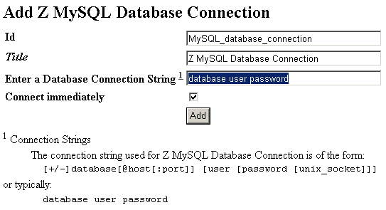
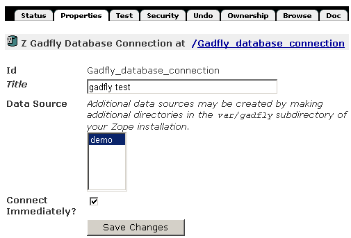
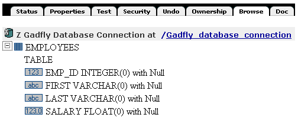
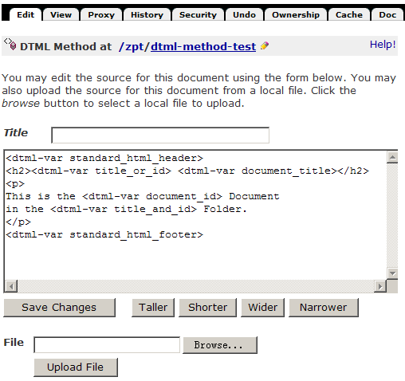
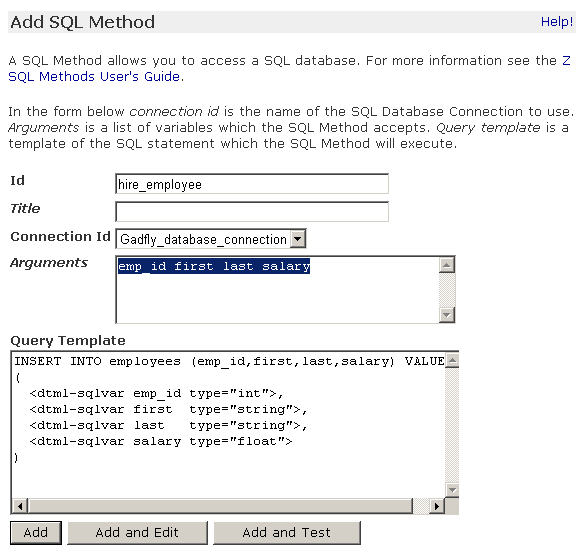
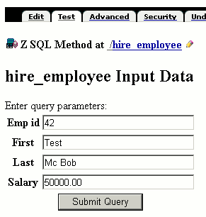
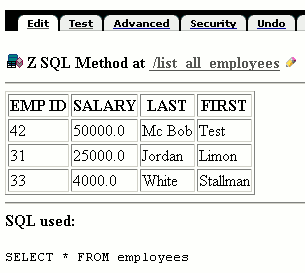
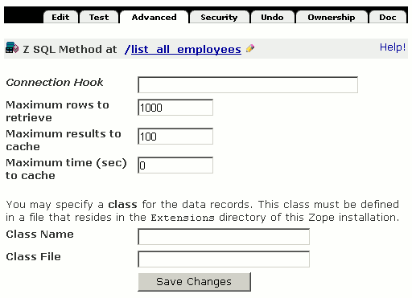

================
 访问关系数据库
================

.. Contents::
.. sectnum::
   :prefix: 14.

虽然Zope自带的ZODB对象数据库在Zope中的应用是最合适的，但很明显，关系数据库仍然在这个世界中占据着统治地位。
可能你所在的IT环境中早已部署了关系数据库，在这个现有的环境中部署Zope/Plone时，你需要让它们可以协同工作，
让Zope/Plone可以读取现有的关系数据库中的数据，让Zope/Plone把数据写入到关系数据库中以便其它支持数据库的程序也能读到这些数据，
这一章正是针对系统管理员和网站管理员会遇到的这种集成需求而编写的。

为了在Zope中使用关系数据，必须建立两种不同的Zope对象：
一个是“数据库连接对象”，另一个是“ZSQL方法”。
前者告诉Zope如何连接一个关系数据库；后者使用前者去连接一个数据库，对数据库的进行SQL访问。

本章学习重点是:

- 了解Zope与各种关系数据库连接的原理，并掌握连接的方法
- 熟练使用ZSQL方法进行以关系数据库为存储方案的应用开发
- 掌握在脚本或模板中等各种调用ZSQL的方法

关系数据库连接
====================
..
  ZODB对象数据库用于存储所有的页面，文件和其它任何你所创建的类型，它的运行是很快的，并且不需要任何设置和维护操作，就像一个文件系统。
  对存储任何适度大小的二进制文件如图片等对象是很合适的。

  关系数据库的工作方式与ZODB不同，它们是基于表的::

    Row   First Name   Last Name  Age
    ===   ==========   =========  ===
    1     Bob          McBob      42
    2     John         Johnson    24
    3     Steve        Smith      38

  表中的信息是按行存储的。表的列布局则称为Schema。
  在关系数据库中，使用 **结构化查询语言(SQL)** 来查询和修改其内容。
  这一章假设你已经有了一些基础的SQL知识。而如果你确实不知道SQL可以参看网上和已出版的很多SQL书籍。

  关系数据库与对象数据库有着很多的不同，它们各自有自己的优点和缺点。
  在Zope中这两者都允许你使用，提供了选择最适合你的存储机制的灵活性。
  最通常的原因是要使用现有的关系数据库来与其它程序共享数据。
  现在大多数编程语言和数千种软件已经能和关系数据库一起工作，

  ZODB虽然与Zope一起部署很容易，但它却很难使用其它编程语言来直接访问，
  也不容易被其它软件直接读取。（如果你需要读取ZODB的内容时，应该使用Zope所提供的访问接口，
  在脚本那一章中有其它语言访问Zope接口的例子可以参考，而这一章专门讲述关系数据库。）

  Zope关系数据库支持最普通的应用就是通过网络操作数据。
  例如：假定你的人力资源部门管理员工数据，这个数据库提供了一些工具供系统管理员生成报表、修改数据。
  然而，对于员工查看、简单管理自己的数据却很困难。
  如果他的住址变更了，他没有办法更改数据库中自己的地址信息。
  使用Zope访问关系数据，你的员工无论在家还是在办公室，都可以使用任何浏览器来查看、修改自己的记录。

  通过Zope来使用关系数据库可以获得所有Zope的其它好处，如安全性，动态显示数据，
  还有Zope的所有网络功能（包括http,ftp,WebDAV,XML-RPC四种方式的支持）。
  你可以使用Zope来将你的数据访问，数据显示还有数据管理等其它数据库组件灵活地结合在一起。

一般应用程序使用关系数据库，比如需要以关系数据库作为数据存储等，
它们需要使用关系数据库所提供的相应编程语言的开发接口。
Zope也不例外，在连接关系库时它就是一个关系数据库的访问客户端，
因此需要相应关系数据库的开发接口。
所不同的是Zope是以Python为编程语言写出的应用程序，
所需连接数据库的接口也必须是Python的。

.. 去掉，我个人认为这个提示与本章不搭嘎
  note
  当今流行的各种关系数据库都有已经有了Python的访问接口。
  如果你要使用的关系数据库没有提供Python的接口，这虽然很少见，
  但也没有关系，一般的关系数据库至少提供了C语言的访问接口，
  在Python中实现一个C访问接口至Python的包装也是很容易的。

除了访问接口，还必须学习的一件事就是连接字符串，
不管你使用哪种编程语言来访问关系数据库，
都需要一种方法来描述所连接的关系数据库的信息，
如连接哪一台机器上的关系数据库中的哪一个数据库，
使用什么用户名和密码等，这在Zope中称为"连接字符串"。

..
  这一节就按照连接的原理来分别讲述安装必需的适配器产品和连接字符串。

数据库适配器(DA)
---------------------
Zope支持现有的很多种关系数据库，
如商业的Oracle、DB2、SQLSever、InterBase等，
还有开源实现的PostgreSQL、 MySQL等，
还有一种是Zope自带的以Python语言实现的Gadfly关系数据库。

Zope使用称为 **数据库适配器** (Database Adapter)的对象作为与实际的关系数据库的接口，
不同的关系数据库有不同的连接适配器，
为了从Zope中访问关系数据库，你需要下载安装相应的数据库连接适配器产品。

同时还因为连接适配器产品就是给关系数据库和Zope之间建立一座桥梁，
它的内部是直接使用这个关系数据库的Python编程访问接口，
你还需要给Python安装与你要连接的数据库相应的Python访问接口。
一般在数据库软件供应商的网站上可以下载到相应的Python访问接口软件包。

.. csv-table:: 【表 14.1】常用的关系数据库所需的连接适配器产品
   :header: 关系数据库名称, 可用的适配器产品说明

   Oracle, 由Zope公司提供的DCOracle2包包含了ZoracleDA
   DB2, 由Blue Dynamics提供的ZDB2DA
   PostgreSQL, 最新的数据库连接适配器是包含于psycopg包中的ZPsycopgDA，原来的ZpopyDA也可以使用
   MySQL, 使用ZMySQLDA，源代码形式和linux二进制包形式都可用
   SAP DB, 由Ulrich Eck提供的ZsapdbDA
   Sybase, 由Zope公司编写并提供商业支持的SybaseDA
   SQLServer, 由Zope公司编写并提供商业支持的ZODBC DA，只有Windows平台可用。这个数据库适配器也支持其它的ODBC兼容的数据库。
   Interbase/Firebird, "有多个数据库适配器可用，包括isectZope, kinterbasdbDA 和 gvibDA"
   Informix, 有ZinformixDA产品，这个产品依赖于informixdb产品也需要安装
   Gadfly, Gadfly数据库适配器已内置于Zope中

上表中所列出的只是一些最常用的关系数据库，
并且在Zope网站上已有很多人贡献的数据库连接适配器产品。
即使某种数据库尚没有相应的数据库连接适配器，
只要它有相应的Python语言编程接口也很容易将这种适配器写出来。

.. hint::
  (在 http://www.zope.org 上可以看到 Download 下面有 Zope Products ，这里可以下载各种形式的 Zope 扩展产品，
  所有数据库操纵方面的产品都在称为 "外部访问(External Access)" 的类型中，
  你也可以直接访问这个地址： http://www.zope.org/Products/external_access 。)

另一方面，还有像ODBC这样的由众多商业、开源数据库支持的跨平台的数据库工业标准协议也被Zope所支持，
也就是说即使你使用的数据库没有相应的Zope上的连接适配器，但只要它是支持ODBC标准的，
那么也可以使用ODBC连接适配器来连接你的关系数据库。

值得一提的是这个Gadfly关系数据库是用Python编写的。
它内置在Zope中，用来做演示或处理小批量的数据。
它很快，但是不适用于处理大量数据，因为它把所有的数据都读入内存来处理。
关于Gadfly本身可以在Chordate的网站上获得更多的情况。

连接到MySQL数据库
-------------------
连接关系数据库的另一个概念是连接字符串。
除了Gadfly，其它关系数据库都是Zope的外部扩展。
连接外部的关系数据库都需要使用连接字符串。

下面以常见的MySQL为例说明连接字符串。

在给Python安装好python-mysqldb并给Zope安装了ZMySQLDA这个Zope产品之后，
启动至Zope管理界面上在添加下拉列表中可以看到 Z MySQL Database Connection 这一项，
选择这个项后会出现如图14.1的界面：

   图 14.1 MySQL 数据库连接

..
  TODO: 图片中需要补充连接字符串
   
图中可以看到MySQL数据库使用的连接字符串格式是::

  [+/-]database[@host[:port]] [user [password [unix_socket]]]

这个字符串格式中以 ``[]`` 引用的部分表示是可选的部分。
如最典型的情况是::

  database user password

这指定了数据库名称和连接所使用的用户名密码信息，
对应着在本地运行的Mysql数据库，并且运行在Mysql的标准端口上。

其它可选的参数分别用于不同的目的：

.. csv-table:: 【表 14.2】连接字符串
  :header: 可选部分, 意义

  +/-, 指定打开或关闭事务支持功能
  @host, 指定数据库运行所在主机，这对应于数据库不是运行在本地主机上的情况
  :port, 指定数据库运行的端口，这对应于数据库运行于非标准端口的情况
  user, 指定连接数据库的用户名
  password, 连接数据库的密码
  unix_socket, 使用UNIX域套接字来连接，在UNIX上主机上运行的Mysql可以使用UNIX特有域套接字来访问

..
  如果数据库服务器运行在不同的主机上，你需要指定host，当在非标准端口运行时还需要port，
  本地运行的UNIX上的支持UNIX域套接字的服务器还可以使用unix_socket的方式与之通信，
  前面的加号或减号用于指定使用或不使用事务功能。
  当你不知道你的数据库的具体连接信息时可以先尝试这种简单地格式。

连接字符串是与关系数据库连接的一个必需的信息，
其它关系数据库也使用与MySQL类似的连接字符串。
这里使用到MySQL的例子只是为了说明在Zope中配置连接一个关系数据库是很简单的。
在这个界面上单击Add按钮就是添加了连接对象，
这是一个Zope中的对象，本章稍后会详细介绍它的用途。

Gadfly数据库连接对象
-----------------------------
本章后面的例子将以Gadfly配置为例，因为这种关系数据库配置起来最为简单，
在你没有部署关系数据库的情况下也可以试验Zope支持关系数据库的强大功能。
同时因为Gadfly数据库是内置于Zope运行的，它是不需要连接字符串的，
这样也给本章讲述的重点是操纵数据库简化了许多操作，
避免因为数据库本身可能存在的问题影响了运行本章示例的结果。

从Zope根目录的添加列表中选择 Z Gadfly Database Connection 来添加一个 Gadfly 数据库连接。
这会进入到一个与上面的添加MySQL适配器类似的表单页面中。
在这里输入 id 为 ``Gadfly_database_connection`` ，
并选择 Data Source 为 demo ，点击 Add 按钮。
这样就增加了一个 Gadfly 数据库连接。

单击新建的数据库连接对象，看到的是它的状态页。
从本页可以知道你是否连接到了数据库（有一个按钮控制数据库的连接和断开）。
一般情况下，Zope会自动连接到数据源。某些情况下，你可能想到手工控制数据库的连接。
对Gadfly来说，它是把所有数据都加载到内存中，断开连接没有什麽意义，
但是对于外部的数据库，就有必要手工控制它们的连接。

.. hint::
  如果你使用不同类型的数据库来进行这些示例的话，会发现只有很少的不同，
  但它们有一个共同点就是都有一个Test标签页用于测试 SQL 查询，并且都有Browser标签页来显示表结构。

..
  对于使用其它关系数据库，在继续进行之前先测试你的数据库的连通性总是一个好的教训。

下一页是属性页，如图14.2所示。
该页显示数据源和连接对象的其他一些属性。
"Title" 属性是一般Zope对象都有的，可以保持为空，
这里比较有用的是数据源属性和是否立即连接属性。
当你想把数据源换成另外一个时，就会用到数据源属性，
下面的 "Connect Immediately" 属性控制了是否立即连上数据库。

   图 14.2 属性页

测试数据库连接
------------------
在测试页可以测试你的数据库连接。在该页，你可以直接输入SQL语句操作你的数据库。
该页用来测试数据库，同时运行SQL语句（比如创建一个表）。
此处不宜输入过多的SQL语句。SQL语句要放在ZSQL方法中，本章后面将作讲解。

让我们在数据库中创建一个表以便展示本章的例子。测试页允许直接输入SQL语句操作数据库。
你可以在测试页输入SQL创建数据表，创建名为employees的表使用如下SQL语句::

  CREATE TABLE employees
  (
    emp_id INTEGER,
    first  VARCHAR,
    last   VARCHAR,
    salary FLOAT
  )

单击提交按钮运行这条SQL语句。Zope会返回一个验证页告诉你什么SQL在运行和可能的结果。
此处创建表的SQL会因你的数据库不同而各异。
数据库建表的确切语句，请参考你的具体的数据库提供商的文档。
还需要注意的是有些数据库如MySQL在客户端操作时需要一个分号结尾，
但是这里在测试标签页中不需要分号。

这个SQL语句将在Gadfly数据库中新建一个名为employees的表。
该表有四列：emp_di,first,last,salary。
一列是员工的id，这是标志员工的唯一号码。
接着的两列类型是VARCHAR，该类型和字符串类似。
salary列的类型是FLOAT，即浮点数。不同的数据库提供不同的数据类型，参考相关文档查看你的数据库支持的数据类型。

为了保证员工号是唯一的，需要为表创建一个索引。在测试页输入下面的SQL语句::

  CREATE UNIQUE INDEX emp_id ON employees
  (
    emp_id
  )

现在你有了一个表并且创建了一个索引，要验证你的表，转到浏览页。该页显示了数据库的表和它们的模式。
在这里，你可以看到一个employees表。假如点击了前边的“加号”，该表会展开，显示出四列：emp_id,first,last,salary。
如图14.3所示：

   图 14.3 浏览数据连接

当创建多表复杂SQL应用时，这是非常有用的，各表的结构一目了然。但不是所有的数据库都支持表的浏览。

注意，
一个Zope连接对象只对应一个用户连接关系数据库，
如果你想要连接多个数据库，
或者使用不同用户连接到一个数据库，
都需要使用多个数据库连接对象。

ZSQL方法
========================
ZSQL方法用于执行具体的关系数据库SQL语言。所有的ZSQL方法都必须和一个数据库连接对象关联。

在数据库连接对象的Test标签页只能作一些简单的SQL查询语句作为测试，
但程序中常常需要动态地生成SQL语句去执行，这就需要一种动态生成文本的技术，
ZSQL方法正是为了这个目的而创造的技术。
它在Zope中通过数据库连接对象去执行SQL语句，
因此所有的ZSQL方法都必须关联一个数据库连接对象。

DTML简介
------------
ZSQL的目的是为了创建动态的SQL语句，
在Zope中，ZSQL的这种动态特性是使用DTML技术来实现的。
因此这一节先对DTML技术作一个简单介绍。

..
  TODO: 这章在这里显得不合理

..
  前面一节提到ZSQL方法中使用一种标记语言来引用参数，事实上它就是Zope的另一项基础技术：DTML。
  在前面的章节中我们分别讲过Script (Python)和页面模板技术都可以用于展示动态的页面，
  而且提到了DTML，这种技术之所现在不流行是因为在页面模板技术诞生之后
  以更直接的方式去生成html/xml，因而在需要生成html/xml的场合下取代了DTML，
  但页面模板技术有自己的局限性就是只能生成html/xml，
  而在这一章里需要生成动态的SQL语句这种非标记语言的场合下便仍然使用DTML技术。
  在这一小节只对DTML技术作一个简单介绍，读者只需要对它的基本功能有所了解即可。
  当然如果你对DTML技术非常熟悉也可以在ZSQL中应用所有的DTML技术。

DTML全称为动态模板标记语言(Dynamic Template Markup Language)，
它适合于生成各种类型的文本结构。
但DTML技术现在已经过时了，在生成xhtml结构化文本的领域已经由页面模板(zpt)技术所取代，
只在少数需要生成非xhtml文本的领域，如动态生成css文件，动态生成SQL语句等，
仍然在使用着DTML技术。前面章节中，我们知道，Plone的css文件全部采用DTML生成。
这里简单对DTML技术进行介绍。

在Zope的添加选择框中，可添加两种DTML对象，分别是DTML Method和DTML Document，但DTML Document已经过时，我们一般使用DTML Method对象。

如图所示是一个DTML方法(DTML Method)的编辑表单：

   图 14.4 DTML方法

在DTML中包含两种标记：单一标记与区块标记。
单一标记由一个标记及小于(<)、大于(>)符号组成，例如var标记就是一种单一标记::

  <dtml-var parrot>

单一标记不需要替var作结束的动作。这一句的意思是替换成parrot变量的内容。
上面的语句，还可以简化如下书写::

  &dtml-cockatiel;

区块标记则由两个标记组成，其中一个开启此区块，另一个用以关闭区块，而内容夹在二者之间。
开启标记启动这个区块，而结束标记将之结束。
“结束标记”与“开启标记”的名字相同，但是“结束标记”的前面会加一个斜线(/)，这跟HTML、 XML的习惯相同。

让我们看一个使用DTML生成的css文件片段示例::

    <dtml-with happy_logo.jpeg>
    background: <dtml-var darkColor> url("<dtml-var id>");
    width: <dtml-var width>px;
    height: <dtml-var height>px;
    </dtml-with>

这里引入了dtml-with这个区块标记。
dtml-with用于指定一个新的名字空间，表示优先从with所指明的对象(happy_logo.jpeg)上读取属性。
后面的几个dtml-var标记中，id、width、height都是对象"happy_logo.jpeg"的属性，
因此直接从"happy_logo.jpeg"对象上读取。

其他Plone会使用的DTML标记，还包括dmtl-in。dmtl-in表示循环，和tal:repeat的功效类似，这里就不多介绍了。

添加ZSQL方法对象
-------------------
下面创建一个名为hire_employee的ZSQL方法用来给employees表添加一条新纪录。
当雇佣新员工时调用这个方法在employees表中插入新员工的记录。

同样是从ZMI管理界面的添加列表中选择 "Z SQL Method" 转到ZSQL方法的添加表单页，
如图14.5所示：

   图 14.5 ZSQL方法的添加页

同新建其它对象一样，你要为ZSQL方法指定id和title，只有id是必需的。
另外，需要为ZSQL方法指定一个数据库连接对象。
因为这里只创建了一个Gadfly连接对象，因此在Connection Id中只一个可选项。
以hire_employee为id，以Gadfly_database_connection为连接对象新建一个ZSQL方法。

接下来你可以给ZSQL方法指定参数。就像脚本一样，ZSQL方法能接受参数。
参数用来构造SQL语句。本例中要指定四个参数：员工号，名字，姓氏和员工的薪水。
在参数框中输入 **emp_id first last salary** ，参数可以各自写在一行上，也可以都写在一行中，中间用空格分开。
参数也可以像Script (Python)一样使用默认参数值。例如：emp_id=100表示emp_id的缺省值是100。

最后的文本框里输入查询模板。此处包含的是调用ZSQL时执行的SQL语句。在此处输入下面的SQL语句::

  INSERT INTO employees (emp_id,first,last,salary) VALUES
  (
    <dtml-sqlvar emp_id type="int">,
    <dtml-sqlvar first  type="string">,
    <dtml-sqlvar last   type="string">,
    <dtml-sqlvar salary type="float">
  )

注意到这里就使用了DTML语句，使用设置了type属性的dtml-sqlvar来引用emp_id等变量。
这里的dtml-sqlvar的作用与dtml-var类似，但提供了更多SQL功能特性，下文会详细解释。

..
  注意到这里的SQL语句也有标记语言的语句，它在这里是要把参数值插入到要执行的SQL中。
  这是一种类似于以前提到的DTML的写法，事实上ZSQL就是基于DTML创建的一种技术，
  本章下文将对ZSQL用到的DTML作一些简单介绍。

这里对ZSQL的语法作简单介绍就是：

- 它是一种生成的SQL语句的语言，因此其主体结构是以SQL为基础
- 执行参数放在DTML标记中::

    <dtml-sql* parameter prop="propvalue">

  其中的parameter就是在ZSQL的参数上声明的参数，
  dtml的部分有dtml-sqlvar,dtml-sqltest,dtml-sqlgroup几种形式，
  针对这几种形式有不同的属性="属性值"，本章后面会分别介绍。

..
  TODO: 这里缺少对ZSQL Method语法的介绍

因此，假如emp_id=42,first='Bob',last='Uncle',salary=50000.00,这里生成的SQL将会是::

  INSERT INTO employees (emp_id,first,last,salary) VALUES
  (42,'Bob','Uncle',50000.00)

..
  查询模板和SQL相关的DMTL语句将在后面进一步讨论。

新建ZSQL方法有三个按钮选择。Add按钮将新建ZSQL方法并返回该对象的文件夹。
Add and Edit按钮将新建ZSQL方法并进入此方法的编辑页。
Add and Test按钮新建ZSQL方法后会自动转到测试页，可以在这里测试新建的ZSQL方法。
现在单击添加按钮新建一个ZSQL方法。

现在你创建了插入新员工记录的ZSQL方法，还需要一个ZSQL方法来查询员工。
以list_all_employees为id新建一个ZSQL方法。不需要参数，SQL语句如下::

  SELECT * FROM employees

这条简单的SQL语句会返回employees表中的所有记录。

测试ZSQL方法
------------
现在你有了两个ZSQL方法：一个用来插入新员工，另一个用来显示数据库中所有的员工。
让我们测试一下这两个方法：先插入一些新员工，然后罗列出他们。进入hire_employee方法的测试页，
如图14.6所示。

   图 14.6 hire_employee的测试页

在这里可以看到一个有四个输入框的表单，对应ZSQL方法的四个参数。
Zope根据ZSQL方法的四个参数自动生成了这个表单。
hire_employee方法有四个参数，所以Zope生成了一个四个输入框的表单。
输入一个员工号42，名字Bob，姓氏McBob和薪水50000.00测试这个方法。
单击Submit Query按钮，你将看到测试的结果。

结果显示本语句不返回任何对象。这是因为hire_employee方法只是插入记录，不进行任何选择，不返回任何记录。
同时你可以看到查询模板生成的SQL语句。同期望的一样，sqlvar DTML将四个参数插入了要执行的SQL语句。
反复测试这个SQL方法可以将多个员工的信息插入数据库中。

为了验证数据是否插入到表中，选择list_all_employees ZSQL方法并进入它的测试页。
测试这个方法不需要输入，因为它没有参数。
直接点击Submit Query提交查询：

   图 14.7 list_all_employees的测试页

这个方法返回employees表的内容。
虽然你添加的记录或许与这不一样，但可以看到一个类似的结果。
你加入的新员工都被显示出来了。

使用ZSQL方法的更多SQL功能
-------------------------
..
  上面两节已介绍了如何在Zope添加这两类数据库相关的对象，还有如何使用它来做好用户界面。
  这一节中学习创建复杂的SQL查询时可以采用的方法。

ZSQL是一种DTML扩展而来的技术，它在DTML的基础上扩展了一些专用于构造复杂SQL查询的标记，
有sqlvar,sqltest,sqlgroup这三个，下面我们将分别学习。

使用sqlvar引用参数
....................
上面的例子中已经看到，sqlvar是用来引用参数。
使用sqlvar可以对传入的参数生成正确的SQL类型，并且对用户可能输入的非法SQL数据作合适的引用。

因为插入数据时使用正确的数据类型非常重要。如果你使用字符串“12”而要求的数据类型是整型，数据库就会报错。
更糟糕的是：不同的数据库支持的数据类型不尽相同。
使用sqlvar可以自动生成这些数据库中所需要的正确的类型，
这在Zope这一层上统一了不同关系数据库所支持的SQL语法的差异。

而且类型验证不只是为了避免出错，而且也是处于安全考虑。
一种常见的SQL注入式攻击(SQL Injection)就可以使用sqlvar来防范。
假如你有一个查询语句如下所示，这里使用dtml-var来引用可变的部分::

  SELECT * FROM employees WHERE emp_id=<dtml-var emp_id>

这个查询是不安全的。因为如果有人输入下面的语句::

  "12; DROP TABLE employees"

这将生成如下SQL语句::

  SELECT * FROM employees WHERE emp_id=12; DROP TABLE employees

执行这条语句后表employees将被删除！
为了避免这些问题，就必须进行类型检查。
ZSQL方法提供了sqlvar就是用来做这件事的。上面例子安全的写法应是::

  SELECT * FROM employees WHERE emp_id=<dtml-sqlvar emp_id type="int">

sqlvar和DTML的var用法相似。但sqlvar会对SQL类型进行检查，当没有输入时默认值设为NULL。

每个DTML标记都有一些可选的属性集，在sqlvar标记上有这些属性可用：

.. list-table:: 【表 14.3】sqlvar所支持的属性
  :header-rows: 1

  * - 名称
    - 是否必须
    - 说明
  * - name
    - 是
    - 指定名称，一般对应一个ZSQL的参数。

      其中name部分可以省略，
      如 ``<dtml-sqlvar name="emp_id">`` 也就是 ``<dtml-sqlvar emp_id>``
  * - type
    - 是
    - 这个属性是将要使用在SQL中的值的类型，type的值有string,int,float,nb(非空字符串）
  * - optional
    - 否
    - 这个属性用来说明sqlvar可以省略或可以是个空值。假如变量不存在或为空，sqlvar将不会提交这个变量。

.. 
  note::
  这里的可选(optional)有两层意思，就是optional关键字本身是可选的，它所修饰的变量也是可选的。

  可以在Zope中使用例子测试如下：

  创建一个测试脚本，在调用ZSQL方法时可以对有optional属性的参数不传参数。
  当salvar语句不包含这个optional属性，空输入会引发异常；类型是不能从输入生成SQL语句。

  而当含有这个optional属性时，返回的SQL语句中sqlvar对应的位置不插入的任何东西——
  本例会返回SQL语法错误的提示，因为生成的SQL是这样的，
  ``SELECT * FROM employees WHERE emp_id=null``
  这个SQL语句不能执行是因为emp_id位置需要的是整数类型。
  optional属性对未输入参数自动生成了null参数。

这些属性中type属性是sqlvar语句的关键属性。它负责插入变量类型的正确性。
处理SQL时你总是应该使用sqlvar代替var来保证SQL的安全。

使用sqltest进行条件测试
.......................
许多SQL查询语句都要用到条件比较。它们遍历表中记录，查找符合输入条件的记录。
但在不同的关系数据库中的比较查询语法可能会有着轻微的不同，使用sqltest可以在Zope这一层上统一这些差异。

例如：你可能想查询所有薪水超过一定数目的员工。
新建一个名为"employee_paid_more_than"的ZSQL方法，给定一个参数"salary"，查询模板中输入::

        SELECT * FROM employees WHERE <dtml-sqltest salary op="gt" type="float">

单击添加按钮并进入其测试页进行测试。"op"属性是"gt"，即“大于”。
ZSQL会返回所有薪水高于你输入数字的员工。sqltest语句安全地生成对应表列的SQL条件。
在salary文本框中输入10000进行测试。你可以看到提交的是下面的SQL语句::

        SELECT * FROM employees WHERE salary>10000

sqltest语句根据特定的数据库做类型检查后把生成的条件语句插入SQL。
sqltest语句中还可以使用这些属性：

.. list-table:: 【表 14.4】sqltest所支持的属性
  :header-rows: 1

  * - 名称
    - 是否必须
    - 说明
  * - name
    - 是
    - 要插入的变量名。
      它同时是输入框的名称，如果sqltest语句省略column属性，它同时还是SQL条件中表字段的名字。
  * - type
    - 是
    - 同sqlvar语句一样。
  * - column
    - 否
    - SQL条件中表字段的名字。注意它和name属性的区别。
  * - multiple
    - 否
    - 提供多值的标志。这个属性用来测试字段是否在一个变量集中。
      例如：假如name是字符串的列表"Bob","Billy", ``<dtml-sqltest name type="string" multiple>`` 返回如下SQL::

        name in ("Bob","Billy")

      上面的"name"指的是字段的名字。

  * - optional
    - 否
    - 同sqlvar语句。意思是这一个比较条件是可选的。
  * - op:
    - 是
    - 比较操作符。它们可以是eq(等于）、gt（大于）、lt（小于)、ge（大于等于)、le（小于等于）、ne（不等于）。

注意，
multiple属性不能在 "Test" 标签页测试。因为调用它需要字符串列表对象，
在 "Test" 标签页的简单表格中无法生成这一类对象，
可以使用后面要讲述的Script(Python)调用方法::

  results = context.test_zsql(name=["Bob", "Billy"])

假如你的数据库提供另外的比较操作（比如'like')，
可以在sqltest中使用它们。假如name是字符串"Mc%",ZSQL语句::

  <dtml-sqltest name type="string" op="like">

将生成如下的SQL语句::

  name like 'Mc%'

sqltest语句帮助你创建正确的sql条件查询。
通常，使用sqltest会比直接使用比较语句更灵活，处理不同类型输入，
统一不同的关系数据库的差异时会省去很多麻烦。

例如：创建有一个参数emp_id的ZSQL方法employee_by_id如下::

  SELECT * FROM employees WHERE <dtml-sqltest emp_id op="gt" type="int">

调用它使用下面的页面模板::

  <tal:rep repeat="item python:here.employee_by_id(emp_id=42)">
    <h1>, </h1>

    
's employee id is .  
     makes 
    per year.

  </tal:rep>

employee_by_id方法返回所有emp_id大于42的人员记录，tal:repeat语句在这些返回的记录上循环。

这是一个Script(Python)中调用的例子::

  ## Script (Python) "join_name"
  ##parameters=id
  ##
  for result in context.employee_by_id(emp_id=id):
    return result.last + ', ' + result.first

这段脚本通过参数id将参数传递给employee_by_id的emp_id参数，之后它‘遍历’这个单记录的列表，将姓和名用逗号分开后返回。

使用sqlgroup语句创建复杂查询
.............................
如果你需要几种不同方式的查询，你可以为每一个查询分别写一个ZSQL方法，
也可以使用这一节要介绍的sqlgroup来把相关的查询组合起来。
sqlgroup语句用来创建不定参数的SQL查询。根据参数的多少，生成的SQL或复杂或简单。

下面是一个无条件SQL查询::

  SELECT * FROM employees

下面是几个有条件的SQL查询::

  SELECT * FROM employees WHERE (salary>10000.00)
  SELECT * FROM employees WHERE（salary>10000.00 and first in ('Jane','Cheetach','Guido'))
  SELECT * FROM employees WHERE（first='Old' and last='McDonald')

上面三个查询都可以用一个ZSQL方法来实现。使用不同的参数，这个方法会生成特定的sql语句。下面的sql模板就会生成上面的三个查询::

  SELECT * FROM employees
  <dtml-sqlgroup where>
    <dtml-sqltest salary op="gt" type="float" optional>
  <dtml-and>
    <dtml-sqltest first op="eq" type="string" multiple optional>
  <dtml-and>
    <dtml-sqltest last op="eq" type="string" multiple optional>
  </dtml-sqlgroup>

在这一段ZSQL中，三个sqltest都是有optional属性的，也就是说它们都是可选的，
需要创建一个测试脚本，你可以给三个测试部分都传入参数，会创建有三个查询条件的SQL语句，
也可以都不传入，则生成无条件查询语句。

sqlgroup语句中用到了and语句。它同样会根据情况插入或不插入'and'。'or'语句也一样。

本例也演示了multiple在sqltest语句中的使用。假如first或last的值是一个列表，正确处理组值的sql会产生。

sqlgroup语句还可以嵌套使用::

  SELECT * FROM employees
  <dtml-sqlgroup where>
    <dtml-sqlgroup>
      <dtml-sqltest first op="like" type="string">
    <dtml-and>
      <dtml-sqltest last op="like" type="string">
    </dtml-sqlgroup>
  <dtml-or>
    <dtml-sqltest salary op="gt" type="float">
  </dtml-sqlgroup>

给定一些参数，这个SQL模板返回下面的SQL::

  SELECT * FROM employees
  where (
  ( first like 'A%'
  and
  last like 'Smith'
  )
  or
  salary > 20000.0
  )

使用sqlgroup语句可以构造复杂查询。为了简化sql语句，你可以不使用sqlgroup语句。
但是，当你创建了若干不同却又有相似的ZSQL方法时，你可以试试使用sqlgroup语句来合并它们。

数据库访问应用实例
==========================
..
  TODO: 把这章写成实例的样子

上面一节是如何在Zope管理界面上添加和使用数据库连接对象和ZSQL方法这两种数据库相关的对象，
接下来我们就要使用从数据库中查到的结果来创建用户界面了。

在Script(Python)中调用ZSQL方法
-------------------------------
ZSQL方法的作用是从数据库中获得数据，它在程序中一般充当着数据源的角色，
它们本身是一类型的称之为可调用的对象，
可以在任何需要的地方如页面模板或其它Script (Python)中使用ZSQL方法来调用它的查询结果。

如这是一个在Script中的简单应用::

  ## Script (Python) "test_data"

  results = context.list_all_employees()
  for r in results:
      print r.emp_id, r.last, r.first, r.salary
      # more process on result object

  return printed

经过Test标签页执行可以看到输出结果::

  30 Five John 3.0
  47 kljIJ noth 2000.0
  42 Mc Bob Bob 50000.0
  38 Stallman Jaudy 3000.0
  58 Iuc Renc -3000.0
  56 bdfbWRG gbfvb 347

这个例子中可以看到，在其中应用了ZSQL方法list_all_employees，
对它的调用与调用函数的方式相类似，也与直接以Python的对象上的方法调用是一样的。

同时还可以看到，这个ZSQL方法的调用返回的对象类似于Python的列表，
列表中的每一个对象上面都有以数据库表结构字段为关键字的属性。

查询关系数据库中返回的是记录的序列。记录也称为“行”。
因为SQL查询结果总是记录集，即使只有一条记录，返回的也是一个仅仅包含一条记录的记录集。
因此ZSQL方法总是返回记录集，不管记录集是空还是只有一条记录。

一条记录也称为‘返回对象’。可以把它想成是一条记录映射的Zope对象。该对象的属性对应数据表的模式。

‘记录对象’和其它的Zope对象最重要的一条区别是：‘记录对象’不会是长久的Zope对象。
记录对象生命周期很短，一旦它返回了结果就会消亡。下次调用ZSQL方法时将得到新建的记录对象。

在本章稍后会对这个返回的对象所支持的所有特性作详细的说明。

直接指定参数调用ZSQL方法
-------------------------
如果你的ZSQL方法像hire_employee是有参数的，在这里还可以像普通的Python传参数的方式一样来调用，
例如，要在程序中使用hire_employee向数据库插入数据，可以这样操作::

  ## Script (Python) "test_insert"

  from random import randint

  result = context.hire_employee(emp_id=randint(0, 10),
                    first='Andy', last='Stallman', salary=4000.00)
  for row in result:
    for col in row:
      print col

  return printed

在这里的代码中使用了random模块的randint函数，是为了在插入数据时使用随机的emp_id，
因为数据库中已创建了这是一个UNIQUE index，在多次插入数据时要保持emp_id是不同的。
如果刚好出现了两个随机值是相同的，数据库会报告冲突。

现在可以在Script(Python)的Test标签页上测试运行，但你发现单击Test标签页去几乎没有任何变化，
这是因为这里的print打印语句没有输出，虽然上一个list_employees有很多的输出，
但这里是对数据库插入操作，数据库确实没有没有返回任何数据。
反复多测试几次，0至9这10个数字很快就会有相同的了，于是报告了emp_id不唯一的冲突。

在页面模板中调用ZSQL方法
-------------------------
在Script(Python)中可以打印ZSQL方法的查询结果但功能有限，如果你希望有更漂亮的网页界面效果应该使用页面模板。

这是使用页面模板的一个例子::

  <ul>
    <li tal:repeat="item here/list_all_employees">
      :
      , 
      makes  a year.
    </li>
  </ul>

测试运行它，这个页面模板将生成类似于如下的HTML输出，当然你的数据库中的数据也可以更少或更多::

  <ul>
    <li>
      30: Five, John
      makes $3.00 a year.
    </li>
    <li>
      47: kljIJ, noth
      makes $2000.00 a year.
    </li>
    <li>
      27: fJIWEF, fljklhkLKJ
      makes $340.00 a year.
    </li>
  </ul>

这里可以看到，在页面模板中调用它与调用其它Script(Python)也是一样的，
在Zope中对于所有可调用对象的调用都是一样的，如果可调用对象是有参数的(如有参数的ZSQL方法)，
那你就不能直接使用路径表达式了，可以使用Python表达式来向其传入参数。

使用Z Search Interface生成用户界面
------------------------------------
在对ZSQL方法list_employees进行测试时可以看到，Zope为你自动生成了表格。
你可以使用页面模板定制一个输入界面，并使用更好的表格或其它页面形式来显示结果给你的用户。
但Zope有一种生成简单的查询界面的方法，就是使用 Z Search Interface 。

从添加下拉列表中选择Z Search Interface，可以看到一个输入界面，在Searchable Objects上选择 hire_employee ，
在Report Id上填入 **hireEmployeeReport** ，在Search Input Id上填入 **hireEmployeeForm** ，
并选中Generate Page Templates，单击Add按钮。

这将在当前工作目录中增加两个页面模板，hireEmployeeForm用于输入界面，hireEmployeeReport用于报告输出。

选择新建的hireEmployeeForm并进入其View页，输入一个新员工的employee_id,名字，姓氏，薪水并提交表单。
Zope返回页显示：“这个查询无返回数据”。
这是因为Z Search Interface生成的返回页要显示ZSQL方法的返回对象，而hire_employee方法不返回任何对象，
它只把员工的信息插入表中。
因此我们修改hireEmployeeReport页面模板以便返回更直观的信息。

打开hireEmployeeReport就会发现，这段页面模板真的很复杂。
它用来自动生成序列元素的表格。但这里不需要这些，可以全部删除，改成简单的::

  <html>
  <head>
    <tal:dummy define="dummy here/hire_employee" />
  </head>
  <body>
    
<a href="listEmployees">list</a>

    
<a href="hireEmployeeForm">Back</a>

  </body>
  </html>

这里可以看到在head标记内，使用tal定义了一个dummy变量，但下文中并未使用到。
这是因为hire_employee方法的调用结果是无输出的，不需要其返回值，
这里使用定义语句只是为了要调用一次这个hire_employee方法。

还有一个问题就是hire_employee方法是有参数的，这些参数是如何传入的呢？
这就需要查看hireEmployeeForm的内容了，打开它可以看到其中有一个form结构，其action是hireEmployeeReport，
还有代表各个参数的input域，name正好就是hire_employee所需要的参数。
也就是说用户在提交hireEmployeeForm页面表单时，将执行hireEmployeeReport页面模板，
根据Zope发布原理一章的表单变量自动转换知识可以知道这些input会自动转换为参数调用形式交给hire_employee方法。

现在你已经有了雇佣员工的全部用户界面。使用Zope的安全策略，可以授权给特定的用户来使用这些方法。
使用Z Search Interface生成的表单/返回界面也可以方便地修改成你所需要的形式。

ZSQL方法的高级功能
====================
目前为止，你已经看到了如何连接一个关系数据库，查询数据，操作数据库，创建用户界面。这些都是访问Zope关系数据库的基本知识。

在下面的几节当中你可以看到如何更紧密地结合Zope以及如何增强它们的性能。
首先看一下调用ZSQL方法返回对象上的其它方法，然后看到的是使用缓冲增强功能以及Zope的事务处理。

查询结果对象上的其他方法
--------------------------
除了上面例子中用到的操作，还有一些也很常用：

- len(result):
  调用Python的内置函数len返回结果对象的长度，
  可以把这个结果就看作对象列表，因此使用len是必然的，
  它返回查询结果的行数，如::

    result = context.list_all_employees()
    print len(result)

- result.names():
  返回列的标题列表如::

    ['EMP_ID', 'SALARY', 'LAST', 'FIRST']

  这个方法返回的是字符串的列表。

- result.tuples():
  返回一个tuple的列表，如::

    [(43, 'Bob', 'Roberts', 50000),
     (101, 'Cheeta', 'leCat', 100000),
     (99, 'Jane', 'Junglewoman', 100001)]

- result.dictionaries():
  将结果变换成字典的列表形式返回::

    ## Script (Python)

    result = context.list_all_employees()
    print result.dictionary()

    return printed

  它返回的结果是查询数据的字典形式的列表::

    [{'emp_id': 42, 'first': 'Bob','last': 'Roberts', 'salary': 50000},
     {'emp_id': 101, 'first: 'Cheeta', 'last': 'leCat', 'salary': 100000},
     {'emp_id': 99, 'first': 'Jane', 'last': 'Junglewoman', 'salary': 100001}]

- result.data_dictionary():
  这个返回的结果也是字典形式，如在这个Script (Python)中::

    ## Script (Python)

    result = context.list_all_employees()
    print result.data_dictionary()

    return printed

  可以返回如下形式的结果::

    {'EMP_ID': {'width': None, 'null': None, 'type': 's', 'name': 'EMP_ID'},
     'SALARY': {'width': None, 'null': None, 'type': 's', 'name': 'SALARY'},
     'LAST':   {'width': None, 'null': None, 'type': 's', 'name': 'LAST'},
     'FIRST':  {'width': None, 'null': None, 'type': 's', 'name': 'FIRST'}}

  实际的是Python打印一个字典值时会将它打印在一行上，这里对它作了简单的格式化。

  可以看到，它返回的结果字典是仅包含表头字段的，但它比 ``names`` 方法返回了更多的信息：
  它的结果还包含了各个字段的SQL属性，即宽度，可否为空，类型值，然后是表中的列名。

- result.asRDB():
  以一种类似于数据表格的形式输出，如在这个Script (Python)中将它打印出来::

    ## Script (Python)

    result = context.list_all_employees()
    print result.asRDB()

    return printed

  显示结果::

    EMP_ID  SALARY  LAST    FIRST
    Nones   Nones   Nones   Nones
    30      3.0     Five    John
    47      2000.0  kljIJ   noth
    42      50000.0 Mc Bob  Bob
    38      3000.0  Stallman         Jaudy
    58      -3000.0 Iuc     Renc
    56      347     bdfbWRG gbfvb

  因为打印的结果总是纯文本的，即text/plain而非text/html，
  你可以仔细看一下浏览器上的页面源代码，可以发现的是这个页面使用的是跳格字符(Tab)输出而非空格，
  一般的浏览器会将跳格字符解释为8个空格，但存在有不同的解释情况，
  因此这个函数只用来将结果输出为一段纯文本。如果要显示在html中，最好是使用pre标记包含起来。

- result[0][1]:
  结果值也可以按照二维列表的形式来索引，
  这个语句返回查询结果的第0行，第1列数据，在这里是数字3.0。
  这种形式在表结构变化时会有不同的含义，故需要谨慎使用。

ZSQL的高级控制项
-----------------
可对查询结果进行缓存，以提高查询性能。

在Zope管理界面中任意选中一个ZSQL方法，可以看到有Advanced标签页，打开可以看到下图14.8所示。

   图 14.8 ZSQL 方法的高级控制项

其中有几个参数很有用：

- Connection Hook : 指定一个可调用对象在连接时调用，它应该返回一个字符串以指明去连接哪一个
  数据库连接对象，如果这个参数保持为空则使用这个ZSQL方法的Edit页面中所指定的连接。
- Maximum rows to retrieve : 这里控制每次请求最多获取多少对象，也就是关系数据库中表的行数，
  有些关系数据库支持返回行数限定的语法，也有些不支持，但你总可以在这里设置强制的限制值。
- Maximum results to cache : 最多缓存的数据量，缓存的结果会使Zope占用更多的内存，
  在这里你可以设置一个最高限制值。
- Maximum time (sec) to cache : 缓存时间，如果这个值设为非零，ZSQL方法会将结果缓存这个指定的时间，
  在缓存的时间内对这个ZSQL方法的重复请求将使用缓存的结果，而只有过期时的请求才会再次连接到关系数据库去操作，
  可以想到的是这个值对于那些修改较少而查询很多的数据库很有用，这能在一定程度上减轻数据库的负担。
  把这个值设置为0则禁用缓存。

下面的一栏是 "Class Name" 和 "Class File" 可以设置绑定结果的类，
但这是在Script (Python)技术诞生以前使用的，现在这项功能也很少用到了，在以后的Zope版本中将被废弃。

事务(Transaction)
----------------------
事务特性是可以一次取消的一组操作，要么被成功应用，要么在失败的情况下就什么也不做，
而不会出现组操作中只有部分被应用的情况，它保证了数据的一致完整性。

在前面的ZODB章节中已经看到Zope本身也是支持事务特性的，
如今大多数关系数据库都支持事务处理的功能，Zope会将它连接到Zope的事务功能上。
这保证了从Zope至关系数据库的数据的一致性。
因而不管在使用ZODB数据库还是使用ZODB与关系数据库混合的方式，Zope都能保证所有数据是一致且完整的。

小结
====
这一章讲述了在Zope上怎样连接关系数据库，展示了数据库适配器对象的用法，
并且详细说明了ZSQL的用法，以及怎样被其它对象所调用，
最后一节还介绍了几种使用ZSQL的高级用法。
