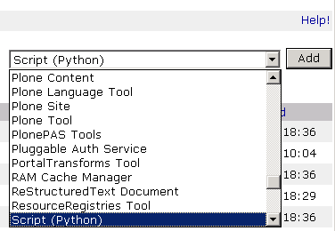
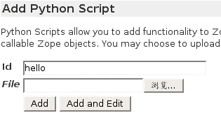
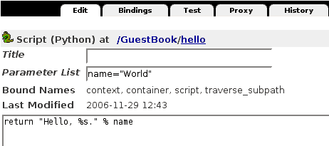
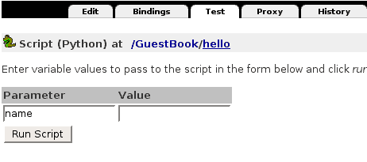
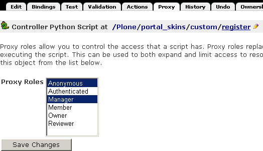
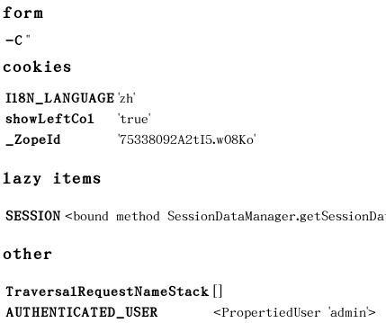
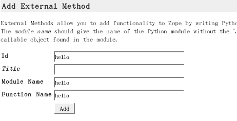

==========================================
 Zope上的Python脚本编程
==========================================

.. Contents::
.. sectnum::
   :prefix: 11.

从本章开始，将进入Zope/Plone的开发。在Zope上面的开发有两种方式：
一种是通过浏览器直接在Zope管理界面上写脚本、模板等，这也称为TTW(ThoughTheWeb)方式；
另一种是在文件系统上写扩展产品，也称为扩展开发。 这一章专门讲述TTW开发方式中的脚本。
本章适合脚本开发人员阅读。

Zope是一个应用程序服务器，其编写源代码是Python，一种动态强类型解释执行语言。
在Zope中可以通过浏览器，在ZMI中添加Script(Python)对象来撰写Python代码。
在一般的Zope开发中也可直接称为Python脚本，
但本章为了区别可能存在的歧义使用Script(Python)这个标准术语。

Script(Python)通常用在逻辑处理的工作上，这是和下一章将会介绍的用来作呈现工作的页面模板作为对比。
将逻辑和呈现的部份分开来，可以提高代码的清晰性和可维护性。

本章学习重点是:

- 掌握脚本的运用，并能理解为了安全性给脚本引入的限制
- 理解外部方法的作用，并掌握其使用方法

.. TODO

   1. 例子要涉及 Request/Response API
   2. 要和附录的API参考关联
   3. XMLRPC
   4. 获取（context参数）

在Zope管理界面中使用Script(Python)
==========================================
在TTW方式开发中，所有写代码的过程都是直接在浏览器中通过相关对象完成。
因此这一节首先介绍在Zope管理界面中操作Script(Python)对象。

创建Script(Python)对象
---------------------------------
在Zope管理界面中，
添加项下拉列表中选取Script(Python)添加Script(Python)对象，如图11.1所示。

   图 11.1 从下拉列表中选择Script(Python)

这时出现添加表单，如图11.2所示。

   图 11.2 在Zope管理界面中添加Script(Python)

只需要输入id，
然后单击Add或者Add and Edit，两个按钮的区别是后者在添加了Script(Python)就开始编辑它。
如果已有写好的文件可以在File输入中直接上传。

点击"Add and Edit"后就开始对新增加的Script(Python)进行编辑，
Zope会生成一段默认的代码，不必理会它，
可以直接删除后改写成下面这一行语句::

 return "Hello, World!"

写好之后，需要单击Save Changes按钮保存一次，
然后就可以选择
标签页进行测试运行，可以看到运行结果正是那个经典的"Hello, World"程序输出::

 Hello, World!

可以看到，这种方式与一般的Python程序开发也很类似，
只不是由浏览器上的编辑框代替了本地的编辑器。
如果你不喜欢这个编辑器（它的功能确实很简陋），
你还可以在本地编辑好然后作为文件上传上去。

Script(Python)的参数的传入
--------------------------------------
在编辑Script(Python)对象的界面中可以看到有Parameter List一行，这是用于在调用Script(Python)时向其传入参数。

   图 11.3 对Script(Python)传入参数

这时再选择Test标签页会要求输入这些参数值。

Script(Python)的参数也可以写默认值，就像一般的Python脚本一样，
在定义了默认参数的情况下测试运行时，不要求必须输入参数值。
图11.3的例子中正是给name参数设置了"World"的默认值。
它的测试运行界面如图11.4，需要在表单填入测试运行值，
这里如果不填就测试运行它就会使用默认值。

   图 11.4 运行有参数的Script(Python)

如果既没有默认值，也没有在测试运行表单中填入参数，则会报告异常。

需要注意的是在写参数列表时应该将有默认值的参数放在后面，这也是与一般Python函数共同的特点。

直接使用Script(Python)
-------------------------
如有Script(Python)位于/hello，那么可以使用这个URL来调用::

      http://localhost:8080/hello

在有参数的Script(Python)上还可以进行表单变量的自动转换，如上面例子中第二个hello有一个参数是name，
于是可以这个URL来调用，Zope会自动将URL中的参数转换为Script(Python)所需要的同名参数::

      http://localhost:8080/hello?name=World

这相当于在使用HTTP GET方式的提交表单。事实上Script(Python)也可以作为form的action被调用，
method可以是任何一种，如这一段代码将表单以POST方式调用::

      <form action="hello" method="post">
        <input name="name" />
        <input type="submit" />
        ...
      </form>

当表单被提交时，运行结果与直接在URL上写的方式是一样的。

应用Zope对象发布原理一章中表单变量的自动转换(Marshall)的知识，你还可以给每个input域加上各种类型后缀，
Script(Python) 就可以接收到各种有类型的数据。

被其他的Zope对象调用
-------------------------------
Script(Python)大部分用于逻辑的判断和数据处理，数学运算等，这些都可以写到单独的脚本中，
在Zope的其它地方就可以进行调用，取得其运算结果。

可以在另外一个Script(Python)脚本中调用上面的hello脚本如下::

    result = context.hello()

上面的context是调用的上下文。如果需要传入参数，可类似一般的Python方法调用方法，如下书写::

   result = context.hello('world')

或者使用关键字参数形式调用::

   result = context.hello(name='world')

在其它可处理运算的Zope对象中同样可以调用Script(Python)，
比如后面要介绍的Zope页面模板、DTML等。

  .. TODO: DTML ?

Script(Python)绑定变量
=============================
Zope是一个强大的应用程序服务器，
要充分利用Zope所提供的功能，
首先要使用到的是绑定变量。

绑定变量清单
---------------
在调用、执行脚本时有一些已存在的对象可供使用，在Zope中称之为绑定变量（Bound Names）。
相当于一般Python编程中的内置变量或函数等。
当前Zope版本中有以下这几个：

- context:
  这个变量是调用 Script 的对象，可以是Zope中任意的对象，如文件夹，或者文件，图片等等任意一个对象，
  它是会随着Script(Python)被调用的位置而发生变化
- container:
  这个变量是容纳 Script 的目录对象，也就是放置Script(Python)对象的那个目录，它是一成不变的
- script:
  这个变量是 Script 对象本身，也是不会变的
- namespace:
  只有由 DTML 调用时才会定义这个变量，它是 DTML 调用时的 namespace，只有在同时使用到DTML的地方才会使用到这个变量，一般不会用到它
- subpath:
  这是一个高级变量，只有通过 Web 调用 Script ，
  而且 URL 在 Script 之后还有其他的对象路径时才会将这些路径切割放入一个 list 中，
  由左向右依序放置。其他时候这只是一个空的 list 。

认识context变量
---------------------------
context变量是执行脚本时的上下文，利用这个特性我们可以将 script 执行在任意获取规则能访问到的对象上。

获取规则是Zope发布原理中介绍的一个很重要的Zope的特性，这里我们可以看一些使用到获取规则的例子。

先在Zope根目录建一个Script命名为get_name，Parameter list保持空白，内容填入::

 return context.title_and_id()

保存这个代码后，然后用浏览器分别查看这些 URL，观察结果，见表11.1。

.. list-table:: 【表 11.1】测试不同的URL
  :header-rows: 1

  * - 查看URL
    - 在浏览器返回结果
  * - ``http://localhost:8080/Control_Panel/get_name``
    - "Control Panel (Control_Panel)"
  * - ``http://localhost:8080/temp_folder/get_name``
    - "Temporary Folder (temp_folder)"
  * - ``http://localhost:8080/acl_users/get_name``
    - "User Folder (acl_users)"
  * - ``http://localhost:8080/standard_html_header/get_name``
    - "Standard Html Header (standard_html_header)"

你可以看到使用不同的URL访问的是不同的对象，
但它们都可以访问到在Zope根目录上的get_name脚本。
get_name执行在不同的对象上就会取出不同的title或id来，这也称作由这些对象来调用Script。
在这里我们用了context这个绑定变量，context表示调用它的对象本身。

认识默认的Python脚本
------------------------
再来看看新建的Script(Python)对象后的默认内容::

  # Example code:

  # Import a standard function, and get the HTML request and response objects.
  from Products.PythonScripts.standard import html_quote
  request = container.REQUEST
  RESPONSE =  request.RESPONSE

  # Return a string identifying this script.
  print "This is the", script.meta_type, '"%s"' % script.getId(),
  if script.title:
      print "(%s)" % html_quote(script.title),
  print "in", container.absolute_url()
  return printed

这一段代码中首先导入html_quote函数为下文需要，然后从container上读取REQUEST和RESPONSE，但这个脚本上实际上并未用到。
然后是打印语句，将script变量的meta_type属性读出，从其getId方法上读取其id，再读title 属性，
如果有，则将title属性作html转化后打印出来，最后打印其URL地址。
用上html_quote是因为title属性可以含有html控制字符，使用html_quote转换为可在html中显示的文本。

.. note::
   在Script(Python)中可以打印，但打印的结果会汇入到printed变量中，所以返回printed来显示结果。

Script(Python)的安全沙箱限制
===================================
因为脚本是可以通过网页界面写在Zope管理界面中，任何有相应Zope权限的人都可以写脚本，
但Python编程语言本身是像所有高级语言一样具有控制Web主机的所有高级功能，
因此在允许Zope用户来写自己的Python脚本时，安全就成为一个大问题。
必须对其限制所有可能危害Web主机的操作。
很多Python的内置函数如open就被禁止使用，这是防止直接由Web存取主机的文件系统。

与通用Python环境中的区别包括:

- 只有这些内置函数或变量可以如同在Python环境中一样地自由使用：

  None, abs, apply, callable, chr, cmp, complex, delattr, divmod, filter, float, getattr, hash, hex, int,
  isinstance, issubclass, list, len, long, map, max, min, oct, ord, repr, round, setattr, str, tuple. 

- range和pow的用法与在Python中是一样的，但大小受到限制。这是预防过大的数字或序列会造成Denial of Service的攻击。

- 类型比较的变化：
  因为内置函数type不能使用，要比较二个对象是否为同一型态， 需要使用same_type。
  使用same_type比较之后如果是同型态的对象，则传回true ::

   if same_type(foo, []):
       return "foo is a list"

  这等同于::

   if type(foo) == type([]):
       return "foo is a list"

  使用 same_type 也可以一次比较多个对象的类型::

   if same_type(obj1, obj2, obj3, ...):
     ...

  当所有对象的类型都相同时返回真。

- 增加了 test 函数：
  在 Python 中一般使用 ``if/else/elif`` 来做判断的逻辑，但 ``if/else/elif`` 都是语句，而非表达式，
  在 Script(Python) 和 Zope 页面模板中只能使用表达式的地方就有了 ``test`` 的用场了，它的用法与一般的 ``if/else/elif`` 也是类似的::

    value = test(condition1, value1, condition2, value2, ..., value_default)

  它可以接多个参数，顺序是一个条件然后一个值，
  如果这个条件是真的，就返回这个值，否则继续测试下一个条件。

  传统的 Python 编程中常有人用到 ``condition and value1 or value2`` 的写法，但这个写法有它固有的问题，
  因为你必须保证 value1 必须是为真的，否则它就不是你想像那样运行了，而 ``test`` 函数则没有这个问题。

  ..
    tip::
    在最新的 Python2.5 中 ``if/else/elif`` 也可以作为表达式来运行了，但目前最稳定的 Zope 运行环境还是 Python2.4 。

Script 的限制是为了预防破坏，它是通过在受限的环境下执行Python来实现的。
这个环境对其中执行的Python语句有以下限制：

- 循环限制

  Script不能执行无限循环，如果Script执行一个很大数字的循环，Zope会引发一个错误。
  不论是for或while循环都被限制。这是避免因为一个无限循环造成Zope本身停止回应。

- Import 限制

  Script不能随心所欲的import Packages和Modules，只能够import Products.PythonScripts.standard utility module ，
  AccessControl module ，string ， random ， math ， sequence 。
  还有一些经由产品开发人员特别指定的Modules，
  可以在Zope Book Appendix B, API Reference中找到更多的讯息。
  (或是看Products目录中的PythonScripts里的README.txt，会提到如何让Script可以Import 更多的Modules。)
  
  

- 使用限制

  当Script使用对象时也会受Zope安全原则的限制。换句话说，当使用者调用Script存取某一对象时，
  Zope会检查使用者是否有权限存取这个对象。
  所有可被执行的对象都可以在Proxy tab中设定Proxy Roles，让执行时的角色参照这个角色。
  再则，不能存取Id开头为下划线的对象，Zope认定这是内部的对象。
  最后，虽然可以在Script中定义class，但是不能正常使用它。 因为 __init__() 不能被执行。

- 写入限制

  不能直接使用Script改变对象的属性，只能调用适当的Zope API方法(method)来作。

..
  可以看到Zope中执行的Python代码其实是在一个受限的Python环境中，

使用Proxy调整执行权限
==============================
运行Script(Python)时，默认使用执行用户的权限。但某些脚本可能需要更高的权限。
这样可通过设置脚本的Proxy角色实现。脚本的Proxy角色，实际上是脚本运行时所采用的角色。

典型的是，匿名用户一般是不能在网站上添加新的用户的。但是在注册的时候，那个注册脚本register在运行的时候可以
在网站中添加用户。这时候，操作的用户一般还处于匿名状态。

我们可通过给register脚本增加一个Proxy角色来实现。

Script(Python)类型的对象在Zope管理界面上比其它类型对象多了一个Proxy标签页，如图11.5。

   图 11.5 在Zope管理界面中为Script(Python)设定Proxy参数

注意到这个画面比普通脚本多了一些标签页，因为它是后面的章节中会讲到的控制脚本，
但它也是脚本的一种类型，这里将它作为设置proxy角色的例子，未见过的标签页等都不必理会，后面的章节中会讲到。

使用XML-RPC和Zope通信
==================================
除了浏览器之外，你还可以使用其它方法来访问Zope服务器，比如被其他的语言调用，和其他的应用集成。
XML-RPC就是另一种Zope所支持的通信接口方式。
XML-RPC是工作在HTTP协议之上，使用XML来编码信息的一种远程调用协议。更多关于XML-RPC的信息可以查看 (http://www.xmlrpc.org/) 。
使用它的好处是几乎所有高级语言都支持XML-RPC编程，也就是说，你可以使用任意你喜欢的语言写客户端程序来访问Zope。

所有从URL上可以访问的Script(Python)也都可以XML-RPC方式调用；
如果你喜欢使用Python来编写XML-RPC客户端可以使用xmlrpclib。
如下面来使用xmlrpclib来访问刚才写的hello脚本::

  import xmlrpclib

  server = xmlrpclib.Server('http://localhost:8080/zpt')
  server.hello()

这段代码如上面的直接测试生成相同的输出，就是打印出结果::

  'Hello, World!'

XML-RPC调用也可以传递参数，如上面的调用一行改为::

  server.hello('Mr Wang')

将会返回的结果是::

  'Hello, Mr Wang!'

注意，XML-RPC不支持以关键字参数形式调用，如这种形式的调用会报告错误::

  server.hello(name='Mr Wang')

..
  TODO: 这段代码的说明, 能否改写和上面的hello world结合？

如果你喜欢使用Perl语言，可以使用Frontier::Client模块::

  use Frontier::Client;

  $server = Frontier::Client->new(url => "http://localhost:8080/zpt");

  $server->call("hello");

使用Java则可以使用XmlRpcClient::

  try {
      XmlRpcClient server = new XmlRpcClient("http://localhost:8080/zpt");
      server.execute("hello");
  } catch (XmlRpcException ex) {
      ex.printStackTrace();
  } catch (IOException ioex) {
      ioex.printStackTrace();
  }

..
  这些只是作为示例在这里说明各种语言版本的XML-RPC都是可用的，但 "http://www.zopezoo.org" 却并不存在对应的 Script(Python) ，
  因而这示例代码还是不可运行的，在具体需要的地方，你需要根据你所定义的 Script(Python) 来写对应的 XML-RPC 客户端程序。

  TODO: 改写,让他能够运行？

应用实例
===================
上面只是介绍了Script(Python)的使用方法，在掌握了其基本用法之后，下面再分别举例来展示脚本的更多用法。

REQUEST与RESPONSE
-------------------------------------------
..
  TODO: 改写为可运行的、更有意义的例子

上一章Zope对象发布原理中讲到Zope是一个对象发布环境，它将各种客户端(浏览器或ftp客户端，
XML-RPC客户端)的请求封装为统一的REQUEST变量，而向客户端的回应则集中在RESPONSE对象，
于是与客户端的交互就统一在了读取REQUEST信息和控制RESPONSE上了。

首先创建一个脚本，在其中直接返回REQUEST变量全文::

 return context.REQUEST

执行这个脚本，可以看到输出的是一个格式化好的页面，
打印出了REQUEST变量的内容。

   图 11.6 打印REQUEST变量

可以看到REQUEST就是一个Python的字典类对象，其中有form、cookies，
还有其它的如浏览器UserAgent信息、
HTTP Referer信息等各种用户请求信息，当需要时这些信息都可以读取出来。

上面讲到脚本可以用在表单的action上，而表单中的数据最后都在REQUEST的form变量中，
因此要将表单中的数据都读出来可以使用::

  request = context.REQUEST
  form = request.form

返回的form变量是一个映射类型(mapping)，可以像Python的字典一样地使用它，
如引用其中的某个name为input_name的值可以这样::

  form['input_name']

而RESPONSE是另一个常用的与客户端交互的变量，
它可以作为REQUEST上面的一个属性读出来::

  response = request.RESPONSE

通常使用RESPONSE来向浏览器发送页面重定向消息::

  response.redirect('http://czug.org')

..
  还可以设置cookie，如::

    response.setCookie('__cp', cp, path='%s' % cookie_path(REQUEST))

有关REQUEST和RESPONSE的更多操作可以参看附录。

下面是一个有用的例子：根据表单中的参数来转到不同的页面。

假设要为一个表单写一个响应脚本，根据填写表单中用户的选择来决定转到哪一个网站。
在表单中有一个redir_to变量，并且已使用":int"后缀转换为了整数型。

..
  这个表单的一部分是::

  <form action="test_action" method="POST">
    ...
    <input type="radio" name="redir_to:int" value="1" checked="checked" />to zope site 
    <input type="radio" name="redir_to:int" value="2" />to plone site 
    <input type="radio" name="redir_to:int" value="3" />to czug site 
    <input type="submit" />
  </form>

下面来写这个响应脚本test_action::

  request = context.REQUEST
  response = request.RESPONSE

  form = request.form
  redir_to = form['redir_to']

  # here can do more

  if redir_to == 1:
    target_page = 'http://zope.org'
  elif redir_to == 2:
    target_page = 'http://plone.org'
  elif redir_to == 3:
    target_page = 'http://czug.org'
  else:
    # other, back to the form
    target_page = '/zpt/test_form'

  response.redirect(target_page)

这一段代码中首先是从context变量上获取request和response变量，
再取出表单中的redir_to域。
这个域在表单中已经使用了:int后缀转换为了整数形，
所以在脚本中就可以直接与数字进行比较，分别设置不同的转向页面。

由于还没有介绍使用表单，这里可以使用URL来模拟GET方式提交这个表单，如：

::

  http://localhost:8080/test_action?redir_to:int=1

这将测试表单变量redir_to为整数1的情况，可以改为2或3来测试，
看脚本是否如设计的那样运行。

替换Plone页面的文字
-------------------------
上面的例子都是在Script(Python)中读取对象的信息，
实际上Script(Python)既然是一种脚本语言，它当然还可以作修改内容和删除内容等所有的操作。

这是一个稍复杂的例子，展示了怎样在Script(Python)中修改其它Zope对象的内容。
注意这个例子中调用了context的getRawText方法，而这个方法是Plone内容对象才有的，
因此这个例子要运行在一个Plone内容对象上。

::

  ## Script(Python) "replaceWord"
  ##parameters=word, replacement
  ##

  text=context.getRawText()
  text=text.replace(word, replacement)
  context.setText(text)
  context.reindexObject()
  return text

假设已知在Plone站点上有一个页面，位于::

  http://localhost:8080/Plone/testpage

而这个replaceWorld应该放置在获取规则可以访问到的地方，如这个Plone站点根目录或者直接放在Zope根目录上，
因此可以这样调用::

  http://localhost:8080/Plone/testpage/replaceWord?word=This&replacement=That

这段代码首先从context读出文档所有内容，返回的是Python的str类型，再根据参数替换文本，并将替换后的文本写回去。

.. attention::
   如果你试图在其它类型的对象上调用replaceWord有可能会出现一个AttributeError，提示没有getRawText属性，
   这是因为这一些Zope对象并没有提供getRawText方法，关于如何读取这些类型对象的全文，可以查看附录的常用Zope/Plone API参考章节。

External Method：外部方法
====================================
出于安全的方面的考虑，Script(Python)中使用Python语言有很多限制。
要突破这些限制可以使用外部方法(External Method)。

..
  因为外部方法必须写在安装 Zope 的文件系统中，
  所以必须拥有主机上的帐号和相应写权限的人才能将文件储存在主机里，
  Zope在这里借用了操作系统的权限来保证外部方法的安全性。

简单地说，外部方法就是在文件系统中的Zope产品的Extension文件夹下，或Zope实例的Extensions文件夹子目录的Python模块文件。
同时在Zope的ZMI界面中，将创建一个对象和这个模块相关联。

因为外部方法是必须写在Web主机文件系统上的，因此只有具有Web主机主机系统写权限的人才能创建外部方法。
增加了这一层权限控制，在外部方法中写Python代码时就不必如Python脚本那样小心翼翼了。
事实上，外部方法就是正常的Python程序，可以导入任何可用的Python包和模块，可以执行任意次数的循环，Zope没有对其作任何的安全限制。

当在开发中遇到Python脚本所固有不能解决的安全限制问题时，
如必须使用到某个Python模块时，可以考虑使用外部方法。

创建External Method
-----------------------------
很多产品的安装自带有很多的外部方法，这些位于产品目录的Extensions子目录中，Plone插件产品的安装程序都大是采用外部方法编写;
在Zope实例目录中也可以创建外部方法，放置于Zope实例的Extensions子目录中。

如在Zope实例目录的Extensions子目录中创建hello.py文件如下::

    def hello(self, name="World"):
        return "Hello %s!" % name 

然后在Zope管理界面中添加外部方法，如图11.7所示。

   图 11.7 在Zope管理界面中添加External Method

..
  TODO: 说明这表单的写法，特别是产品的外部方法的写法。

图中可以看到，添加外部方法需要输入四个参数，
其中id和title与添加其它Zope对象时是一样的，
id是必需输入的，title是可选输入的。
而后面的两个则是关键的参数：

- "Module Name" 这里输入文件系统上的外部方法所在模块名。
  如果是在Zope实例的Extensions目录中的py文件，直接输入文件名就可以(不包括扩展名py)，
  这里对应着在Zope实例的Extensions目录中的hello.py中的hello部分；
  如果是在某个产品的Extensions目录中，则需要以"产品名.模块名"的方式输入，
  如使用Archetypes产品的外部方法Install.py时，就在这里输入"Archetypes.Install"。
- "Function Name" 这里输入在外部方法中定义的函数名，上面定义的函数是"hello"，所以这里直接写"hello"。

保存后就可以测试运行。外部方法同样有一个Test标签面，用来测试运行。
运行结果与上面的在Script(Python)中的运行结果是一样的::

  Hello, World!

.. note::
 这里面的External Method有两层概念，一个是在文件系统上产品目录或Zope实例中Extensions子目录中写好的Python脚本，
 另一个是在Zope管理界面添加的Zope对象，在这个对象上设置参数使其与文件系统上的Python脚本相关联。

调用External Method
------------------------
Zope中External Method与Script(Python)有很多相同点，其调用方法就是一样的，可以直接在Test标签页测试运行，
也可以使用URL传参数或是使用表单传递参数。见调用Script(Python)一节，所有调用Script(Python)也都适用于External Method。

传递context的接口：self
-------------------------------
因为外部方法是写好在文件系统上，Zope在内部通过Python的import句法来调用它，
这里与Script(Python)不同的是Zope在调用它时不会准备了那么多的绑定变量，此时唯一可用的就是self变量，
这个变量在此时的意义与Script(Python)中的绑定变量context是相同的。
也就是调用此外部方法的那个具体的Zope对象。

实例: 生成汉字拼音
----------------------
下面是一个稍复杂但有实际功能的External Method示例，用来生成拼音。

可在Extension目录中添加一个pinyin.py的Pyhton模块，内容为::

      from Products.ZopeChinaPak.pinyin import PinYinDict

      def getPinYin(self):
          str = self.title_or_id()
          str = str.decode('utf8')
          pinyins = []
          for c in str:
              pinyins.append( PinYinDict.get(c, '').capitalize() )
          return ' '.join(pinyins)

这个外部方法可以作用于任意对象上，将对象的title_or_id取出来，使用Products.ZopeChinaPak.pinyin模块的功能将其中的汉字转换为拼音。
注意到这个外部方法从Products.ZopeChinaPak导入了函数，因此测试这个例子时要安装 ZopeChinaPak 这个产品。

然后是在Zope管理界面中加入External Method:

.. figure:: img/pythonscript/add-pyin-external-method.png
   :alt: 添加外部方法

   图 11.8 添加外部方法

在一个title名为“研究学习”的目录上调用的URL::

 http://localhost:8080/Plone/study-directory/pinyin

结果如下::

 Yan Jiu Xue Xi

外部方法其实就是Python模块中的函数，因此一般Python函数中能使用的技术在这里也同样适用，
如使用默认参数等，同样可以用在外部方法中。

小结
====
这一章讲述了Script(Python)和External Method的作用和使用方法，

这两类Zope对象的共同点是都是适合处理逻辑（相对于其它用于显示界面的Zope对象而言），但它们又有着不同点，
以分别适用于Zope应用中不同的侧面：

- Script(Python)

  对于所有具有Zope管理界面操作权限的人都可用；

- External Method

  只有系统管理员(指具有主机文件系统上写权限的人)能使用，通常用于需要突破Script(Python)所固有的安全限制时。
