=================
用户和权限管理
=================

.. Contents::
.. sectnum::
   :prefix: 6.

对于任何一个系统，我们都会关心它的安全性问题。我们需要控制不同的用户，在网站的不同地方，在不同的阶段，能够拥有不同的权限。Plone具有一个强大的、柔性、精细粒度的安全性模式，可针对每个对象，为用户、组分配权限，支持委托授权。

本章首先穿插介绍所有相关的概念术语，及Plone中怎样管理用户和设置权限；同时深入Zope的权限介绍，并对管理用户的文件夹及相关作用做详细介绍；包括原理、及与其它服务集成，如LDAP（Lightweight Directory Access Protocol: 轻量级目录访问协议）集成，关系数据库用户集成等。

本章适合网站管理员、系统管理员、系统集成人员阅读。本章学习重点：

- 管理用户的概念
- 在Plone控制面板中管理用户和组
- Plone权限设置
- 深入权限管理
- 认识ZMI中的用户管理文件夹
- 与第三方认证集成
  
管理用户
===================

用户、角色和组
----------------------
在Plone中，用户（Users)、角色(Roles)和组(Groups)属于非常重要的概念，这里先对它们详细地介绍。

用户
.............
每个访问Plone站点的人，都被称为 用户(User) ，不管是否可以通过Plone认证。那些不能通过认证的用户被称为 匿名用户(anonymouse users) 。匿名用户属于最 低 等级的用户，系统对他们有最多的限制。一旦用户登入系统，就会获得账户赋予的角色身份。一个用户是由其用户名唯一识别的，例如 joy 。

角色
........
Plone站点拥有一组角色，角色是权限的集合。一般有系统集成人员在ZMI中预先定义每个角色拥有的权限，而Plone中不提供角色的设置界面。可以同时分配多个角色给一个用户，例如，一个用户可以是成员和管理员。每个角色也具有唯一的标识，如成员（Member）。

Plone有6个预设的角色，可以分为两种：可分配角色和不可分配角色。

不可分配的角色有：

- 匿名用户(Anonymous)：指那些没有登录到系统中的用户，他们可能没有系统账户、或者有系统账户但只是没有登录。

- 认证用户(Authenticated)：指所有已经登录到系统中的用户，不管他是什么角色。一个用户不是匿名用户就是认证用户，这两种角色是互斥的。因为认证用户这种角色并不能在在用户分类上提供更多帮助，所以不推荐使用。

可分配的角色有：

- 所有者(Owner)：如果用户创建一个内容对象后，即自动成为该内容的所有者。对被创建的内容对象而言，该角色只会赋予一个用户（创建它的用户），其所有者信息被保存在这个内容对象本身。该角色的分配并不是显式操作的结果，而是Plone自动完成的。

- 成员(Members)：对于注册到Plone站点的用户而言，缺省即为成员角色。只要通过Plone界面中的【注册】链接方式加入的用户，都会具有该角色。

- 审批人(Reviewer)：该角色用户拥有的权限比成员角色更多、但比管理员角色要少。审批者用户可以编辑或审批由成员角色提交的内容；他们不可以修改系统配置或设置用户账户信息（这是管理员用户做的事情）。

- 管理员(Manager)：管理员可以做任何事情，所以该角色只能赋予那些可信赖的开发人员或系统管理员。一个管理员用户可以删除、编辑内容对象，清除用户账户，改变系统配置，甚至删除整个Plone站点。所以一定要谨慎使用该角色！
   
Plone 3.0 引入了两个新的角色：

- 查看人（Reader）：查看人可以查看所有状态的内容，并具有访问内容信息（Access content information）和查看文件夹列表（List folder contents）权限。

- 编辑人（Editor）：编辑人具有编辑（Modify portal content）站点内容的权限。

用户组
.........
组是用户的一个集合，组是用户的逻辑分类。例如，市场部的用户可以划分为一个组，而工程部的用户又可以划分为另外一个组。每个用户可以不属于任何组、也可以属于多个组。

Plone控制面板中管理用户和组
-------------------------------
在《使用Plone》的章节中介绍Plone控制面板的时候，Plone控制面板中提供了用户和组管理。下面来介绍在Plone控制面板中管理用户和组。

用户管理
..............
以网站管理员角色进入网站设置，然后进入这个用户和组管理页面如图6.1，这个设置页面分为两个标签页，分别设置用户和组。

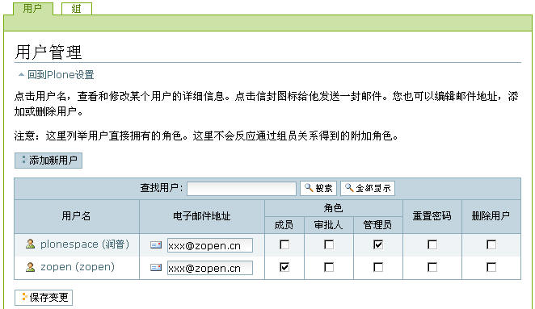

   图 6.1 用户和组管理的用户标签页

在用户标签页中网站管理员可以通过【添加新用户】按钮添加新的用户。在下面的表格中可查找用户，单击【全部显示】显示所有用户。点击某个用户名，如zopen，可查看和修改这个用户的详细信息，包括所属的用户组。点击信封图标可给他发送邮件，可以编辑邮件地址，可变更用户角色，可删除用户，还可重置用户的密码（会自动发送通知邮件）。

.. hint:: 
   并不是所有的用户数据源都支持【全部显示】功能，比如通过LDAP等连接的用户就不能显示。

组管理
...........
组标签页如图6.2所示。

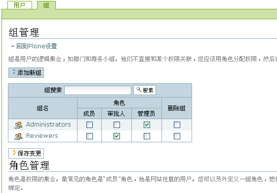

   图 6.2 用户和组管理的组标签页

这个界面很类似于成员管理的界面。在这里可以添加新的组。在表格中可搜索指定的组名。这里的组默认是全部（分页）显示的，可变更组的角色，还可删除组。点击某个组名，如Administrators，可添加组员和修改组属性，如图6.3是进入到Administrators，搜索zopen用户，将其加入到Administratros组。

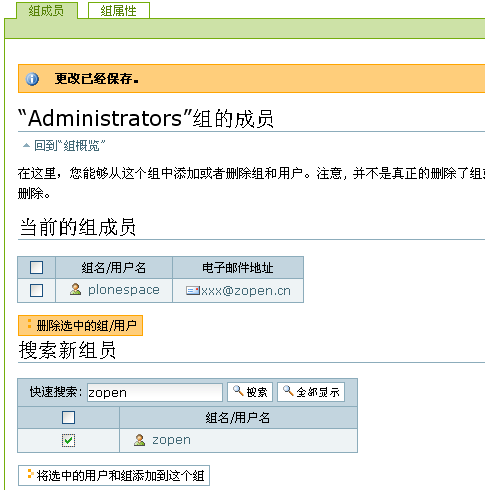

   图 6.3 用户和组管理－－添加用户到组中

图6.3中的组成员的页面中显示Administrators组的当前组成员，组成员可以是组也可以是用户，在当前组成员的表格中可以删除某一组/用户。在下面搜索新组员的表格中，可搜索到某一用户/组或全部显示，选中添加到Administrators组中。在这个页面的组属性标签页中可设置Administrators组的相关属性。

返回到组管理的页面，即图6.2所示。可看到这个页面中有角色管理的介绍，也清晰地描述了角色的概念，在上文中也有定义。可以添加新的角色，而这是一个开发工作，需要到Zope管理界面中去完成，下文中会详细介绍。

Plone权限设置
================
在Plone中设置内容的权限一般有三种方式：第一，针对用户/用户组设置系统角色；第二，针对内容设置内容共享；第三，设置内容为保密或发布状态。

第一种方式，针对用户/用户组设置系统角色，在上文中介绍通过Plone控制面板管理用户和用户组的时候已经了解到。
为用户分配的系统角色，将在整个网站在所有的内容上都有效。下面介绍设置权限的另外两种方式。

设置内容共享
----------------
在《使用Plone》的章节中，了解了一些内容标签，在这里介绍设置内容的【共享】标签。

Plone中的所有内容都可以设置共享，可对单个文件也可以对整个文件夹，由内容的所有者或站点管理员可在【共享】标签页中操作完成。

在【共享】标签中可为用户或者组分配本地角色。和前面的系统角色不同，本地角色仅仅在所在内容或者文件夹下才有效。

默认情况下，在文件夹上的本地角色设置，文件夹中的内容会自动获取；也就是说文件夹中的内容，可继承父文件夹中的本地角色设置。
因此，一般是对文件夹设置共享，而不必单独为文件夹中的每个内容设置。图6.4所示是进入stuff文件夹的共享标签页看到的当前共享权限。

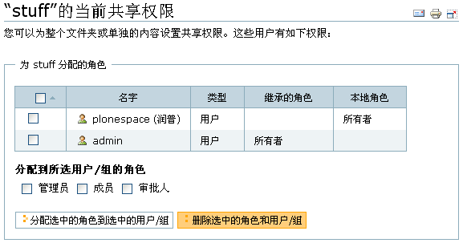

   图 6.4 设置共享权限－－stuff文件夹当前的共享权限

图中显示plonespace用户是此内容的所有者，而admin继承的所有者角色。在这个界面中可以对用户/组分配角色，同时也可以删除已存在的角色和用户/组。

给用户设置共享权限
.....................
在共享标签页的当前共享权限以下，可看到给用户授权的界面，如图6.5所示。

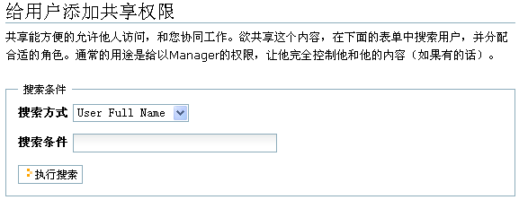

   图 6.5 设置共享权限－－给用户授权(1)

通过多种搜索方式，如：用户登录名，邮件地址，或所在的组名来搜索用户。执行搜索后，此部分界面变成了下图6.6所示。

.. figure:: img/security/folder_localrole_adduser.png
   :alt: 设置共享权限

   图 6.6 设置共享权限－－给用户授权(2)

搜索结果中显示搜索到的内容，如果有多个也会同时显示多个，选中需分配的用户（图中是spring的用户），选择要分配的角色（图中分配为管理员），单击为【所选用户分配本地角色】即可。执行后，再看看当前的共享权限，如图6.7所示。

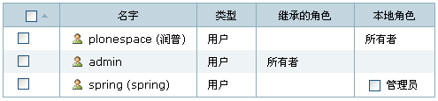

   图 6.7 查看当前的共享权限

看到设置后在当前的共享权限的表格中多了spring用户的信息，他是此内容（stuff文件夹）本地角色的管理员。spring用户是通过授权成为stuff文件夹的管理员，默认情况，spring用户也自动获取了stuff文件夹子文件的管理员权限。

给组设置共享权限
...................
为方便管理，一般成组设置角色。这样，只需要将用户加入到某个组，便可自动得到为组所分配的权限。

再看看给组添加共享权限的界面，如图6.8所示。

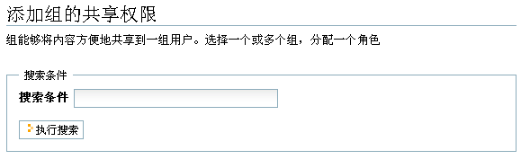

   图 6.8 设置共享权限－－给组授权(1)

给出搜索条件，执行搜索后，此部分界面变成了下图6.9所示。

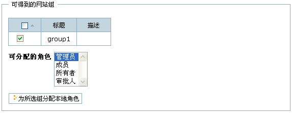

   图 6.9 设置共享权限－－给组授权(2)

也同样，搜索结果中显示搜索到的内容，如果有多个也会同时显示多个，选中需分配的组（图中是group1的组），选择要分配的角色（图中分配为管理员），单击【为所选组分配本地角色】即可。执行后，再看看当前的共享权限，如图6.10所示。

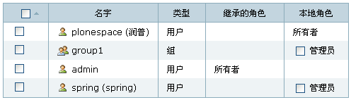

   图 6.10 查看当前的共享权限

可看到设置后在当前的共享权限的表格中多了group1的信息，他的类型是组，他是此内容（stuff文件夹）本地角色的管理员。group1组也是通过授权获得stuff文件夹的管理员权限，同时也自动获取了stuff文件夹子文件的管理员权限。

添加组的共享权限就非常的方便，而且也是经常处理的工作，比如，我们需要这个部门的用户都能管理某一个文件夹，也正好之前将这个部门的所有用户分配到建立的某个组，那么只需要通过给这个组设置共享管理员的权限即可。

高级设置
.............
前面了解到某一内容都有可能有从上一级目录继承的角色。那么是否可以去除这个继承关系呢？是可以的。现在以文件夹中的某一内容为例，这样更能清楚地看到从上一级继承的角色。进入stuff文件夹的document页面的的共享标签页的底部，可看到如图6.11所示。

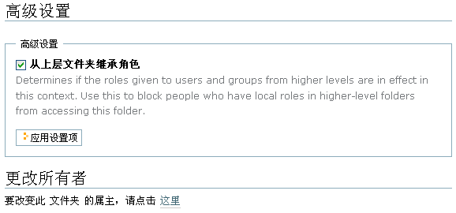

   图 6.11 设置共享权限－－高级设置

如果是站点管理员所看到的就还有更改所有者的的部分。做为此内容的所有者看到此页面是没有更改所有者的部分。

去掉【从上层文件夹继承角色】的选项（默认是选择的），单击【应用设置项】后，可以看到此内容的当前共享权限，如图6.12中。

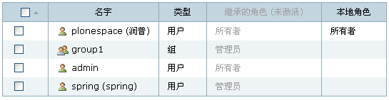

   图 6.12 查看当前的共享权限

图中可看到从上一级目录，即stuff文件夹继承角色的用户/组都变成灰色了。他们已经不是document页面的某些角色，也不再拥有document页面的相关权限。

站点管理员用户可以更改内容的属主，每个内容有唯一的所有者，管理员可在更改所有者的部分按提示操作。这个设置不常用到，设置也比较简单，这里就不多介绍了。

Plone 3.0中设置内容共享
.........................
上文中介绍的设置内容共享，设置过程还较复杂，较繁琐。一个设置内容共享的页面分成几个区域，导致共享的标签页很长，上文介绍的时候也不得不分成几个板块来分别介绍。下图6.13是Plone 3.0中设置内容共享的页面截图，Plone 3.0大大简化了权限的设置步骤。

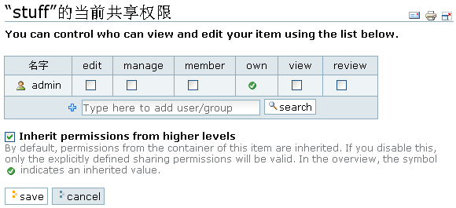

   图 6.13 Plone 3.0中设置内容共享

Plone 3.0设置内容共享的页面只用了一个搜索用户/组板块来设置本地角色，但同时多了编辑人，查看人的角色（上文中已介绍）。   

调整内容的状态
-----------------------
调整文件夹的状态，比如保密、公开草案、发布等，这样可以设置文件夹下内容的保密级别。比如将文件夹设置为保密后，文件夹及文件夹下内容对除所有者和管理员的角色外所有的用户就没有显示的权限。当然直接对普通内容（文件，页面，图片等）也可单独设置内容状态。

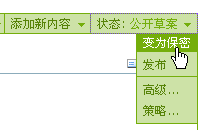

   图 6.14 调整内容的状态

可查看《管理工作流》章节中的工作流权限明细表，据不同的要求调整内容状态，这个比较简单，在《使用Plone》的章节中也有部分介绍，这里就不过多介绍了。

深入权限管理
===================
Plone提供了一个用户友好的权限设置界面，已经可以实现日常管理的权限设置。但您可能需要更多，更深入地了解Plone的权限，比如想了解是什么控制内容可查看，可编辑等，这需要您了解Zope的权限。Zope的权限非常细，也较为复杂，所以可进行更加精细的权限调整。实际当中，也并不需要了解这些细而复杂的权限，下面会介绍常用的权限设置。同时会介绍在Zope管理界面中如何添加新的角色，以及一些日常管理工作。

了解Zope的权限
---------------
在《深入Plone设置与管理》章节中介绍ZMI，当时了解了ZMI中每个对象都有一个Security标签页，即对象安全标签页。图 6.15所示是站点ZMI根目录的Security标签页的截图片断。

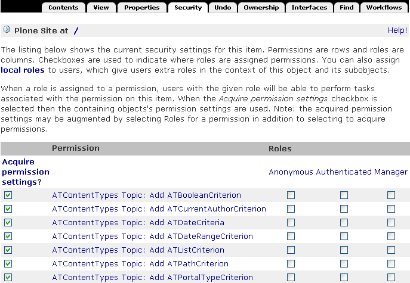

   图 6.15 对象的安全标签页

图中看到这个页面的表单左侧列出的权限项(Permission)很多很多，这些是站点获得Zope的，以及Plone的，还有Plone的一些插件产品几乎所有的权限项。这些是几乎接近底层的东西，没有必要一个个去了解它们。在表单的右侧列出的是针对每一个权限项各个角色(Roles)是否拥有这个权限项的权限，这些角色正是上文中罗列的Plone站点中预设的6种角色(Anonymous, Authenticated, Manager, Owener, Reviewer)。

在每一个权限项的左侧，都有一个选择设定获取(Acquire permission settings?)的选择框，表示自动从对象上一级目录获取权限设置。
因为这个获取的存在，一般情况下，只需要在网站根文件夹下设置权限即可，下面的各级子文件夹中的内容都可自动获取根文件夹中的设置。
这样大大简化的网站的权限设置。

常用权限设置
-------------------
前面看到了ZMI中的Security标签页中的权限项太多，一般不推荐到这里来设置权限，这里介绍几个常用的权限。

.. csv-table:: 【表 6.1】 Plone的常用权限
   :header: "权限", "权限说明"   

   "View", "查看具体内容的权限"
   "Add portal content", "添加内容的权限"
   "List folder contents", "列举文件夹内容清单的权限"
   "Delete objects", "删除内容的权限"
   "Modify portal content", "编辑内容的权限"
   "Add portal member", "注册到网站的权限"
   "Reply to item", "评注的权限"

添加角色
-------------
在上文中介绍用户与组管理时提到可以添加角色，就是在Security标签页的最下方，如图6.16。

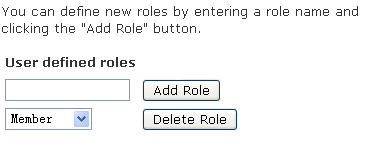

   图 6.16 添加角色

图6.16中是站点根目录的Security标签页下方的添加角色，所以你看到在这里可以删除成员和审批人的角色。在这里可以添加角色和删除角色。

添加角色属于系统集成人员才会执行的操作，添加角色后往往还要为该角色关联相关的权限。比如可定义一个贡献人角色，然后在Security标签中，和这个将Add portal content的权限项和这个角色关联。这样，便可以在Plone共享标签中，通过为文件夹中的用户或组分配这个新的贡献人角色，来授予添加内容的权限。

日常权限管理工作
-------------------
说到Plone中的权限管理，不可能不提及到工作流。在上文中的Plone权限设置中，提到三种方式设置内容的权限，有一种就是调整内容状态，这其实是工作流所控制的。调整状态，可以批量的调整角色的权限。比如内容一旦发布，原始作者便不能再修改了。所以在Plone权限管理中是和工作流密切相关的，关于工作流具体会在下一章《定制工作流》中详细介绍。

Plone中的某些权限项，比如，内容的查看，编辑等权限，是由工作流所控制的。其他的权限设置，比如添加内容的权限项，用户注册的权限项，用户评注的权限项等，可以单独设置。

下面是日常权限管理工作中几个常用到的例子，通过例子的操作更深入地了解和掌握复杂一点的权限管理工作。

禁止用户自行注册
......................
禁止用户自行注册也是很多案例需要去设置的，比如，建立企业的内部站点，建立私人站点，就常有这样的需求。下面是设置禁止用户自行注册的实例。

【例 6.1】 设置禁止用户自行注册

#. 进入站点ZMI根目录的Security标签
#. 找到Add portal member权限项，取消选择Acquire（获取）复选框，并选择允许Manager和Owner角色的复选框
#. 单击Save按钮，保存更改

这样就设置了站点禁止用户自行注册的功能，当您用匿名用户查看站点时，注册的链接已经没有了，匿名用户不能注册站点成员了，如图6.17所示。当然，管理员可以在Plone控制面板中添加站点成员，这也正是我们需要达到的目的。 

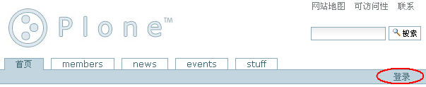

  图 6.17 设置禁止用户自行注册

允许成员添加内容
...................
很多站点会有这样一个需要，它们开放某一个目录，在这里站点成员都可以添加内容（或某一类型内容）。下面是设置某一文件夹下允许成员添加内容的实例。

【例 6.2】 设置某一文件夹下允许成员添加内容

#. 进入ZMI中的stuff文件夹（这里以stuff文件夹为例）的Security标签页
#. 找到Add portal content权限项，取消选择Acquire，并选择允许 Manager 、Member 和 Owner 角色
#. 找到您想让成员添加的内容类型的权限项，比如，添加文件内容（ATContentTypes: Add File）的权限项，取消选择Acquire，并选择允许 Manager 、Member 和 Owner 角色
#. 单击Save按钮，保存更改

这样，站点成员就可以在stuff文件夹下加您允许添加的文件类型内容。下图 6.18 是成员用户登录到stuff文件夹后有添加文件的权限。

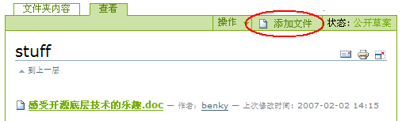
  
  图 6.18 允许成员添加内容

允许匿名用户评论
....................
默认的Plone站点对用户登录才能对内容发表评论，下面是设置允许匿名用户发表评论的实例。

【例 6.3】 设置允许匿名用户评论

#. 进入ZMI的根目录的 Security 标签页
#. 找到Reply to item权限项，取消选择Acquire，并选择允许Anonymous角色
#. 单击Save按钮，保存更改

这样，站点的内容如果开启了评论，匿名用户也可对内容进行评论。如下图是匿名用户可添加评注，默认情况内容开启评论后，图中红圈位置是【登录后发表评论】的按钮。

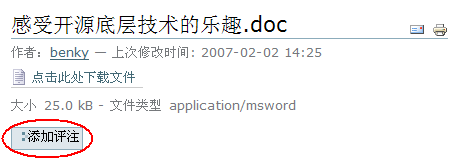

   图 6.19 允许匿名用户评论
   

用户管理文件夹
======================
在Plone控制面板中可以对用户和组的管理，那么Plone站点用户在内部是如何存储、管理、认证的呢？下面就来介绍Plone的用户管理文件夹。

有的Plone网站需要与其它系统的用户数据集成，他们根本不想把用户放在Plone默认存储的数据库中，比如希望让Plone站点与LDAP集成，与关系数据库用户集成等，Plone的用户管理文件夹可以实现这些。

认识用户管理文件夹
----------------------
进入站点的ZMI中，看到有一个acl_users的对象，如图6.20所示，Plone就是通过这个称之为用户管理文件夹的工具来存储和管理用户账号的。

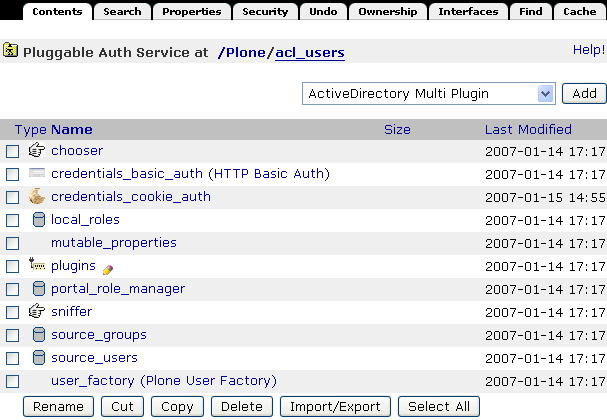

   图 6.20 用户管理文件夹

用户管理文件夹原理
--------------------
从Plone 2.5开始，Plone开始引入PlonePAS来进行用户管理。 PlonePAS 是一个全插件架构的用户文件夹，拥有大量的插件，能够灵活的设置认证、用户管理、用户属性管理、组管理、角色管理等各个环节，并可轻松扩展，满足个性化的用户管理需要。
使用相关的插件，可实现Plone和第三方的用户数据源的集成，实现多数据员认证，支持用户组的管理，也可在多个Plone站点之间共享数据源。 
PlonePAS底层采用Zope上的一个叫做PluggableAuthService的产品实现。

acl_users中除Plugins，其他对象都是用户管理文件夹都是插件，这些插件按不同类型的插件分类组成在用户管理文件夹，以下是这些插件简单说明。

.. csv-table:: 【表 6.2】  acl_users 工具中的对象
   :header: "对象", "用处" 

   "chooser", "选择对通过浏览器，FTP，WebDAV，及 XML-RPC（XML-RPC 是一套规范及其一系列的实现,允许运行在不同操作系统、不同环境的程序基于internet进行远程过程调用。）访问协议映射"
   "credentials_basic_auth", "设置通过HTTP认证的接口"
   "credentials_cookie_auth", "设置通过cookie认证的接口"
   "local_roles", "设置管理本地角色的接口"
   "mutable_properties", "设置管理存储在ZODB（Plone默认存储的数据库）中的用户属性"
   "portal_role_manager", "站点角色管理"
   "sniffer", "设置管理请求相关的接口"
   "source_groups", "站点组管理，存放在Plone默认数据库中的组"
   "source_users", "站点成员管理，存放在Plone默认数据库中的用户"
   "user_factory", "设置Plone用户工厂接口"

PlonePAS用户文件夹的核心对象是plugins对象，它是所有插件的一个注册表。在acl_users文件夹中，进入plugins对象，这是查看插件的管理器，在插件管理器中，可以查看各种的注册清单。plugins对象的Active标签页对插件清单做了分类。如图6.21（为了更容易理解这部分内容，下面是加了一个ldap_users插件的截图）。

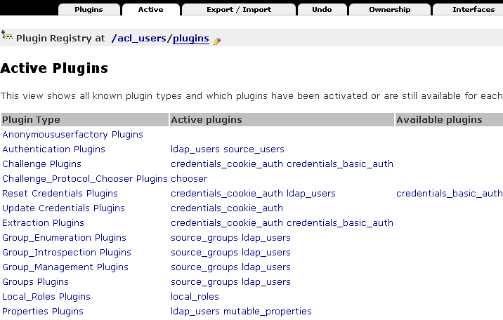

   图 6.21 注册插件清单表

正如前面所介绍的，所有的插件是按不同类型的插件分类组成在用户管理文件夹，下表6.3是插件分类说明。

.. csv-table:: 【表 6.3】插件分类说明
   :header: "插件", "说明" 

   "Anonymoususerfactory Plugins", "创建匿名用户插件"
   "Authentication Plugins", "认证插件，依赖提供的用户数据外部认证插件"
   "Challenge Plugins", "考查插件，用户信息认证时向用户发起考查"
   "Challenge_Protocol_Chooser Plugins", "协议选择器考查插件，它指定用户请求各种协议的认证；比如指定FTP，WebDav使用HTTP协议认证。"
   "Reset Credentials Plugins", "清除认证信息插件，响应用户的登出"
   "Update Credentials Plugins", "更新认证信息插件，响应用户更改认证信息"
   "Extraction Plugins", "萃取插件，从请求中提取可靠的认证信息"
   "Group_Enumeration Plugins", "用户组枚举插件，允许通过ID查询组"
   "Group_Introspection Plugins", "组自省插件，提供组和用户的列表"
   "Group_Management Plugins", "用户组管理插件，提供对组进行增、改、删和成员管理"
   "Groups Plugins", "组插件，确定用户属于哪个组"
   "Local_Roles Plugins", "本地角色插件，为本地角色定义了一些策略"
   "Properties Plugins", "属性插件，可产生用户一些信息"
   "Request_Type_Sniffer Plugins", "请求类型嗅探器插件，探测一个引入请求的类型"
   "Role_Assigner Plugins", "角色分配插件，允许PAS分配角色到相关人员"
   "Role_Enumeration Plugins", "角色枚举插件，允许通过ID查询角色"
   "Roles Plugins", "角色插件，确定一个用户拥有的全局角色"
   "Update Plugins", "更新插件，允许用户或应用程序更新用户属性"
   "User_Adder Plugins", "增加用户插件，允许PAS创建用户"
   "User_Enumeration Plugins", "用户枚举插件，允许通过ID查询用户，或搜索相匹配的详细信息"  
   "Userfactory Plugins", "创建用户"
   "User_Introspection Plugins", "用户自省插件，允许PAS提供用户的列表"
   "User_Management Plugins", "用户管理插件，允许PAS增、删、修改用户"
   "Validation Plugins", "确认插件，指定允许用户的属性值"

在这里很方便地看到各个插件的类型，同种功能插件的使用顺序，及可用到的插件等。
比如在上图中，同属于Authentication Plugins的插件有ldap_users和source_users，同属于Challenge Plugins的插件有credentials_cookie_auth和credentials_basic_auth。插件使用顺序在设置上也很重要，比如上图中的Authentication Plugins（认证插件），用户认证先使用ldap_users数据源，如果在这个数据源中没找到再到下一个source_users数据源中找。同样，你可以设置改变顺序，进入Authentication Plugins，如图6.22所示。

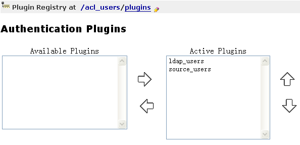

   图 6.22 改变同功能的插件使用顺序

在这里可以调整Authentication Plugins的两个插件ldap_users和source_users的使用优先级。如果不需要用到source_users数据源，将source_users从Active Plugins（当前活动的插件）移到Available Plugins（可用到的插件）区。这样就做到了只使用ldap_users数据源了。

在用户数据认证，有时候需要满足这样的要求：某个Plone站点之前使用的是存放在默认Plone数据库中的用户数据源source_users，现在想使用用户数据更全的LDAP数据源认证，并且以后从网站注册的用户都存放在LDAP数据源中，Plone原来的用户数据源source_users只提供用户数据认证。这样实现其实很简单，在source_users的Activate标签页中设置一下接口就行，只允许提供用户认证接口，如图6.23所示。

.. figure:: img/security/source_users.png
   :alt: source_users

   图 6.23 设置source_users数据源中的接口

所以在这里也了解到，要实现多个用户数据源的认证，首先要添加多个用户数据源，如上图6.16中添加了一个ldap_users的数据源，然后要设置认证的顺序，还需设置各个数据源中的认证的接口，根据具体的需求设置实现多个数据源认证。另外，实现数据源认证一般需要设置缓存加速，进入数据源ldap_users的Cache标签页设置缓存。 

第三方认证集成
================

LDAP集成
--------------
首先，确认已经建立好LDAP服务器，或某些使用LDAP协议（Lightweight Directory Access Protocol: 轻量级目录访问协议）的服务器，比如活动目录。下面的例子只介绍如何在Plone中与LDAP服务器集成。

与LDAP服务器集成需要安装以下几个产品扩展包：

- SimpleUserFolder：Zope的扩展包，将用户名和口令存放在Plone默认的数据库中，这个产品没有支持组的功能。

- LDAPUserFolder：Plone的扩展包，这个产品对Zope的用户文件夹重新定义，让Plone用户存储与LDAP服务器集成。如：活动目录、OpenLDAP。

- LDAPMultiPlugins：Plone的扩展包，这个产品提供PAS使用LDAP的插件。

这些都是Zope/Plone的产品，按照传统的安装方式将产品放到Plone实例的Products目录，重启服务即可，在ZMI的acl_users中可以看到可以添加ldap_multi_plugin插件，如图6.24。

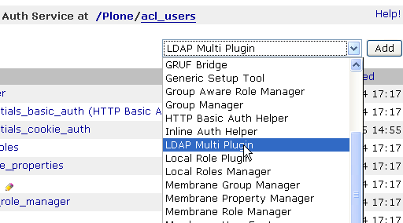

   图 6.24 提供集成LDAP的插件

在添加列表中有 ldap_multi_plugin ，现在添加这个插件，出现了配置LDAP的页面，如图6.25所示。

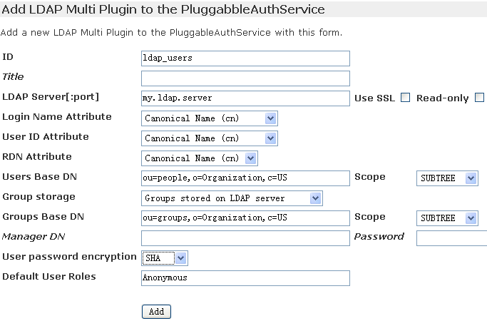

   图 6.25 配置LDAP
   
连接LDAP服务器，配置上图表单中的配置项，下表6.4中对配置LDAP的配置项做了具体说明。

.. csv-table:: 【表 6.4】 LDAP配置项说明
   :header: "配置项", "说明"
   
   "LDAP Server[:port]", "连接LDAP服务器"
   "Login Name Attribute", "用户的登录名，使用LDAP中匹配的字段"
   "User ID Attribute", "用于唯一认证用户的字段"
   "RDN Attribtues", "LDAP中的节点标识字段"
   "Users Base DN", "用户对应在LDAP服务器中的DN"
   "Group storage", "组是否存放在LDAP服务器中"
   "Group mapping", "组的映射方式"
   "Group Base DN", "组对应在LDAP服务器中的DN"
   "Manager DN", "管理人员对应在LDAP服务器中的DN"
   "User object classes", "用户的LDAP类型(用于在LDAP服务器中创建用户)"
   "User password encryption", "口令加密的方式"
   "Default User Roles", "登录后在Plone站点中将自动获得一个默认的系统角色"

这些配置项由LDAP服务器的管理员提供，配置好后，单击Apply Changes提交更改，这样就对配置集成LDAP服务器就完成了。配置表单存放在ldap_users 的Content标签页下的acl_users文件夹，可看到LDAP服务器已经连接上，如图6.26所示。

.. figure:: img/security/ldap_connect.png
 
   【图 6.26】连接LDAP服务器

下面需要设置已经配置好LDAP数据源的接口，返回acl_user目录，进入ldap_users，设置它提供的接口。如图6.27所示。

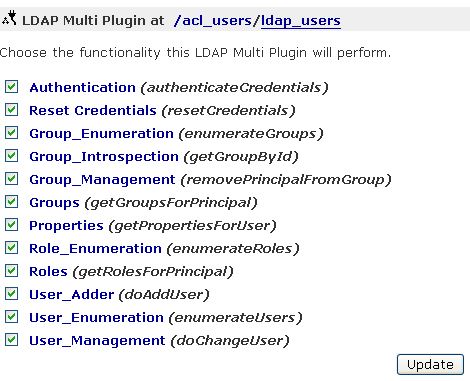

   图 6.27 设置LDAP数据源的接口

根据需求设置好接口后，单击Update按钮完成更改。

还需对认证LDAP数据源设置缓存加速。（关于这一步，LDAPMultiPlugins产品中的README.txt中写得很清楚，安装产品前看README是一个很好的习惯。）返回到acl_users目录，在下拉菜单中添加"RAM Cache Manager"，填入缓存设置的ID（例子中设置为auth_cache）配置缓存项，如图6.28所示。

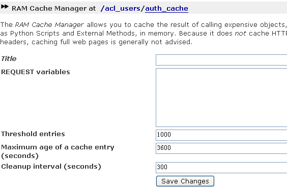

   图 6.28 配置缓存项

按照您的具体需要配置好后，单击Save Changes按钮，保存更改。返回acl_users目录，进入ldap_users的Cache标签页，设置ldap_users数据源的缓存使用的对象，即前面配置的缓存auth_cache。如图6.29所示。

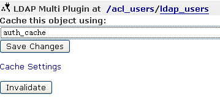

   图 6.29 对LDAP数据源使用缓存

设置好后，单击Save Changes按钮，保存更改。

按照需要在acl_users中调整数据源的认证顺序及其它设置，过后测试在站点页面中与关系数据库集成是否没问题，到这里，配置与LDAP服务器集成的工作就完成了。

关系数据库用户集成
--------------------
在第十四章的《访问关系数据库》的章节中详细介绍了Plone与关系数据库如何集成，在了解Plone是如何与关系数据库集成后设置与关系数据库用户集成就很方便了。

首先，在您的关系数据库中建立一个新的用户数据库有数据库，下面的例子用MySQL创建的一个数据库及数据库表。 

:: 

 # 建立user_database数据库
 create database user_database;

 # 在user_database数据库中建立users_table表
 create table user_database.users_table (
   username varchar primary key,
   full_name varchar,
   email varchar,
   password varchar
 ); 

在站点在ZMI根目录下建立一个与关系数据库的连接（查看《访问关系数据库》的章节了解如何建立让Plone站点连接关系数据库）。取连接数据库的接口ID为mysql_users_database，确保能与 MySQL数据库取得连接。

需要安装SQLPASPlugin扩展产品包，这是Plone针对PAS做的SQL的插件包，按照传统方式安装后，在acl_users目录中，右侧的下拉菜单中有会sql_user_manager插件，如下图6.30。

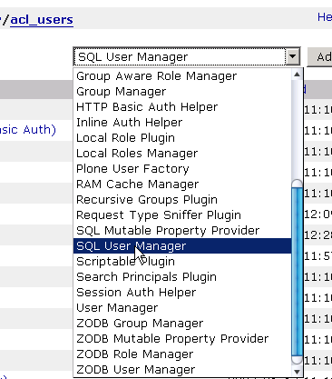

   图 6.30 sql_user_manager 插件

添加sql_user_manager插件项，出现下图的表单，取一个您想给予的Id,在Database Connection中就会有连接MySQL数据库的接口mysql_users_database，这正是前面配置的连接接口（您的站点中如果有多个，在这里可以选择其中的一个）。如图6.31所示。

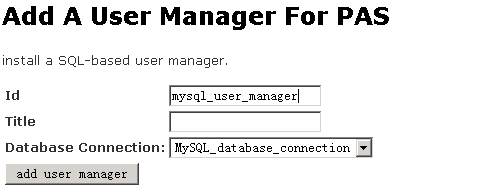
 
   图 6.31 添加sql_user_manager插件

填完表单后，单击add user manager按钮保存设置，在acl_users目录中就添加了一个连接关系数据库的数据源插件mysql_user_manager，下面需要对数据源进行配置，进入mysql_user_manager，设置它提供的接口，如图6.32所示。

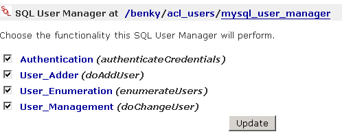

   图 6.32 设置SQL数据源接口

按照您的要求设置它提供认证、添加用户、列举用户、用户管理等接口，单击Update更改保存设置。进入mysql_user_manager的Properties标签页设置数据源的属性项，如图6.33所示。

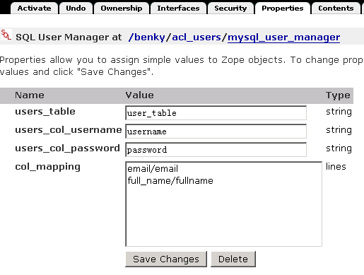

   图 6.33 设置SQL数据源的属性项

对应于在数据库中建立的表，依次在属性项中填入与数据库中表及表中字段映射关系，如下对应属性项内容。 ::

 users_table          :     user_talbe
 users_col_username   :     username
 users_col_password   :     password
 col_mapping          :     email/email
                            full_name/fullname 

设置好属性项后，单击Save Changes保存设置，这样就设置好了数据源的属性项了，下面需调整SQL数据源中的调整一些ZSQL方法，进入mysql_user_manager的Contents标签页，在这里面会看到sqlCreateUser，sqlLoadAllUsers, sqlLoadUser, sqlRemoveUser, sqlUpdateUser等默认的ZSQL方法，在这个页面中也可以添加新的ZSQL方法，下面需要对现有的ZSQL方法调整一下，让他们与属性项，与数据库字段对应。以sqlCreateUser为例，如图6.34所示。

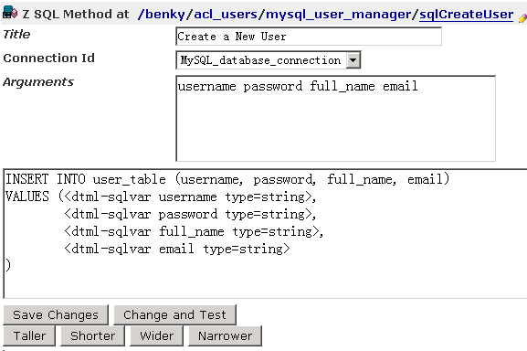

   图 6.34 调整ZSQL方法与属性项、与数据库字段对应

对sqlCreateUser的Arguments加入其它的字段，如上图6.28中所示，加上下面这些字段。 ::

 username password full_name email

对于sqlCreateUser写的ZSQL方法也需要调整，写ZSQL其实很简单，就是在SQL中加上DTML的语言，如下面的代码。 ::

 INSERT INTO user_table (username, password, full_name, email)
 VALUES (<dtml-sqlvar username type=string>,
        <dtml-sqlvar password type=string>,
        <dtml-sqlvar full_name type=string>,
        <dtml-sqlvar email type=string>
 )
     
这些是实现添加数据的功能，在页面下方操作按钮中的Change and Test 可以对ZSQL方法进行测试。依照这种方式更改其它ZSQL方法，确认每个使用到的ZSQL方法都能测试通过。

按照需要在acl_users中调整数据源的认证顺序及其它设置，过后测试在站点页面中与关系数据库集成是否没问题，到这里让Plone站点与关系数据库用户集成的设置工作就完成了。

小结
==============
用户和权限管理是学习Plone很重要的部分，本章讲述用户管理的相关概念，了解Plone中的用户，用户组，角色等概念，进一步介绍了在Plone中管理用户和组；本章在讲述权限管理中，先介绍常用的Plone权限设置，这是Plone中常用的权限设置工作，进而深入Zope中了解权限管理，以及介绍了几个在ZMI中设置的日常权限管理例子；本章还介绍了用户管理文件夹的使用原理，及讲述了与第三方认证集成，并通过实际操作与LDAP用户数据源集成，和与关系数据库用户集成。
