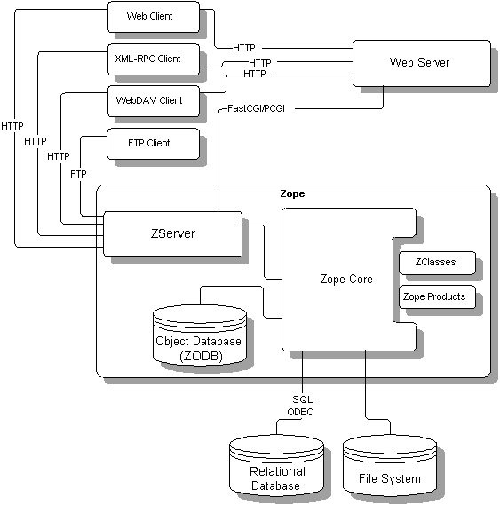
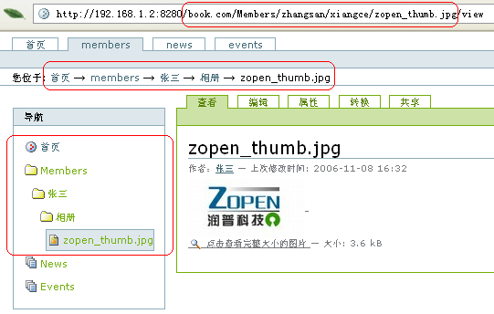
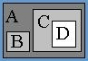

===================================================================
Zope对象发布原理
===================================================================

.. Contents::
.. sectnum::
   :prefix: 10.

从前几章，我们可以看到Plone内容管理系统的强大功能。Plone是架设在Zope web应用服务器之上的。
从本章开始，我们将逐步深入了解Zope/Plone各种开发技术。
本章是后续各章的基础，适合阅读人员包括Plone的脚本开发人员和扩展开发人员。

本章重点:

- Zope的对象发布过程
- 获取机制

Zope的内部架构
=====================
Zope是一个对象发布服务器，内部由多个组成模块，具体架构如图10.1所示。

   图 10.1 Zope组成架构图

上图中间的方框标识了Zope服务器的主要部件，上方是Zope和前端用户不同连接方式，下方是Zope其他的数据存储接口。分别说明如下。

Web服务器
----------------
Zope自带一个Web服务器，也可以和其他的web服务器(比如Apache)集成。

- ZServer：这是Zope内置的Web服务器，用于提供内容服务。这个web服务器还支持FTP、 WebDAV和XML-RPC等多种接口协议。

- Web Server（Web服务器）：Zope还可以和现有的Web Server结合在一起，比如Apache或者Microsoft IIS，以及其它支持通用网关接口（CGI）的Web服务器。

Zope Core（Zope核心）
----------------------------
这是Zope的核心引擎，它控制如何显示，以及控制管理界面和对象数据库。

数据的存储
-----------------
Zope的数据可存储在多种系统中。默认是存放在ZODB中，但也可存放在关系数据库中，或者文件系统中。

- Object Database（ZODB，对象数据库）：使用Zope的时候，大多数情况下是在处理存储在Zope对象数据库中的对象。ZODB是Zope/Plone的默认数据存储介质。

- Relational database（关系型数据库）：数据不一定要存储在Zope对象数据库中，Zope中可以使用其它的关系型数据库，比如 Oracle, PostgreSQL, Sybase, MySQL等等。

- File System（文件系统）：Zope还可以使用存储在服务器文件系统中的文档和其它文件。

Zope扩展组件
----------------
Zope提供2种方法来扩展Zope，增加有新特性的对象组件，他们是ZClass和Product:

- ZClasses：使用ZClass，可以通过使用Web管理界面来定义类，而不是采用传统的代码方式定义类。

  .. warning:: ZClass技术已经过时，Zope未来版本将会去除对ZClass的支持

- Products（插件产品）：Zope中还可以通过在Zope服务器中的文件系统里安装 *插件产品* 后，添加新的对象。

  .. hint:: Plone就是由Zope上的一组扩展插件产品组成，包括CMFPlone、Archetypes等.

Zope对象发布过程
============================
Plone上的所有内容、服务、逻辑，都是以对象的形式存放在Zope的对象数据库ZODB中。

Zope把对象输出到网络上，这就是所谓的 *对象发布* 。对象发布是Zope服务器请求处理一次服务的全过程:

#. 用户从浏览器、FTP客户端，或者xml-rpc程序中发起页面请求。请求的URL格式为：protocol://host:port/path?querystring， 比如::

    http://www.zope.org:8080/Resources?batch_start=100

#. Zope把URL分解成：主机、端口、路径和查询参数(分别是：``http://www.zope.org`` 、 ``8080`` 、 ``/Resources`` 和 ``?batch_start=100``)。

#. 根据路径(``/Resources``)，Zope服务器中的ZPublisher，会在ZODB对象数据库中定位到相关的对象

#. 传递参数(``?batch_start=100``)执行发布对象

#. 如果对象执行的结果返回数值，那么数值就被发送回浏览器。一般是返回 HTML，文件数据或图形数据。

#. 浏览器解释收到的数据并显示。

上述过程，可用下图表示::

  HTTP                  请求
       \  +---------+  request  +------------+ (对象漫游定位)  +----------+  (运行)
  FTP  -+-| ZServer |---------->| ZPublisher |---------------->| 发布对象 |---------> response
       /  +---------+           +------------+                 +----------+
  SOAP                  输入                                                            输出

``ZOPE`` 的命名，实际上是 *Z Object Publishing Environment* 的缩写。也就是说，Zope可理解为一个 *对象发布环境* 。

下面我们将逐步详细介绍Zope对象发布的全过程。

发起请求: 殊路同归
=================================
请求对象(request)：封装输入条件
------------------------------------
Zope服务器默认支持HTTP、WebDAV、xml-rpc等对外通讯接口，安装部分插件产品后，Zope还可能支持SOAP等其他的通讯接口。

不管采用那种方式发起请求，Zope内部的ZServer将各种请求统一封装为一个request对象。
ZServer负责处理各种协议的差异，Zope上运行的对象则只需知道request对象的接口即可。

request（请求）对象封装所有与当前请求有关的信息。这包括输入协议头、表单数据、服务器数据和cookies。

request对象是一种Python字典对象(dict)，表示了变量与值的映射集合。变量分成五个类别：

- Environment（环境变量）：这些变量包括输入报头、服务器数据和其它与请求有关的数据。变量名称符合CGI规范。

- Form（表单数据）：这些数据是从被编码的URL查询字符串或正文表单中提取的数据。Zope支持自动对表单数据进行类型转换，详细见下节。

- Cookies：这些数据是cookie数据。

- Lazy（惰性数据）：这些变量是可以调用运行(callable)的，他的值是对应的函数运行后的结果。Lazy数据可以延时到真正需要这个数据的时候，才把结果运算出来，这样可以避免不要的数据准备，提升性能。Lazy数据通过request.set_lazy(name,callable)，放入到在request变量中。

- Other（其它）：这些数据是可以由应用程序对象设置的数据。

request 对象可以像字典对象那样使用，其中，值按照以下顺序查找：环境变量，其它变量，表单数据，cookies。

参数转换(Marshall)
--------------------------------------
request请求中的表单数据(form)，默认是字符串类型。这样，在处理表单提交数据的时候，通常需要做一些类型转换的处理。
典型的，比如如果表单传入的是年龄信息，则在处理前需要做一个 ``字符串 -> 整数`` 的转换。

Zope为了简化表单数据的转换操作，提供了一套根据表单变量后缀来自动类型转换的机制，也就是所谓的 *表单变量Marshall* 。

比如，后缀 ``:int`` 表示转换为整型，后缀 ``:list`` 表示转换为列表类型。
这样，用户请求的链接可写为::

 http://localhost:8080/full/path/the_script?a:int=1&b:list=12&b:list=13

或者在html表单中，可使用类似的输入名字::

 <input name="a:int" />
 <input name="b:list" />
 <input name="b:list" />

上述请求提交后，Zope会对这些表单变量进行类型转换预处理，然后再存放到request对象的form类型的数据中。
这样，request变量中的a和b变量，就分别转换成了整数和列表类型::

 >>> request['a']
 1
 >>> request['b']
 ['12', '13']

Zope支持如下的类型转换后缀如下:

.. csv-table:: Zope请求参数转换后缀
   :header: "后缀", "说明"

   "boolean", "将变量转换为True或者False。如果变量是0、None、空的字符串或者空的序列，则转换为False，其他的都是True。"
   "int", "将变量转换为Python整数"
   "long", "将变量转换为Python长整数"
   "float", "将变量转换为Python的浮点数"
   "string", "将变量转换为Python字符串" 
   "required", "如果变量不存在或者是空的字符串，则抛出一个异常" 
   "ignore_empty", "如果变量是空的字符串，则从请求request变量中去除" 
   "date", "将字符串转换为DateTime对象。格式非常灵活，比如 ``10/16/2000, 12:01:13 pm``."
   "list", "将变量转换为Python值的列表(list)，即便只有一个值。"
   "tuple", "将变量转换为Python的元组(tuple)，即便只有一个值。"
   "lines", "将字符串转换为Python的字符串列表，根据回车来分割。"
   "tokens", "将一个字符串转换为Python的字符串列表，根据空格来分割。" 
   "text", "将一大段包括回车的文本转换为字符串。不同平台上的浏览器采用不同的方法对回车进行编码，这个方法能够让各个平台的回车编码保持一致。"

多个后缀可组合，比如 ``b:int:list=12&b:int:list=13`` 的输入，可将b转换为2个整数的列表，而不再是字符串的列表::

 >>> request['b']
 [12, 13]

点击表单不同的按钮，一般需要提交到不同的脚本处理。
同样的，Zope提供一种叫做方法参数(Mothed Argument)的特殊参数后缀: ``:method`` ，
来自动化处理脚本的跳转。比如如果有2个提交按钮::

 <input type="submit" name="cut_objects:methods" value="剪切" />
 <input type="submit" name="copy_objects:methods" value="复制" />

点击 *剪切* 将提交到 *cut_objects* 脚本处理，而点击 *复制* 将提交到 *copy_objects* 脚本去处理。
``:method`` 后缀相当于可以自动调整表单的action地址。

定位对象
=================
URL路径和对象位置的关系
-----------------------------------
Zope直接根据请求URL中的路径部分定位对象。

比如访问Plone站点中用户 张三 的个人文件夹下相册子文件夹中的图片，如图10.2所示。

   图 10.2 Plone中URL路径和对象位置的关系

我们看到，URL中的路径部分是::

 /book.com/Members/zhangsan/xiangce/zopen_thumb.jpg/view

根据这个路径，显示了一个包含照片的预览页面。从Plone的路径栏可看到图片位于网站的如下位置::

 首页   →   Members   →    张三   →    相册   →    zopen_thumb.jpg  

这个路径可分为2部分:

- ``/book.com/Members/zhangsan/xiangce/zopen_thumb.jpg``  ：这是图片各级父文件夹的ID组成的地址，其中book.com就是网站根，其他的路径是网站下的文件夹。
  这段路径根据文件夹包含关系逐级定位到了图片。

- ``/view``  ：这是图片自身的一个方法，这个方法将显示最终的页面。

路径漫游规则
------------------------
从上面的例子可以看到，根据URL中的路径部分可以定位到对象。事实上，使用路径来定位对象，是Zope中的一个通用的方法。
在后面的章节中，我们将学习到一种 *路径表达式* ，它是路径方式定位对象的最典型的应用。

Zope根据路径定位对象的时候，并非一次直接定位，而是从ZODB根节点开始，依次根据路径中的各个对象id，逐级询问定位到下一个对象，最终找到需要访问的对象。
比如，对于路径 ``/book.com/Members/zhangsan/xiangce/zopen_thumb.jpg`` ，Zope先向ZODB的根对象询问找到名字为 ``book.com`` 的Plone站点，
然后向这个站点询问找到名字为 ``Members`` 的个人区文件夹，然后向这个个人区文件夹询问找到名字为 ``xiangce`` 的相册文件夹，最后在相册文件夹中找到了我们需要定位的图片。

Zope根据路径逐级定位对象的过程，叫做 *漫游* (traverse)。

Zope根据路径名字定位下个对象的规则，可能存在多种变数，具体如下:

1. 如果对象定义了特殊方法： ``__bobo_traverse__`` ，则传入名字直接调用，返回的结果便是下个对象。

   .. hint:: Plone的皮肤中的元素位于 ``portal_skins`` 中，却能够直接在网站根下访问。之所以能够这样，就是因为对象定义了这个特殊方法。

2. 如果(1)不满足，但存在同名的属性，则直接返回该属性的值

   .. hint:: 在zope中，文件夹内的对象自动成为文件夹的属性，因此上节中的路径漫游实际上是依据这个规则。

3. 如果(2)不满足，但是对象支持字典方式(dict)访问，则返回key为该名字的value。

上述漫游规则是传统Zope 2的漫游规则。从Zope 2.8开始，Zope 2支持Zope 3漫游规则，也就是：可以通过ZCML来为对象定义view，提供对Zope 3 view的附加漫游。
Zope 3视图的介绍见后续章节。

当发布器在漫游过程中，从一个对象移动到另外一个对象时，它需要进行权限检查。
仅当用户认证有权限后，才能沿着发布路径走下去。

对象的获取 (Acquization)
-----------------------------
图10.3中，注意观察ZODB中对象A、B、C、D的包含关系。

   图 10.3 对象的包含关系示例

我们可以看到，对象D的路径应该是 ``/A/C/D`` ，而B对象位于 ``/A/B`` 。

Zope中的发布的对象，都支持 *获取* 特性，也就是说可直接使用漫游路径上级对象中的属性和方法。
在上图的例子中，对象D中并不包含对象B，但是由于路径 ``/A/C/D`` 中的A是包含了对象B的，因此使用下面的漫游路径也可定位到对象B::

   /A/C/D/B

获取技术通常有2个用途：

1. 将服务性质的公共对象放在上层，以便其他对象直接利用

   例如，从ZMI中，观察Plone网址根节点下的内容，可发现很多以 ``portal_`` 打头的工具对象。
   由于获取特性，所有这些对象就可直接被其他对象以属性的方式，直接访问。

2. 自动继承上层文件夹的属性设置

   例如，Plone站点的属性页面，有 ``left_slots`` 和 ``right_slots`` 这样的属性，用于放置面板宏。
   网站下的每个文件夹，也可设置自己特有的``left_slots`` 或 ``right_slots`` 。如果不设置，则自动获取网站根下的这2个属性。

在开发中，获取是大量被使用的，这个特性是zope的一个创新，它在实例这一级引入了对象属性的继承，大大的简化了开发。

获取过程是动态执行的，这使得代码编写非常灵活；
但与此同时，容易引起代码执行的不确定性。在Zope 3中，仅仅支持显式的调用获取(aq_aquire方法)。

发布对象
==================
通过对象漫游，定位到对象后，最终需要 *发布对象* 。
例如，漫游路径 ``/book.com/Members/zhangsan/xiangce/zopen_thumb.jpg/view`` 最终可得到view方法对象；
所谓发布view方法对象，这里也就是直接执行这个方法。

.. hint:: 在python中，对象的方法仍然是一个对象的，比如这里的view方法.

Zope对发布对象有一些限制。首先是对象必须有一个docstring，这个要求对方法对象同样有效(很多人对这个规则不解，Zope 3已经去除了这个限制)。
另外一个限制是对象的名字不能以下划线 ``_`` 起头，这是为了限制发布对象的私有方法。最后，发布的对象不能是Python的模块。

事实上，发布对象的时候可能有三种不同的执行方法:

1. 如果对象可调用，则直接接调用

   前面的例子就是遵循了这个规则

2. 如果对象不可调用，但是有名字为 ``index_html`` 的属性或者方法，则直接发布这个对象

   这样，如果文件夹下如果存在 ``index_html`` 的页面，则访问这个文件夹时，将直接显示这个页面了。
   这个 ``index_html`` ，也就是文件夹的默认页面，和通常的 ``index.html`` 是对等的。

   我们访问zope根的时候，会显示一个默认页面，而不是zope站点根文件夹，就是这个道理。

   .. hint:: index_html可采用获取的方式得到。

3. 如果1和2都不能满足，则直接转换为字符串输出

response对象：输出控制
===========================
发布对象后，需要把结果返回到调用端。

我们可以通过控制response对象来更好的控制输出，比如设置消息头等::

 response = context.REQUEST.RESPONSE
 # 跳转到另外一个页面
 response.redirect('http://google.com')
 # 设置消息头
 response.setHeader('Content-Type', 'text/plain')

小结
===========
本章了解了Zope对象的架构，了解了Zope对象发布的内在机理。
Zope在对象发布过程中，将请求信息封装到统一的request对象中，并根据路径逐级进行权限保护下的漫游，定位到最终对象，
并执行相关的方法，将结果返回到用户，可使用response对象对输出进行控制。

