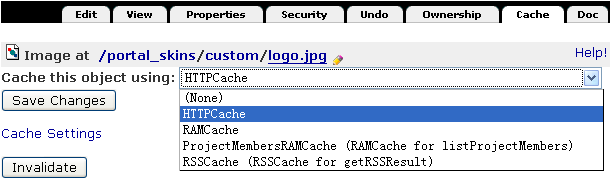
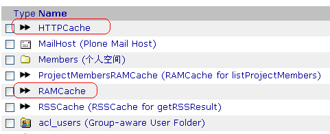
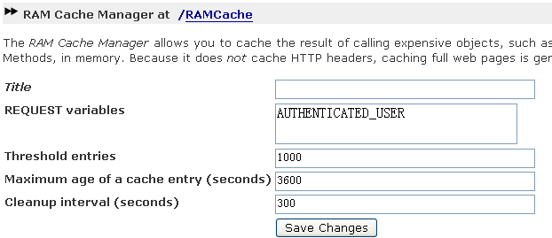
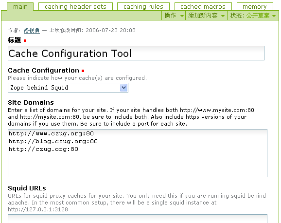
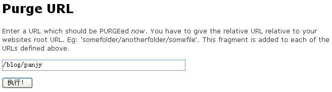

=============================
Plone站点缓存加速
=============================

.. Contents::
.. sectnum::
   :prefix: 9.

如果网站的访问量非常大，在直接使用Plone提供服务生成动态页面的情况下，网站页面打开会非常慢，用户体验不佳。

为了解决这个问题，从Plone2.5开始，Plone自带了一个叫做CacheFu的插件产品。
使用CacheFu，可通过内存、缓存代理服务器、浏览器多种缓存的组合，实现完成Plone站点的加速。
一旦配置完成，你的站点可提速近10倍；如果配合Squid，可提速近50倍。对于真正的大负载的Plone网站部署，都是需要采用CacheFu来进行网站加速的。

本章主要面向系统管理员，介绍如何利用CacheFu和Squid加速您的站点。本章学习重点：

- HTTP缓存协议和缓存原理
- CacheFu的缓存设置
- squid的设置和缓存清除

缓存加速原理
======================
基本原理
--------------
所谓缓存，是指将计算后的结果保存到内存或者硬盘，下次访问的时候，直接将保存的结果输出，从而避免重复计算导致服务器过载，同时也加快响应速度。

如果将需要网络传输的数据缓存，还可以起到减少网络流量，节省带宽耗用的作用。

同时，配置缓存的时候，需要考虑注意回避如下问题。这也是后面配置缓存时需要设法规避的。

- 缓存可能占用大量的内存、硬盘空间。我们需要权衡缓存生效的时间、保存的数量，避免缓存内容过大。

- 缓存可能带来过时的数据。一旦更新数据，需要刷新缓存。

Zope在数据存取的各个环节，均可设置缓存。

回顾: ZODB的缓存管理
----------------------------------------------
在ZODB一章中，我们介绍了ZEO缓存和ZODB的缓存，回顾如下：

- ZEO缓存：在zope.conf中的zeoclient中设置，表示对ZEO数据库的缓存。缓存保存在本地硬盘中，避免每次从远程ZEO服务器上读取对象。

- ZODB的缓存：在zope.conf的zodb_db中设置，表示内存中缓存的ZODB对象数量。缓存保存在内存中，可避免每次都从硬盘中读取。
  在ZMI中的Control_Panels中，可对ZODB缓存进行清除和分析。

Zope的缓存管理器
---------------------
zope提供了一个叫做Zope缓存管理器(CacheManager)可插拔的缓存框架。
你可编写一个缓存管理器，然后将支持缓存功能的Zope对象和这个缓存管理器绑定，就可以对这个对象进行缓存。

文件、图片、ZPT、DTML等对象都支持缓存管理。在ZMI中，有个 Cache 标签页用于设置缓存管理器。比如网站的logo图片 ``portal_skins/custom/logo.jpg`` 缓存设置界面如图9.1所示。

   图 9.1 对象的缓存管理器绑定

在上图中，下拉列表中的HTTPCache、RAMCache等，都是网站的一些缓存管理器，可选择一个，将对象的缓存管理委托给该管理器管理。

在Plone网站根的ZMI界面中，我们可以找到这些缓存管理器，典型如图9.2所示。

   图 9.2 Plone预装的几个缓存管理器对象

其中:

- RAMCache对象是一种叫做 RAM Cache Manager 的缓存管理器，它直接用服务器内存进行缓存结果。为避免内存耗用过多，RAMCache一般不适合缓存整个页面，而适合对脚本的中间的结算结果进行缓存。
- HTTPCache对象是一种叫做 Accelerated HTTP Cache Manager 的缓存管理器，它仅仅设置http的缓存消息头，不真正进行缓存，可和squid/apache这样的缓存服务器配合进行缓存。缓存服务器可将动态页面转换为静态页面缓存起来，再次访问的时候，将直接由代理服务器提供服务，从而提升性能，减少Zope的负担。

其中RAMCache缓存管理器的设置界面如图9.3所示。

   图 9.3 RAMCache内存缓存管理器的设置

其中：

- REQUEST variables: request变量中会对结果有影响的参数。根据这个参数的不同，缓存管理器会保留多个结果版本。图中设置AUTHENTICATED_USER，表示系统会为每个登录用户保留一份缓存。
- Threshold entires: 最多保留多少份缓存数据。这个可避免缓存数量逐步增加，导致内存不够用的情况发生。
- Maximum age of a cache entry (seconds): 每个缓存的最大存活时间。及时的让缓存失效，可减少数据过时的机会。
- Cleanup interval (seconds): 数据清理周期时间。定期对数据进行清理。

CacheFu的缓存框架
------------------------
网站的内容非常多。Zope默认的缓存管理，仅仅能够对内容逐一进行内容的关联，而且操作界面不友好。

针对这一问题，Plone 2.5提供了一个叫做CacheFu的缓存框架，构建了一个基于规则的缓存策略，分离了缓存的条件、缓存方法、缓存消息头，同时提供了一个友好的缓存管理界面。

在内部实现上，CacheFu提供了几个新的缓存管理器:

- Page Cache Manager：类似RAM Cache Manager, 同时将响应消息头也保存了，适合对某些页面进行缓存。
- Policy HTTP Cache Manager：基于策略的HTTP缓存管理器，具体的缓存消息头设置是由Cache在Plone的控制面板中设置的，在后面章节中，我们会详细介绍。

HTTP协议的缓存
=========================
浏览网页采用的是HTTP协议实现浏览器和服务器的通讯。HTTP协议中包括了完整的缓存管理规范。

缓存部件
----------------------
用户通过浏览器来访问Plone服务器的时候，中间可能经过浏览器和缓存服务器，如下结构图所示::

  +------------+   +---------------------+   +--------------------+
  | Zope/Plone |<--| Squid缓存代理服务器 |<--| 浏览器(FireFox/IE) |<---用户
  +------------+   +---------------------+   +--------------------+
                           |                           |
                           V                           V
                     /-------------\            /--------------\
                     | Proxy Cache |            | Brower Cache |
                     \-------------/            \--------------/

这里，浏览器和缓存服务器都能提供缓存功能:

- 浏览器：一般浏览器都可以进行缓存。浏览器根据接收页面的http消息头中缓存设置信息进行缓存。浏览器一般都有清除缓存的功能。

- Squid/Apache缓存服务器proxy：缓存服务器，Squid更加专业。缓存服务器位于浏览器和，web服务器之间。缓存服务器根据http部分消息头进行缓存。

  web服务器可发送purge指令到缓存服务器，清除过时的缓存。

  Squid支持多个缓存服务器树状阵列，缓存服务器之间通过ICP协议进行缓存信息交换。
  如果在zope.conf中开启icp服务器，则Zope可设置为squid的上级缓存服务器，让squid在多个zope服务器之间负载均衡。

观察HTTP消息头
----------------------
HTTP协议包括消息头和消息体。HTTP缓存消息头可控制网页何时、在哪里缓存。

在Linux下，可用 ``wget -d`` ，查看完整的HTTP请求和响应消息头。比如查看访问plone.org首页时的消息头如下::

 $ wget -d http://plone.org/

 [省略前面输出...]
 ---request begin---
 GET / HTTP/1.0
 User-Agent: Wget/1.10.2
 Accept: */*
 Host: plone.org
 Connection: Keep-Alive

 ---request end---
 HTTP request sent, awaiting response...
 ---response begin---
 HTTP/1.0 200 OK
 Server: Zope/(Zope 2.8.7-final, python 2.3.5, linux2) ZServer/1.1 Plone/2.1.5 (SVN/UNRELEASED)
 Date: Mon, 11 Dec 2006 03:40:24 GMT
 X-Pagecache: HIT
 Content-Length: 43524
 Content-Language: en
 Expires: Fri, 13 Dec 1996 03:39:58 GMT
 Vary: Accept-Encoding
 ETag: ||Plone Default|0|652025|False|||||323835
 X-Caching-Rule-Id: plone-containers
 Cache-Control: max-age=0, s-maxage=0, private, must-revalidate
 Content-Type: text/html;charset=utf-8
 X-Header-Set-Id: cache-in-memory
 X-Cache: MISS from plone.org
 X-Cache-Lookup: MISS from plone.org:80
 Connection: keep-alive

 ---response end---
 [省略后面的输出...]

在response部分，可看到很多消息头，后面将逐一介绍。

另外，firefox浏览器提供了一个LiveHTTPHeaders插件(http://livehttpheaders.mozdev.org/)，使用它可在加载页面的时候，观察完整http消息头。

安装后，从 ``工具`` 菜单中打开 ``Live HTTP headers`` 窗口，访问某个页面，观察http消息头，如图9.4所示。

.. figure:: img/cache/live-http-headers.png

   图 9.4 Firefox插件LiveHTTPHeaders的消息头监视窗口

一般页面包括各种图片、css、flash等，对于外部的门户级别网站，所有这些内容一般都需要进行缓存。
可利用LiveHTTPHeader插件，可逐一检查是否有遗漏的元素没有缓存。

标准的缓存消息头
------------------------------
Vary, Etag, Cache-Control, Age是标准的缓存消息头，用于控制内容的缓存策略。
Plone提供了对这些消息头的控制方法。
如果HTTP消息头中出现这些，表示服务器缓存机制在生效了。

Cache-Control消息头
......................
Cache-Control 是HTTP协议中主要的缓存控制参数。在上面访问Plone网站首页的输出中，我们看到::

   Cache-Control: max-age=0, s-maxage=0, private, must-revalidate

Cache-Control消息头可包括一组控制变量，具体包括：

* max-age：这个参数告诉浏览器将页面缓存多长时间，超过这个时间后才再次向服务器发起请求检查页面是否有更新。对于静态的页面，比如图片、CSS、Javascript，一般都不大变更，因此通常我们将存储这些内容的时间设置为较长的时间，这样浏览器会不会向浏览器反复发起请求，也不会去检查是否更新了。

* s-maxage：这个参数告诉缓存服务器(proxy，如Squid)的缓存页面的时间。如果不单独指定，缓存服务器将使用max-age。对于动态内容(比如文档的查看页面)，我们可告诉浏览器很快就过时了(max-age=0)，并告诉缓存服务器(Squid)保留内容一段时间(比如，s-maxage=7200)。一旦我们更新文档，我们将告诉Squid清除老的缓存版本。

* must-revalidate：这告诉浏览器，一旦缓存的内容过期，一定要向服务器询问是否有新版本。

* proxy-revalidate：proxy上的缓存一旦过期，一定要向服务器询问是否有新版本。

* no-cache：不做缓存。
* no-store：数据不在硬盘中临时保存，这对需要保密的内容比较重要。

* public：告诉缓存服务器, 即便是对于不该缓存的内容也缓存起来，比如当用户已经认证的时候。所有的静态内容(图片、Javascript、CSS等)应该是public的。

* private：告诉proxy不要缓存，但是浏览器可使用private cache进行缓存。一般登录后的个性化页面是private的。

* no-transform: 告诉proxy不进行转换，比如告诉手机浏览器不要下载某些图片。
* pre-check/post-check：微软的特殊扩展，一般需要关闭： ``pre-check=0, post-check=0`` 。

条件请求和浏览器缓存
.........................
当浏览器首次发起页面请求，HTTP请求如下::

  GET /some/page/on/the/site

当服务器响应的时候，会同时发送一些有用的信息，比如上次对象修改的时间和
一个ETag标签(可选)。浏览器在后续请求发起时，会利用这些信息。

当再次访问这个网页，浏览器先检查Cache-Control消息头中的max-age参数，
看保留的页面是否过期了。如果没有max-age参数，则检查Expire消息头。
如果页面没有过期，则直接调出浏览器缓存的页面。如果页面过期了，浏览器会向web服务器发送一个条件GET请求，而不是普通的GET请求。条件GET请求如下::

  GET /some/page/on/the/site
  If-Modified-Since: [浏览器缓存中页面的上次修改时间]
  If-None-Match: [浏览器缓存中页面的ETag时间]

服务器可以有2个选择：它可以象一般的GET请求那样响应，返回一个 ``Status: 200`` (成功)的消息头。
它也可以更聪明些，它可以检查一下用户所缓存的时间和Etag标签，
看用户浏览器所保存的页面和服务器将要提供的页面是否相同。如果相同，
它可发送一个消息头为 ``Status: 304`` (没有更改)的空页面。

这样，服务器不必生成完整的页面，因此服务器负载大大降低；
同时由于也不必发送完整的页面，带宽耗用也减少了；而用户，也得到了来自服务器的
更快的响应速度。

ETag标签
.............
前面关于缓存的讨论，都是基于时间的缓存。在基于时间的缓存中，服务器发送了
Last-Modified 、 Expires 和 Cache-Control: max-age 消息头。
浏览器在缓存过期的时候，才向服务器发送GET请求，并提供一个 If-Modified-Since 的
消息头。这种缓存对于需要针对登录用户个性化的页面是不适合的，因为浏览器无法告诉服务器
是在匿名方式访问还是登录后的个性化访问，或者是采用不同用户登录的页面。
为了缓存个性化的页面，我们需要更多的信息。

ETag标签实际上是服务器标记页面版本的一个任意字符串，用于确定内容是否最新。
浏览器可比较自己的缓存页面的ETag和服务器的最新ETag，如果相同则表示缓存页面是最新的了。

ETag是浏览器用来缓存个性化页面的，其核心是一个ETag的生成器。ETag一般和这些因素有关系:

1. 内容变更的时间
2. 用户信息的变化(比如登录与否，或者更换了登录用户，因此需要显示新的个性化页面)

这样ETag标签可以由如下信息组成:

当前登录的用户名 + 分隔号 + 页面的修改时间 + 分隔号 + 所在的整点时间

这样，标记的第一段保证用户登出或者更换的时候，ETag会发生变化；第二段确保内容修改的时候，ETag发生变化；第三段让内容在1小时内失效。

Vary
.............
表示需要根据某个参数，为某个地址缓存多个变种。比如多种不同的语言缓存不同的内容，需要设置 Accept-Language 。

扩展的缓存消息头
---------------------------
这些扩展的缓存消息头一般是用于缓存调试，用于告知缓存服务器的工作情况。

- X-Cache：这是squid附加的。如果HIT，表示命中Squid缓存；MISS表示在Squid缓存中不存在。

- X-Caching-Rule-Id：这是CacheFu增加的，表示使用了哪

个缓存规则. 可在cachefu的设置面板中找到id为 plone-composite-content-types 的规则。

- X-Header-set-Id：这是Cachefu增加的，表示具体采用了哪个缓存消息头集合。在cachefu设置面板中可找到对应的消息头集合。

CacheFu安装配置
============================
CacheFu是一组产品，其核心是CacheSetup产品，另外包括CMFSquidTool、PolicyHTTPCacheManager、PageCacheManager等Plone产品，还包括squid的配置生成脚本。

CacheFu支持如下几种缓存架构:

- 独立的Zope，没有专门的缓存服务器
- 将Zope放在Apache后面，Apache可提供简单的缓存服务
- 将Zope放在Squid缓存服务器后面
- 将Zope放在Squid缓存服务器后面，再把Squid放在Apache后面。这种架构可利用Apache的强大web功能

CacheFu安装方法
-----------------------
CacheFu安装方法如下:

1. 停止 Zope 服务器
2. 将CacheSetup、PageCacheManager、CMFSquidTool、PolicyHTTPCacheManager拷贝到
   产品安装目录中。(它们在产品CacheFu目录中，不必拷贝MemcachedManager，这个产品还不成熟)
3. 启动Zope服务器
4. 在Plone的网站设置中，安装CacheSetup产品。(不必安装其他的CacheFu产品)

和Squid集成
----------------
Squid(http://squid-cache.org)是一个成熟的缓存服务器。
Squid一般在linux/unix服务器上，Squid的配置文件比较难于编写。

CacheFu提供了一个脚本，可自动生成一套squid的配置文件，该脚本位于 ``CacheFu/squid`` 文件夹中。

1. 设置 ``squid.cfg`` 配置文件，这个文件中包含了用于squid配置文件生成的基本信息。

   squid.cfg包括一组参数，根据squid.cfg中的提示注释填写。其中包括：

   
   .. csv-table:: 【表 9.1】 squid.cfg的参数说明
      :header: "参数", "说明"  

      "direct", "如果直接采用squid来提供服务，填写True；如果squid架在Apache后，填写False。"
      "port", "squid的端口，如果squid在apache后面，这里填写squid的端口。"
   
   最后的 ``[accelerated-hosts]`` 节是域名和Plone内部站点的映射，需要根据自己的情况重新填写，比如 ``www.mysite.com: 127.0.0.1:8080/mysite`` 表示访问站点www.mysite.com时候，转向到本机8080端口的Zope实例上的名字为mysite的Plone站点。

2. 生成配置文件::

    export PYTHONPATH=$PYTHONPATH:/opt/Zope-2.8/lib/python
    python squid/makeconfig.py

3. 运行 ``squid/deploy`` 脚本部署

   这时候，会自动部署一组配置和脚本文件，根据需求和手工修改。下表 9.2 是配置和脚本文件的文件说明。

   .. csv-table:: 【表 9.2】 配置和脚本文件的文件说明
      :header: "配置和脚本文件的文件名", "说明"  

      "squid.conf", "squid的主配置文件。可参考squid手册，对这个文件细化调整。"
      "iRedirector.py", "转向器，此文件一般不需要调整，它和squidRewriteRules.py配合使用。"
      "squidRewriteRules.py", "转向规则，此文件可能需要调整。"
      "squidAcl.py", "用于测试某个请求是否由登录用户发起(这样不应该缓存)，或者是一个带有 If-None_Match 消息头的条件GET请求(这个不应该由Squid服务)。"

采用自动脚本生成的squid配置文件，能够满足大多数情况的需求。
如果网站的负载量非常大，采用了ZEO的架构进行多机负载均衡，
此时可将Zope配置成squid的上级缓存服务器，利用squid作为统一的前端实现负载均衡。

具体操作步骤为:

1. 生成配置文件的时候，采用backendpool作为squid.cfg文件中的映射目标主机，比如::

    www.czug.org: backendpool/czug

#. 调整zope实例的zope.conf配置文件，开启ICP服务。取消文件中相关注释行即可::

     <icp-server>
       # valid key is "address"
       address 888
     </icp-server>

#. 调整生成的suqid.conf文件中的 ``CACHE PEERS`` 节的配置，典型如下::

    acl in_backendpool dstdomain backendpool
    cache_peer 127.0.0.1 parent 8280 1088 no-digest no-netdb-exchange
    cache_peer localhost parent 8180 988 no-digest no-netdb-exchange

    cache_peer_access 127.0.0.1 allow in_backendpool
    cache_peer_access 127.0.0.1 deny all

    cache_peer_access localhost allow in_backendpool
    cache_peer_access localhost deny all

    acl local_servers dstdomain 127.0.0.1
    always_direct allow local_servers

    never_direct allow all
    icp_access allow all

    httpd_accel_with_proxy on

和Apache集成
-------------------------
Apache在各种平台上被广泛使用，也可以提供简单的缓存功能。

首先需要确保相关模块加载，在httpd.conf中，需要包含如下加载语句::

 LoadModule rewrite_module modules/mod_rewrite.so
 LoadModule proxy_module modules/mod_proxy.so
 LoadModule proxy_http_module modules/mod_proxy_http.so
 LoadModule cache_module modules/mod_cache.so
 LoadModule disk_cache_module modules/mod_disk_cache.so

接下来，在httpd.conf的末尾，需要设置虚拟主机(假定网站域名为www.mysite.com，Plone站点位于zope根，且id为site_id，zope端口为8080)::

 <Proxy *>
       Order deny,allow
       # Deny from all  # 可注释此行
       # Allow from .mysite.com
 </Proxy>

 NameVirtualHost *:80
 <VirtualHost *:80>
  ServerName www.mysite.com

  CacheRoot proxy
  CacheEnable disk /
  CacheDirLevels 5
  CacheDirLength 3

  RewriteEngine on
  RewriteMap servers rnd:map.txt
  RewriteRule ^/(.*) http://127.0.0.1:8080/VirtualHostBase/http/www.mysite.com:80/site_id/VirtualHostRoot/$1 [L,P]

  ErrorLog logs/ekp-error.log
  CustomLog logs/ekp-access.log combined
 </VirtualHost>

如果需要支持多机负载均衡的话，可利用Apache的RewriteMap来创建一个服务器缓冲池，详细参考Apache的配置手册。

CacheFu缓存配置
-----------------------
网站管理员进入Plone 【网站设置】 页面 ，单击 Cache Configuration Tool 配置项， 开始站点CachFu缓存设置。

这个页面，包括5个子标签。如图9.5所示。

   图 9.5 CacheFu设置界面

主标签页(main)
.................
这里是几个基本的缓存参数。见下表 9.3 。

.. csv-table:: 【表 9.3】 缓存参数设置
   :header: "缓存参数", "说明" 

   "Cache Configuration", "缓存系统的架构模型，Zope/Squid/Apache的部署位置关系。"
   "Site Domains", "用于缓存清理，属于CMFSquidTool的参数。"
   "Squid URLs", "对于squid behind apache的情况下，squid服务器的url，用于squid缓存自动清理。"
   "compression", "是否对页面进行压缩后传输。"
   "var header", "输出http的var消息头时，应该输出什么？也就是每个页面的缓存，将根据那些参数保留保留多个版本。"
   "enable macro caching", "是否对宏进行缓存，后面有专门的 cached macros 页面可以进行更多的设置。目前此特性不成熟，暂不建议启用。"

缓存消息头组合(caching headers sets)
.............................................
预先定义的一组HTTP缓存消息头设置，定义了页面缓存的常用设置。
供 caching rules 中的缓存规则选用。默认包括下表 9.4 中规则选用。

.. csv-table:: 【表 9.4】缓存规则选用说明
   :header: "规则选用", "说明"  

   "Do not cache", "不缓存"
   "Cache with ETag", "使用ETag机制缓存，不在proxy中缓存。Squid不支持处理ETag请求，ETag请求用于控制浏览器缓存。Etag适合登录用户情况下的缓存管理"
   "Cache file with Last-Modified", "也不在proxy中缓存，使用上次修改时间进行缓存"
   "Cache in proxy cache for 1 hour", "在proxy中缓存1小时，在浏览器中不缓存"
   "Cache in proxy cache for 24 hours", "在proxy中缓存24小时，在浏览器中不缓存"
   "Cache in browser for 1 hour", "在浏览器和proxy中缓存1小时"
   "Cache in browser for 24 hours", "在浏览器和服务器中缓存24小时"
   "Cache in browser forever", "在浏览器和proxy中缓存1年"

缓存规则(caching rules)
............................
一组缓存规则，这里是HTTP缓存设置的最主要的页面。默认包括下表 9.5 规则。

.. csv-table:: 【表 9.5】 caching rules 中的缓存规则
   :header: "缓存规则", "说明"  
 
   "HTTPCache", "用于和HTTPCache关联的内容的缓存设置，主要针对是皮肤中的图片。无论登录与否，均在浏览器上缓存24小时。"
   "Content", "页面型内容(非下载文件)的缓存设置。匿名用户在代理服务器中缓存24小时，登录用户采用Etag在浏览器上缓存。"
   "Container", "文件夹类型内容的缓存设置。匿名用户在代理服务器中缓存1小时，登录用户不做缓存。"
   "Templates", "系统和内容无关的一些综合性动态页面，比如站点地图等。不论登录与否，均采用Etag在浏览器上缓存。"
   "CSS & JS", "ResoruceRegistry中的CSS文件和JS文件。这个跟进portal_javascript和portal_css中的设置决定。"
   "File & Image", "网站的图片和文件，这些图片和文件必须是ATFile/ATImage。如果匿名用户有权限查看，就缓存在浏览器中缓存24小时，否则就不缓存。"

每个规则包括2部分:

1. 适用条件，见下表 9.6 。
   
   .. csv-table:: 【表 9.6】 缓存规则的适用条件
      :header: "属性", "说明"  

      "CacheManager", "使用的CacheManager, 每个可缓存的对象都和一个Cache Manager关联，这二者应该一致。"
      "Types", "缓存对象的内容类型"
      "Ids", "缓存对象的id"
      "Cache Preventing Request Values", "如果URL中哪些参数，就不做缓存了"
      "Predicate", "条件表达式，可用的变量包括request, object, view (当前模板的ID), member(匿名为None)"

2. 消息头设置，见下表 9.7 。 
   
   .. csv-table:: 【表 9.7】 缓存规则的消息头设置
      :header: "属性", "说明"  

      "Header Set for Anonymous Users", "匿名用户的消息头"
      "Header Set for Authenticated Users", "认证用户的消息头"
      "Header Set Expression", "动态消息头表达式"
      "Last-Modified Expression", "设置last-modified消息头，还可用time变量（当前时间）"
      "Vary Expression", "var参数表达式"

对宏缓存(cached macros)
.......................
对ZPT中的宏进行缓存，此特性目前不成熟，建议暂不使用。

对页面缓存(page cache)
.................................
使用内存缓存页面，此特性似乎不成熟，建议暂时关闭(turn off).

清除Squid缓存
=====================
如果缓存过时，则需要清除缓存。几种清除squid缓存的方法：

最原始的telnet
--------------------
用telnet来手工做，依据协议来，最简单也最有效::

 $ telnet localhost 80

 PURGE http://www.mysite.com/path/to/your/page HTTP/1.1
 Accept: */*

CMFSquidTool
-----------------------------
安装CMFSquidTool后，如果内容页面一旦修改，会自动给squid发送相应的purge目录，实现缓存的自动更新。

对于查询结果、内容面板等综合页面，在ZMI->portal_squid界面中的purge url表单中手动清除，如图9.6所示。

   【图9.6】portal_squid清除缓存

.. 
 注意：必须调整CMFSquidToool, 使用python 2.4的putrequest方法的skip_accept_encoding的参数，才能支持purge::

  import httplib
  conn = httplib.HTTPConnection('localhost', 80)
  # 看到更多debug信息，了解消息往来情况
  conn.set_debuglevel(1)
  conn.connect()
  # 必须包括skip_accept_encoding的参数，否则如果缓存的页面的变种(Var)如果和这个参数有关系，就不可行了!
  # 这也是当前CMFSquidTool的一个bug
  conn.putrequest('PURGE', 'http://www.mysite.com/path/to/your/page', skip_accept_encoding=1)
  conn.endheaders()
  # 看看返回结果
  conn.getresponse().status

使用squidpurge工具
-------------------------------
squidpurge的网站在这里：http://www.wa.apana.org.au/~dean/squidpurge/

它的功能非常强，可直接查看所有的缓存情况::

 purge -e .

清除所有的mp3::

 purge -p localhost:<port> -P 1 -se '\.mp3$'

注意，这个工具也不能清除对Accepted Encoding进行变种缓存的页面。必须采用前面2种方法。

清除所有的缓存
----------------------
一般不推荐清除所有缓存，清除缓存会在一段时间内降低服务器的访问性能。可采用上面的squidpurge，有选择的批量清除。

如果一定需要，可采用如下方法::

  squid -k shutdown
  cd /usr/local/squid/var
  mv cache oldcache
  mkdir cache
  chown proxy:proxy cache
  squid -z
  squid -s
  rm -rf oldcache & 

小结
=============
在系统的各个环节中均可通过缓存来加速。CacheFu在Plone中提供了一个友好的设置界面，
可通过一组HTTP协议的缓存消息头规则，实现缓存的精细控制。CacheFu和Squid能实现紧密的集成，它不仅提供了简化配置工具，也提供了自动和手动的缓存清理工具。
CacheFu也提供一些实验性的通过内存来加速的Plone模版页面和宏的工具。

