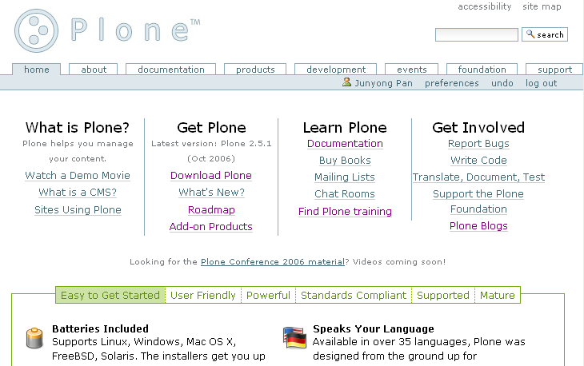

==================================================
介绍Plone
==================================================

.. sectnum::
   :prefix: 1.

本书是一本介绍Plone内容管理系统的书籍，本章对Plone进行基本的介绍。

本章重点:

- 内容管理系统功能
- Plone的主要功用和特性
- 本书的读者群

什么是内容管理
====================
网络技术的发展，让网站成为最主要的信息传播的主要工具。
政府使用网站发布政策、公告，实现电子政务；
各种协会、非赢利组织，需要通过网站，将分散在各地的成员形成一个虚拟的电子社区；
企业内部需要构建内部门户，发布信息，构建工作平台；
每个企业，也需要通过外部网，构建企业的网络形象，提供客户服务。
形形色色的各种网站不断出现，我们每天需要接触各种网站。
这要求我们能够更方便地更新管理网站的内容，能够确保网站内容的安全性，更好的获取网站的内容。

网站的发展经历了静态网站、动态网站和内容管理系统(CMS: Content Management System)三个阶段。
最早期的网站，都是由专业技术人员采用静态的HTML制作。静态网站的内容和外观绑定，修改维护非常不方便。
因此，这些网站经常处于年久失修的状态：网站内容数量少，内容很少更新，界面不统一，常有死链接出现。
动态网站是那些采用ASP、PHP、JSP等技术定制的网站。
动态网站能够将内容和外观分离，通常有比较友好的内容提交界面。
但是这种网站由于专门开发，因此存在费用较高、功能有限、扩展不方便、数据难以和其它系统集成等问题，而且难以跟近最新的Web技术。
随着动态网站的发展，最后产生了用于网站制作和管理的专业内容管理软件。
它们支持皮肤、流程、权限、插件扩展等高级的技术，可在各种应用环境下使用，而且能够提供标准的数据交换的接口。

内容管理系统的不断发展，开始逐步从单纯的网站内容管理(如网页、图片等)，
过渡到文档管理、媒体资源管理(比如音频、视频等)等多个领域，内容管理所涉及的领域逐步扩大。
特别是随着企业内容管理(ECM: Enterprise Content Management)概念的提出，
内容管理和企业业务结合日益紧密，内容管理系统越来越成为支撑企业运转的核心管理软件之一了。

然而，内容管理系统(CMS)的定义并不明确，一般可认为是在协同环境下管理非结构化数据的系统。
内容管理系统所管理的内容是指的非结构化的信息，比如文件、档案、图形、影像、 Web网页、资料库表格、声音、视讯等；
对内容的管理操作，包括收集、切割、分类、权限、审核、转换、公布、更新、删除、储存、版本控制、版权宣告等，目的是使内容可以最正确、最及时的传递给适当的人。

Plone是什么
=======================
Plone是一个屡获大奖的专业内容管理系统。
InfomationWeek杂志称Plone是一个 “世界级的内容管理系统”；
eWeek杂志2006年4月刊中，评定Plone是eWeek杂志研究室分析员推荐奖获得者，它是公司门户和内部网的最佳解决方案之一。

更加重要的是，Plone是一个开放源代码(opensource)软件，它使用GPL协议授权。
这意味着，你可免费得到这个软件，包括全部的源代码，并可以自由的修改和再发布。
Plone的全部知识产权和商标，由非赢利的、社区控制的Plone基金会拥有和保护，自由软件法律中心的专家也为Plone提供法律支持。

作为一个通用的内容管理系统，Plone可用于传统的网站内容管理，如建立各种门户网站、公司内外网等；也可在企业内容管理领域使用，比如用作文档管理、知识管理、群件系统等；Plone更可作为一个应用开发的平台，可基于Plone，快速开发个性化的应用。

Plone发展很快。它的第一个公开版本发布于2001年10月，目前(2006年12月)的最新版本是Plone 2.5版。
Plone由全世界数百个开发人员在技术社区协同开发，一般每年发布2个大的版本。
全世界数百个公司可以提供Plone的商业支持服务。

Plone拥有大量的在线文档可供查阅，活跃的技术讨论邮件列表和聊天室，Plone的用户可轻松寻求帮助。
目前，有五本关于Plone的出版书籍，且被翻译成德语、日语和其它的一些语言。

一些大的组织机构，包括NASA, Oxfam, eBay, Trolltech, Nokia, Utah State University, Creative Commons和Wolford，他们都使用Plone作为内容管理。
在国内，网易、上海航空公司等都在使用Plone.

Plone的官方网站是: http://plone.org. 在那里，你可以下载插件产品、阅读在线文档、了解Plone发展的动态。plone.org的首页如图1.1所示。

   【图1.1】 Plone官方网站

内容管理系统的功能
=============================
内容管理系统一般都需要提供如下功能，Plone也不例外：

1. 分离页面中的内容和展现部分

   web发展早期的静态网站，内容和显示部分是混合在一起的。这导致网站的界面升级时需要对每个页面进行调整，界面调整的工作量非常巨大；
   同时网站文字内容的提取和再利用也非常困难。内容管理系统一般会采用模版技术，将内容和展现部分分离，甚至引入皮肤切换机制，
   动态组装页面。

2. 最终用户可直接编辑内容

   引入内容管理系统之前，内容的编辑维护通常是由专业IT维护人员管理，而提出内容修改要求可能是组织机构中的其他人员。
   这样，一方面企业IT人员的网站维护负担非常繁重；另外一方面，网页也通常难以及时准确的修改。使用内容管理系统，最终用户就可以象使用自己的桌面办公环境那样，方便地编辑更新网站内容。

3. 权限控制：谁、何时、能发布什么内容

   为避免最终用户随意(甚至恶意)地更改内容，内容管理需要对权限进行控制。内容管理系统需要针对单个内容、或者位置，为用户分配读、写、提交、发布等权限。

4. 流程：将业务流程和内容结合

   如果需要让内容管理在组织中用好，必须考虑和具体的业务流程结合起来。
   典型的，比如新闻的审批、发布流程。
  
   内容管理系统一般提供可定制的流程引擎，可根据具体的需要进行流程定制。

5. 内容全文搜索

   如何从网站大量信息中找到自己需要的内容？搜索引擎是互联网时代最基本的工具了。作为网站自身，也需要提供类似搜索引擎的内容搜索功能。特别是，能够对office文档内部内容进行搜索。

Plone的特性清单
=======================
Plone的主要特性包括:

容易上手
----------------
|bi| 开箱即用
  支持Linux, Windows, Mac OS X, FreeBSD, Solaris. 使用安装程序，只需数分钟，就可运行起来。没有复杂的安装设置过程。

  其它的类似系统，一般需要安装数据库，需要配置和Apache服务器的集成，需要专业人员才能完成安装。但Plone的安装是傻瓜型的，非技术人员就可以完成。

  .. |bi| image:: img/introduce/battery.png

|yourlan| 多语言支持
  可用于超过35种语言，plone的设计基于多种语言管理平台。它可以处理中文，日文，甚至那些从右到左书写的语言，如阿拉伯语和希伯来语。

  安装相关插件后，Plone对中文有完善的支持。

  .. |yourlan| image:: img/introduce/preferences-desktop-locale.png

|nicekids| 业界最漂亮的一款产品
  Plone团队有着一群资深的可用性专家，他们使Plone更易用，工作的效率更高。

  Plone采用了最流行和最贴近用户现有感受的方式来设计，Plone的界面是符合工业标准的设计。

  .. |nicekids| image:: img/introduce/face-grin.png

用户友好
----------------
|visualeditor| 沿袭现有的编辑方式
    plone包括一个功能强大的可视编辑器，支持文本格式编排、图片和链接的插入能力。如果你已经能熟练使用Office套件工作，那使用起来就是轻车熟路了。

    .. |visualeditor| image:: img/introduce/edit-find-replace.png

|quicksearch| 即时的全文搜索
   所有的内容可供立即搜索，甚至包括Word文档和pdf文件中的文字。“实况搜索”功能，让所有这些伸手便可及。

   .. |quicksearch| image:: img/introduce/system-search.png

|imagescale| 内置图片缩放功能
   上传一张图片，它自动缩放生成不同的大小，可在你的内容中使用它，不需要使用Photoshop软件。 

   .. |imagescale| image:: img/introduce/thumbnail-preview.png

|theme| 多种皮肤外观显示
    plone很容易定制外观风格。它能够完全套用你现有的外观，或者让你添加一种属于你自己的全新风格。

    另外，plone.org上有众多皮肤外观供下载选用。

    .. |theme| image:: img/introduce/preferences-desktop-theme.png

功能强大
-------------------
|workflow| 强大的工作流引擎
    使你的业务流程成为文档工作流的一部分 － 同时附加了“傻瓜型”的安全管理。

    .. |workflow| image:: img/introduce/format-indent-more.png

|performance| 速度和可扩容性
    自带负载均衡和智能缓存代理集成功能

    .. |performance| image:: img/introduce/media-seek-forward.png

|security| 安全且富有弹性
    细粒度的、基于角色的安全模型，使你的内容更加安全可靠。Plone的权限沙箱架构确保即使你的系统有安全漏洞，入侵者也不可能访问你的服务器或者你的网络。

    .. |security| image:: img/introduce/emblem-readonly.png

|syndicate| 信息聚合和分发
    聪明的文件夹，聪明地更新内容。Plone自动地从文件夹、搜索结果等中生成RSS聚合信息 － 这是站在信息爆炸最前沿和定制信息分发的最理想方式。

    .. |syndicate| image:: img/introduce/feed-icon.png

符合标准
-----------------
|accessibility| 符合可访问性标准
    满足或者超过了针对视力和行动伤残人士的美国政府508条款和W3C的WAI-AA标准。为了在所有的浏览器上运行，所有的Javascript使用都有一个替换的模式。

    .. |accessibility| image:: img/introduce/preferences-desktop-accessibility.png

|searchengine| 优异的搜索引擎可见性
    100%有效的XHTML和CSS可良好满足搜索引擎和web浏览器的需要。Plone站点在Google的搜索结果中一直保持着很高的等级

    .. |searchengine| image:: img/introduce/internet-web-browser.png

|integration| 和其它系统良好集成
    LDAP，SQL，SOAP，Web服务(WSDL)和WebDAV －Plone 都可以结合它们一起工作

    .. |integration| image:: img/introduce/network-workgroup.png

|auth| 可插件扩展的认证机制
    很容易和LDAP、活动目录和SQL数据库集成，可方便地编写认证插件进行扩展。

    .. |auth| image:: img/introduce/system-users.png

得到支持
-----------------

|opensource| 开源，开放标准
    Plone采用和Linux相同的开源许可，使用开源的Python编程语言和Zope应用服务器。这避免了被供应商锁定、昂贵的许可费用，并给你一个可预知的未来 － 可自由地更改革新。

    .. |opensource| image:: img/introduce/osi.png

|innovation| 创新和可扩展性
    数百个Plone的附加产品可供使用 － 论坛，讨论追踪器、博客、和一些协作的工具。

    .. |innovation| image:: img/introduce/dialog-information.png

Plone的技术栈
======================
Plone是基于Zope和“内容管理框架”(CMF)的。要深入了解Plone，必须知道这2个技术平台。

Zope(http://zope.org)是最早由Zope公司开发的一个功能强大的、柔性(flexible)的开源Web应用服务器。
最初，Zope被开发为一个独立的CMS，但当时它并不能满足用户的需求。
于是Zope公司将Zope定位为基础的Web应用服务器，而另外开发了CMF这个开源项目。
CMF提供给开发人员足够的工具来创建复杂的CMS系统；它包括工作流、网站皮肤机制，以及很多其它的功能。

CMF是一个系统的框架。它是一个为开发人员提供了构建产品的工具，不是为最终用户提供直接使用的系统。
Plone是一个在CMF之上的一层，而CMF则又是运行在Zope之上的一个应用。

Plone利用了CMF的众多特性，并进行了改进，最终提供给用户一个高质量的产品。
理解CMF是理解Plone的一个关键。Plone的一些管理功能需要使用Zope的管理界面，开发Plone则需要理解Zope和它的对象。

Zope有2个大的分支版本：Zope 2和Zope 3。
Zope 3是吸取Zope 2开发的经验教训，利用最新的组件框架和设计模式，完全重写的系统。

现在Zope 2上已经可以使用大部分Zope 3的技术了。
从Zope 2.8开始，Zope 2自带一个叫做Five的插件产品，并包含了完整的Zope 3代码。
Five建立了从Zope 2到Zope 3的桥梁，使得开发人员可以在Zope 2中使用Zope 3的技术。
Zope 2的核心组件也越来越被Zope 3的新组件所替代。
Zope 2不会过时，Zope 2将逐步发展为Zope 3的一个特殊定制分支。

Plone是构建于Zope 2之上。Plone的发展是采用渐进、演变的策略。
从Plone 2.5开始，Plone越来越多地使用Zope 3上的各种技术。
Plone的很多核心模块也逐步开始采用Zope 3技术重写。

Zope/Plone的主要开发语言是 Python(http://python.org) 。
Python是一个面向对象的动态语言，它以简洁、易学、开发效率高、库丰富、跨平台等特性广泛流行。
使用和管理Plone，都不需要掌握Python的知识；然而，一些定制工作和Plone上脚本编程是需要掌握Python的。

包括Google在内的很多大型公司都在广泛使用Python。Industrial Light Magic公司的高级技术主管，Tommy Burnette, 
这样评说Python (http://python.org/about/quotes/):

    Python在我们主要的产品线中扮演着一个关键的角色。没有它，象“星球大战II”这样大的项目就根本不可能

如果你打算使用Plone做一些复杂的事情，就需要花1－2天学习Python的基础知识。
这不仅将让你能更充分地定制Plone，而且它将让你熟悉这些对象，以及它们如何在Plone环境中相互作用。
学习Python，并不在本书的范围之内。

幸运的是，Python是一个非常容易学习的编程语言；
一般一个熟练的编程人员一天便可完全掌握它，全新的编程人员稍微长些。
如果你在Windows或者Mac上安装Plone，Python将会自动安装上。
如果要在任意的操作系统中，独立地下载安装Python，请到 http://python.org 寻找更多的信息。

社区
==========
Plone拥有一个以plone.org网站为核心的、健康的、有组织的庞大英文国际社区。
Plone社区每年举办一次Plone大会，交流Plone最新技术和产品，交流Plone开发使用经验，商讨规划Plone的发展。
Plone不定期的举办协作开发聚会(Sprint)，针对某个主题进行快速推进Plone的开发。

社区主要通过在线聊天室和多个邮件列表来沟通联系，详细信息参看： http://plone.org/support ；
社区汇集了大量的扩展插件产品，可在产品库页面 http://plone.org/products 中寻找；
Plone的文档，包括常见问题、howto、教程、参考手册、错误参考、链接、词典，可在文档页面查看 http://plone.org/documentation 。
Plone的开发在 http://dev.plone.org 上组织，这里还包括了大量的插件产品的开发。

国内主要的Zope/Plone技术社区是“中文Zope/Plone用户组”，网站是 http://czug.org 。
台湾地区的Zope/Plone社区是 http://www.zope.org.tw 。
国内主要的Python社区是 http://python.cn 。

使用Plone搭建的网站很多，很多站点可以拥有和标准Plone完全不同的外观。在这里可以看到一些知名的站点案例: http://plone.org/about/sites 。
Plone的商业推广站点是 http://plone.net 。

小结
===========
本掌介绍了内容管理的发展历史、现状和主要功能，并对Plone内容管理的发展、特性、社区、技术栈进行了介绍。
