===================================================
安装和部署Plone
===================================================

.. sectnum::
   :prefix: 2.

Plone可在大多数操作系统上安装，并特别提供Windows、Linux、Mac OS等各种操作系统即装即用的安装包。

本章分别介绍Plone在各个平台上的安装方法，安装完毕后来认识的安装的目录结构，最后介绍一些常用的系统维护方法。系统管理员需要阅读本章。

本章学习重点：

- 安装基础概念
- 安装Plone，了解在不同系统上安装的不同之处和相同之处
- 认识安装后的目录结构
- 学会配置Plone实例
- 创建紧急用户和使用虚拟主机

安装基础概念
=====================
从第一章中了解到Plone是运行在Zope应用服务器上的，本章将介绍安装和部署Plone，在这里来清楚地认识Plone与Zope的关系。

安装之前，有必要先理解一些基础概念和相互关系：

- Zope软件：Zope软件是Zope安装后的软件所在的文件夹，这里包含核心的代码和工具。

- Zope实例：是具体的Zope的运行环境。Zope安装后，可建立多个运行环境。Plone是作为插件产品，安装在Zope实例上运行的。
  
- Plone站点：在一个Zope实例的ZODB数据库中，可创建多个Plone站点。
  
默认的Plone在中文支持上还不全面，比如默认不支持中文搜索。要使Plone全面支持中文，需要安装CJKSplitter和ZopeChinaPak扩展产品。

- CJKSplitter：中文搜索分词模块。下载地址： `http://zopen.cn/products/open/CJKSplitter/`

- ZopeChinaPak：中文支持补丁集。下载地址： `http://zopen.cn/products/open/ZopeChinaPak/`

另外，在下面介绍的各种安装方式中暂只有Windows中文安装包集成了支持中文的扩展产品，其它的安装方式都需要附带安装支持中文的扩展产品。

安装Plone
================

在Windows中安装
------------------------
安装包中集成了python解释器、Zope、Plone，安装完毕后自动产生运行Plone的实例，同时也产生了一个初始Plone站点。

直接安装
..........................
可以选择Plone中文版本Windows安装包来安装，Plone中文版windows安装包是在Plone英文安装包的基础上扩展了中文支持模块和中文搜索分词模块，让Plone全面的支持中文。

Plone安装包和Plone中文版windows安装包下载位置：

- Plone英文安装包：http://plone.org/download/
- Plone中文版windows安装包：http://zopen.cn/products/open/plone-chinese/
  
建议以Windows系统的管理员权限的身份去安装。在安装Plone前，应该先停止所有正在运行的Web服务器。例如，某些Windows版本自动安装同时启动了Microsoft Internet Information Services (IIS)，并监听 80 端口。安装程序运行的 Plone 正是运行在 80 及 8080 端口的。要测试有没有程序占用 80 端口，最方便的方法是开启浏览器到 `http:/127.0.0.1/`  看看有没有找到网页。

下面以Plone中文版安装包来介绍安装步骤。

（1）直接运行安装程序，如下图2.1所示。

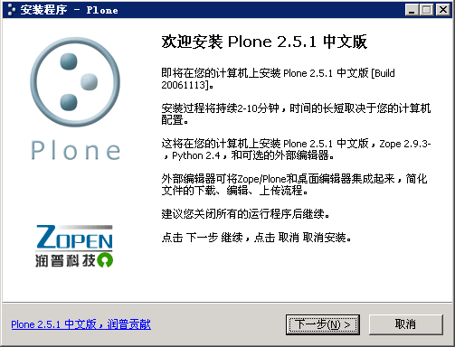
   
   图 2.1 Windows上安装Plone

（2）单击【下一步】，至创建管理员账户页面，如下图 2.2 。填写管理用户名和密码，系统安装后会创建这个用户。这是网站的初始超级用户，可用于管理Zope和Plone，一般用 admin 作为用户名，设定时需要记住这个用户名和口令。

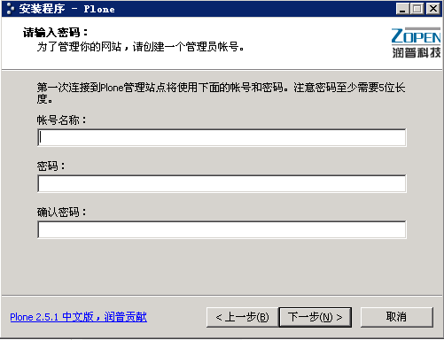

   图 2.2 输入管理账户用户名和密码

（3）需要选择安装路径，如图2.3所示。

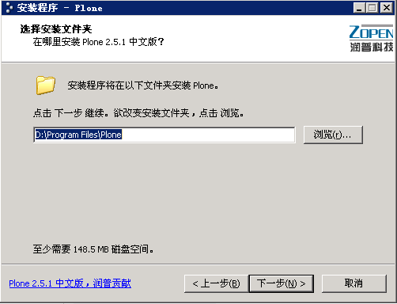

   图 2.3 选择安装路径
   
（4）安装过程一般三到五分钟，这取决于你电脑的速度。这个时候安装过程在执行一些安装结束前的任务，比如编译python文件，建立数据库，创建一个初始的Plone站点等。最后出现如下图2.4 ，提示安装已结束。

.. figure:: img/install/windows_install_over.png
   :alt: Windows上安装Plone

   图 2.4 安装结束页面

（5）在图 2.4 中，完成Plone安装向导的界面中，可选择图中的【启动Plone控制器】和【安装外部编辑器】，启动Plone控制器后，如下图2.5所示。

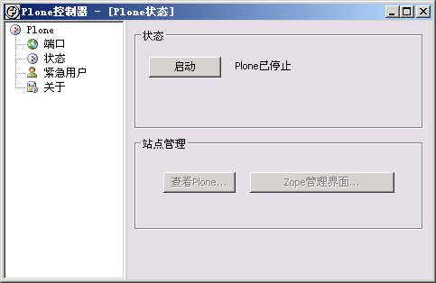

   图 2.5 Plone控制器

Plone控制器在Windows中能很方便地管理Plone的启动和关闭。Plone控制器提供很友好的用户界面，可看到Plone的运行状态，所运行的端口。同时还可以在这里创建紧急用户。

（6）Plone控制器启动Plone后，可以看到【查看Plone...】 和【Zope管理界面】按扭由灰变成可点击，可单击【查看Plone...】进入Plone站点，也可以直接打开浏览器到 `http://localhost/` 显示Plone的初始界面。如下图 2.6 。

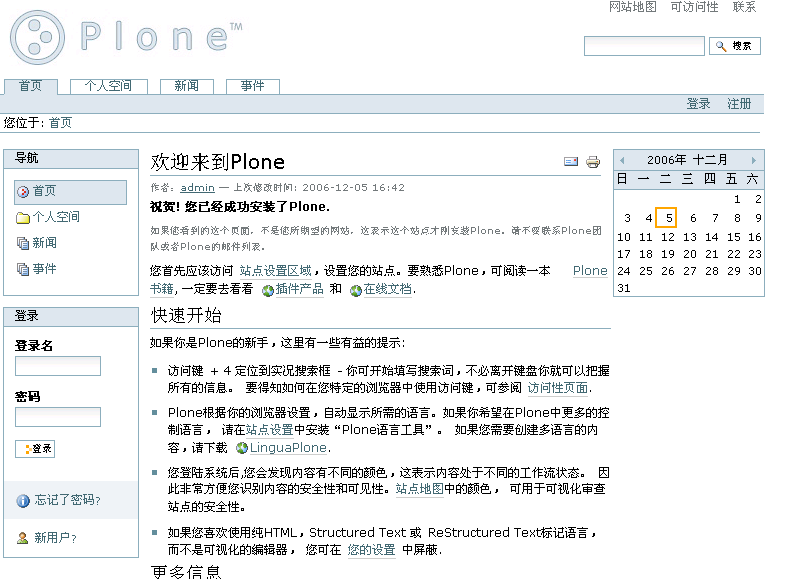

   图 2.6 Plone初始界面
   
用刚设定的用户名和密码登陆Plone站点，如果读者具有很强的好奇心，可以在刚才的Plone控制器中单击【Zope管理界面】，进去看看。

到这里，在Windows上安装Plone就结束了。

在Windows上配置Plone
........................

改变端口
,,,,,,,,,,,

可以在Plone控制面板端口界面上对各个运行端口的设定，如图 2.7 ，允许指定Plone监听HTTP，FTP，WebDev的端口。

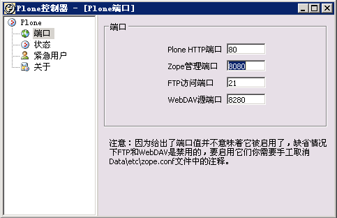

   图 2.7 Plone控制器端口界面

要改变端口，在Windows中可直接在Plone控制器端口界面中对HTTP，FTP，WebDev的端口进行设置，设置之前先确保要设置的相应端口没有被其它服务器所占用。

- Plone HTTP端口: 这是用户访问Plone的端口。默认的是 80 端口，这也是Web服务器默认的标准。虽然这个端口不是必须的，但如果没有它你将不能在Web浏览器上访问Plone。如果这个端口是激活的并且Plone是运行的，状态页上的【查看Plone...】按钮将是可点击的。

- Zope管理端口: 这是指定管理员访问Plone的端口。默认是 8080 端口。这个端口让你进入Zope的Zope管理界面的根目录。你仍然可以通过这个HTTP端口访问Plone；使得分开端口更容易和更加便利。如果这个端口被激活而且Plone是运行的，状态页上的【Zope管理界面...】按钮将是可点击的。

- FTP访问端口: 这是指定通过FTP访问Plone的端口。默认没有被激活的；如果想激活它，通常端口为 21 。可以使用FTP去上传大文件到Plone中。
   
- WebDAV源端口: 这是指定通过WebDAV协议访问Plone。默认是没有被激活的；如果想激活它，通常端口为 8081。（WebDAV 是一个通过远程协议在Plone编辑内容 。通过WebDAV，可以实现映射Plone服务器内容完成一些工作。）
   
使用紧急用户
,,,,,,,,,,,,,,
在忘掉管理用户名或密码的时候，可通过Plone控制器的紧急用户的页面创建紧急用户。如下图 2.8 ，创建紧急用户。

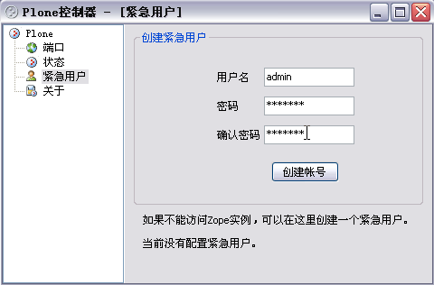

   图 2.8 创建紧急用户

通过创建的紧急用户只是临时访问Plone系统，用紧急用户登录后需要创建一个新的管理用户，用新的管理用户管理Zope/Plone 。   

   
在调试模式下启动Plone
,,,,,,,,,,,,,,,,,,,,,,,,
有时Plone运行中出错了，一时也找不出原因所在，或者其它的情况，需要使用在调试模式下启动Plone。在调试模式下启动Plone，会将所有的日志信息打印在Windows的命令窗口，以便我们跟踪调试信息。

运行在安装目录的 ``Data\bin`` 下的runzope.bat ，如下图 2.9 是命令行窗口启动Plone时的截图。   
   
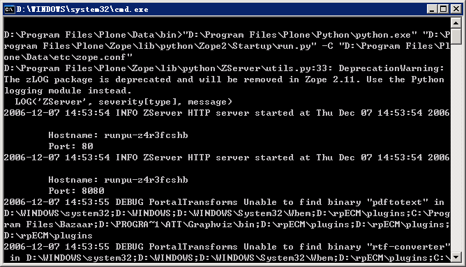

   图 2.9 调试模式启动Plone

Debian/Ubuntu上打包安装
-------------------------------
Plone在Debian/Ubuntu上是一个标准的安装包，因此得到的版本取决于Debian/Ubuntu系统的更新版本。安装Plone，使用Debian/Ubuntu的apt管理软件包安装即可。下面是安装的操作步骤。

（1）用管理员用户登录系统
（2）安装Plone站点命令： ::

 apt-get install plone-site

Debian/Ubuntu提示要设置一个管理员用户名和密码和一个想让Plone运行的端口。默认它的端口是 8081 。记住当前的设置。

（3）安装中文支持扩展产品，将 CJKSplitter 和 ZopeChinaPak 放到 */var/lib/zope2.9/instance/plone-site/Products* 目录（此为Plone实例的Products目录）
   
（4）安装完成后，启动Zope/Plone： ::
   
 /etc/init.d/zope start

（5）创建一个Plone站点： 

打开浏览器，进入 *http://localhost:8081/manage* ，以设定的管理用户名和密码登录。进入了Zope管理界面后，可创建Plone站点，下文中有这一步的详细说明。

回顾一下，安装在哪里了： ::

 /etc/zope2.9/plone-site/   # 安装目录
 
 /var/lib/zope2.9/instance/plone-site # Plone实例目录
 
在Debian/Ubuntu中安装的Plone站点可结合linux的logrotate实现自动日志循环。

Redhat上打包安装
-------------------------
这里介绍的Redhat打包安装是用RPM包，它在Redhat，Mandrake，和SuSE发行版上都可以用到。可以在 `http://www.plone.org/download` 上下载一下最新的安装包。这个RPM包需要Redhat系统已经安装好了Python 2.4 。在shell里运行查看你现在使用的Python的哪个版本：

::

 $ python -V
 Python 2.4.3

它显示已经安装了Python 2.4.3 ；如果没有安装，从Python官方网站 `http://python.org` 下载Python的RPM包，下载完毕后用标准的rpm命令去安装；安装Plone的时候很简单，下面是Plone安装时，包括创建站点和创建管理账户用户名和密码时打印出一些很有用的信息，显示如下： ::

 [root@zopen-02]# rpm -ivh Plone2-2.5.1rh-2.i386.rpm
 Preparing... ###########################################
 [100%]
 Making group plone (not altered if already exists).
 Making user plone.
 ~ 1:Plone2 ###########################################
 [100%]
 Creating initial 'main' instance...
 Instance created. Listening on 127.0.0.1:8080, initial user: 'plone'
 with password: 'plone'.
 Setup of initial database in 'main' instance...
 /usr/lib/plone2/lib/python/AccessControl/Owned.py:79:
 DeprecationWarning: Owned.getOwner(1) is deprecated; please use
 getOwnerTuple() instead.
 ~ DeprecationWarning)
 Created initial database content.
 look at /etc/plone2/main/zope.conf.
 Run then "/etc/rc.d/init.d/plone2 start" to start Plone2.
 you may create new Plone instances with mkploneinstance.

安装完成后，启动Zope/Plone： 

::

 /etc/rc.d/init.d/plone2 start

然后，就可以通过浏览器来访问：http://localhost:8080/ ，用设置的管理用户名和密码访问管理界面，在管理界面中，你可创建新的Plone站点。

源代码方式安装
------------------------
Plone的安装，还可以选择用源代码的方式安装，它可以在Windows平台，也可以在Linux/Unix平台。这种安装方式需要对Zope，Zope实例及Plone之前的关系有一定的了解，这样，安装过程就非常清晰；当然，安装方式也很简单，也可在安装过程之后，体会三者之间的关系。

安装Zope及Zope实例
.............................
下面分别介绍在Windows上和在Linux/Unix上安装Zope及Zope实例。

Windows上安装Zope及Zope实例
,,,,,,,,,,,,,,,,,,,,,,,,,,,,,,,

这里介绍安装步骤中重要的几步。

（1）Zope的Windows安装包下载位于：http://zope.org/products/ 。 下载的时候注意版本一致，下面使用的实例的Plone的源代码包版本是2.5.1，推荐Zope的版本是Zope 2.9.4 或 Zope 2.8.7 。

（2）图 2.10 中安装程序提示选择Zope安装位置。

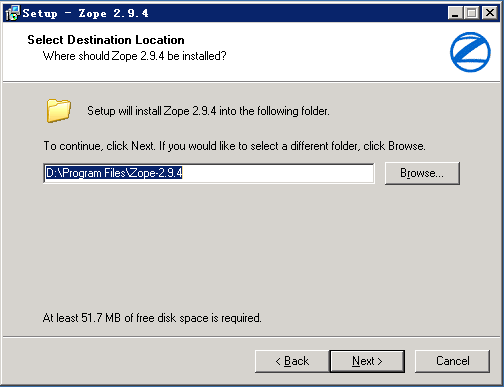

   图 2.10 选择Zope安装位置

（3）图 2.11 中是选择安装的构成成份，分为主Zope文件和Zope实例，Zope实例是可选的。选择Zope实例安装程序将安装Zope软件，同时安装一个Zope实例。默认是安装Zope连同安装Zope实例的。

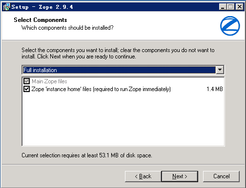

   图 2.11 选择安装的构成成份

（4）图 2.12 中提示，选择安装结束后在Windows服务中添加一个服务，可在服务中运行Zope实例，Zope实例在系统启动后自动运行。如果上面选择安装的构成成份中没有选择安装Zope实例，这一步将不会出现。在安装结束后可打开服务尝试从那里运行和关闭Zope实例。

.. figure:: img/install/windows_zope_server.png
   :alt: Zope安装
  
   图 2.12 选择添加一个启动服务 

（5）图 2.13 中安装程序提示选择Zope实例的安装目录。如果上面选择安装的构成成份中没有选择安装Zope实例，这一步将不会出现。指定好安装Zope实例的目录，并记住它（区分Zope实例的目录和Zope的安装目录）。

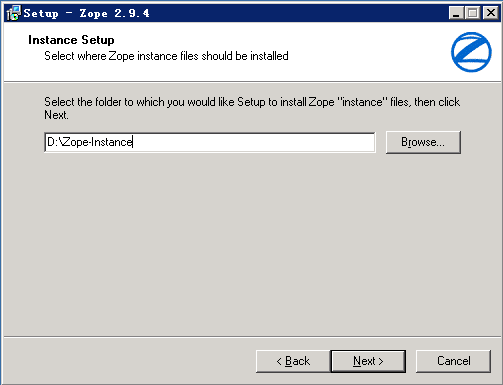

   图 2.13 选择Zope实例的安装目录

（6）当设定管理用户密码后安装程序按照设定自动安装，这个过程需要二到三分钟，如果前面的设定中选择安装Zope实例，在安装过程中同时创建一个Zope实例。这一步完成后，Zope的安装就完成了。

.. hint:: 如果安装了Zope实例，可以看到Windows系统中的服务多了一个Zope Instance的服务和开始菜单程序目录中多了一个Zope 2.9.4的程序目录。

如果要在Windows中创建新的实例，从开始菜单程序目录中看到Zope 2.9.4 目录中有一个 Make Zope Instance ，运行它，提示你设置实例的目录，实例的用户名和密码就可以创建新的实例。

.. hint:: 创建实例其实是通过运行 ``zope 2.9.4\bin\mkzopeinstance.py`` 实现的。也就是说完全可以用python运行mkzopeinstance.py来创建Zope实例。

Linux/Unix上安装Zope及Zope实例
,,,,,,,,,,,,,,,,,,,,,,,,,,,,,,,,,,

在Linux/Unix上安装Zope及Zope实例之前，需要做一些准备工作：

- 确保你的Linux/Unix系统上安装好了Python 2.4.2 或更新；
- GNU make工具等；
- 到Zope官方 `http://zope.org/Products` 下载Zope源代码包。

安装Zope, 先查看下载的Zope安装包里的doc/INSTALL.txt文件。下面是在Linux/Unix上安装Zope及Zope实例的操作步骤。

（1）解压Zope源代码包 tar zxf Zope-2.9.4-final.tgz
（2）进入解压后的Zope-2.9.4-final目录，执行安装命令
   
从安装帮助中得知有两种安装方式，一种是安装同时创建Zope实例，一种是安装后再创建Zope实例，这些在安装包中的INSTALL.txt中有介绍，推荐后者，这样会使你对创建实例更为清楚。

这里以安装后再创建Zope实例来介绍。此过程中的创建Zope实例是创建实例的标准方式。当需要创建新实例时也用这种方式。

（3）进入解压后的目录，执行编译： ::
   
 ./configure --prefix=/opt/Zope-2.9.4
    
 make

prefix是zope安装的目录。如果有多个python环境，想指定python 2.4.2，在configure中给出with-python参数的路径。

（4）编译过程完毕后，执行： ::

 make install

命令提示： ::

 Zope binaries installed successfully.
 Now run '/opt/Zope-2.9.4/bin/mkzopeinstance.py'

（5）然后来创建实例，运行mkzopeinstance.py： ::

 /opt/Zope-2.9.4/bin/mkzopeinstance.py

给出安装实例目录： :: 

 Directory: ./zope/myplone 

给出实例管理用户名和密码： ::
  
 Username: admin
 Password: 
 Verify password:  

这一步结束后就安装好了Zope实例。
  
（6）启动Zope实例（Zope实例已创建在zope/myplone目录中）： ::
 
 zope/myplone/bin/zopectl start

或用调试模式运行：  ::
 
 zope/myplone/bin/runzope

（7）设置让实例自动运行，在 ``Ubuntu/Debian`` 你需要开机自动运行Zope实例，运行下面操作：

在 ``/etc/init.d/`` 硬链接启动文件： ::

 sudo ln -s zope/myplone/bin/zopectl /etc/init.d/myplone

设定运行级别自动运行： ::

 sudo update-rc.d /etc/init.d/myplone defaults 99

安装Plone的源代码包
.....................
安装Plone的源代码包的方式在Windows，Linux，Unix上也都一样。

plone 2.5.1 版本中需要Python的PIL模块的支持。如果你的Python没有PIL模块（Windows安装Zope自带的Python没有PIL模块），Plone的就不能正常运行。PIL模块下载位置： `http://www.pythonware.com/products/pil/`

安装Plone的源代码包：解压源代码包，把解压后的目录中所有的内容移到安装好的Zope实例中的Products目录。

安装中文支持扩展包：将CJKSplitter和ZopeChinaPak解压后放到Zope实例的Products目录。

创建Plone站点
.................
启动Zope实例，在浏览器中访问 `http://localhost:8080/manage` 进入Zope管理界面。填入在安装Zope时设定的管理用户名和密码。在右上方的添加下拉列表中，找到 `Plone Site` 项。（没有安装Plone源代码包是没有这项的，这也可以去检验源代码包是否安装好了。）如下图2.14所示。

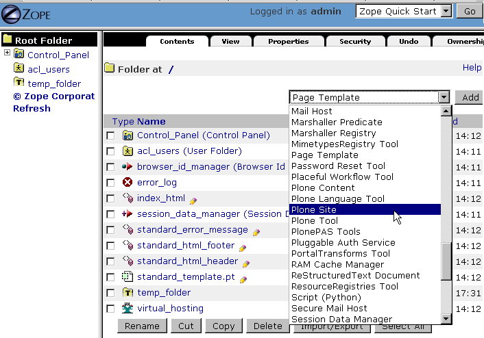

   图 2.14 添加Plone站点

接下来的工作，就进入 `Add Plne Site` 的页面填上ID，Title，Description添加一个Plone站点。如下图2.15所示。

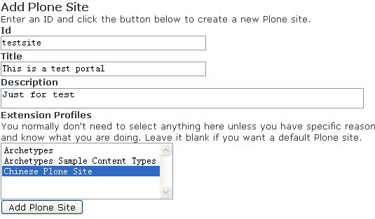

   图 2.15 添加Plone站点页面

在添加站点页面中填写站点ID，描述信息，选择 Extension Profiles 列表中的 Chinese Plone Site 单击 Add 创建Plone中文中点。这个过程需要一到两分钟的时间，就进入了Plone站点的欢迎界面。
 
 
了解安装后的文件夹结构
=============================
Plone的整体结构或者是安装后的目录结构，基本分为两大区域，Zope目录和实例目录。现分别从Zope目录和实例目录了解安装后的整个目录结构。

Zope软件文件夹结构
--------------------
这是介绍基础概念时提到了Zope核心软件的文件夹，它是实例运行的基本平台。其主要文件夹包括。

- bin: 存放一些工具。包含一些有用的代码和模块增强Zope。

- lib/python: 核心代码。Zope的核心代码存放目录。

- lib/python/Products: 核心扩展产品。Zope自带的扩展产品存放目录。

实例文件夹结构
-------------------
实例是Plone的运行环境。我们有必要来认清每个目录及目录中的文件是有什么作用的。

- bin: 这里是存放实例的运行、调试等可执行文件的目录。 ``bin\zopectl`` : linux平台上以守护进程方式运行。 ``bin\runzope`` : linux平台上，在终端上运行实例。 ``bin\runzope.bat`` : windows平台上，以终端方式运行实例。

- etc: 存放实例配置文件: zope.conf。后面讲到的配置实例基本上通过这个文件配置参数。

- log: 实例运行过程中生成的日志文件。一般有一个Z2.log和一个event.log文件。 ``log\Z2.log``   : 访问日志文件。记录什么时间，哪个用户，以及在什么环境下访问实例。 ``log\event.log`` : 错误日志文件。记录实例运行过程中产生的错误等。

- var: 这里是实例的数据存放区域。采用非ZEO Client方式（在《Zope对象数据库》章节中会详细介绍ZEO构架），其中的 ``Data.fs`` 就是ZODB的数据库文件。Zope上的扩展产品的数据也一般存放在这个文件夹中。

- import: ZODB的zexp格式导入文件存放的路径，仅仅在这个路径下的zexp文件，才运行导入到Zope中。

- extension: 此文件夹用于存放外部方法脚本(External Method)

- Products: 实例扩展产品。在我们使用Plone时，常有安装一些Plone的扩展产品，Plone的扩展产品就是一般存放在这个目录中。

.. hint:: Plone3.0中顺应Zope3的结构，将部分新的扩展产品包存放在实例的 ``lib/python`` 目录中，Windows安装后的目录可能会放在 ``Python/Lib/site-packages`` 目录中；实例配置文件目录（etc目录）中多了一个site.zcml的站点配置文件，它导入了配置文件目录中的package-includes目录的产品配置文件。
  
      
配置Plone实例
====================
Plone一旦安装完毕，可能需要它运行在其它的端口，接受FTP、WebDAV访问，查看日志信息等，就要配置Plone站点，下面详细介绍各个系统中统一的配置。

Zope实例中包括一个配置文件（etc/zope.conf），实例的所有配置参数位于这一个文件。下表是对常设置的参数的简单说明：

.. csv-table:: 【表 2.1】 配置文件(zope.conf)中常设置的参数
   :header: "配置参数", "参数说明"

   "debug-mode", "调试模式"
   "effective-user", "Linux系统上的运行时使用的用户账号"
   "http-server", "web服务器的端口设置"
   "ftp-server", "ftp服务器的端口设置"
   "port-base", "各个端口的附加偏移。调整这个参数，可方便的批量调整各个服务的端口号，以避免端口冲突"
   "default-zpublisher-encoding", "页面默认编码，应该调整为utf-8，以便更好的支持中文和其他语言"

如果在Windows上使用直接安装，大部分配置信息可在Plone控制器上查看到。同时，可看到一个额外的文件（plone.conf），这里包含了相关端口定义:  ::

    %define PLONE_WEBSERVER_PORT 80
    %define PLONE_FTPSERVER_PORT 21
    %define PLONE_DAVSERVER_PORT 8280
    %define ZOPE_MANAGEZODB_PORT 8080
    %define ZEO_SERVER_HOST localhost
    %define ZEO_SERVER_PORT 9999

这些定义的变量，会在zope.conf文件中被引用

配置运行端口
------------------
改变Plone的运行端口。比如，我们要运行Plone在 9090 端口代替默认，见下面的例子。

【例 2.3】改变Plone的运行端口

在zope.conf中改下面的部分： ::

 <http-server>
   # valid keys are "address" and "force-connection-close"
   address 8080
   # force-connection-close on
 </http-server>

改为： ::

 <http-server>
   # valid keys are "address" and "force-connection-close"
   address 9090
   # force-connection-close on
 </http-server>
 
.. hint:: 用Windows直接安装的方式配置端口可在Plone控制器上更改端口。

另外，可改port-base参数实现。port-base是端口的附加偏移，如果当前的Plone运行在默认的 8080 端口上，要实现运行在9090端口上，只需设定port-base为 1010 ，设置如下： ::

 port-base 1010

在Linux/Unix系统中，用非root用户，是不能启用 80 端口的；而创建的Zope实例又不能让root用户去运行（root用户权限过大，会存在安全性问题，Zope实例在启动后是不让root用户运行）。所以Zope实例配置文件中提供了 effective－user 的设置，是让root用户从 80 端口上去启动 Plone 转而由其它用户去运行，见下面的例子。

【例 2.4】配置Plone由有效用户运行

在zope.conf中找到下面部分： ::
 
 #  effective-user chrism
 
设置为： ::

  # 以zope用户运行
  effective-user zope

实现开启FTP端口在 8021 上（默认是没有被激活的），见下面配置Plone开启FTP端口的例子。

【例 2.5】配置Plone开启FTP端口

找到下面部分： ::

 #  <ftp-server>
 #    # valid key is "address"
 #    address 8021
 #  </ftp-server>

去掉注释即可： ::

 <ftp-server>
   # valid key is "address"
   address 8021
 </ftp-server>

当然，开启WebDAV也是如同上面的例子，这就不重复介绍了。

设置页面默认编码
----------------------
编码问题是网站开发经常遇到的问题，特别是页面中中文编码显示不正确的问题。
默认情况下，Plone采用utf-8作为页面编码。
如果希望Plone更好的显示中文，特别是让纯Zope的页面更好的显示中文，应该在zope.conf中设置发布编码为utf-8::

 default-zpublisher-encoding utf-8

使用Debug调试模式
------------------
在Debug调试模式下运行，在很多地方不必重新启动服务器更改的代码就可生效，因此可大大简化开发。但Debug模式会导致网站运行速度下降，不推荐在正式场合使用。

在Plone2.5.1的版本中debug调试模式默认是没有被激活的。可以在Plone站点中的 网站设置 的页面底部和在Zope管理界面中的 portal_migration 看到Debug调试模式是否被激活。下面是配置Plone开启Debug调试模式的例子。

【例 2.6】配置Plone开启Debug调试模式

在配置文件（zope.conf）中看到默认为： ::

 # debug-mode on

要使用Debug调试模式，需改为： ::

 debug-mode on
 
查看日志
-----------------
默认情况下在Plone中有两个日志文件（了解安装目录结构的小节已介绍）。这些日志文件分别记录了Plone的访问日志，和错误日志。

在默认的配置文件中可以看到： ::

 <eventlog>
   level info
   <logfile>
     path $INSTANCE/log/event.log
     level info
   </logfile>
 </eventlog>

 <logger access>
   level WARN
   <logfile>
     path $INSTANCE/log/Z2.log
     format %(message)s
   </logfile>
 </logger>

在这里可以定义一个新的文件或存放新的路径。

创建紧急用户
=================
Plone允许在忘掉管理用户名或密码的时候，通过创建紧急用户去访问你的系统。这个紧急用户只是暂时的，一般是通过紧急用户登录系统，更改管理用户名密码，以保证以后的登录。下面是创建紧急用户的例子，也是通用的创建紧急用户的方法。

【例 2.7】创建紧急用户

（1）创建紧急用户文件（zpassword.py在zope目录的bin文件夹中）::

     python zpassword.py inituser（这个inituser可以任意取名）

（2）将 **inituser** 文件拷贝到实例文件夹中

（3）重新启动实例
   
.. hint:: 在Windows用直接安装的方式安装的Plone，创建紧急用户可直接通过Plone控制器，在Windows配置Plone这一节里已有介绍。如果在Windows下采用这种手动方式，需要重启Zope instance服务，而不是只通过Plone控制器重启Plone，这样并没有重启zope实例。当然也可通过http://localhost:8080/manage中Control_Panel去restart，这样更方便。 

虚拟主机
===========

Zope自带的虚拟主机
------------------------
Zope有两个对象可帮助你实现虚拟主机，分别是“SiteRoot”和“Virtual Host Monster”。通过虚拟主机服务，我们可在一个Zope服务器中建立多个网站。SiteRoot已不多用了，下面简单介绍Virtual Host Monster.

“Virtual Host Monster”的唯一的工作就是改变zope对象的URLs。它允许你定制显示的URLs，当你通过不同方式访问对象时有不同的URL。如，我想发布一个Zope文件夹，/foofolder，但我不想以文件夹的形式，而是以http://www.foofolder.com/形式来发布。 “Virtual Host Monster”的工作就是把http://www.foofolder.com/翻译成zope服务器中的/foofolder文件夹。如果该文件夹不存在，则“Virtual Host Monster”就什么都不做，如果存在，则“Virtual Host Monster”会通过路径和目标信息来生成与http://www.foofolder.com/不同的URL，从而能正确访问到/foofolder 文件夹。

VHM(Virtual Host Monster)在URL中发现以下两个元素后才会进行截取和转换处理：

- VirtualHostBase：如果VHM在URL中搜索到这个名字，它会使Zope对象用另外的协议、主机名和端口号来生成URLs。
 
  VirtualHostBase宣告在新URL的开始位置进行，VHM会截取这个宣告后的两个元素，一个是新的协议，一个是新的主机名和端口号。格式如下：VirtualHostBase/protocol/hostname:portnumber，第二个元素的端口号是可选的，如果没有指定端口号，则VHM就不会改变原始端口号。下面是一些例子： ::

   如果VHM位于根目录，而且请求URL是：

   “http://zopeserver:8080/VirtualHostBase/http/www.buystuff.com”

   则会生成如下的URL：
   
   “http://buystuff.com:8080”

   如果VHM位于根目录，而且请求URL是：

   “http://zopeserver:8080/VirtualHostBase/http/www.buystuff.com:80”

   则会生成如下的URL：
    
   “http://buystuff.com” (由于端口号80是默认的http端口，所以这里不用写)

   如果VHM位于根目录，而且请求URL是：

   “http://zopeserver:8080/VirtualHostBase/https/www.buystuff.com:443”

   则会生成如下URL：
 
   “https://buystuff.com/” (由于443端口是https默认的端口，所以这里也不用写)

- VirtualHostRoot：如果VHM在URL搜索到这个名字，它会使Zope对象用不同的“根目录”来生成URLs

  VirtualHostRoot宣告在新URL的结尾附近进行。VHM会把VirtualHostRoot宣告前后的路径元素联接起来，这些路径元素组成Zope对象结构，需发布的对象就被重写成跟在VirtualHostRoot后的元素。举个例子就很容易明白：对于一个 /a/b/c/VirtualHostRoot/d的URL，VHM将会形成“a/b/c/d”的对象结构，/d就是新的URL路径。下面是几个实例： ::

   如果VHM位于根目录，而且请求URL是：

   “http://zopeserver:8080/Folder/VirtualHostRoot/”

   则Folder对象会被发布，生成的URL是：“http://zopeserver:8080/”当你用上面的URL访问时，就是访问Folder对象。

   如果VHM位于根目录，而且请求URL是：

   “http://zopeserver:8080/HomeFolder/VirtualHostRoot/Chris”

   则/HomeFolder/Chris对象就被发布，生成的URL是：“http://zopeserver:8080/Chris”当你用上面的URL访问时，就是访问 “/HomeFolder/Chris”

我们可在Zope的根目录中建立一个VHM，为不同的域提供服务，如：http://www.buystuff.com指向Zope根目录下的 /buystuff文件夹；http://www.mycause.org指向Zope根目录下的/mycause文件夹。要这样配置，我们需同时用到 VirtualHostBase和VirtualHostRoot。如： ::

 /VirtualHostBase/http/www.mycause.org:80/mycause/VirtualHostRoot/

 /VirtualHostBase/http/www.buystuff.com:80/buystuff/VirtualHostRoot/

和Apache2配合的虚拟主机
-----------------------------
如果你使用Apache做为Zope的前台服务器，那么你就要用Apache的重写规则来代替Zope的Mappings tab。Apache的重写规则是很直观，很容易理解：Apache服务器监听普通端口(80)，Zope服务器监听另一个端口(8080)。 Apache在80端口接收请求，之后通过Apache配置文件中的虚拟主机指令，把请求重新定向到Zope服务器的发布目录。

要使用 Apache的重写功能，你需要mod_rewrite和mod_proxy两个Apache模块。安装这两个模块的方法是在编译Apache时，用-- enable-modules="rewrite proxy"标记编译就可以了。如果你使用Apache2.0系列版本，你需要mod_proxy_http模块，详细介绍请参考Apache mod_rewrite documentation。在Apache配置文件http.conf的LoadModule节可查看Apache可加载的模块。

配置好Apache重写模块后，我们就可以配置重写规则了。下面我们以一个例子详细介绍如何配置。和上例配置环境一样，我们在hosts文件中设置主机名： ::

 ...
 127.0.0.1   www.example.com
 ...

Apache在80运行在端口，Zope运行在本地的8080端口。我们要把www.example.com映射到根目录下的 vhm_test文件夹。也就是以vhm_test作为www.example.com网站的根目录。我们可在Apache的http.conf配置文件的虚拟主机部份设置如下内容： ::

 NameVirtualHost *:80
 <VirtualHost *:80>
 ServerName www.example.com
 RewriteEngine On
 RewriteRule ^/(.*) http://127.0.0.1:8080/VirtualHostBase/http/www.example.com:80/vhm_test/VirtualHostRoot/$1 [L,P]
 </VirtualHost>

小结
=============
Plone的安装非常的方便，针对当前一些流行的操作系统都有安装包，也有支持中文的Plone Windows中文安装包。本章介绍了各种安装方式，学习操作的过程也可对应不同安装方式的相同之处和不同之处；理解 Zope软件，Zope实例，Plone站点，这些基础的概念以及它们相互的关系。另外，本章介绍了Plone安装后的目录结构，和Plone实例的基本配置方法。
