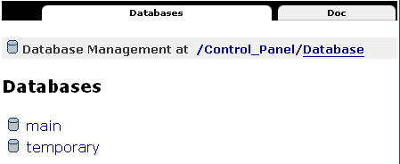
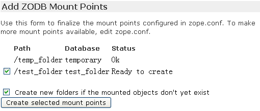
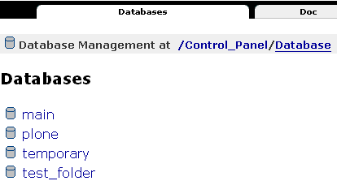
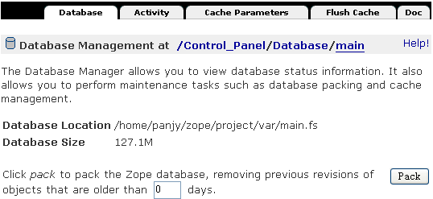

=========================================
Zope对象数据库(ZODB)
=========================================

.. Contents::
.. sectnum::
   :prefix: 8.

Zope默认将所有数据存放在Zope对象数据库(ZODB)中。
ZODB实现了Python对象的透明存储，应用的编写几乎不必考虑数据库的操作。
ZODB支持缓存、撤销、事务、可插拔的存储等高级特性。
ZODB是Zope自带的数据库，但是也可以脱离于Zope独立使用。

本章适合系统管理员和系统集成人员阅读。本章重点包括:

- ZODB的分区存储配置
- ZODB的维护方法
- ZEO架构的配置

关系数据库，还是对象数据库
=============================
关系数据库(RDBMS)是一个很成熟的技术。
这也是大多数软件所采用的存储技术。但是具体应用的编写，需要直接针对对象来操作。
因此，往往通过一些O-R映射(对象-关系的映射)，来将二者衔接。这最终导致基于关系数据库的开发比较繁琐。

ZODB最大的优点就是透明性，你根本不必编写任何数据库读写的代码，
省去了传统的O-R映射代码。Python的所有对象可保存为一个 pickle 数据块，并可从 pickle 数据库块中恢复对象；而ZODB数据库实际上就是对象pickle化后的一个数据库。
可轻松从ZODB数据库中恢复一个对象。

如果你的应用中有大量不同类型的对象，相互之间有非常复杂的关系，而且可能模型可能经常发生变化的时候，这时候关系数据库可能无法承载了，
而采用ZODB则是一个更好的选择。内容管理系统中存在各种不同的内容类型，插件的安装，要求系统能够不断扩展。
因此，ZODB特别适合内容管理系统的开发。

和关系数据库一样，ZODB也支持事务：一次操作要么成功提交，要么失败(执行的时候抛出异常)回滚。
不会出现事务执行到一半出现异常，而数据已经被改写，导致数据不一致的情况。

和关系数据库相比，ZODB对象也存在一些缺点，包括：

- ZODB中的数据，不能脱离软件独立使用，而且目前只能使用python语言访问
- 自身是个黑箱，不支持跨语言的、通用的、类似SQL的访问接口
- 是九十年代才开始发展的技术，不如关系数据库从七十年代至现在发展得那么成熟

Zope中ZODB的使用
======================
查看数据库文件
------------------------
每个Zope实例中，包括一个 var 的子目录，ZODB就是存放在这里。
Zope服务第一次启动后，会自动生成2个数据库文件:

#. Data.fs

   这就是ZODB的核心数据库文件。网站备份的时候，只需要备份这个文件。

#. Data.fs.index

   ZODB数据库的对象索引文件。这个文件不是必须的，不必备份。
   启动的时候，可根据Data.fs自动生成。

我们在ZMI中看到的所有对象，均保存在ZODB中。
包括: 脚本、显示模板、工具对象、内容等。

Zope的默认数据库配置
-----------------------------
Zope提供了ZODB的基本管理界面。进入ZMI界面的根目录中，依次单击 Control_Panel -> Database Management, 
我们可看到这个Zope实例所使用ZODB的清单，如图8.1所示。

   图 8.1 Zope使用的数据库

默认包括main和temporary这2个数据库。main数据库对应前面看到Data.fs文件中。而temporary数据库是一个使用内存存储的临时数据库，
用于存放session这样一些临时对象。

在Zope实例的 ``etc/zope.conf`` 配置文件末尾，可以相应看到如下配置::

 <zodb_db main>
    # Main FileStorage database
    <filestorage>
      path $INSTANCE/var/Data.fs
    </filestorage>
    mount-point /
 </zodb_db>

 <zodb_db temporary>
    # Temporary storage database (for sessions)
    <temporarystorage>
      name temporary storage for sessioning
    </temporarystorage>
    mount-point /temp_folder
    container-class Products.TemporaryFolder.TemporaryContainer
 </zodb_db>

这里包括main和temporary这2个数据库的配置。
main数据库采用了filestorage作为存储，这也是Zope默认的存储机制，它最终存储到了实例的var子目录下的Data.fs文件中，mount-point表示这个文件对应ZODB的根节点(/)；
而temporary数据库采用了temporarystorage作为存储，将对象保存在内存中，它将加载到ZODB的/temp_folder处。

可看到，Zope采用了分区、可插拔存储。
这里有2个加载点(mount-point)，并且使用了2个不同的存储方法(storage)。Zope的ZODB和数据库存储之间关系如下::
                            
    /  (Zope根)       <-- Data.fs  (filestorage)
     |-- ..
     |-- ..
     `-- temp_folder/ <-- 内存     (temporarystorage)

ZODB数据库的存储和加载
===========================
Mount Point：使用多个ZODB数据库
---------------------------------------
加载时创建加载点对象
.......................
为了避免单个zodb的数据库文件过于庞大，可在zope.conf中配置更多的storage分开存放。
这需要我们确定加载点的对象类型。如前面temporarystorage中，配置文件中有如下设置::

 container-class Products.TemporaryFolder.TemporaryContainer

如果要加载一个BTree Folder(BTreeFolder2)，类似的在可在zope.conf中设置::

     <zodb_db test_folder>
       # Plone FileStorage database
         <filestorage>
            path $INSTANCE/var/test.fs
         </filestorage>
       mount-point /test_folder
       container-class Products.BTreeFolder2.BTreeFolder2.BTreeFolder2
     </zodb_db>

其中 ``Products.BTreeFolder2.BTreeFolder2.BTreeFolder2`` 是类(class)的完整路径。这样重现启动Zope后，可在ZMI的添加下拉框中选择 ``ZODB Mount Point``, 
选择 Create new folders if the mounted objects don't yet exist ，单击 Create selected mount point ，如图8.2所示。

   图 8.2 加载时创建一个BTreeFolder2对象
 
这样，就可以创建一个 test_folder 的BTree文件夹，并挂接到一个独立的名字为test.fs的storage上。在ZMI中可看到这个文件夹，如图8.3所示。

.. figure:: img/zodb/mounted-folder.png

   图 8.3加载后的BTree文件夹

加载初始化好的storage
.........................
上面的加载很方便，但是有些对象不能简单根据类(class)简单创建，比如Plone站点，或者Plone的文件夹，这些对象的创建过程很复杂。
这样，我们就需要预先在单独的实例中，将这个storage初始化好，手工先创建一个加载点的对象。

比如，我们可将Plone站点 ``/plone`` 单独存放到一个filestorage(``plone.fs``)中，即::

    /  (Zope根)       <-- main.fs  (filestorage)
     |-- ..
     |-- plone/       <-- plone.fs (filestorage)
     |-- test_folder/ <-- test.fs (filestorage)
     `-- temp_folder/ <-- 内存     (temporarystorage)

可如下操作:

#. 初始化待加载数据库(plone.fs)

   创建一个空的临时Zope实例，在ZMI中，创建一个id为plone的Plone站点。完成后停止此实例，将实例的var文件夹中的Data.fs改名为plone.fs保存起来。此临时Zope实例可删除。

#. 配置ZODB的存储结构

   将plone.fs放置到需要运行的Zope实例的 ``var`` 文件夹中，同时调整配置文件 ``etc/zope.conf`` ，在末尾增加如下配置::

     <zodb_db plone>
        # Plone FileStorage database
        <filestorage>
           path $INSTANCE/var/plone.fs
        </filestorage>
        mount-point /plone
     </zodb_db>

#. 重新启动Zope实例

#. ZMI中，在添加下拉框中选择 ZODB Mount Point ，出现下图的加载表单。我们可以看到前面加载的test_folder的状态为 OK 。
   选择路径 plone ，单击 Create selected mount point，将plone挂载到ZODB树上，如图8.4所示。

   .. figure:: img/zodb/mount-point-plone.png
  
      图 8.4 加载数据库

一旦加载，我们可看到ZMI根下出现了plone的站点文件夹。回到ZMI-> Control_Panel -> Database Management中，我们也可看到新添加的plone数据库，如图8.5所示。

   图 8.5 已经加载的数据库

其他的Storage
----------------------------
安装一些插件产品后，Zope常用的几种Storage见表8.1：

.. csv-table:: 【表8.1】常见的几种存储
   :header: "名字", "说明"

   "FileStorage", "默认的存储介质，使用一个文件存储。简单、性能好，但文件会越来越大" 
   "TemporaryStorage", "将对象保存在内存中，适合保存session等临时对象。"
   "DirectoryStorage", "数据分散在文件夹中，pack操作非常慢。也可去除保留历史功能，不必pack。"
   "OracleStorage", "存储在Oracle数据库中。仍然保存的是不可直接查看的对象pickle."
   "ZEOClientStorage", "采用C/S架构，和远程的ZODB数据库服务器通信，组成ZEO架构，下文将介绍"

数据库的管理维护
============================

挤压数据库(pack)
----------------------
在上节中的 Database Management 页面中，点击任何一个数据库，可对数据库进行监视和维护操作。

ZODB最常用的FileStorage存储，所有操作均在数据文件末尾记录，能够保留所有操作历史，它能够支持撤销(undo)操作。
这样，即便是删除操作，也不能减小数据库文件的大小。频繁修改，可能导致数据库文件大小迅速增加。

ZODB数据库管理页面中，可对数据库进行挤压(pack)操作，清除部分或者全部undo历史，减小数据库文件的大小。
界面如图8.6所示。

   图 8.6 挤压(pack)ZODB数据库

数据库缓存
----------------------------
ZODB数据库中存放了大量的对象。一旦Zope启动，需要首先将这些对象从数据库中读取到内存中，才能被利用。

将对象从数据库加载到内存的过程，通常比较慢。但是一旦加载到内存中，ZODB会将对象保留在内存的缓冲区中一段时间，
避免反复加载导致性能下降。第一次访问Plone站点的时候，由于大量对象初次加载，
因此页面打开会比较慢；之后的访问，由于对象已经进入内存，速度则会加快很多。

由于内存大小有限，不能将全部对象加载到内存中。Zope默认支持缓存5000个对象。
根据服务器内存的大小，可在 ``zope.conf`` 文件中调整缓存对象数目::

     <zodb_db plone>
        # Plone FileStorage database
        <filestorage>
           path $INSTANCE/var/plone.fs
        </filestorage>
        mount-point /plone

        # 每个线程默认支持缓存5000个对象(注：不是内存大小)
        cache_size 100000
     </zodb_db>

.. note:: 这里的cache_size，表示一个线程的缓存对象数目。Zope的线程数量是在 zserver-threads 参数中设定的，
   二者相乘 ``cache_size * zserver-threads`` 才是总的缓存对象数目。
   在调整cache-size的时候，需要同时考虑zserver-threads参数。

ZMI的  Database Management 页面提供了一组缓存监视和管理工具:

- Activity: ZODB读写图表, 便于调整cache的设置。如果ZODB对象加载太多，则可能需要增加缓存。

- Cache Parameters: 查看缓存参数，以及当前缓存的占用情况

- Flush Cache: 在这里可清除内存中的缓存对象，释放内存

数据库备份
---------------------
Zope默认的filestroage，直接备份数据库文件即可(``var/Data.fs``)。这种备份也称做完全备份。

如果数据库文件比较大，这样保留多天完全备份会占用大量空间。Zope提供了一个增量备份的工具，可仅仅备份上次备份后修改的内容。

这个增量工具位于Zope软件安装目录下的 ``bin/repozo.py`` 中。可执行如下命令备份并压缩::

 python repozo.py -Bvz -f Data.fs -r [备份到的文件夹路径]

其中的 ``-z`` 参数表示压缩后备份。可加上 ``-F/--full`` 参数，强制做一个完全备份::

 python repozo.py -Bvz -F -f Data.fs -r [备份到的文件夹路径]

如果要从备份数据中恢复一个最新版本到文件Data.fs，可执行::

 python repozo.py -R -r [备份到的文件夹路径] -o Data.fs

如果要恢复2006年12月8日的备份，则可执行::

 python repozo.py -R -r [备份到的文件夹路径] -D 2006-12-08 -o Data.fs

.. note::  这里的python是2.4Plone安装目录中的python，也就是2.4的版本且包含相关zodb模块，如果和你的python不符，
       可以用path/python的方式运行，在windows环境中，可用引号" "屏蔽空格

其他的维护工具
---------------------------
另外，Zope还包括几个其他的filestorage工具脚本，均位于zope安装目录下的bin文件夹中。

比如 fstail.py 可查看/导出ZODB最近的事务执行情况，类似undo中的事务清单； fstest.py 可对数据库进行完整性测试。

具体使用方法，可查看各自脚本文件中的注释说明文本。

ZEO架构
======================
如果网站的访问请求越来越多，那么站点的访问响应可能会越来越慢。最差的情况下，
太多的请求可能导致站点完全过载，停止处理请求甚至崩溃。
所有的应用服务器，不仅仅是Zope，都会遇到这个问题。
最直接的处理方法是使用多台计算机来提供服务。

但使用多台计算机，也存在另外的问题。比如，如果你使用3台运行Zope的计算机来
提供服务，那么这3台计算机上的数据和访问结果必须完全相同。对于内容不断变化的网站，手工同步多个站点的数据是不大可能的。
为了解决这个问题，Zope公司开发了Zope企业对象(ZEO: Zope Enterprise Objects)。

ZEO是什么
-------------------
ZEO是让你的站点可以在多台计算机上运行的技术。这也常被叫做负载均衡技术。
在多台计算机上运行Zope，你可将请求分布到多台计算机上，减少单台计算机的负载量。
同时，如果其中一台服务器出问题了，其他的服务器仍然能够继续服务。

ZEO在多台服务器上运行Zope，并能够确保各个Zope能够共享相同的数据库。
ZEO使用C/S架构。ZEO服务器(ZEO Server)相当于传统关系数据库中的数据库服务器，
用于集中管理数据；ZEO客户(ZEO Client)会连接到公共的ZEO服务器上获得数据。如图8.7所示:

.. figure:: img/zodb/zeo-top.png

   图 8.7 ZEO拓扑结构(C/S结构)

这里的ZEO Client，一般就是前面的Zope网站服务器。他们一方面是提供web请求处理，
是服务器；另外一方面，从ZEO Server那里得到数据，是客户机。

什么时候使用ZEO
-------------------
有很多理由使用ZEO，比如：

- 你的网站点击访问量越来越大，希望得到更快的处理。你可使用ZEO，进行负载均衡，提高响应。
- 你的网站非常关键，需要24*7上线。这样ZEO可给你一个容错的环境。
- 希望把你的站点分布到很多的镜像站点上。
- 充分利用服务器的多CPU。目前一个Zope实例只能利用一个CPU(Python的限制)，使用ZEO，可充分利用多处理器的服务器架构。
- 你希望在服务器正常运行的同时，能够开辟一个调试站点。这对开发人员非常有用。

与此同时，部署ZEO意味着更加复杂的安装、配置、管理方面的操作。部署ZEO适合高级用户使用。大多数Zope用户，并不必需要ZEO。

ZEO原理
------------------------------------------
前面我们知道ZODB有一个叫做ClientStorage特殊存储，这个存储就是实现了ZEO Client的功能，用来和ZEO Server通讯。如图8.8所示:

.. figure:: img/zodb/zeo-connection.png

   图 8.8 ZEO工作原理图

我们看到，ClientStorage远程连接到ZEO Server后，最终还是连接到了一个FileStorage。
因此，ClientStorage实际上就是远程的FileStorage的代理。

ZODB完全屏蔽了各种Storage的差异。对于Zope应用服务器上运行的对象来说，完全无需知道底层的存储机制。

安装和配置ZEO
----------------------

安装ZEO Server
...........................
要运行ZEO Server，需要首先创建一个ZEO实例(ZEO Instance)，也就是ZEO Server的运行环境。

Zope软件的bin目录中，包括一个 ``mkzeoinstance.py`` 脚本，运行它可创建一个ZEO实例。比如::

 mkzeoinstance.py /var/zope/plone/zeo 9000

其中， ``/var/zope/plone/zeo`` 是ZEO实例的安装目录，9000是服务监听端口。

ZEO实例的目录结构，和Zope实例的目录结构类似。

在Linux上可以直接以守护进程方式运行ZEO Server::

 bin/zeoctl start

或者在命令行上运行，以便调试程序::

 bin/runzeo

windows上运行ZEO Server
........................................
和Zope 服务器一样，ZEO Server可在各种平台上运行。
不幸的是，迄今为止，默认创建实例安装后，Zope的ZEO Server在Windows平台上并没有可直接使用的运行脚本，这需要我们手工完成。

可在 ``zeo\bin`` 目录下添加一个批处理文件运行zeo服务器，文件名为 ``runzeo.bat``::

 @set PYTHON=<<python.exe文件的完整路径>>
 @set SOFTWARE_HOME=<<zope安装路径\lib\python>>
 @set INSTANCE_HOME=<<zeo实例的安装目录>>

 @set PYTHONPATH=%SOFTWARE_HOME%
 @set CONFIG_FILE=%INSTANCE_HOME%\etc\zeo.conf
 @set ZEO_RUN=%SOFTWARE_HOME%\ZEO\runzeo.py
 "%PYTHON%" "%ZEO_RUN%" -C "%CONFIG_FILE%"

注意，上面的PYTHON、SOFTWARE_HOME、INSTANCE_HOME需要替换为实际的路径。

如果希望以服务的方式运行ZEO Server，则需要在 ``zeo\bin`` 下手工添加一个 ``zeoservice.py`` 的文件::

 import os.path
 import sys
 from nt_svcutils.service import Service

 PYTHON=r'<<python.exe文件的完整路径>>'
 SOFTWARE_HOME=r'<<zope安装路径\lib\python>>'
 INSTANCE_HOME = r'<<zeo实例的安装目录>>'
 ZOPE_BIN= r'<<zope安装路径\bin>>'

 ZEO_RUN = SOFTWARE_HOME + r'\ZEO\runzeo.py'
 CONFIG_FILE= os.path.join(INSTANCE_HOME, 'etc', 'zeo.conf')
 PYTHONSERVICE_EXE=ZOPE_BIN + r'\PythonService.exe'

 # Setup the environment, so sub-processes see these variables
 parts = os.environ.get("PYTHONPATH", "").split(os.pathsep)
 if SOFTWARE_HOME not in parts:
     parts = filter(None, [SOFTWARE_HOME] + parts)
     os.environ["PYTHONPATH"] = os.pathsep.join(parts)

 os.environ["INSTANCE_HOME"] = INSTANCE_HOME
 sys.path.insert(0, SOFTWARE_HOME)
 servicename = 'ZEO_' + str(hash(INSTANCE_HOME.lower()))

 class InstanceService(Service):
     _svc_name_ = servicename
     _svc_display_name_ = 'ZEO instance at ' + INSTANCE_HOME
     _exe_name_ = PYTHONSERVICE_EXE
     process_runner = PYTHON
     process_args = '"' + ZEO_RUN + '" -C "' + CONFIG_FILE + '"'

 if __name__ == '__main__':
     import win32serviceutil
     win32serviceutil.HandleCommandLine(InstanceService)

同样上面的PYTHON、SOFTWARE_HOME、INSTANCE_HOME、ZOPE_BIN需要调整为实际的路径。安装为服务的方法为::

 python zeoservice.py install

如果需要安装为自启动的方式，可执行::

 python zeoservice.py install --startup auto

启动服务，可执行::

  python zeoservice.py start

ClientStorage的配置
...............................
默认情况下，ZEO Server上包括一个名字为1的Storage。
可调整zope.conf的配置，让整个Zope根连接到ZEO Server上。

首先需要把从前整个 ``<zodb_db main>`` 节注释掉，
然后增加下面的配置::

 <zodb_db main>
   mount-point /
   # ZODB缓存, 单位为数据库的对象
   cache-size 5000
   <zeoclient>
     # ZEO服务器的主机和端口
     server localhost:9000
     # ZEO服务中的Storage名
     storage 1
     # 一个名字
     name zeostorage
     # 临时缓存文件的存放文件夹
     var $INSTANCE/var
     # ZEO Client在文件系统上的缓存，单位为字节
     cache-size 200MB
     # 注意：去除下行注释，可永久保存缓存, 但此功能面前还不成熟
     #client zeo1
   </zeoclient>
 </zodb_db>

上面的配置 zeoclient 节中，包括连接和ZEO缓存2部分配置。

连接方面， server 指定了ZEO服务器和端口信息；
storage 是在ZEO Server上的Storage的名字，下面会详细介绍。

这里的ZEO缓存，不同于前面的ZODB缓存。ZODB缓存是在内存中缓存已经读取的对象；
而ZEO缓存，是在ZEO Client的文件系统中，缓存从ZEO Server上读取的对象，避免每次耗时的网络读取。
zeoclient 节中的 cache-size 是字节数，而不是对象数量。缓存将存放在 var 参数指定的位置。
如果不设置 client 参数，每次服务器重新启动，将重新生成缓存；而一旦设置 client 名字，
可将缓存永久保存，下次启动可直接读取上次遗留的缓存数据，避免再次从服务器读取。

配置完成后，重新启动Zope服务器，即可生效。

配置ZEO Server
.......................
ZEO Server实际上是一个独立的存储服务器，它监听某个端口，为ZEOClientStorage提供服务。
ZEO实例的配置文件位于 ``etc/zeo.conf`` 。这个文件包括zeo、filestorage等多个节。

典型的zeo节如下::

 <zeo>
   address 9000
   read-only false
   invalidation-queue-size 100
   # pid-filename $INSTANCE/var/ZEO.pid
   # monitor-address PORT
   # transaction-timeout SECONDS
 </zeo>

其中，address是服务器的监听端口，这里使用的9000号端口，可ClientStorage中的端口一致。
由于连接到这个端口并不需要权限认证，为了避免恶意连接破坏数据，
一般需要在服务器上设置防火墙，只允许指定的服务器来连接。

如果是ZEO Server和ZEO Client都在同一台计算机上运行，而且使用的是unix/linux的操作系统，则也可使用unix域套接字(Unix-domain socket)，比如在zeo.conf中设置::

  address $INSTANCE/var/zeo.sock

这样在ZEO Client的zope.conf中需要这样设置ZEOClientStorage到ZEO Server之间的链接地址::

  <zeoclient>
     server /path/to/zeo/var/zeo.sock
     ....

如果设置 monitor-address ，则可telenet到这个端口，检查ZEO Server的运行情况，包括连接数量，Storage清单，冲突发生情况等。
比如将9001做为监听端口::

  monitor-address 9001

可如下查看服务器运行情况，如下::

 $ telnet localhost 9001
 Trying 127.0.0.1...
 Connected to localhost.
 Escape character is '^]'.
 ZEO monitor server version 3.4.4
 Tue Dec 12 11:38:45 2006

 Storage: 1
 Server started: Tue Dec 12 11:34:49 2006
 Clients: 1
 Clients verifying: 0
 Active transactions: 0
 Commits: 28
 Aborts: 0
 Loads: 1
 Stores: 420
 Conflicts: 0
 Conflicts resolved: 0

 Connection closed by foreign host.

ZEO Server默认只包括一个名字为“1”的FileStorage，存放在ZEO服务器的 ``var/Data.fs`` 文件中::

 <filestorage 1>
   path $INSTANCE/var/Data.fs
 </filestorage>
 
也可让ZEO服务器使用多个Storage，比如可再添加名字为plone的Storage::

 <filestorage plone>
   path $INSTANCE/var/plone.fs
 </filestorage>
 
之后，在Zope服务器的zope.conf配置文件中，可增加一个zeoclientstorage的zodb配置，连接到这个名字为plone的storage，如下::

 <zodb_db plone>
   mount-point /plone
   cache-size 5000
   <zeoclient>
     server localhost:9000
     storage plone
     name plone
     var $INSTANCE/var
     cache-size 200MB
   </zeoclient>
 </zodb_db>

当然，和前面一样，还需要在Zope的ZMI界面中，添加 Zope Mount Point ，手工加载这个storage才能使用。

挤压(pack)ZEO数据库
-----------------------
ZODB数据库默认会保留整个操作历史，如果不进行定期挤压(pack)，数据库将不断增大。

前面我们介绍在ZMI中可对数据库进行挤压操作。但是这个操作会对当前运行的站点的性能造成很大的影响，而且不方便在后台自动运行。

对ZEO部署的数据库，Zope提供了一个脚本，可使用一个独立的进程对数据库进行挤压(pack)操作，可避免对运行站点的影响，也很方便编写自动执行的脚本。

这个脚本是Zope安装程序下的 ``bin/zeopack.py`` 文件。
比如，挤压本机9000端口运行的ZEO Server上的名字为plone的storage，仅仅保留最近一周(7天)的历史数据::

 python zeopack.py -p 9000 -h localhost -S plone -d 7

如果使用unix域套接字(Unix-domain socket)，则应该这样执行::

 python zeopack.py -U /path/to/zeo/var/zeo.sock -h localhost -S plone -d 7

小结
==============
ZODB相对于关系数据库，在内容管理领域有独特的优势，能够大大简化开发。ZODB支持多种存储，常用的是filestorage。
将ZODB部署在不同的storage之上，避免数据库文件过于庞大。ZODB的数据库文件需要定期挤压(pack)，以去除历史数据。
通过缓存设置和调节，可提升数据访问的性能。ZEO架构实际上是C/S结构的ZODB访问方式，能够实现多机负载均衡。
ZODB支持增量备份。

