=====================================
使用Plone
=====================================

.. sectnum::
   :prefix: 3.

前面一章介绍了安装和部署Plone站点，本章介绍如何使用Plone。
本章适合最终用户和网站管理人员阅读。最终用户可以学习如何使用Plone，熟悉Plone的界面组织，包括登录、个人选项设置、添加并发布内容、组织内容，讨论和搜索内容等一些基本的使用方法；网站管理员可了解对Plone站点的基本设置与管理。

本章学习重点：

- 初步认识Plone的界面组织
- 进入Plone，了解个人文件夹和个人选项设置
- 熟悉在Plone中添加、编辑内容的方法
- 了解Plone中内容的组织
- 给内容添加评注以及搜索内容
- 使用Plone控制面板进行管理

Plone的界面组织
=====================
在使用Plone之前先介绍一下Plone的界面组织结构。

Plone站点结构
-------------------
站点元素在Plone网站结构中的分布图如下图3.1所示。

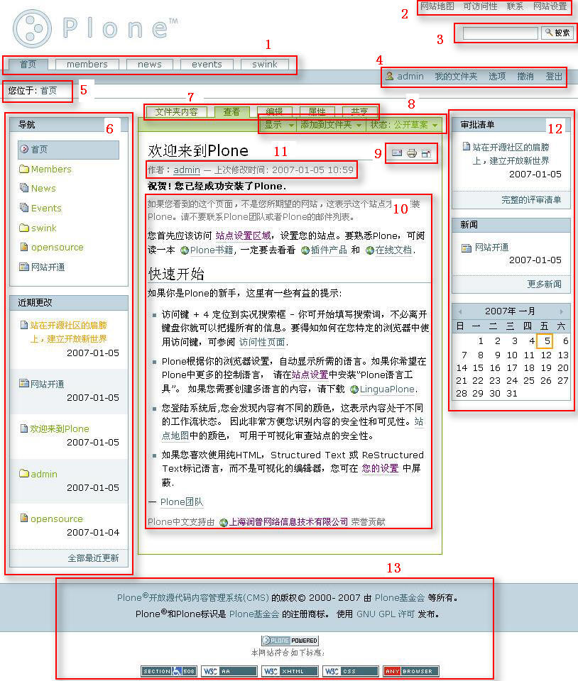
   
   图 3.1 Plone站点结构图

整个站点界面包括如下元素(元素后括弧中的序号和图中对应):

- 【页首标签】(1)：页首的标签，包括“首页”、“Members”、“News”等网站分区的标签。

- 【网站操作项】(2)：站点的一些操作项，包括“网站地图”、“联系”、“高级搜索”、“网站设置”等。
   
- 【快速搜索区】(3)：网站右上方的快速搜索区域，可以对网站内容进行快速便捷的搜索。

- 【个人栏】(4)：“页首标签”下方的横条，放置登录用户相关的操作。登录后，这里包括“个人文件夹”、“选项”、“撤销”、“登出”等。

- 【路径栏】(5)：“个人栏”下方的横条。指示内容的当前位置，同时可点击查看路径中的上级文件夹。

- 【左面板列】(6)：位于页面主体内容左边，一般包括“导航”、“登录”等面板。管理员可设置“左面板列”上的面板。

- 【内容标签】(7)：如果用户有足够的权限，则可看到内容标签。一般包括“内容”、“查看”、“编辑”、“共享”等标签。

- 【内容菜单栏】(8)：如果用户有相关权限，则可看到此栏中的“添加内容下拉菜单”和“改变状态下拉菜单”

- 【内容工具条】(9)：内容工具条上以图标的形式，提供当前内容的常用快捷工具，包括打印、页面发送等。

- 【内容正文区】(10)：内容的正文，位于页面正中。

- 【内容附属信息】(11)：位于内容标题下方，包括分类、作者、版权、修改时间等内容信息。

- 【右面板列】(12)：位于页面主体内容右边，一般包括“日历”、“新闻”等面板。像“新闻”和“审批清单”有则显示，没有则不显示在面板上。管理员可设置“右面板列”上的面板。

- 【页脚信息】(13)：Plone版权等信息，管理员可以修改或添加内容。

Plone站点的每个页面都是由以上所有或部分元素组成。
   
类比Windows资源管理器界面 
--------------------------------------------
资源管理器是用于管理个人电脑上的文件，而Plone则是用于管理服务器上的内容。在逐步认识Plone后，会发现Plone网站的组织结构非常类似于Windows资源管理器。一个对Plone陌生的用户在一开始对Plone网站上操作的每一步都会觉得很熟悉。他们会发现Plone从整体界面、添加内容、文件夹显示模式以及对文件的操作等等，都可以与在Windows上对文件夹和文件的操作进行类比。

先回顾一下资源管理器界面，如图3.2所示。

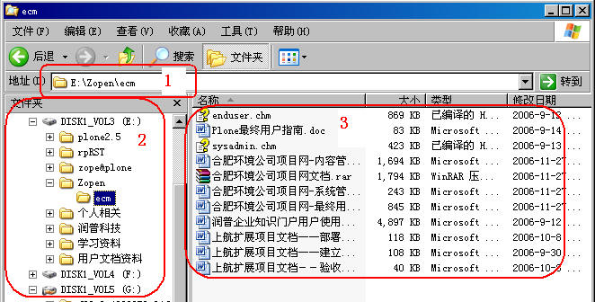

   图 3.2 资源管理器界面

再看看Plone网站内容导航界面，如图3.3所示。

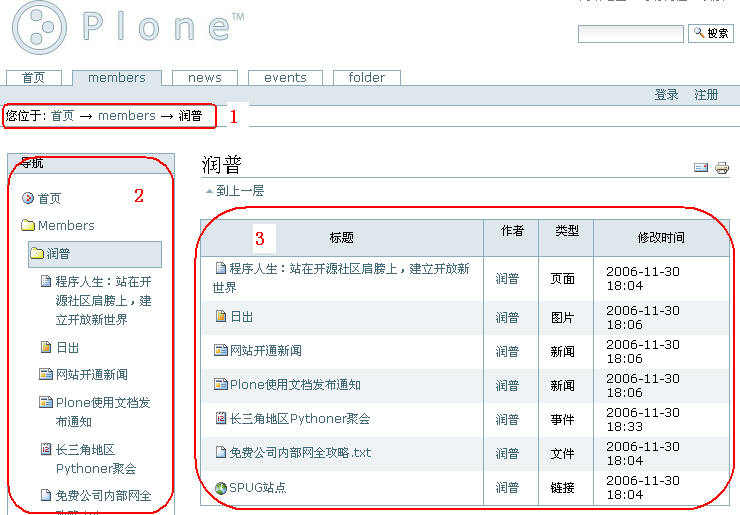

   图 3.3 Plone站点内容导航界面

这二者非常类似，资源管理器上的文件夹路径对应Plone中的路径栏（两图中的区域1），左边显示的都是导航条（两图中的区域2），而正文显示的是文件夹内容（两图中的区域3）。

不仅仅是在界面上类似，在Plone的使用中，站点的很多操作和使用界面上也都和Windows资源管理器界面非常之类似，下面在Plone使用的过程中会一一做类比。

进入Plone
=====================
初始设置
--------------
在网站管理员部署好并添加站点后，需要对站点做初始设置工作，常需设置的有：

- 设置网站标题
- 是否开启编辑内容的英文ID
- 是否开启用户自行注册功能
- 是否开启用户选择密码功能
- 是否开启用户文件夹
- 网站邮件服务器和邮件寄送人设置
- ...

.. Note:: 以上特性是Plone3.0具备的，有些特性Plone2.5及以前并不具备，Plone2.5及以前可设置用户选择皮肤的特性。

用管理用户登录到站点，进入到右上方的【网站设置】，如下图3.4所示。

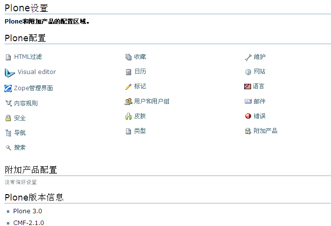

   图 3.4 网站初始设置

你可以在Plone配置中的【网站】页面里设置网站标题，设置是否开启编辑内容的ID，开启外部编辑器等；在【安全】页面里设置是否开启用户自行注册，设置是否开启用户选择密码，设置是否开启用户文件夹，设置是否开启任何人查看“关于”信息等；在【邮件】页面里设置网站邮件服务器和邮件寄送人。

初始设置只是网站管理员在开通好站点时做的一小部分工作，在网站使用和维护过程中经常需要对网站进行设置，后面一节将详细介绍使用Plone控制面板设置网站。

登录、注册
--------------
打开浏览器进入你的Plone站点，如需要注册，可在页面的右上方点击【注册】链接，或者左侧框登录面板中的【新用户】链接，进入注册页面，注册Plone站点的用户。Plone站点界面的注册区域，如图3.5所示。

.. figure:: img/using/join.jpg
   :alt: 注册

   图 3.5 Plone站点的注册区域

进入注册页面后，通常有两种注册方式：站点生成密码并发送至邮箱，或者允许用户设定密码，使用哪一种方式是由站点管理员所控制的，在下文中会有详细介绍；注册页面中的注册项旁红色方点意味着是此项为必填项；注册的密码不要过于简单，如果忘记密码，可以从你所填写的电子邮件地址中获取它。注册页面如图3.6所示。

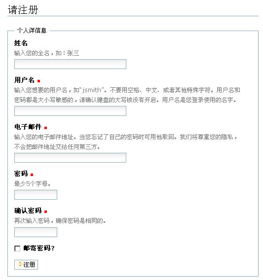

   图 3.6 Plone站点的注册页面

注册完后就可以登录了，页面上有两个地方供你登录，你可以使用左侧的登录框，或者在右上方的【登录】链接进入登录页面，填写注册时用的用户名和密码登录。Plone站点的登录区域如图3.7所示。

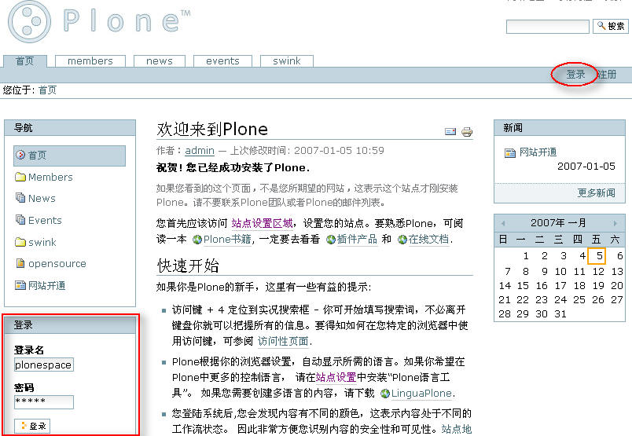

   图 3.7 Plone站点的登录区域

登录后，站点发生了下面这些变化：

- 消息显示你现在是登录状态
- 登录和注册链接被个人栏的内容替换掉了
- 左侧的登录框不再显示了
   
点击个人栏的【登出】链接，就可登出Plone站点，这样可再次返回匿名用户的身份，回到匿名用户浏览站点的样式。

个人文件夹和选项设置
=======================
登录之后，右上角的个人栏中将会提供你作为站点成员所拥有的选项。如图3.8所示。

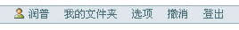

   图 3.8 登录后的个人栏
   

其中的一个功能是每个成员在他们加入站点的时候系统都会为其创建一个个人文件夹。个人文件有特定的安全设置，只有成员本身（以及管理员）才能在其中添加或修改内容。通过点击右上角的【我的文件夹】链接即可访问个人文件夹。

在个人栏中，有一个【选项】的链接，进入【我的选项】页面可改变你在Plone站点环境中的一些个人相关设置。如图3.9所示。

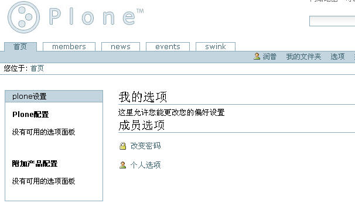

   图 3.9 我的选项页面

改变密码
-----------
在“我的选项”页面中有【改变密码】的链接，密码修改表单可以让你修改密码，你需要输入当前的密码以及两遍新密码。修改会立即生效，你无需再次登录，只需下次登录时使用你的新密码。图3.10是改变密码的页面。

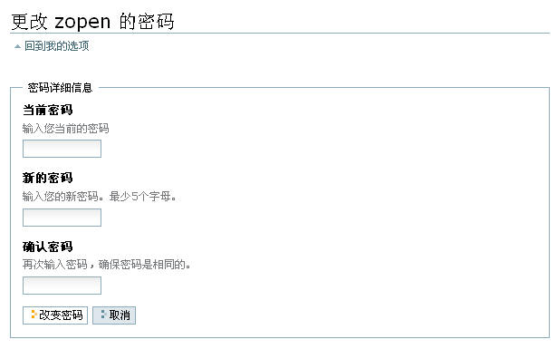

   图 3.10 改变密码页面

个人选项
--------------
【我的选项】中还有一个【个人选项】的链接，个人选项的表单可以让你修改很多设置以达到改变站点呈现方式的目的。这些设置保存在服务器端，这样可以在多次站点访问之间保持一致。个人选项页面如图3.11所示。

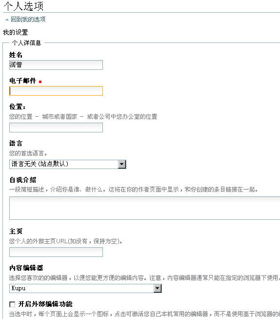

   图 3.11 个人选项页面

个人选项属性说明：

- 【姓名和E-mail】：姓名和E-mail是在注册页面中设置的

- 【内容编辑器】：作为内容编辑者，选择你喜欢的的编辑器，以便你能更方便的编辑内容。

- 【开启外部编辑】：作为内容编辑者，可选择是否开启外部编辑。当选中时，每个内容页面上会显示一个图标，点击可激活你自己本机常用的编辑器，而不是使用基于浏览器的编辑器来编辑该内容。这需要在客户端安装一个叫做外部编辑器的附加软件。

- 【允许英文代号】：设置英文代号（也叫做ID）在编辑时是否可更改。如果英文代号不显示，他们将自动生成。ID属性用于在系统内部表示内容本身，同时他们也在Web地址以及该对象的URL中出现。

- 【搜索时列入】：网站的成员搜索功能中，是否能够找到你的名字。

- 【外观】：网站的外观选择。

- 【像片】：上传的个人像片。

.. attention:: 开启外部编辑，允许英文代号，和外观属性需要网站管理员在网站设置或皮肤设置中开启相关设置后，用户才会在用户属性中看到，下文中会详细介绍。 

填完必需的修改之后，单击【保存】按钮以提交设置，就设置好个人在Plone站点的环境了。

添加、编辑内容
===================
设置好个人环境，下面来熟悉在Plone站点中添加和编辑内容。

基本内容类型介绍
------------------
Plone站点中以各种内容类型去区分需要添加的内容，如：图片，链接，文档，等等。下面先介绍一下这些内容类型。

- 页面：这种类型向用户展现静态的信息，同时也是最常见以及最接近典型Web页面的内容。

- 新闻：这是一种显示在新闻标签下的文档类型（比如说，新闻稿发布）。

- 图片：图片类型，例如 .gif 或者 .jpeg 文件。Plone可自动生成各种大小比例的缩略图。

- 文件：这是另一种类型的内容，例如文本文件、视音频文件、压缩文件或者任何你想上传的一种文件。

- 链接：这是指向某地址的链接，可以是内部的也可以是指向其他站点的外部链接。

- 事件：即将到来的活动、会议、研讨会或者其他类型的事件。

- 查询集：这是一组其它内容的集合。本质上是一个预先设好的搜索标准（条件），用户可以使用这个搜索标准。只有具有相应权限的用户可以添加查询集。

- 文件夹：就像硬盘上的文件夹一样，用户可以将内容放入其中以便以后使用。

添加、编辑页面
------------------
添加内容之前首先确定已经登录，只有登录且拥有权限的用户才能添加内容。然后，单击右上角的【我的文件夹】链接，进入这个完全由你掌控的地方。

能添加内容的页面和你不能添加内容的页面在显示上是有些不同的，可能你已经发现，如果您有权限往某个文件夹添加内容的话，该文件夹的上方应该有绿色的边界。如果这个绿色边框(即内容标签)没有出现，那您将无法添加任何内容；这个边框包含了你可以在当前位置执行的操作。可看到有一些标签如【文件夹内容】、【查看】、【属性】、【共享】等。在这个“绿色边框”的右上方有【操作】，【显示】，【添加到文件夹】等下拉菜单。如下图3.12所示。

  
   图 3.12 添加内容

单击【添加到文件夹】下拉菜单即可添加新内容。这里先类比一下Plone站点和Windows中新建内容，如下图3.13所示。

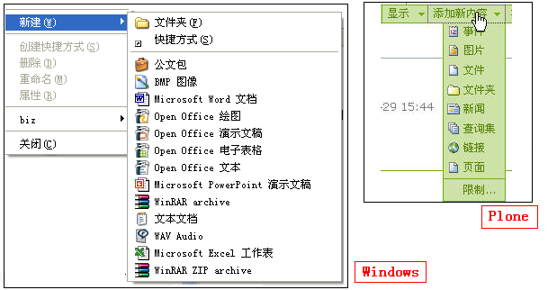

   图 3.13 类比Windows新建内容

编辑页面
............

如下图3.14所示，在我的文件夹中添加页面。

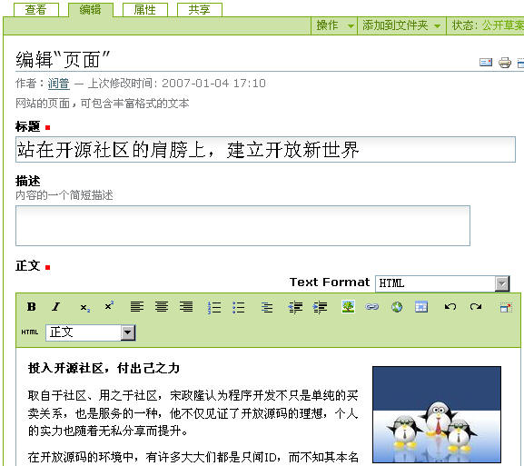

   图 3.14 编辑页面

编辑内容需填写标题、描述（可填）、正文，然后点击【保存】保存编辑内容。从上面的图中可看到编辑正文的部分是用了一个编辑工具－－Kupu，下面就来了解一下Kupu的使用。

Kupu的使用
...............
Kupu是在内容框中编辑页面的工具。Kupu是一个功能强大的可视编辑器，支持文本格式编排、图片和链接的插入能力。如果你已经能熟练使用Office套件工作，你便可以轻松地使用它。

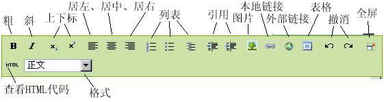

   图 3.15 Kupu的使用

Kupu可以对文字做到加粗，斜体等处理，还有其它处理的功能；可以对文本内容进行居左、居中、居右的调整；对文本内容可几种列表显示；可在文本中添加图片，在上图3.15中添加图片可在站点其它位置找到图片还可从从本地上传，并可做多种显示效果；可链接本地内容，也可以链接其它站点的内容，链接其它站点的内容，将会在链接的内容上有一个链接的锚点；在Kupu中实际上编辑完了就生成了HTML代码，点击Kupu中的HTML链接可查看源代码，同时也可以编辑源代码。

Kupu为符合标准，默认做了一些设置，它过滤了一些HTML标记，所以你可能在其它页面中复制一些有颜色的文字后，粘贴在Kupu中，保存后字体不显示保存前的颜色了。Kupu的这些设置管理员可以去重新设置，包括定义更多的表格和段落样式，下文的Kupu可视编辑器配置中有详细介绍。

设置页面的属性
....................
点击内容标签的【属性】，可以查看和设置页面的属性。

任何的内容对象都会有一些属性。这些属性就叫做 元数据（metadata） ，提供诸如关键字，版权以及投稿人等信息。

由于这些元数据通常不会在用户浏览文档时显示，他们往往都是被用在文档的某些特殊需求上。所以输入这些数据的主要原因是为了像搜索或者分类这样的任务而添加这些信息。

可以通过绿色的【属性】标签来访问这些属性（元数据）。这个属性表单中有如下一些被其他内容类型公用的域：

- 【在导航中排除】：内容默认是在导航中显示的，选此属性可让内容不在导航中显示。

- 【关键字】：只有站点管理员才在关键字右侧区域显示有添加关键字，并能添加。一般用户可选择管理员预先添加好的关键字。关键字属性一般做为内容搜索或者分类会用到。

- 【贡献人】：贡献人员的名字。每个贡献者应该独占一行。

- 【创建人】：负责创建这个内容的人。

- 【生效日期】：文档可被获得的日期（当然，他必须先发布了）。如果没有设置生效日期，该文档会立即生效。

- 【失效日期】：内容失效的日期。到时内容将自动对其他人变成不可见。如果不设置，它将永不失效。

- 【语言】：这是指该文档以何种语言写成，默认是创建者设置默认的语言。

- 【版权】：内容的版权信息。

Plone3.0中编辑页面内容和编辑页面属性都在一个页面中（Plone2.5及以前的版本编辑页面和各编辑属性在编辑区的几个页面中，添加、编辑一个页面经常需切换到几个页面编辑设置。），如下图3.16所示。

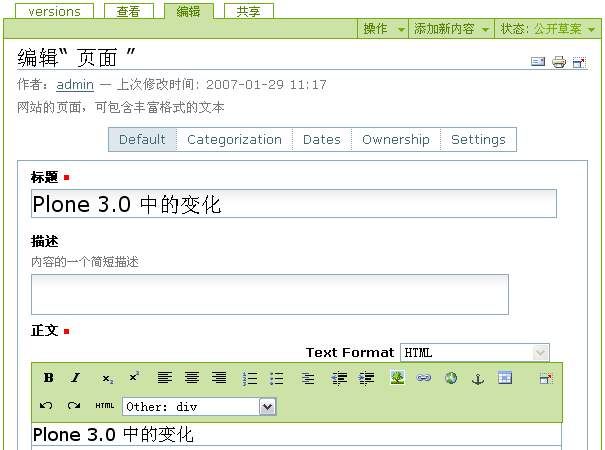

   图 3.16 Plone 3.0 添加、编辑内容的变化

在图中，Plone 3.0 将属性标签页拆分到编辑标签页中的 Categorization，Dates，Ownership，Settings 几个扩展编辑页。编辑内容在 Default 页中编辑好内容，需设置关键字，生效/失效日期，版权信息，其它如“在导航中排除”的设定，直接到 Categorization ，Dates ，Ownership ， Settings 对应的扩展编辑页中设置。这样很方便了添加、编辑内容的过程。

编辑页面中的Settings标签页中有这样一些可设置的特性：

（1）评论的功能

Plone站点中的任何内容都可以被讨论。内容的拥有者(一般被认为是内容的创建人)可通过在编辑页面中设置，使其允许被讨论。

.. Note:: Plone3.0的评论设置在编辑页面的Settings标签页中，Plone2.5及以前的版本设置评论功能在编辑页面下方，如下图3.17所示。

  .. figure:: img/using/discuss.jpg
     :alt: 允许讨论
   
     图 3.17 设置讨论

如果允许讨论，在查看文档内容的同时，已经发表的评注也会同时显示，成员用户可以参与评注。下图3.18是某个文件有用户评注的截图。

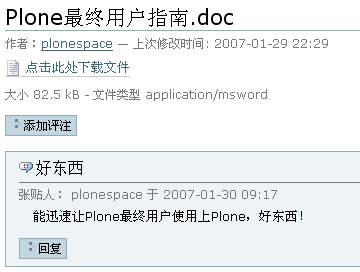

   图 3.18 评注页面

（2）从导航中排除

你可能需要某个页面或某个文件夹不出现在导航中和不出现在站点栏目中，可在这里设置。

（3）开启前后页导航（只存在于文件夹设置中）

在某些特殊的文件夹中，文件夹的内容有很强的前后内容关联性，可以在这个文件夹里开启前后页导航。比如某个文件夹里存放了一个教程或一本书，里面的页面是分章节来存放的，你希望读者能在看到第一章的页面后能很方便地链接到第二章，设置开启前后页导航就可以轻松实现。

（4）呈现方式（只存在于页面设置中）

Plone3.0中页面可以以幻灯页的方式显示，勾选Settings中的呈现方式设置就可以看到页面上有如下图的链接，点击这个链接可以以幻灯页的方式显示页面。

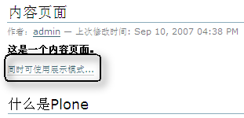

   图 3.18 页面的幻灯呈现方式

（5）显示目录（只存在于页面设置中）

Plone3.0中可让页面在页面可上侧显示页面的目录，以方便阅读，设置好后页面如下图3.19所示。

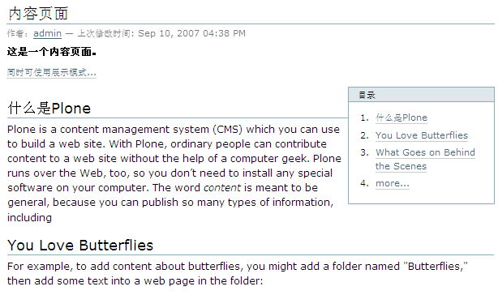

   图 3.19 页面的目录呈现方式

Plone 3在使用了页面版本管理开始，拥有了最为先进的版本管理机制。版本管理允许你编辑后保存一个新的版本，可以比较以前的版本，也可以回退到以前的某个版本。Plone3.0使用CMFEditions实现页面的版本管理，它是集成在Plone中的扩展产品。我们在编辑区【查看】，【编辑】标签页并排的有一个【历史】(history)标签页，Plone3.0中编辑内容将保存为一个新的版本，你可以在下图3.20所示，为新版本加一个简单的注释。

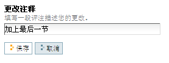

   图 3.20 为新版本加简单的注释

我们可以在【历史】(history)标签页中看到所有的版本，所加的新版本注释显示在“评注”栏中，在“操作”栏中，我们可以进行“比较当前版本”、“比较前一个版本”、“回退到这个版本”等操作。如下图3.21所示。

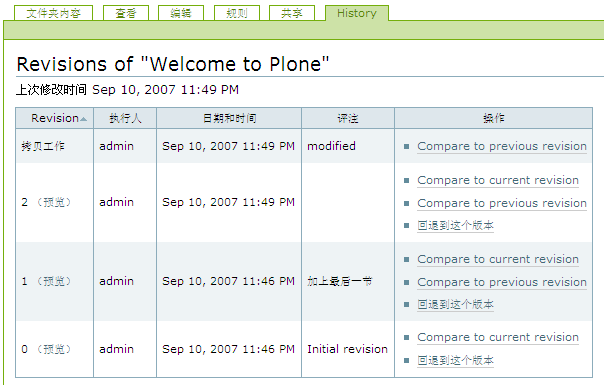

   图 3.21 历史版本

我们来看看比较历史版本的界面，它以不同颜色的色块来表示添加的、更改的、删除的、和更改的标记的相比较的内容，如下图3.22所示。

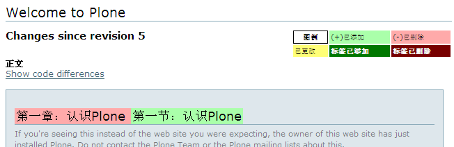

   图 3.22 比较历史版本

Plone3.0中使用了Ajax技术在很多应用场合提升了用户体验，最为醒目的地方就是你可以随时随心所欲的编辑内容。在你对某个内容拥有编辑权限的情况下，你查看此内容时鼠标经过内容的标题、描述、正文部分时，页面的此区域会随鼠标凹陷提示，单击此区域即可编辑，如下图3.23编辑描述部分。

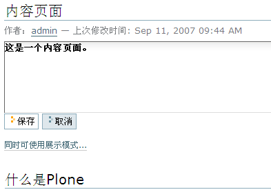

   图 3.23 编辑描述

添加、编辑其它类型内容
-------------------------

添加、编辑图片
..................
在内容标签中的【添加到文件夹】的下拉框中选择添加图片，选择本地的一张图片后，填上标题和描述信息后保存，显示如下图3.24所示。

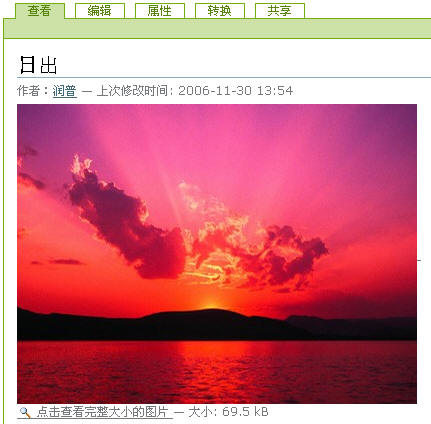

   图 3.24 图片显示页面

这个页面显示的是上传图片的缩略图，可以在图片单击下方的【点击查看完整大小的图片】查看完整图片。

图片编辑好后并不是不可重新编辑，再进入编辑页面，可删除此图片，可替换成其它图片。Plone能将不同大小的图片处理显示成一套缩略显示图，所以在Plone中，能很方便地看到图片缩略图，图3.24中显示的图片展示，和查看完整大小的图片等；另外显示图片的页面上的内容标签多了一个【转换】的标签，进入【转换】标签页，可对图片进行不同的角度的调整做显示，这也是Plone显示图片的一个灵巧的功能。

添加、编辑新闻
...................
新闻是网站常用的向读者展示信息的方式。新闻所包含的属性与页面基本相同，多一个可从本地上传图片的编辑属性，图片作为新闻的主题图片。（这里就不做添加、编辑详细介绍了。）

新闻发布后会出现在news标签下和站点右侧栏新闻面板中，如图3.25所示。

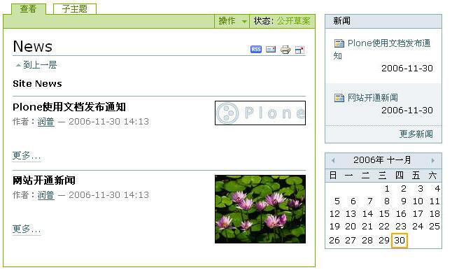
    
   图 3.25 新闻显示

添加、编辑事件
.................
事件可以是将来会发生的事情，也可以是已发生了的事情。添加事件到Plone后，它们会在日历中出现。选择下拉菜单中的Event来添加活动。尽管事件的属性比大多Plone对象都多，但他们通常都很容易理解。

编辑完后保存的事件，如图3.26所示。

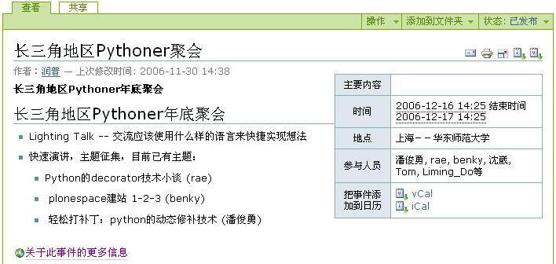

   图 3.26 事件显示

事件发布后会出现在event标签下和站点右侧栏近期事件面板中，在日历中事件发生的当日也会显示相关信息，如图3.27 中事件在events栏目中显示，在图3.28中事件在近期事件框中和在日历中显示 。

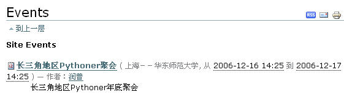

   图 3.27 事件在events栏目中显示

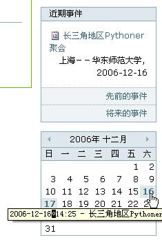

   图 3.28 事件在近期事件框中和在日历中显示

内容审批和发布
---------------
通常，网站的新闻，必须通过审批后才能发布，而且一旦发布后，原始作者只有收回后才能修改。这是一个典型的内容审批发布流程。

Plone使用工作流机制使内容在不同状态间流转，内容的审批和发布也正是使用工作流的这一特性实现的。关于工作流的详细介绍请阅读第七章《管理工作流》。下面以社区工作流（Community Workflow）的状态来介绍内容的审批和发布（社区工作流在Plone2.x中是Plone内容的默认工作流，Plone3.0默认工作流采用了简单发布工作流Simple Publication Workflow）。

在Plone2.x中，或在Plone3.0使用社区工作流时，新闻创建之后处于初始的【公开草案】状态（Plone3.0使用简单发布工作流内容创建后处于初始的【保密】状态。）。 在页面右上方的【状态】下拉菜单来改变内容状态，如下图3.29所示。

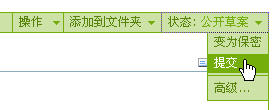

   图 3.29 改变内容状态

首先作者选择下拉菜单中的提交以便发布对象，作者一般无权直接发布内容，只能将内容提交审批。当某个内容被递交审批的时候，它同时也被已到了“审批”状态下，这是“公开草案”和“发布”之间的中间状态。它允许拥有“审批员”角色或者“管理员”角色的用户可以在内容被正式发布之前对其进行审批。在你提交了对象之后，你可以在右上角看到该对象处于“审批”状态。另外，如图 3.30 所示，【编辑】标签没有了。

.. attention:: 如果你是以管理员身份登录的话，会发现在下拉菜单中还有一个“发布”的选项，该选项可以让你直接发布内容而无需任何中间步骤。

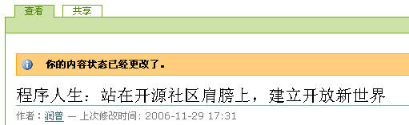

   图 3.30 内容审批

在内容标签中的【状态】的下拉列表中还有个“高级”的选项，通过它可以打开状态表单以改变对象的状态。该表单有如下属性：

- 【生效日期】：见上节中设置页面的属性。

- 【失效日期】：见上节中设置页面的属性。

- 【评注】：可以是任何对于这次状态变化的评注，该评注将会被系统纪录。比如说，你可能会输入：“第一稿；Bob，请检查下第二段”。

- 【改变状态】：通过下拉菜单的方式显示可能的选项。例如“提交”，“变为保密”等等。还有一个选项，“不改变”，在没必要改变状态时可能用到。

有哪些工作流状态
.....................
在第七章将对工作流详细介绍，站点中的内容都是在工作流中流转，如下图3.31，用户可将内容在不同的状态中流转。

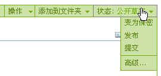
    
   图 3.31 工作流状态的扭转

Plone默认配置有下面这些状态：

- 【公开草案】：公开草案是内容对象创建后的默认状态。所有用户均可通过搜索来找到该状态的内容并可直接通过URL来访问。公开草案状态的对象在导航或文件夹内容中显示为绿色。对象拥有者和站点管理员均可以修改该对象。（Plone3.0的默认工作流简单发布工作流中没有这个状态。）

- 【保密】：只有对象拥有者和具有管理员权限的用户可以访问和编辑私有状态的对象。它们不会在其他用户的搜索结果和浏览路径中出现。

- 【待审】：待审是那些已提交审批，并且准备发布的对象的状态。从用户的角度看，待审内容和公开草案没什么区别。这两者直接的区别在于待审的对象被标志为等待审批，站点的审批员负责发布或拒绝该对象。只有管理员和审批员可以修改审批对象。

- 【发布】：发布对象对所有站点访问者都是可见的。他们会出现在搜索结果和浏览路径中。他们还会在自身类型的区域中出现（新闻对象，举例来说，就会出现在新闻标签中）。只有站点管理员可以编辑发布对象，但对象所有者可以收回对象来编辑（收回对象导致对象回到公开草案状态）。

审批并发布
..................
作为审批员，登录后会在主页的右侧栏看到“审批清单”的面板，列出了已被提交给你或其他审批员审批的内容，如果没有审批内容则面板不会显示。

.. attention:: 管理员也有审批的权限，所以有审批内容，也会在管理员的右侧栏显示“审批清单”。

图3.32是出现在审批面板的审批清单，当点开待审批内容，作为审批员可以做以下动作：

- 【发布】：选择发布意味着审批通过，会把内容的状态改为发布状态。

- 【拒绝】：通过选择下拉菜单中的“拒绝”拒绝发布，这会使该内容回到公开草案状态，同时表明你对该内容并不满意。通常，你会点击高级选项打开评注表单，添加为什么拒绝发布的理由。

- 【编辑】：先编辑，然后再做上面的操作。作为审批员，你可以做任何你想要做的操作，只需使用【编辑】标签就可以了。

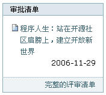

   图 3.33 审批清单

怎样编辑已发布的页面
.......................
文档一旦发布后，必须“收回”才能进行编辑。选择【状态】下拉菜单中的【收回】以收回文档，这会将文档置回公开草案状态。一旦回到公开草案状态，你就可以重新编辑并再次递交审批。

为确保所有内容都要经过审批是有必要的。就是说，必须确保对于任何一个页面所做的编辑得要有适当的审批。具有管理员角色的用户可以在任何时候编辑内容，这样，他们可以迅速的修复一个排版错误而无需任何审批步骤--然而这是在足够信任管理员的情况下！如果你是管理员，你可以在任何内容中看到【编辑】标签，直接编辑和修改内容就可以了。

共享页面
-------------
共享页面可以给系统的其他用户或用户组更多的关于你的内容的权限。这是一个比较高级的特性，会在第六章中详细讨论。

内容的组织
==============
Plone有两个主要的内容组织方式：使用文件夹和使用查询集。

使用文件夹
---------------
文件夹是最简单、最强大的内容组织方式，它就像Windows中的文件夹或目录一样。文件夹可以包含任何类型的内容；内容可以在文件夹中或在文件夹之间进行复制、剪切、粘贴等操作。

查看文件夹中的内容
......................
查看文件夹中的内容有多种显示模式（在【内容标签】的【显示】下拉框中选择）。

切换文件夹的显示视图也非常类似于Windows资源管理器中切换视图，如图3.34所示。

.. figure:: img/using/view_mode.jpg
   :alt: 显示视图

   图 3.34 类比显示视图

- 【标准视图】：默认看到的文件夹视图，列出文件夹中的内容，包括各个文件的图标、标题、作者、修改时间、描述等信息的显示

- 【摘要视图】：以摘要的形式显示文件夹中的内容，news页面就是以摘要视图来显示的。

- 【表格视图】：以表格的形式显示文件夹中的内容。

- 【缩略图】：以缩略图的形式显示文件夹中的内容。如果文件夹中是图片等内容，缩略图显示文件夹会像相册一样显示文件夹中的内容（图片）。

- 【选择一个条目作为默认视图】：选择文件夹中某一条目（页面、图片、文件等）作为默认视图。
   
内容的移动、复制、改名、删除
..............................
下面是文件夹内容页面，如图3.35所示。

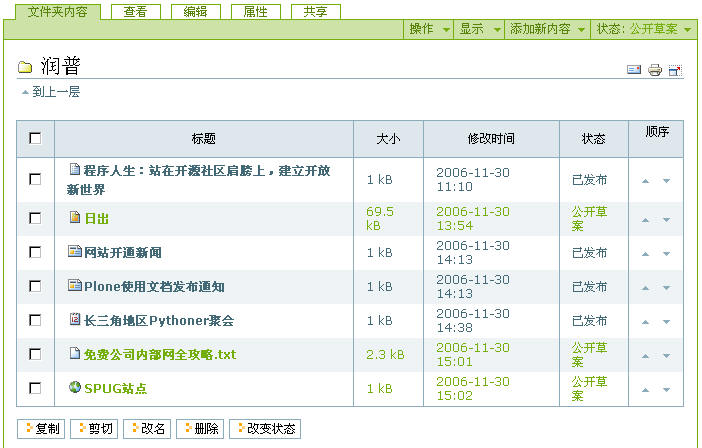

   图 3.35 文件夹内容

在这个页面中可以看到在文件夹内容条目的下方有【复制】、【剪切】、【改名】、【删除】，【改变状态】的按钮，这里可提供对一个或多个文件进行复制、剪切、改名、删除和改变状态等操作，还可以调整各个内容的排列顺序。   

其实前文在介绍了如何添加单个文件后，没有介绍可对单个文件进行复制、剪切、改名、删除等操作。在这里补充一下，在内容标签下方，有一个【操作】的下拉菜单，在介绍添加内容、发布内容、显示内容视图的时候，你便已经看到在【添加新内容】、【显示】等下拉菜单旁有一个【操作】的下拉菜单，这是对当前内容的相关操作。但是它只是对单个文件进行操作，不能同时对多个文件进行操作。在图3.35中，也就是文件夹内容页面中，可以对多个文件进行操作。类比一下在Windows和在Plone中对文件的操作，如图3.36所示。

.. figure:: img/using/plone-windows-actions.jpg
   :alt: 添加内容

   图 3.36 类比内容操作项界面

发布文件夹
..................
在显示某内容时在内容标签处可以对单个内容进行发布，也可以在文件夹页面中选择多个文件进行改变状态的操作，那么可不可以直接发布文件夹呢？可不可以直接发布文件夹使文件夹里面的内容全都发布了呢？

一般来讲，发布文件夹没有具体的意义，所以在Plone中发布文件夹是拥有者直接发布（拥有者不需要管理员权限就可发布所拥有的文件夹），没有提交审批的过程。不过，单独对文件夹发布，有时是因为站点设置没有发布的文件夹不能在导航条上显示，这时需要创建者或管理员去发布文件夹。

管理员有时想发布文件夹并将文件夹内所有文件随之全部发布，在工作流下拉菜单中选择【高级】，进入发布过程页面，在【包括文件夹内的内容】项中选择，然后发布（当然也可以改变到其它状态）。

.. attention:: 这一步只有管理员执行才会全部发布，因为对单个文件而言普通用户没有直接发布的权限。
   

使用查询集
-------------
查询集可预先定义一个搜索Plone站点的内容条件, 并按你指定的方法去显示。查询集内一般不保存任何内容，但是可自动显示最新的满足搜索条件的内容。

利用查询集可创建Plone系统内所有符合查询条件的内容集合。通过“规则”内容标签页面，可以设定查询条件，查询集将对所有被系统索引了的内容进行查询。你可以从不同层面设定查询条件：物理位置、创建时间、状态等。查询集中仅仅是符合条件的内容的链接和内容的相关信息，并没有象普通的文件夹一样，保存内容本身。

Plone中默认情况下，只允许管理员角色的用户创建查询集内容。熟悉查询集使用的最好方法就是通过例子来学习，下面的例子是添加一个查询最近一周所添加内容的查询集。

例 3.1 查询最近一周所添加的内容的查询集

#. 以站点管理员身份登录站点，在文件夹中添加查询集；填写标题、描述，这里以表格方式显示内容的标题、创建时间、创建人（Creator），如图3.37所示。

   .. figure:: img/using/add_topic.png
      :alt: add_topic

      图 3.37 添加查询集

#. 编辑完后，单击【保存】，查询集就创建好了，下面来设置查询集的查询条件。
#. 进入创建的查询集的【条件】标签页，这个页面可设置“添加新的搜索条件”和“设置排序次序”，如图3.38所示；在“添加新的搜索条件”中添加“创建时间”和“条目类型”条件，设置以内容的“创建时间”逆序排序。

   .. figure:: img/using/topic_condition.png
      :alt: topic_condition

      图 3.38 添加查询集条件

#. 添加查询条件和设置排序方式后，下面来设置刚才添加的条件。在创建时间条件中设置日期小于一周，日期范围条件是"in the past"；设置条目类型为事件、文件、图片、页面、新闻。如图3.39所示。      

   .. figure:: img/using/topic_conditions.png
      :alt: topic_conditions

      图 3.39 设置查询集条件
      
#. 设置好后，单击【保存】，回到查询集页面，看到下图3.40的页面，查询集列出了我们需要的内容。

   .. figure:: img/using/topic_view.png
      :alt: topic_conditions

      图 3.40 查询集

这样，添加一个查询最近一周所添加的内容的查询集就完成了，查询集的使用非常之灵活，你完全可以设置更为复杂的查询条件。另外，查询集标签页中还有【子文件夹】、【子主题】等标签页。子文件夹可以在查询集中添加子查询集，子查询集可对当前查询的结果再进行指定条件的搜索；子主题是子查询集所搜索到的内容。

      

搜索内容
===================
在Plone中有两种搜索的方式：通过Plone站点顶部的搜索功能，可以对站点所有内容进行全文检索，安装了中文支持后的站点也支持对中文内容的检索。如图3.41所示。

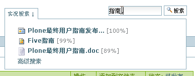

   图 3.41 搜索内容

在图中能动态地搜索到内容，这是由livesearch（实况搜索）所控制，你可以在网站设置的搜索设置中关闭实况搜索。   

搜索内容还可以通过使用高级搜索功能，设置更多的搜索条件、缩小搜索范围。你可在图中动态搜索内容的下方单击【高级搜索】链接，或在搜索页中进入，可打开高级搜索页面。
在高级搜索页面中，你可以通过设置标题、关键字、描述信息、状态、创建时间、内容类型以及作者等条件进行查询。

左右列管理面板和控制面板
=========================================
左右列管理面板
-------------------------
进入站点后，默认情况下，我们看到在站点左侧有登录面板、最近更新面板；在站点右侧有审批清单面板、新闻面板、事件面板、日历面板等。那么我们想调整这些面板，或去除、添加新的面板如何做呢？

在Plone3.0中出现了左右列管理面板，能够在站点界面上很方便地管理左右列面板。在使用管理员用户登录站点后，会在站点左右侧看到“管理面板”的链接，如下图3.42所示。

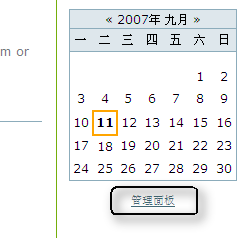

   图 3.42 管理面板

通过这个链接进入到管理面板页面，如下图3.43所示。

.. figure:: img/using/manage_portlet.png
   :alt: manage_portlet

   图 3.43 左右列管理面板

在这个界面中可以在Add portlet下拉菜单中添加新的面板，在Portlet assigned here处调整面板的排列顺序和删除某个页板，在Block/unblock Portlet处设置面板显示条件。下面分别看看使用方法。

（1）添加面板

从Add portlet下拉菜单中选择需添加的面板，可以添加预先定义好的登录面板、审批清单面板、搜索面板、最近更新面板、新闻面板、导航面板、事件面板、日历面板，还可以从通过一段RSS链接添加RSS聚合面板，和添加自定义宏面板。如下图3.44所示。

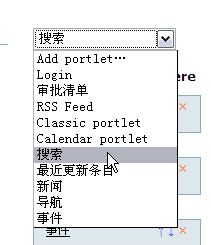

   图 3.44 添加面板

（2）编辑面板

选择好了的面板是可以编辑的，比如你希望在新闻面板中显示更多条目的新闻，或调整显示其它状态的新闻。点击管理面板里新闻面板的链接进入如下图3.45所示界面。

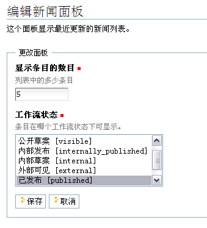

   图 3.45 编辑面板

（3）设置面板显示条件。

通常可能在不同目录中，或针对不同的用户，或针对不同的类型所显示的左右列面板不同。在管理面板界面中可设置面板的显示条件。

比如在某一个新的文件夹里，我们需要与站点全局的面板显示不同，希望日历面板和新闻面板显示在左侧。那么，进入这个文件夹的管理面板处，首先在管理面板界面中设置Parent portlets为Block，如下图3.46所示。再使用上面添加、删除面板的方式添加删除面板。

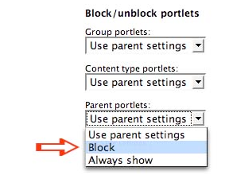

   图 3.46 设置面板

通常有这样的需求，你需要为某个组分配一个仅这个组的用户才能看到的面板，管理面板能很方便地实现。首先进入用户和组管理，进入到需分配的组，如下图3.47所示，进入组面板设置，在这里你就可以专门为这个组设置面板了。

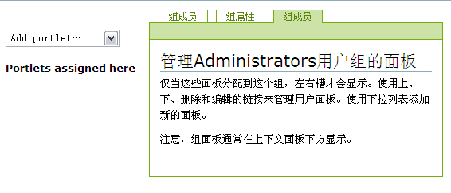

   图 3.47 组面板

还有这样的需求，你需要为某一类型的内容显示某个面板，管理面板也能很方便地实现它。首先进入网站设置中的类型管理，进入到需设置的内容类型，如下图3.48所示，能看到“管理面板分配到这个类型”的链接，在这里便可专门为这个类型设置面板了。

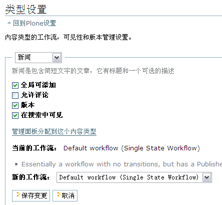

   图 3.48 内容类型面板

Plone3.0中提供的管理面板功能非常地灵活，能轻松结合多种方式实现任何一个栏目显示的面板。而这以前要实现它，你可能需要写一些代码，需更复杂的设置才能实现。

Plone控制面板
-------------------------
作为网站管理员，当你创建并部署好站点后，可能首先要做的事情就是对网站的基本设置。比如，需要设置站点标题、描述、站点“寄信人”名字、地址等。当然，过后对站点的调整、基本设置等工作都需要通过【网站设置】来完成。下面介绍如何通过Plone控制面板来完成网站的设置工作。

Plone控制面板是什么？
........................
先回顾一下我们所熟悉的Windows中的控制面板，它是Windows中的一个系统工具，系统管理员和一般用户都可通过它对Windows做一些重要的系统设置。如添加/删除程序、区域和语言选项、用户账号等。

Plone中也有设置Plone站点的工具，也引入“控制面板”这个常见的术语，我们来看看Plone中“控制面板”能做些什么？

不要把它和ZMI（Zope管理界面）的控制面板搞混淆了。ZMI控制面板向你展露的是底层的ZMI选项，而Plone控制面板提供了一个更加友好的用户接口来使用ZMI所提供的功能（Plone的趋势也是将ZMI所提供的功能逐步地转移至Plone控制面板）。如图 3.49 所示进入Plone控制面板。

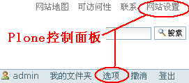

   图 3.49 进入Plone控制面板

Plone控制面板其实就是管理员登录后所看到站点右上角的【网站设置】，而从前面的章节中我们已经了解到用户的选项是设置个人在Plone站点中的环境。可以回顾一下，举个例子：管理员只有在【网站设置】中的【皮肤设置】中设置【允许用户选择皮肤】后，在用户的人个选项中才会出现【选择皮肤】的选项，而真正要设置个人所使用的Plone皮肤，就要你在个人选项中选择你想使用的皮肤。关于这些，会在下面一节中具体介绍。

下面了解一下Plone控制面板到底能做些什么？进入【网站设置】，如图3.50所示。

   图 3.50 Plone控制面板

从网站设置这个页面基本可以了解到Plone控制面板所提供的Plone站点的相关设置，包括：安装/卸载产品、错误日志、邮件设置、导航设置、网站设置、搜索设置、皮肤、查询集设置、用户和组管理、Zope管理界面（入口），以及附加产品配置。这样，Plone中一般使用到的设置完全可以通过Plone控制面板完成。

邮件设置
..................
我们在“进入Plone”一节中已经看到了在注册时可以选择发送初始密码的形式，用邮件获取密码，另外在内容页面中也有以邮件方式发送本页内容等一些功能，这些功能在可以正常使用之前必须在【邮件设置】中设置好SMTP邮件服务器等设置。邮件设置页面如图3.51所示。

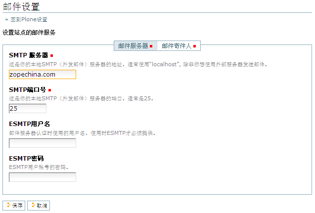

   图 3.51 邮件设置

默认的配置中SMTP服务器是 localhost ，SMTP端口是 25 ，这是本地的SMTP（外发邮件）服务器的地址和默认端口，也可以设定为使用外部SMTP服务器发送邮件。邮件服务器需提供ESMTP时要在【邮件设置】中设置ESMTP用户名和ESMTP密码。

安装/卸载产品
..................
安装新的插件产品，这需要系统管理员是将插件产品解压后放置实例的Products目录下，重启实例进程。这样操作后，就可以看到新安装的产品出现在【可供安装的产品】列表中，同时也可看到该产品的产品描述。如需在这Plone站点中安装此产品，只需选择它，点击【安装】按钮，它就出现在 已经安装的产品列表中，同时可查看安装日志，在已经安装的产品列表中也可以方便地选择卸载某个已安装产品。如图3.52所示。

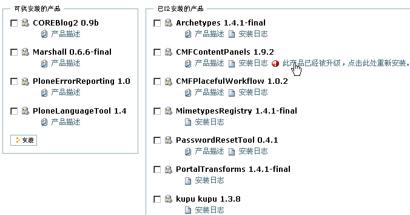

   图 3.52 安装/卸载产品

另外，还可以通过这里升级某产品。比如安装的某个产品，它现在有新的版本，想升级新的版本。只需将新版本的产品覆盖实例Products目录中的该产品，重启实例后，在已经安装的产品列表中，可看到想升级的产品出现了升级的提示，点击升级提示就可升级该产品。

网站设置
..................
网站设置应该是网站管理员建好站点后首先要设置的，它包括站点标题、站点描述等基本信息，还包括对站点中开启外部编辑器、显示内容的“英文代号”等。可以看到，网站设置中某些属性在个人设置中也有。这是为什么呢？这便是前面提到Plone控制面板也包含个人的选项的设置，网站设置是全局的设置，但应用到具体（个人）则是在个人选项中的设置。如图3.53所示，网站设置界面。

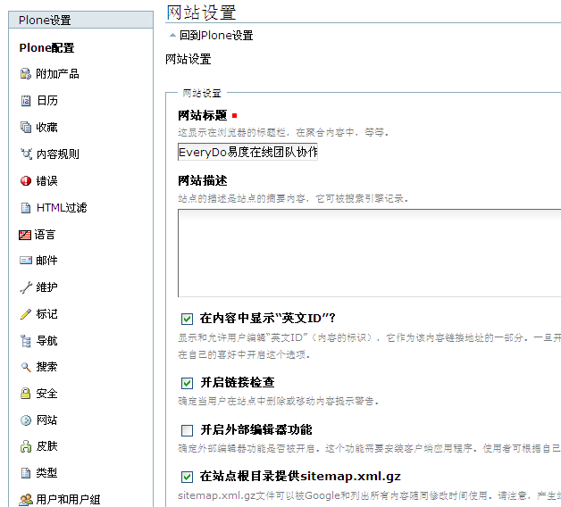

   图 3.53 网站设置

下面介绍一下相关属性：

- 【站点标题】，【站点描述】：设置站点的标题、站点的描述信息。

- 【开启外部编辑器特性】：设置是否开启外部编辑器功能。这里选择了，在个人设置属性中才会有开启外编辑器特性的属性。

- 【显示内容的“英文代号”】：显示并允许用户编辑 "英文代号" 这个内容标识，它构成了内容条目的URL地址。   

- 【开启链接检查】：确保站点内容的删除或移动不会产生坏的链接。

- 【在站点根目录暴露Sitemap.xml.gz】：根据Sitemap.org标准让你的网站生成一个文件，方便谷歌、雅虎、微软待搜索引擎更好地收录你的网站。

在Plone3.0中，有一个新的特性－－链接检查，通俗的理解保证你的站点内部删除或移出内容时不会产生无效的链接。下图是删除某个图片，而某个页面包含此图片，做删除操作时的提示，如下图3.54所示。

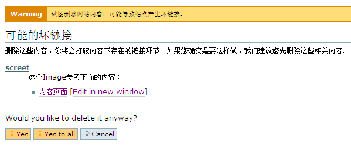

   图 3.54 链接检查

安全设置
..........

网站安全设置包括网站的用户注册，用户的相关信息等，下面是安全设置界面的一些属性设置。进入安全设置的界面，如下图3.55所示。

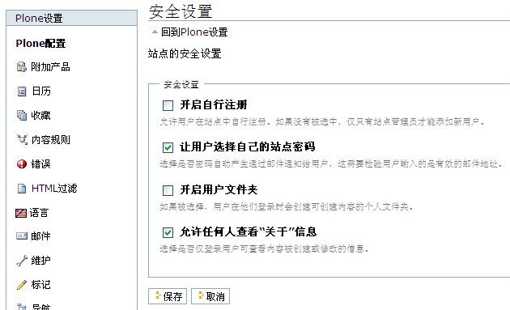

   图 3.55 安全设置

网站安全设置的界面中包括这些属性设置：

- 【开启自行注册】：允许用户在站点中自行注册。如果没有被选中，仅只有站点管理员才能添加新用户。
- 【让用户选择自己的站点密码】：选择是否密码自动产生通过邮件通知给用户，这需要检验用户输入的是有效的邮件地址。
- 【开启用户文件夹】：如果被选择，用户在他们登录时会创建可创建内容的个人文件夹。
- 【允许任何人查看“关于”信息】：选择是否仅登录用户可查看内容被创建或修改的信息。

内容规则设置
...............
你是否希望在你的站点内，某一目录下的内容提交、发布，网站能自动地通知你；或者某一目录下的内容被创建、或内容被修改、移动、删除，站点能自动地做一些处理，比如在通知用户，或拷贝到另一个目录做备份等。

Plone3.0中提供了强大的、可配置性的内容规则引擎，让你可定义一些事件，在事件被触发时执行某些操作。

我们在文件夹处编辑区域中知道这里有一个【规则】的标签，每一个目录都可以定义一些规则，当内容被创建、修改、移动、删除，或状态被改变时执行一个或多个规则。如下图3.56所示。

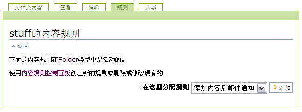

   图 3.56 规则标签

在控制面板中，有一个“内容规则”的界面，是专门管理着站点中所有的规则。下面我们通过一个具体的例子介绍内容规则，我们希望在站点的“stuff”文件里，内容被发布能自动地发一封邮件给某个人。操作步骤如下：

（1）创建你的规则

首先，进入控制面板中的“内容规则”界面，在这里创建新的内容规则，如下图3.57所示。

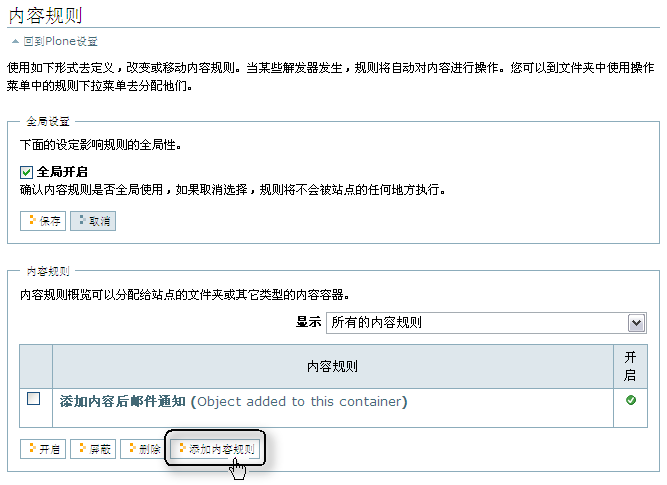

   图 3.57 创建内容规则

进入了添加规则页面，填写标题、描述，我们看到添加规则时可选择这样几个触发事件：

- Object added to this container：添加对象到目录的触发事件
- Object modified：对象被修改的触发事件
- Object removed from this container：对象从这个目录中移出的触发事件
- Workflow stat changed：工作流状态被改变的触发事件

这里我们选择“Workflow state changed”触发事件，如下图3.58所示。

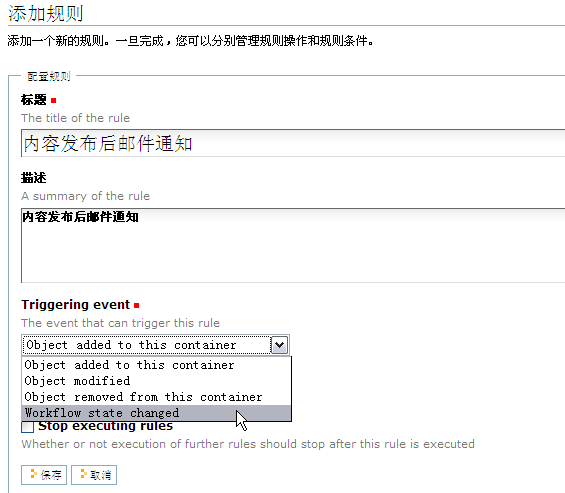

   图 3.58 创建内容规则

（2）配置规则

现在已经创建了触发工作流状态被改变的触发事件的内容规则，我们还需要配置它的条件和执行的操作，进入这个创建好的规则，如下图3.59所示。

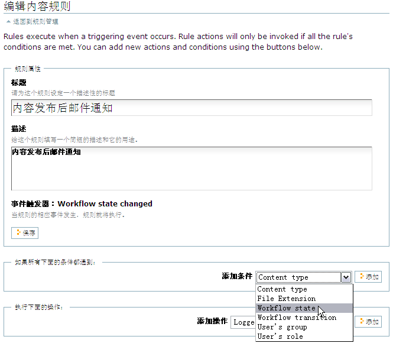

   图 3.59 配置内容规则

先来添加条件，我们看到这里有这样一些可添加的条件：

- Content type：使内容规则应用于所选择的内容类型
- File Extension：使内容规则应用于所添加文件的指定扩展名
- Workflow state：使内容规则应用于指定的内容的工作流状态
- Workflow transition：使内容规则应用于指定的内容的工作流变迁
- User's group：使内容规则应用指定的用户组
- User's role：使内容规则应用于指定的用户角色

这些条件是可以并合使用的，这里我们使用Workflow state条件，使内容规则应用于当内容发布的条件，如下图3.60所示。

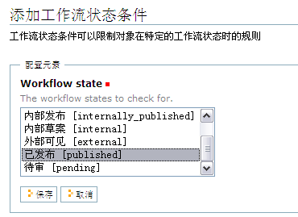

   图 3.60 配置内容规则

下面来添加触发所执行的操作，我们看到如下图3.61所示，有这样一些可添加的操作：

- Logger：执行输出消息到系统日志
- Notify user：执行通知消息、警告、错误等类型的消息通知给这个用户
- Copy to folder：执行拷贝这个对象到某个文件夹
- Move to folder：执行移动这个对象到某个文件夹
- Delete object：执行删除这个对象
- Transition workflow state：执行变迁工作流状态
- Mail action：执行邮件动作

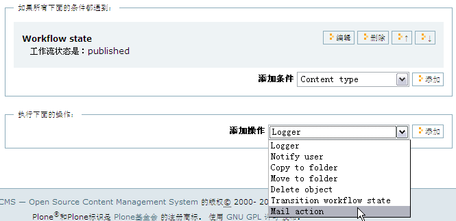

   图 3.61 配置内容规则

这里，我们选择执行邮件动作。下面来看看配置邮件操作的表单，填写邮件的标题、邮件来源、邮件收件人和消息，如下图3.62所示。

   图 3.62 配置内容规则

（3）将添加的内容规则配置给文件夹

内容规则已经配置好了，我们这个内容规则配置给stuff文件夹，进入stuff文件夹的规则标签页，选择刚添加的内容规则，如下图3.63所示。

   图 3.63 将添加的内容规则配置给文件夹

一个文件夹可以配置使用多个规则，可将规则仅应用于当前文件夹或应该于子文件夹，可配置某个规则开启或屏蔽。如下图3.64所示。

   图 3.64 将添加的内容规则配置给文件夹

这样，当在stuff文件夹中某个内容被发布时，配置的邮件收件人就会收到一封通知邮件了。

错误日志
..................
错误日志是截获Plone站点遇到的错误的日志。站点出错后，可以难以从报错的页面知道错误的详细原因，而【错误日志】中保留着异常出错的详细日志，可方便查错。

进入错误日志页面，如下图3.65。

   【图 3.65】错误日志

从这个页面可以先设定保留的异常数目、是否把异常复制到事件日志中，以及忽略异常的类型。

从错误日志页面中进入某个发生异常的链接，从中可以很容易找到发生错误的原因。它会提供发生异常的时间、用户名、请求URL、异常类型、异常值、Trackback等。

这里列举几种标准的普通错误类型，更多请查看： *http://plone.org/documentation/error*

.. csv-table:: 【表 3.1】常见的几种错误
   :header: "错误类型", "说明"

   "Unauthorized", "这种异常发生在某个用户没有权限去完成某项操作"
   "NotFound", "这种异常发生在访问一个不存在的内容"
   "Redirect", "这是HTTP（Hypertext Transfer Protocol）重定向时出现错误"
   "AttributeError", "当一个对象没有这个属性时发生的错误"
   "ValueError", "这种异常发生在赋值操作不对，或不能确认等"
   "KeyError", "这种异常发生在访问某个内容对象，而对象中某个属性不存在"

NotFount异常、Unauthorized异常和Redirect异常等，由于可能大量存在，但是并非真正的网站故障，一般在错误日志中忽略这些类型的错误。
不过，如果要检查无权限的原因，则需要在这里去除对Unauthorized的过滤。

导航设置
..................
在这里可设置站点的导航。比如常见的设置有：让导航不是显示整个站点的导航树，而是从显示站点整个导航树的根目录的下级目录开始；只需要在【导航设置】中设置导航树起始级别为 1 即可。同样，你可能想设置导航中内容类型，导航中的内容的状态等，在【导航设置】中都可以完成，下面介绍导航设置中的常用的一些属性。

- 【自动生成标签】：默认情况下，所有网站根下的文件夹将自动生成网站页首导航标签。如果希望手工构建这部分导航，可关闭此选项。

- 【导航树根结点】：设置导航树、网站地图、当前路径的根文件夹路径。“/”表示站点根，“/folder1”表示从“folder1”开始。

- 【导航树起始级别】：指定导航树的显示超出定位站点根目录的水平位置。0 表示从根目录开始，1 表示从根目录的下级目录开始。

- 【导航树深度】：设定让导航树显示多少层。0 表示没有限制，1 表示只包含根目录。

- 【显示的内容类型】：设定在导航树和网站地图中显示的内容类型。

- 【过滤的工作流状态】：设定在导航树和网站地图上显示指定状态的内容。

HTML过滤设置
.............
在页面上编辑内容，Plone默认会过滤那些被认为有安全隐患的HTML，你会发现你用HTML在页面中编辑的标准控件，显示某些媒体文件的HTML，不常用的HTML标记，还有给某个标记定义的一些样式都会被过滤掉。控制面板中的HTML过滤管理着这些HTML中标记、样式、属性的设置。如下图3.66所示。

   图 3.66 HTML过滤设置

你可能需要为你的站点在页面编辑过程中保留某些标记，允许一些样式和属性，分别可在这个界面的三个标签页中开启或其它设置。比如，现在需要在页面编辑过程中，希望使用到background，border, margin, padding等样式，而这些默认情况下可能是被过滤掉的，我们在HTML过滤设置的界面中进入样式的标签页，单击添加Permitted styles按钮，添加我们想要的样式，如下图3.67所示。添加设置后注意保存。

.. figure:: img/using/html_filer.png
   :alt: HTML过滤设置

   图 3.67 HTML过滤设置

类型设置
...........
Plone3.0提供了在Plone控制面板中对类型进行设置，如下图3.68所示，可以设置站点中任何一个类型如下一些特性：

- 设置是否全局可添加
- 设置是否允许评论
- 设置是否使用版本管理
- 设置在搜索中是否可见
- 设置管理面板分配到这个内容类型
- 查看到这个类型当前的工作流，和重新为它设置默认工作流

   图 3.68 类型设置

日历设置
..........
Plone3.0中提供了日历的设置，可设置日历中一周的第一天是星期几。比如，在我国一般是周一为一周的第一天，而在英国，周日才是一周的第一天。在日历设置中还可以设置如事件是在哪种状态下显示在日历上的，如下图3.69所示。

   图 3.69 日历设置

语言设置
.............
Plone可用于超过35种语言，plone的设计基于多种语言管理平台。它可以处理中文，日文，甚至那些从右到左书写的语言，如阿拉伯语和希伯来语。下图3.70是语言设置界面。

   图 3.70 语言设置

语言设置界面中，你需要设置站点的默认语言，比如：Chinese(China)；你可以为你的站点设置多个语言，如下图3.71所示。
你的站点如需控制多个语言，你需要安装Plone控制多语言的扩展产品LinguaPlone。

   图 3.71 语言设置

格式设置
.............
Plone在页面编辑中提供了可视化的编辑，也可以使用其它格式的文本编辑，支持的格式有text/html, text/plain, text/plain-pre, text/x-python, text/x-rst等，还可支持Wiki编辑语法，进入格式设置的界面编辑页面使用的格式，如下图3.72所示。

   图 3.72 格式设置

搜索设置
..................
在站点首页有一个搜索的功能，这里是设置搜索功能的相关属性。

- 【开启“实况搜索”】：开启“实况搜索”特性，如果浏览器支持JavaScript，可以即时查看搜索结果。

- 【定义搜索的类型】：定义你使用搜索框时应搜索的类型。注意：如果安装了新的内容类型，除非手工或者安装程序关闭，他们将默认可以被搜索。

.. Note:: Plone中搜索出的内容是根据此用户拥有的权限，也就是说只有此用户能有权限访问的内容才会被搜索到。
   

可视化编辑设置
.................
一些附加产品的设置也在Plone控制面板中，默认的有 Kupu可视编辑器的配置、位置相关的工作流的配置。这里简单介绍一下Kupu可视编辑器的配置，在《管理工作流》的章节会详细介绍位置相关的工作流的配置。

Kupu可视编辑器有如图3.73所示的配置标签页。

   图 3.73 Kupu可视编辑器的配置界面

- config标签页：Kupu编辑器的常用的相关配置，下文有详细介绍。
- libraries标签页：管理中Kupu所用到的内容列表，比如在添加图片时可以从 Home, Current folder, My recent item, Recent items 中选取内容。 
- resource types标签页：配置Kupu编辑器所用到的资源的类型。比如链接类型的，链接站点其它类型的内容；媒体类型，可插入图片类型的媒体内容；还有文件夹类型。
- documentation标签页：Kupu编辑器的文档说明。

一般很少需要配置Kupu编辑器，通常都是使用它的默认配置。这里介绍一下配置Kupu编辑器中的config标签页中的属性设置，有些属性设置是需要了解和知道如何去设置的，见下表 3.2 Kupu标签页中的设置项及其属性说明。

.. csv-table:: 【表 3.2】Kupu标签页中的设置项及其属性说明
   :header: "设置项", "属性说明"
  
   "Link options", "链接选项设置，其中包括 Link using UIDs 属性项，选择此属性表示链接内容使用UID识别；比如：链接的一张图片从文件夹移到另一位置，它的链接地址就发生了变化，但UID不会变化，使用UID识别不会因为图片链接地址的变化导致图片找不到。"
   "Captioning", "标题说明配置，其中包括 Allow captioned images 属性项，允许图片设置标题"
   "Reference Browser", "相关浏览器，其中包括 Use Kupu Reference Browser 属性项"
   "HTML View", "HTML查看，其中包括 Filter HTML in source view ，Kupu中查看源代码中过滤HTML"
   "Styles", "样式设定，其中包括 Tables ，和 Paragraph Styles 样式设定；在这里可以定义一些新的表格和段落样式。"
   "HTML Filter", "设定过滤HTML中的某些标记(Tag)，见下文详细介绍"

在页面配置了过滤HTML中的某些标记，配置表单如图3.74所示。

   图 3.74 Kupu中配置过滤HTML中的某些标记

这个表单由三部分组成，第一部分是配置Tag－－Attributes表，第二部分是样式白名单（Style Whitelist），第三部分是类黑名单（Class Blacklist）。

表单的第一部分配置Tag－－Attributes表的使用，默认情况定义了三条过滤记录，定义了 center, span, tt, big, small, u, s, strike, basefont, font 这些标记所有属性都过滤；定义了所有标记的 dir, lang, valign, halign, border, frame, rules, cellspacing, cellpadding, bgcolor 这些属性都过滤；定义了标记为 table, th, td 中的 width, height 属性过滤。可取消选择相应过滤记录的左边的复选框，单击 Save 后清除过滤记录；可在对应Tag和Attributes的表单填写新的过滤记录。表单的第二部分是样式白名单，默认情况定义了 text-align, list-style-type, float 样式是有效的，可以在这个表单中换行定义新的有效样式。表单的第三部分是类黑名单，可以在这个表单中定义无效的Class 。

皮肤
..................

它有这些属性：

- 【默认皮肤】：选择Plone网站的默认皮肤。
- 【标记外部链接】：是否开启所有的外部链接使用特殊的图标表示。是否屏蔽“外部链接使用新窗口打开”不起作用
- 【从新窗口打开链接】：是否开启所有的外部链接使用新窗口打开。
- 【显示内容类型图标】：如果屏蔽内容的图标显示在文件夹列表中和面板，它将不会显示。
   
查询集设置
..................
在这里设置创建查询集时所可用于查询的字段/索引，以及这些索引允许的条件等。下图 3.75是查询集设置的页面。

   图 3.75 查询集设置

图中的查询集索引标签页，可以设置创建查询集时用于查询的字段/索引，以及所允许的条件等。在查询集元数据标签页中可以设置在查询集视图中可用的一些元数据。

用户和组管理
..................
用户和组的管理对于站点的维护是非常重要的。在《用户和权限管理》的章节中将详细介绍此部分内容。

Zope管理界面
..................
这是进入Zope管理界面的入口。Plone正逐步将需在Zope管理界面中完成的操作移植到Plone控制面板中，但目前还有不少操作需要在Zope管理界面中去完成，所以也要了解在Zope管理界面中完成站点的设置与管理。在《深入设置与管理Plone站点》章节中会具体介绍。

站点维护设置
...............
Plone3.0在控制面板中提供了站点维护的设置，让你不用进入Zope管理界面就可以对Zope服务和Zope数据库进行相应的操作，如下图3.76所示。

   图 3.76 站点维护设置

小结
============
本章从最终用户、站点管理员的角度来认识和使用Plone；Plone的整体构架，以及未来的发展趋势（还介绍了一些Plone 3.0新特性）也是以这两种使用Plone的角色来考虑，以易用、贴近用户、更人性化为根本出发点，在本章的介绍中也有体现。 

对于本章的学习，正如章节中所提到的，几乎可以将Plone中的任何方面的使用与再熟悉不过的Windows资源管理器进行类比，这样可以让你更轻松地熟悉和掌握操作方法，也可以增加更多乐趣。本章的内容包括认识Plone，认识Plone的界面组织；使用Plone，了解个人文件夹和个人设置，以及在Plone中添加、编辑内容，对内容的组织，对内容的评注和搜索内容；管理Plone，使用Plone控制面板管理Plone站点等。

