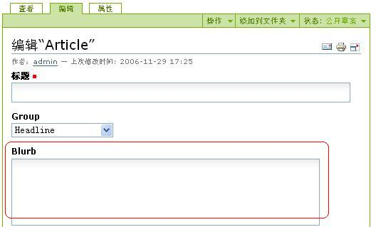
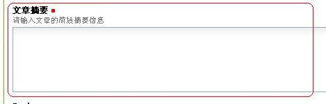
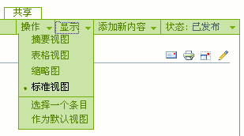
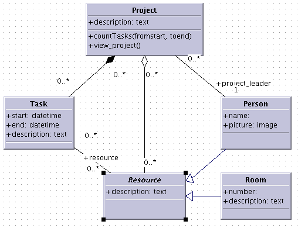

================================
使用Archetypes扩展开发
================================

.. Contents::
.. sectnum::
   :prefix: 15.

在本章介绍之前，几乎所有的开发，都是在浏览器中通过ZMI完成的(External Method 除外)。这些技术也就是Plone的脚本开发技术。
掌握他们，可以满足大多数具体应用的需求。

另外一方面，Plone上有非常多的扩展插件产品，可供安装使用。
这些扩展插件产品，都是在文件系统开发完成，能够方便的发布，可被重复的使用。

本章将关注如何采用Archetypes技术，来开发Plone的可重用扩展插件产品。本章适合扩展开发人员阅读。

本章的学习重点：

- 理解扩展产品开发应用的背景
- 掌握使用Archetypes语义为基础的产品开发
- 掌握开发内容类型时常用的重载方法
- 了解扩展产品在文件系统上的常用布局
- 掌握针对内容类型定制显示模板的方法

.. 编写思路: 开发的需求 -> CMF历史的问题 -> Archetypes原理 -> 实例 -> 详细参考 -> 未来发展
.. 参考资料: 

扩展插件产品开发背景
==========================
在各个Zope实例中，也有一个Products目录，包括CMFPlone在内的Zope外围插件产品就放置在这里。
在Zope启动的时候，会依次加载Products目录中的各个产品。

其中Plone的扩展插件产品，都可在Plone网站设置中的 安装和卸载产品 中安装和卸载。

一旦安装后，大多数的插件产品都会增加一组新的内容类型，可在文件夹的【添加到文件夹】下拉菜单中看到。
比如内容面板(CMFContentPanels)产品，就新增加了一个 内容面板 的内容类型。

每个内容类型，有自己的图标，有自己的编辑和查看界面；对用户的输入，能够对输入进行合法性校验，能够进行权限控制；
每种内容类型，都支持一组标准的元数据（属性）；所有的界面，需要支持国际化，能够在多种语言下工作。

可以看出，Plone扩展插件产品的开发需求还是比较复杂的。
在Archetypes技术出来之前，如果要对Plone进行扩展开发，就需要使用Zope/CMF提供的大量API，需要遵循比较复杂的代码规范，掌握扩展开发的学习曲线非常陡。另外，这种开发方法，没有将对象的数据和逻辑分离开来，可扩展性不是很好。

archetypes做什么
=====================================
Archetypes是Plone内容扩展开发的一个开发框架，只需要用python语言对内容类型提供描述信息，便可自动完成一些逻辑和内容编辑展现界面。这样，Archetypes大大简化了Plone的扩展开发过程，减少了学习掌握的曲线；同时，代码减少，也意味着产生bug的可能性减少，以及后续的维护费用降低，并能带来更快的开发周期。

Archetypes分离了内容的数据字段(field)、显示器件(widget)、存储(storage)。由于完全采用通过描述性语句来说明，因此还可以UML工具进行图形化建模，对建模结果采用一个叫做ArchGenXML的工具处理后自动生成代码。你甚至不需要写任何的代码。

快速开发是Archetypes的最主要的优点。很多用户将Archetypes用作建立快速的系统原型、建立应用框架的良好途径。

现在几乎所有的Plone扩展插件产品都使用了Archetypes，Archetypes基本上是Plone扩展开发的标准。Arachetype开发包能够实现：

- 能自动生成内容的编辑和显示页面，因此你不用写任何的页面模版代码
- 为每个内容自动维护一个用户不能更改的、内部唯一代号(UID)。这样即便内容被移动了，仍然可以通过UID来找到。
- 支持内容的关联引用。每种内容，可和其他的内容建立多种关系。比如，一个新闻可能附加了几个其他的参考文档的链接。
- 默认就包括一套安全设置，能够满足大多数的应用场合。
- 支持多种存储方式，除了保存在ZODB对象数据库外，还可保存在文件系统，或者关系数据库中
- 提供大量的显示器件(控件)，可构造丰富的界面，如网格表格、富文本输入等。
- 提供了数据格式转换的功能，比如，可以将微软的Word文档转换为html格式，直接在浏览器上显示。

Archetypes不仅仅可被用在Plone上，他也可被用于CMF，但目前还仅仅在Plone中大量使用。未来，Archetypes将融合更多Zope 3的技术，比如采用Zope 3的Schema架构。采用Archetypes开发的产品，能够确保和未来的Plone版本兼容。

快速进入代码
=======================
Archetypes包括一个叫做ArchExample的示例产品，下面将以这个产品为例子做讲解。
这个产品可在 ``http://dev.plone.org/archetypes/browser/ArchExample/trunk`` 得到。

在继续之前，你可以先安装这个产品，并尝试它的功能，
注意这次是从subversion仓库中取出代码，如果你不熟悉subversion仓库，
Windows平台用户可以使用ToitoiseSVN作为客户端下载它的代码，
而一般命令行上可以使用这个命令来获取代码::

  svn co https://svn.plone.org/svn/archetypes/ArchExample/trunk ArchExample

获取的代码就在ArchExample文件夹中，将它放置在Products文件夹中，并重新启动Zope，
在Web界面上打开站点设置的安装产品页面，可以看到多了一个ArchExample产品可安装，
选中它并安装到Plone中。这样安装之后，在添加下拉菜单中就多了一项article类型。
你可以尝试几次添加这种类型的对象，
添加了之后还可以再编辑它的内容，修改它的属性，
看它与其它Plone上可添加的类型有什么不同。
由此可能明白为什么要在文件系统上进行开发，这个过程就是创建了新的可添加类型。

试用过它的功能之后再看看这么多的功能需要的代码量是多少，由此你可以体会到使用Archetypes开发的快捷性。

这个产品实现一种新的文章内容类型，文章主要包括如下字段：

- Title: 文档的标题（必填）
- Group: 文章所属的栏目（例如：头条，公告，专栏等等）
- Blurb: 文章的摘要
- Body: 文章的内容，提供２种输入方法（手动输入文章内容，上载文章内容）。文章的格式多种格式，比如：纯文本、html等。

其中 ``Article.py`` 文件包含了产品的主要代码。在这个文件中，我们可以看到对摘要字段的定义::

  StringField("blurb",
              searchable = 1,
              widget = TextAreaWidget(),
              ),

这段代码是对文章摘要的定义。这个属性的名字是blurb，他是一个字符串，编辑的时候将使用HTML的文本框(TextArea)进行输入。编辑这个内容的时候，是这样的:

   图 15.1 文章的摘要(blurb)属性

仅仅四行代码，我们就为文章这种内容类型添加了一个字段。在编辑表单采用标准的Plone界面风格呈现：如果你编辑了某个属性，再次回来的时候，原先的值可正确显示，错误可正确处理和提醒，等等。做为示例，我们让输入标签显示 文章摘要 ，而且必须输入，来表明修改的容易度。我们调整代码为::

 StringField("blurb",
             required = 1,
             searchable = 1,
             widget = TextAreaWidget(label="文章摘要", 
                                     description="请输入文章的简短摘要信息"),
             ),

这里，我们添加了 ``required = 1`` 参数，表示这个字段必须输入，另外添加了一个label(标题)和description(描述)参数。需要特别指出的是，Plone默认采用utf-8作为页面编码，这里的代码中的汉字，也应该采用utf-8编码。如果重新启动Plone，添加一个新的文章(Article)，新的界面会自动更新，以反映这个新的语义。这个字段现在显示为 文章摘要 :

   图 15.2 更新后的文章摘要属性输入部分

这个变化表明，一旦内容的底层语义(schema)发生变化，相关的用户界面会随之改变，
这正是Archetypes的强大所在。
一旦你定义好了语义，你不必再作任何其它调整，你完成了这个内容类型了。
随后你可再调整语义，界面也可随之改变。
当然，任何语义的调整之后，或者说产品的源代码改变之后，
你必须重新启动Zope，才能让修改生效。
这样，新的变更才能被加载和正确注册。
这也是文件系统上的产品开发与以前的通过Web(TTW)式开发的一个不同。

内容语义(Schema)和相关概念
================================
从前面，我们看到。内容的语义(Schema)是整个插件产品的核心。Archetypes的语义(schema)类似于我们通常的数据字典的定义，关系数据库中表结构的定义也是语义定义的重要部分。

内容的语义(Schema)由若干类型的字段（field）组成，每个字段包括一个显示器件(Widget)。他们的关系如下::

 +--------------+
 | 语义(Schema) |
 +--------------+
       |   +--------------+
       |-->|  字段(Field) |
       |   +--------------+
       |          |          +------------------+
       |          `--------->| 显示器件(Widget) |
       |                     +------------------+
       |   +--------------+
       `-->|  字段(Field) |
           +--------------+
                  |          +------------------+
                  `--------->| 显示器件(Widget) |
                             +------------------+

语义、字段和显示器件的关系

语义(Schema)
-----------------
可将各个字段(Field)以按照元组(tuple)的方式传入Schema对象，即可创建一个新的语义(schema)。例如，这个文章的语义(Schema)就包括三个字段(Field): group, blurb 和 body ，这个语义(Schema)的起始部分代码是::

 Schema((
    StringField('group',
        vocabulary=ARTICLE_GROUPS,
        widget=SelectionWidget(),
        ),
        # 这里开始是其他的字段...
        )

多个语义(Schema)累加，是可以组装为一个新的语义(Schema)的。ArchExample也是这样做的，它累加了一个叫做 BaseSchema 的语义。

BaseSchema 包含了所有Plone内容类型都应该有的2个字段：标题和英文代号。标题用来在用户界面上显示这个内容，英文代号是用来内部命名的。这2个语义简单的累加，可构成一个更大的语义。在ArchExample中，可将你的内容语义和现有的 BaseSchema 进行累加。例如::

 schema = BaseSchema +  Schema((
    StringField('group',
                vocabulary=ARTICLE_GROUPS,
                widget=SelectionWidget(),
                ),
    ...

在界面上各个输入项显示的次序，和Schema定义中字段(Field)的添加次序是一致的。
这意味着，移动Schema中各个字段(Field)在语义(Schema)中的位置，便可调整这些
元素在界面上的显示次序。正因如此，由于 BaseSchema 加到了开始处，
所以在编辑页面中，英文代号和标题在位于最上方，而不是底部。

字段(Field)
--------------------------
到现在为止，我们看到了 StringField 这个字段，它是在内容中表示字符串类型的一个常用字段。在Archetypes中，还包括很多其他的字段，详细见本节后面的表格。你可以尝试更多的字段类型，甚至定义自己的字段类型。

每个字段(Field)有一个默认使用的显示器件，你也可以专门指定一个。上面的摘要 blurb 字段中，指定了一个 TextAreaWidget (Widget在下节讲述)。所有的这些字段，可在Archetypes的public模块中导入，比如::

 from Products.Archetypes.public import BooleanField

所有的字段的实例化方法是相同的：创建一个字段，并将字段名作为第一参数传入。你也可以使用关键字参数的方式，传递更多的可选参数。比如::

 from Products.Archetypes.public import IntegerField
 # 年龄字段
 age = IntegerField('age')

.. csv-table:: 【表 15.1】Archetypes中可用的字段清单
   :header: "名字", "类型", "默认显示器件", "描述" 

   "BooleanField", "布尔类型", "ComputedWidget", "用于存放真/假的简单字段"
   "DateTimeField", "日期和时间对象", "CalendarWidget", "用于存放日期和时间"
   "FileField", "文件类型", "FileWidget", "用于存放大段的数据，比如文本文件，微软的Word文档，等等"
   "FixedPointField", "定点数值", "DecimalWidget", "用于存放定点的数值数据"
   "FloatField", "浮点数", "DecimalWidget", "用于存放浮点数值数据"
   "ImageField", "图片", "ImageWidget", "存放图片，允许动态的调整图片的大小"
   "IntegerField", "整数", "StringWidget", "存放整数数值类型"
   "LinesField", "列表", "LinesWidget", "数据的列表(list)，比如关键字"
   "ReferenceField", "引用", "ReferenceWidget", "指向这个对象和其他对象的引用"
   "StringField", "字符串", "StringWidget", "针对存放比较小的字符串优化的字段，比如小于100个字符的字符串"
   "TextField", "字符串", "TextWidget", "针对存放较大的字符串优化的字段，比如大于100个字符. 这个字符串可被转化为多种格式"

每个字段都有一组可设置的属性。我们现在已经至少看到了2个： name 和 widget 属性。 name 属性是字段唯一必需的参数，而且必须唯一，并使用不包含空格和点号的小写英文字母。
name 字段将在内部使用，因此应该严格遵守这个命名规范。所有的其他属性都是可选的。下表描述了其他的所有的属性。

.. csv-table:: 【表 15.2】字段(Field)属性
   :header: "名字", "描述", "可能的值" 

   "accessor", "获取字段值的方法名", "可以指定任何方法名(如specialGetMethod)"
   "default", "字段默认值", "为字段设置一个合适的默认值"
   "default_method", "参数是一个方法名的字符串，调用该方法得到字段默认值，如果不设置则系统将自动生成一个", "任何一个方法的名称字符串"
   "edit_accessor", "获取字段原始值的方法名", "任何方法名(如rawGetMethod)"
   "enforceVocabulary",	"如果被设置则不接受vocabulary之外的任何值", "True或False."
   "index", "如果你希望这个字段被用在它自己的索引名中，可以在这里设置一个索引类型字符串。
   如果再加上:schema后缀，则它还会作为metadata信息被存储", "任何索引名，如KeywordIndex 或 KeywordIndex:schema."
   "name", "字段的唯一命名", "任何小写的字符串并遵守Python变量命名规则，(如 description, user_name, 或 coffee_bag_6)."
   "mode", "字段的读写模式，使用一个字符串形式表示，默认值是读写模式", "只读模式是 'r', 只写模式是 'w', 读写模式是 'rw'"
   "multiValued", "表示字段是否可以有多个值，这对于下拉列表形式的多选项很有用", "True 或 False."
   "mutator", "改变字段值的方法名，由此可以改变这个字段怎样被设置", "任何方法名(如 specialSetMethod)"
   "primary", "如果设置为真，则这个字段将被作为FTP和WebDAV协议的响应。
   只能有一个字段设置这个值，如果有多个字段设置了primary则只有第一个被使用。通常只为主body属性设置这个字段", "True 或 False."
   "required", "指定这个字段是否必需", "True 或 False."
   "schemata", "将这个字段放入其它字段中组中称为schematas", ""
   "metadata", "指示这个值是否会被放入到metadata信息中", "默认值是False" 
   "searchable", "拕定该字段是否加入到可搜索文本中以被搜索到", "True 或 False."
   "validators", "为字段设置校验，可以在这里设置校验方法的字符串的元组，
   它会顺序执行这个校验方法", "任何校验器，see the 'Validations of Input” section later."
   "vocabulary", "字段的可能的值的列表，常用于下拉列表中的可选项", "字符串列表，如 ['Green', 'Red', 'Blue'])"
   "storage", "在哪里存放数据；默认是 AttributeStorage ，将数据存放为对象的一个属性", "任何一个有效的storage对象，比如 AttributeStorage 或者 SQLStorage 。更多的信息, 请查看 存储(storage) 一节."
   "widget", "用于显示字段的器件名称", "任何器件对象"
   "read_permission", "用于读取时的权限设置", "如CMFCore的permissions中定义的View权限"
   "write_permission", "修改这个字段所需要的权限", "如CMFCorer的permissions中定义的ModifyPortalContent权限"

到现在为止，我们已经讲述了默认的字段(Field)和属性，现在开始讲述显示器件(Widget).

显示器件(Widget)
--------------------
显示器件(Widget)包含了如何显示对象的一些信息。通常，一个字段的显示视图和这个字段的类型密切相关。但是，你可以有更多的显示选项，比如字符串可以被输入，或者从多个可选项中选择。你可从Archetypes的 public 模块中导入显示器件。例如::

 from Products.Archetypes.public import BooleanWidget

所有的显示器件采用相同的方式实例化：创建一个显示器件，并传入所需的关键字参数。比如::

 from Products.Archetypes.public import IntegerField
 from Products.Archetypes.public import IntegerWidget
 # 年龄字段
 age = IntegerField('age',
        widget=IntegerWidget(label="您的年龄")
        )

显示器件能有其他的属性，这取决于显示器件的类型。大多数情况下，这些附加的属性直接和HTML属性对应。比如， StringWidget 就有一个 size 属性。相应的，这将产生使用这个size属性的HTML输入框。如果我们需要让输入框只有20个字符串宽，我们可创建如下的显示器件::

 bankAccountNumber = StringField('bank',
    widget=StringWidget(
            label="银行帐号",
            size=20)
          )

下表描述了Archetypes中可用的所有显示器件。

.. csv-table:: 【表 15.3】可用的显示器件(widget) 
   :header: "名字", "描述", "其他属性" 

   "BooleanWidget", "显示一个复选框","—"
   "CalendarWidget", "一组输入框，还包含一个弹出式小窗口用于选择日期", "show_hm控制是否显示小时和分钟，show_ymd控制是否显示年月日"
   "ComputedWidget", "以HTML来显示计算值", "—"
   "DecimalWidget", "简单的HTML输入框用于输入字符串", "thousands_commas可以指定是否以逗号分隔三位数字的形式显示数字"
   "FileWidget", "显示一个HTML文件元素用于上传文件","show_content_type控制是否显示内容类型"
   "IdWidget", "一个简单HTML输入框用于显示自动产生的ID","display_autogenerated控制是否显示自动产生的id"
   "ImageWidget", "显示并允许编辑图片", "可使用 display_threshold 设置图片的大小"
   "IntegerWidget", "一个简单的HTML字符串输入框", "size控制输入框大小，maxlength控制可输入的最大长度"
   "KeywordWidget", "在一个复杂器件中显示可用的关键字列表", "—"
   "LabelWidgets", "用于显示表单上的提示信息","—"
   "LinesWidget", "显示一个文本区让用户输入", "可以用rows控制行数, cols控制列数"
   "MultiSelectionWidget", "选择器件，默认是使用HTML的select器件", "format, 其值可以是 select 或 checkbox"
   "PasswordWidget", "HTML密码输入元件", "—"
   "RichWidget", "允许以多种格式输入一个文件内容并将在内部作转换格式", "可使用rows控制显示行数, cols控制显示列数 和 format控制显示格式"
   "ReferenceWidget", "显示HTML的select元素用于选择一列可能的引用值", "—"
   "SelectionWidget", "显示一个选择器件，它在默认情况下是很灵活的：
   当可选择值多于四个时显示一个选择框，否则显示为一组单选按钮", "format, 其值可以是 flex(默认值), select, 或 radio."
   "StringWidget", "简单的HTML字符串输入框", "size指定输入框的大小，maxlength指定最多可输入的字符个数"
   "TextAreaWidget", "允许以多种格式上传内容的文本区", "可使用allowed_content_types,
   值是字符串的列表，其中每一个字符串代表着一种上传内容的meta_type类型,append_only设置为True可以设为追加模式"
   
上表中的各种显示器件，在下表中描述了所有显示器件公共的属性。你已经看过了 label 和 description 属性了，他们用于设置显示器件的标题和提示说明信息。和上面各个显示器件的附加属性在一起，我们可获得一个完整的显示器件属性清单。

.. csv-table:: 【表 15.4】显示器件(widget) 的公共属性
   :header: "名字", "描述", "可能值" 

   "label", "显示在用户界面上的提示信息", "任何字符串，如Start Date for a field start_date."
   "modes", "器件的显示模式，默认有两种模式，view 和edit.", "模式字符串的列表，默认是('view', 'edit')."
   "populate", "如果这设置为真，则查看或编辑时控件内的值将被显示，
   通常这个值被设置，但对于密码输入则不应该设置。默认值是真。", "True 或 False"
   "postback", "如果这设置为真，当查看或编辑发生错误时，则控件内的值将被显示，
   通常这个值被设置，但对于密码输入则不应该设置。默认值是真。", "True 或 False"
   "visible", "用于决定是否在用户界面上可见。这是一个字典类型的映射值，用于对每一种显示模式分别设定是否可见，
   可选值有visible, hidden (显示在HTML的hidden类型的表单值中), invisible (根本不显示).", "如,
   {'view': 'visible', 'edit': 'hidden' } 意思是view模式是可见的，但eidt页面则使用hidden方式隐藏"

在上例中，你看到的是直接在写在源代码中的中文解释说明文字，
这里只是为了说明上的简单性，
但如果你想要做成一个国际化的产品，这些文字最好是写在相应的翻译用的po文件中。

事实上Archetypes就提供了这些功能，
你可以为Widget的构造函数中的每个参数添加以"_msgid"为后缀的关键字式参数，
为它提供一个msgid，并且使用i18n_domain参数指定翻译域，
这样翻译的工作就可以分离到相应的po文件中去了，示例如下::

 StringField("blurb",
              required = 1,
              searchable = 1,
              widget = TextAreaWidget(label="Article Blurb",
                                      label_msgid="label_blurb",
                                      description="Please input a short blurb for this article.",
                                      description_msgid="help_blurb",
                                      i18n_domain="archexample"),
              ),

上面的几个属性说明如下表。

.. csv-table:: 【表 15.5】用于国际化的属性
   :header: "名字", "描述", "可能值" 

   label_msgid, "设置label的翻译消息的id", "任何翻译的po文件中的id"
   description_msgid, "设置description的翻译消息的id", "任何翻译的po文件中的id"
   i18n_domain, "翻译域", "在po文件中定义的域，如plone"

要完成国际化工作，还需要产品i18n目录中，为各个语言的po文件中增加相关的msgid的翻译。
比如对于这个blurb字段，就需要在中文的翻译po文件中增加label_blurb和help_blurb这2个msgid::

 msgid "label_blurb"
 msgstr "文章摘要"

 msgid "help_blurb"
 msgstr "请为文章填写一个短的摘要"

上面这些Widget都是Archetypes所提供的，如果你安装了其它产品，则还有一些高级的Widget可以使用，

.. csv-table:: 【表 15.6】其它产品中可用的Widget
   :header: "Widget名称", "所在产品名称", "描述"

   ColorPickerWidget, ATColorPickerWidget, 用于选择一种颜色
   MemberSelectWidget, ATMemberSelectWidget, 用于选择一个本站成员
   ReferenceBrowserWidget, ATReferenceBrowserWidget, 用于选择关联文件
   AddRemoveWidget, AddRemoveWidget, 增加删除控件
   ComboBoxWidget, AddRemoveWidget, 组合框控件
   DataGridWidget, DataGridField, 数据表格控件

事实上是Archetypes提供了扩展Widget并注册的函数，
在这些产品中也就是使用Archetypes提供的功能加上少量的扩充定制而成，
在有必要时还可以定制自己的Widget，本章后面的定制视图一小节会讲到。

字段(Field)和显示器件(Widget)的组合
-------------------------------------------
本节包含常用的一些组合示例。比如，制作一个你所喜爱的水果(fruit)的下拉框。
你可以定义字段的 vocabulary 属性为一个字符串的列表(list)。列表的每个值，
就是一种水果类型的字符串；因此，这个字段类型是 StringField 。由于我们采用了
SelectionWidget ，最终将显示为一个下拉列表框。代码如下::

 StringField('fruit',
     vocabulary = ["苹果", "桔子", "菠萝", "香蕉"],
     widget = SelectionWidget(label = "喜爱的水果")
     )

ImageField 可用于创建和管理Plone站点中的图片。如果需要提供用户一个上传图片的字段，可使用下面的方式::

 ImageField('portrait',
     widget = ImageWidget(label = "我的照片"),
     )

下面将是一个比较复杂的内容类型。大多数内容类型有一个存放数据的主字段。比如基础的页面类型，有需要输入和编辑的正文字段。这个正文字段是这个内容类型的主要文字。对这个字段，需要增加几个额外的属性。

首先，我们需要让这个字段支持全文搜索，因此需要设置 searchable 属性。其次，我们需要让这个字段能够响应FTP和WebDAV的请求，因此我们需要设置 primary 属性(后面我们会讲述Primary字段的更多信息)。你需要让多种内容类型可被上传，于是设置 allowable_content_types 属性。接下来你需要知道如何显示这个字段，这样就需要设置 default_output_type 属性。最终代码是::

 TextField('body',
          searchable = 1,
          primary = 1,
          default_output_types = 'text/html',
          allowable_content_types = ('text/plain',
                                     'text/structured',
                                     'text/restructured',
                                     'text/html'),
          widget = RichWidget(label = '正文'),
          )

Marshall: FTP和WebDAV接口适配
----------------------------------------
Plone中的内容，每个内容都包括很多属性。但是FTP或者WebDAV只能传递单个的文件。
这样，通过FTP/WebDAV下载内容的时候，需要将内容转换单个的文件。上面的例子中，
body字段被设置为内容的主字段(primary)，在FTP/WebDAV下载的时候，
会直接传递这个字段的内容，而不是整个内容。

这个方法是很有效的。但是有时候，我们还希望同时获得内容的一些属性信息。我们可采用类似邮件的存储格式那样，将内容打包后传输下来。

Archetypes将这种内容到单个文件的转换，叫做Marshall。相应的，从文件转换到内容的过程，则叫做DeMarshall。Archetypes内容的Schema定义中，可指定一个Marshaller，
来负责Marshall和DeMarshall的过程: ``marshall=some_marshaller()`` 。Archetypes默认包括2种Marshaller：

- PrimaryFieldMarshaller: 仅仅将主字段转换为文件，Plone的文件和页面，均采用这个Marshaller。

- RFC822Marshaller: 将内容采用RFC822的标准格式存储，也就是邮件的存储格式。这个格式采用 "关键字: 值" 的方式，能够传递内容的各种属性。

另外Plone 2.5包括了一个叫做Marshall的产品，如果安装了这个产品，将包括一个叫做 ControlledMarshaller 的特殊Marshaller，可手工设置满足条件内容的Marshaller方式。比如可指定网站某个部分的内容采用PrimaryFieldMarshaller，而另外一部分内容，采用RFC822FieldMarshaller。

Marshall产品还包括一个特殊的Marshall，可以将Plone的内容以XML格式导出，这样可以比较方便地和其他系统进行数据交换。

Validator: 输入校验器
-----------------------------
现在内容的编辑表单已经能够很好的处理一些基本的错误，比如遗漏的输入项。
但是你可能需要更加复杂的错误处理逻辑。你可以进行一系列的校验，
以验证内容的输入是正确的。比如，你有一个整数字段，你就可能需要用户添加的数据是不是这样的。

要实现这个功能，可在字段(Field)定义中增加一个检验参数。比如，为了测试你的 IntegerField 是否真的是一个整数，你可这样完成::

  from Products.Archetypes.public import IntegerField
  from Products.Archetypes.public import IntegerWidget
  # 一个简单的年龄字段
  age = IntegerField('age',
        validators=("isInt"),
        widget=IntegerWidget(label="你的年龄")
        )

这里的 isInt 是从哪里来的？ isInt 是Archetypes校验框架中预先注册的一个校验器的名字。现在可用的校验器数量并不多，但是都非常有用，具体可见下表。

.. csv-table:: 【表 15.7】可用的校验器
   :header: "名字", "说明"

   "isDecimal", "是10进制数，包括正负号、指数等"
   "isInt", "是整数"
   "isPrintable", "是否可打印，只能是字母和数字"
   "isSSN", "是9个数字(也就是美国的社会安全号)"
   "isUSPhoneNumber", "长度为10个数字"
   "inNumericRange", "位于某个范围的数值"
   "isURL", "是URL，起始为 http://, ftp://, 或者 https://"
   "isEmail", "是邮件地址格式"
   "isEmpty", "为空"
   "isValidDate", "是有效的日期"
   "isMaxSize", "上传文件的大小限制"

你可也注册自己的校验器(validator)。校验器是实现了 IValidator 接口的简单类。
已经有2个基础的校验器了： RegexValidator 会检验是否符合一个正则表达式， RangeValidator 则检验数据是否在一个范围内。如果要注册一个新的校验器，检查用户年龄必须在0-150岁之间，你可在字段定义前，将下面的代码添加到你的Python模块中::

  from validation.validators import RangeValidator
  from validation import validation

  # RangeValidator 需要传入校验器的名字、起始和结束值
  validAge = RangeValidator("validAge", 0, 150)
  validation.register(validAge)
 
接下来，你可更改age字段的校验器为::

  validators=("isInt", "validAge"),

首先，这段代码将检查是否是一个整数；接下来，它将检查这个整数是否在有效的年龄范围内。
如果你希望添加一个全新的校验器，而不是这种范围检查或者正则表达式检查，
你就需要添加一个新的校验系统。比如，检查日期位于某2个值之间。下面的例子介绍了一个新的 DateRangeValidator ，如果日期位于2个指定日期间，则返回布尔(boolean)值。
这样的一个检查，可确保休假位于学校的假期中。

现在，我们在 validators 模块中添加一个 DateRangeValidator 的校验器。
它允许你注册一个时间范围，来确保输入的时间位于其间。
为了完成这个，我们可使用Zope的 DateTime 对象。校验器实现起来其实很简单－它就是
有一个 name 属性的类，并且指出 ``__call__`` 方式调用来检验日期。下面就是位于 validators 模块中的 DateRangeValidator 类::

  from Products.validation.interfaces.IValidator import IValidator
  from DateTime import DateTime

  class DateRangeValidator:
      __implements__ = IValidator

      def __init__(self, name, min, max, title='', description=''):
          self.name = name
          self.min = min
          self.max = max
          self.title = title
          self.description = description 

      def __call__(self, value, *args, **kwargs):
          if len(args) >= 1:
              min = args[0]
              if len(args) >= 2:
                  max = args[1]
              else:
                  max = self.max
          else:
              min, max = self.min, self.max
          if not isinstance(value, DateTime):
              value = DateTime(value)
          return min <= value < max

接下来，你可注册这个新的校验器，如下::

  from validation.validators import DateRangeValidator
  from validation import validation
  from DateTime import DateTime

  christmas = DateRangeValidator("isChristmasHolidays",
                      DateTime('12/18/2004'),
                      DateTime('01/09/2005'))
  validation.register(christmas)

然后，你可在语义字段(Field)中使用校验器了::

  validators=("isChristmasHolidays",)

数据的存储(Storage)
---------------------------
到现在为止，各个字段中存放的数据，都是直接作为内容对象的属性，存放在Zope的对象数据(ZODB)中的。大多数情况下，这已经可以满足要求。

前面在ZODB一章中提及，ZODB存在非Python语言无法访问、不适合存储大数据量等问题。如果我们需要和其他系统共享信息，我们可能希望将部分数据存放在关系数据库中；如果我们需要进行大量的文档、软件、流媒体的管理，我们则可能需要直接将文件存放在文件系统中。

我们可在Schema中，设置各个字段的存储方式。比如将字段的 storage 属性设置为 PostgreSQLStorage 就可将数据存放到Postgre数据库中。具体代码如下::

 from Products.Archetypes.SQLStorage import PostgreSQLStorage

 age = IntegerField('age',
      validators=("isInt",),
      storage = PostgreSQLStorage(),
      ),

当然，与此同时，需要在Plone的根下在ZMI界面中，添加一个数据库连接对象，并在 archetypes_tool 的 Connections 页面中选择。 

如果要将文件在文件系统中保存，需要安装 ExternalStorage 或者 FileSystemStorage 这样的插件产品支持。可在 http://plone.org/products 下载后安装。关于文件系统存储的具体使用方法，可参看这些插件产品的说明文档。Archetypes默认支持的Storage清单如下表:

.. csv-table:: 【表 15.8】可用的Storage
   :header: "名字", "描述"

   "AttributeStorage", "直接将数据存放到对象的属性中"
   "MetadataStorage", "用于存放元数据，所有数据存放在一个对象的 _md 的属性中"
   "ReadOnlyStorage", "只读的存储，不能够写数据"
   "ObjectManagedStorage", "存放在文件夹内部"
   "AnnotationStorage", "数据存放在对象的 ``__annotations__`` 属性中"
   "SQLStorage", "将数据存放到关系数据库中"

内容的开发
===============
上面我们介绍了 Article.py 文件中，内容语义(Schema)的定义。Schema是内容数据相关的核心，下面我们介绍内容的定义。

开发一个最小的内容
--------------------------
一旦完成Schema的定义，内容的定义就非常简单了。一个最简单的内容，可如下编写::
 
 from Products.Archetypes.public import BaseContent, registerType
 from config import PROJECTNAME

 # 略去Schema 的定义，详细见上节
 # schema = ....

 class Article(BaseContent):
     """ 这是一个用于示例的文章 """

     schema = schema

 registerType(Article, PROJECTNAME)

这里， Article 的基类是 BaseContent 。 BaseContent 是Archetypes的public模块提供的一个基础类，它提供了作为Plone内容所必须的大量特性，包括搜索、引用、编辑表单处理等。所有非文件夹类型的内容，都应该继承它。

这个类包括一个 docstring 说明：“这是一个用于示例的文章”。这个说明将自动作为内容类型的描述，在Plone界面中显示。Article类还包括了一个schema变量，这个变量直接使用前面单独定义的语义Schema。

最后 ``registerType`` 可将这个类注册到Archetypes中。后面我们会看到，可利用Archetypes的其他接口，对这个产品中注册的类自动生成代码和安装。

设置内容类型信息
----------------------
前面在Plone的基本设置一章中，我们知道在ZMI->portal_types中管理了各种内容类型的一些基本信息，包括标题、描述、图标、显示视图、操作项(action)等。
默认情况下，Archetypes中的内容会自动生成上述内容类型信息，无需单独设置便可工作。
如果您希望对自己的内容做更加个性化的设置，则可重载这些默认的设置。

这些内容类型信息，可作为给内容类的属性来设置，比如::

 class Article(BaseContent):
     """ 用于示例的文章 """

     content_icon = 'article_icon.gif'  # 图标
     portal_type = 'DemoArticle'        # 内容类型的内部注册名字
     archetype_name = 'Demo Article'    # 在界面上显示的标题

     # 内容标签页
     actions = ({ 'id': 'view',
                  'name': 'View',
                  'action': 'string:${object_url}/article_view',
                  'permissions': ('View',)
                 },)

上面的例子分别设置了图标、注册名字、显示名字和内容标签页。Archetypes自动为内容生成查看(view)、编辑(edit)、属性(properties)、共享(sharing)这4个标签页面。
通过设置actions属性，可调整现有的标签页的设置，或者添加新的标签页。
Archetypes默认的查看页面是一个 base_view 的页面，显示形式比较简单，一般需要对查看页面进行定制。
上面的例子中，重新定义了查看(view)标签的action地址为 article_view ，以便更加合理的显示文章。
这个 article_view.pt 位于 ArchExample 产品的 skins/archexample 子目录中。

内容类还有一组其他的属性，详细见下表。

.. csv-table:: 【表 15.9】内容类的特殊属性
   :header: "名字",  "描述", "取值"

   "schema", "内容的语义定义", "Schema对象"
   "content_icon", "图标文件名", "默认对非文件夹使用 document_icon.gif ，文件夹使用 folder_icon.gif"
   "meta_type", "类在Zope中的内部注册代号", "默认直接直接使用类的名字"
   "portal_type", "Plone内容类型内部注册代号", "默认直接使用类名字生成"
   "archetype_name", "界面上显示的名字", "默认由类的名字生成"
   "default_view", "内容的默认查看页面", "默认是base_view"
   "immediate_view", "创建后首先要编辑的页面","Plone暂不支持这个"
   "global_allow", "默认是否允许添加？", "默认True"
   "allowed_content_types", "对于文件夹类型有效，文件夹内部可添加的内容类型", "元组(tuple)类型，默认为空"
   "filter_content_types", "对文件夹类型有效，是否仅仅允许添加 allowed_content_types 中指定的内容类型", "默认为Flase"
   "typeDescription", "类的描述信息", "默认使用类的docstring"
   "typeDescMsgId", "类的描述信息的国际化po文件msgid", "一般是以 ``description_`` 开头的字符串"
   "actions", "内容标签", "默认包括查看、编辑、属性、共享几个标签页面"
   "_at_rename_after_creation", "创建的时候，自动根据标题生成英文id", "默认是False"

重载或者添加方法
-----------------
在上面我们的类还只有一些属性定义，与普通的Python类定义相同的是，其中还可以定义方法。

一般内容类型都从BaseContent开始开发，它为内容类型提供了很多默认的构造函数和方法等，
有时需要为新的类型提供不同于默认特性的方法，或者需要为新的类型提供更多的方法，
这时可以重载现有的函数以提供不同于继承类的特性，或者添加新的方法以实现更多的功能。

因为Archetypes会默认给每一个字段都生成显示和编辑框，
但有时你想定义一个内部使用的字段不允许用户编辑而是按照规则生成字段内容，
这时可以为它定义方法：

..
  TODO 需要找到一个重载了字段设置和获得方法的例子

如Poi产品(用于项目跟踪器)中为每一条新的报告生成一个新的id，
如果使用Archetypes默认的方法则会按照标题的md5值去生成一个id来保证id不重复，
但Poi产品想使用一种简单的办法保证id不会重复，就是使用数字系列从1开始往上数，
一直增加的方法，这样也能保证id不会重复，
因此在其中重载了这个_renameAfterCreation方法：

::

    def _renameAfterCreation(self, check_auto_id=False):
        parent = self.aq_inner.aq_parent
        maxId = 0
        for id in parent.objectIds():
            try:
                intId = int(id)
                maxId = max(maxId, intId)
            except (TypeError, ValueError):
                pass
        newId = str(maxId + 1)
        # Can't rename without a subtransaction commit when using
        # portal_factory!
        transaction.savepoint(optimistic=True)
        self.setId(newId)

这一段代码就是将所有现有的id都转换成数字并找出一个最大值，并加1做为新的id。

上面这个例子是对对id字段的重载，但实际上定义语义Schema中的所有字段都是可以重载的，

还有一些是属于Plone本身的一些功能重载也很用，如搜索特性。

在前面的字段定义中可以看到很多字段定义了searchable属性，
Archetypes会将设置了searchable属性为真的字段值作为字符串连接存入portal_catalog中作为搜索字符串，
如果想改变这种默认的方式，可以重载SearchableText函数，如Poi产品中对SearchableText的重载::

    def SearchableText(self):
        """Include in the SearchableText the text of all responses"""
        text = BaseObject.SearchableText(self)
        responses = self.contentValues('PoiResponse')
        text += ' ' + ' '.join([r.SearchableText() for r in responses])
        return text

这个重载的方法中首先调用基类的方法获得所有需要进行索引的文本，
它还将其本身所容纳的PoiResponse子对象也纳入了索引文本内。

另外还有一些属于Zope所提供的方法重载也很有用，
如ATContentTypes中对get_size方法作了如下定义::

    security.declareProtected(View, 'get_size')
    def get_size(self):
        """ZMI / Plone get size method
        """
        f = self.getPrimaryField()
        if f is None:
            return 0
        return f.get_size(self) or 0

也就是从类型上读取主字段，让主字段去计算文件大小。
这个方法是用于各种方式(http,ftp)下载时或在文件夹浏览视图上查看时以正确计算出这个类型对象的大小。
如果你对这些方法有不同的需要，可以重新定义它们，也就是重载。

除了重载之外，还可以添加新的方法，也就是给自己的内容类型对象操作的新的方法，
这是Python类的特性，可以为需要的类添加任意的方法。
但需要注意不要与BaseContent基类方法命名冲突，
因为有命名冲突时可能引起的未知的错误，就是说你想定义一个方法来实现某个功能，
但这个名称的方法可能已经被Zope所内部使用，结果是你的方法在意想不到的地方被调用了，
这种情况下运行结果也是意想不到的，并且这种错误很难检查。

附录中一份常用的重载方法列表，直接在Zope的源代码中搜索也可以找到更多。

安全声明
---------
上面已经看到在定义之前有一行security，这是不管重载还是定义新的方法都要进行的权限声明。

安全声明是所有Zope产品都要求的一项特性，
因为在文件系统上开发具有所有Python可用的特权，
也就是说这是在Zope的内核上增加特性，
Zope在默认情况下设置了很多级的权限，
并且对于一个多级管理的多用户系统是十分安全的，
因此你需要十分注意你的产品不要成为Zope安全问题的突破点，
毕竟，安全是一个复杂的话题，在整个系统中所有产品包括内核和外围增加产品的组合中，
系统的安全性是取决于安全性最低的那一个组件。

具体在写代码的过程中，也就是要注意使用ClassSecurityInfo来声明函数的权限。

::

    security = ClassSecurityInfo()

这一段代码是用在类的定义中，也就是实例化一个ClassSecurityInfo对象，
然后使用这个对象来初始化各个要定义的方法::

    security.declareProtected(ModifyPortalContent, 'setText')
    def setText(self, text=''):
        ...

这个语句是将setText方法设置为保护方法，只有有ModifyPortalContent权限的角色才能调用这个方法，
这里的ModifyPortalContent是从CMFCore.permissions上导入的权限值，它其实是一个字符串，
在 CMFCore.permissions 中定义为 'Modify portal content' 。
并且在CMFCore中已经定义了很多默认的权限值，你可以导入它，也可以使用新的权限字符串。
在这里看到Zope中的权限定义其实都是字符串，而不是其它系统中所常用的定义常量数字的形式，
使用字符串形式的权限定义不仅可读而且清晰易维护，
对于扩展人员使用也同样方便，使用一个新的字符串就好了。
它是Zope强大的用户权限管理的基础。
同样的还有::

    security.declarePrivate('guessMimetypeOfText')

是注意为私有方法，私有方法只能在产品的Python代码中被调用，而不能在脚本或页面模板中调用。
在类的初始化时如果没有说明是哪一种类型则默认是私有的，
虽然能有默认值就是私有的，但在代码中还是显式地说明最好，以显得更为清晰可读。

反之，如果被说明为公有的::

    security.declarePublic('guessMimetypeOfText')

则这个方法可以不受权限系统限制在任何地方被调用。

.. note::
  在直接的以URL方式调用某个对象的方法时，还有另一个因素决定了它能否被调用：
  即从对象发布原理一章已可知URL方式的调用即为发布对象，
  而Zope发布对象要求必须有docstring，对象的方法也是一个对象，
  如果在定义时使用了docstring就可以直接在URL上发布，否则便不能。

..
  方法的docstring会决定能否直接通过URL来访问这个方法

..
  TODO 有docstring时可以被Zope所发布，所以能通过URL访问方法，这个需要结合对象发布原理介绍。

文件夹类型的内容
--------------------
上面从BaseContent继承是注册一般内容类型，
有时需要制作可以容纳其它对象的类型，一般也称为文件夹类型，
这时可以考虑从Archetypes的文件夹基类上继承。

..
  TODO 制作文件夹类型的内容从这两个类上继承

在Archetypes中提供了两种类型的文件夹类型可作为基类，

- BaseFolder
- BaseBTreeFolder

两种类型的不同是BaseBTreeFolder一般用于大文件夹，指的是可能有上万个子对象的情况下，
一般情况下仅使用BaseFolder就足够了。

如ATContentTypes产品中定义了一个基于BaseFolder的ATCTFolder类型，

::

  class ATCTFolder(ATCTMixin, BaseFolder):
      ...

基于ATCTFolder继承下去可以定义更多的文件夹类型。

支持多种视图
-------------------
可以看到在Plone内置的文件夹类型是可以选择多种视图，在【显示】下拉菜单中，可以看到多种可以选择：

   图 15.3 Plone界面的多种视图显示

同样，定制的内容也可以增加多种显示视图，
这需要从CMFDynamicViewFTI的BrowserDefaultMixin继承就可以::

 from Products.CMFDynamicViewFTI.browserdefault import BrowserDefaultMixin

以 BrowserDefaultMixin 作为继承的一个父类就可以定义多种视图，
因为Python的类是可以多继承的，在文件系统上的产品开发中，经常可以看到有以Mixin结尾命名的类，
这些类一般都是用于多继承，如

::

  class CustomFolder(BrowserDefaultMixin, BaseFolder):

然后在类的定义中可以使用suppl_views来定义可用的视图::

    default_view   = 'atct_topic_view'
    suppl_views    = ('folder_listing', 'folder_summary_view', 'folder_tabular_view', 'atct_album_view')

在这个定义中，默认的视图是atct_topic_view，并且还有其它几种可供选择的视图。

..
  TODO 多视图

整合为一个产品
=================================
上面是分别讲述了开发这个产品过程中的一些细节，现在看看它是如何组合成一个产品被用在Plone上的。

..
  TODO 这是第一个文件系统开发的章节，需要介绍产品目录中每一个文件的作用。

因为底层的应用服务器是Zope，
所有Plone产品首先必需是一个Zope产品，它一般放置在Zope实例的Products文件夹中，
在这里是Products下面的一个子文件夹Products/ArchExample，
这个文件夹的结构是这样的::

  Products/ArchExample/
  |-- Article.py
  |-- ChangeLog
  |-- Extensions
  |   |-- Install.py
  |   `-- __init__.py
  |-- __init__.py
  |-- config.py
  `-- skins
      `-- archexample
          `-- article_view.pt

可以看到其中有ChangeLog(其它产品中还可能有README)等文件是用于软件的文档，
这里先只考虑起作用的文件有这么几个：

- Article.py用于定义内容的schema，并注册它。
  其中定义了一个从BaseContent继承的类，
  并在最后使用Archetypes的registerType函数注册。
- __init__.py 是产品初始化文件，
  有了这个文件可以让所在文件夹成为Python的一个包，
  Zope也使用它里面定义的initialize函数来初始化产品。
- Extensions文件夹是用于定义外部方法，这个文件夹中起作用的只有一个Install.py文件，
  这是用于Plone安装产品时用到的，在其中定义了一个install函数，成为Plone的可安装产品，
  可安装的Plone产品都会出现在Plone控制面板的安装产品页。
  同理，其中的__init__.py只是为了使目录成为一个Python包，
  但Extensions如果不被其它Python源代码所导入的话，也可以不需要__init__.py文件。
  也就是说Extensions不必是一个Python包。
- config.py：配置文件
  在这里统一定义了其它文件中会用到的各种全局量。
- skins：产品皮肤
  在这个产品中只有一个文件，就是archexample/article_view.pt，
  在这里写好的文件注册并安装后都会出现到portal_skins中，这是在文件系统上的皮肤开发。
  本章后面的定制一节会重点讲述这些定制显示方面的内容。

再来看看产品在Zope对产品进行初始化过程中和Plone对产品安装的过程中分别在做什么：

产品初始化
--------------
Zope初始化一个产品的过程就是导入这个产品，然后运行其中的initialize函数，可以看到在__init__.py文件中。

::

  from Products.Archetypes.public import process_types, listTypes
  from Products.CMFCore import utils
  from Products.CMFCore.DirectoryView import registerDirectory

  from config import SKINS_DIR, GLOBALS, PROJECTNAME
  from config import ADD_CONTENT_PERMISSION

  registerDirectory(SKINS_DIR, GLOBALS)

  def initialize(context):
      ##Import Types here to register them
      import Article

      content_types, constructors, ftis = process_types(
          listTypes(PROJECTNAME),
          PROJECTNAME)

      utils.ContentInit(
          PROJECTNAME + ' Content',
          content_types      = content_types,
          permission         = ADD_CONTENT_PERMISSION,
          extra_constructors = constructors,
          fti                = ftis,
          ).initialize(context)

这段代码首先是从其它模块中导入一些函数和常量，然后注册皮肤路径，它从Products.CMFCore.DirectoryView导入了registerDirectory函数用于注册文件系统目录视图，
注册之后skins中的子目录，才能被安装程序安装到portal_skins中。

重点是在initialize函数中，这个函数在Zope启动的时候，会被Zope调用执行。
Archetypes的process_types函数会对找到产品定义的内容，并进行预处理，比如动态的生成get/set方法等。
因此需要预先import相关定义内容的模块，比如import Article。
获取在产品中注册过的类型，并使用utils.ContentInit将Archetypes注册过的类型注册到Zope中，并初始化。

经过initialize的执行之后，这些内容类型就可以在ZMI上添加了(但是不推荐在ZMI界面添加)。

产品在Plone中的安装脚本
--------------------------
在Zope对产品进行初始化之后，还需要一个安装脚本来控制产品在Plone上的安装。
因为Plone对产品的安装过程控制得更为细致一些，它使用外部模块来进一步控制安装状态，
也就是说Zope产品只要放在Products文件夹中就一定会被初始化，
可添加类型在Zope初始化过程中就会加入到Zope的可添加类型列表中去了。
而Plone使用外部方法install来控制一个产品以在web界面上操作它的安装状态，
这种方式的可用性更好。它的安装过程定义在Extensions/Install.py文件中：

::

  from Products.Archetypes.public import listTypes
  from Products.Archetypes.Extensions.utils import installTypes, install_subskin
  from Products.ArchExample.config import PROJECTNAME, GLOBALS

  from StringIO import StringIO

  def install(self):
      out = StringIO()

      installTypes(self, out, listTypes(PROJECTNAME), PROJECTNAME)

      install_subskin(self, out, GLOBALS)

      out.write("Successfully installed %s." % PROJECTNAME)
      return out.getvalue()

首先也是导入一些函数和常量，
然后在install函数中调用了installTypes安装内容类型，安装后可在ZMI中的portal_types中查看到；
同时，install_subskin可以将skins文件夹中的子文件夹作为层安装到网站所有的皮肤中。

扩展产品目录结构
----------------------
这里的ArchExample仅仅是一个示例产品，
如果你直接到Products目录中去看许多现有的产品的话，
可以看到产品的一般结构。

一组文件是README.txt, version.txt, HISTORY.txt, refresh.txt 这些文件通常是说明性的，
在README.txt中是产品介绍，version.txt是产品的版本号，Zope在初始化一个产品时会读取到，
Changelog.txt/HISTORY.txt记录了产品的更改发布历史。

refresh.txt一般是个空文件，
但它对于Zope有着特别的意义。一般情况下，修改产品的代码，需要重新启动Zope才可以让代码生效。
Zope重新启动花费的时间比较长，这导致开发效率降低。在Zope提供了一个产品刷新机制，可不必重新启动Zope服务器，就应用新的代码。
如果产品目录中存在一个refresh.txt文件，在Zope的ZMI根下，进入Control_Panels/Products区域，可找到这个产品，进入refresh标签，便可刷新产品。

另一个重要的是content目录，这里存放产品的内容定义。在ArchExample产品中因为只注册了一种类型，
所以直接放在产品根目录的Article.py文件中。
在注册类型较多的情况下可以创建一个content目录，在里面存放各种新定义的类型，
并加上一个__init__.py文件使之成为一个Python包。

还有Extensions目录用于存放产品的外部方法，一般用于需要突破Zope对脚本的安全限制时，
这时可以Extensions中定义好外部方法。
Plone安装产品也是使用固定名称的Install.py中的install函数这个外部方法。

当为产品定义了不同的显示页面时，还需要skins目录，
通常是在skins目录中再按不同的用途分为多个子文件夹存放。

为了使用产品所增加类型的功能有更为清晰的描述，通常还需要一个interfaces.py文件，
或者当类型较多时将interfaces组织为Python包，即在interfaces目录中按所注册类型分别定义各个接口，

一个更完整的Archetypes产品示例
----------------------------------
有另一个Archetypes的示例产品InstanceMessage，位于
http://svn.plone.org/svn/collective/InstantMessage/trunk。这个产品提供了发布即时消息的功能。

先看它的目录结构，这是一个标准的Archetypes产品的目录结构布局::

  InstantMessage
  |-- Extensions
  |   `-- Install.py
  |-- __init__.py
  |-- config.py
  |-- permissions.py
  |-- content
  |   |-- __init__.py
  |   |-- message.py
  |-- skins
  |   `-- instantmessage
  |       `-- instantmessage_view.pt
  |-- tests
  |   |-- __init__.py
  |   |-- base.py
  |   `-- test_setup.py
  |-- README.txt
  |-- refresh.txt
  `-- version.txt

其中每一个文件名或目录的具体含义是：

- 在Extensions中存放的是外部方法，里面的Install.py是Plone安装脚本，
- __init__.py是Zope初始化使用的文件，同时也用于构成Python包，
- config.py用于各种产品配置用的全局变量，
- permissions.py是权限定义，这个产品中为了将权限划分为更充分，
  使用一个单独的文件来存放，一般如果权限定义较少也可以直接写在config.py中
- content目录中定义各种内容类型，每种类型单独使用一个Python文件来定义，
  里面的__init__.py的作用是使这个目录成为一个Python包
- skins目录用于存放皮肤文件，这里的instantmessage_view.pt
  是InstantMessage内容类型的查看页面
- tests目录中的文件是单元测试，单元测试是一种新的开发软件的方法，
  在下一章的Zope3产品开发中将作更详细的说明。
- 最后的三个文件中，README.txt是产品说明，refresh.txt是产品可刷新文件，
  version.txt中声明产品的版本号。

按传统命名并不是强制要求的，但按照符合传统的命名方法能使软件的意图清晰明了。

..
  http://plone.org/documentation/manual/archetypes-developer-manual/referencemanual-all-pages

定制内容的显示模板
==============================
使用Archetypes定义Schema之后也就是定义了内容类型，这个产品就已经可用了，
Archetypes会为它生成有查看、编辑、属性这三个标签页，
使用base_eidt模板来作为它的编辑页面，使用base_view作为它的显示页面，
使用base_metadata作为编辑属性的页面，一般来说这些默认的操作界面已经可用，
但同时这些显示界面也是很死板的：它为所有新的内容类型生成统一的界面。
这一节讲述在需要的情况下怎样为内容类型定义特殊的显示或编辑界面。

..
  TODO 定制内容说明

  在上面的ArchExample产品中也可以看到，它的皮肤文件夹下有一个article_view.pt显示页面，
  这是定制显示页面的方法之一。
  除了重新制作页面模板文件，
  要定制特殊的显示页面，还有几种不同的方法可以选用：

最简单的方法就是定制css类型
-------------------------------
Archetypes默认生成的编辑或查看界面的HTML代码是很有规则的，
你可以在浏览器上查看生成的页面源代码，
发现默认的界面中的每一个字段都是有id和class定义的，
从css的知识可以知道，在自己的css文件中重新定义这些id或class都可以改变显示方式。

下面以改变body字段显示方式为示例，
因为下面的以页面模板方式的定制也是为了去掉在默认的base_view页面上显示的Body字段的Body标题部分。

Archetypes为内容生成的默认页面中给每一个字段以"archetypes-fieldname-字段名"的形式为id，
以ArchetypesTextAreaWidget为编辑界面的class，以ArchetypesField-StringField为查看界面的class，
根据这些规则可以自定义某个字段的样式了。

于是可以在皮肤目录中添加新的css文件，如命名为article-custom.css::

  #archetypes-fieldname-body label {
    display: none;
  }

这一段css是将以archetypes-fieldname-body为id的HTML标签内的label标签设置为不显示。

针对文件系统上的css需要在安装时做注册，但不必担心，安装的过程也很简单，
需要在安装脚本Install.py中增加几行代码就可以::

  cssreg = getToolByName(portal, 'portal_css', None)
  cssreg.registerStylesheet("article-custom.css")

如果getToolByName没有导入时则还需要::

  from Products.CMFCore.utils import getToolByName

注意此时注册的css文件会对站点上所有的内容类型都会生效，
如果想只对article类型有效，则需要在注册时增加一个expression参数::

  cssreg = getToolByName(portal, 'portal_css', None)
  cssreg.registerStylesheet("article-custom.css",
      expression = "python:object.portal_type == 'article'")

定制整个显示视图
--------------------
上面的定制css的方法可以改变一些Archetypes默认显示界面的外观，
但真正要改变显示页面的结构还是需要自己制作页面模板。

因为默认的base_view显示方法会将所有可显示的字段都按照顺序显示出来，
有时你需要以不同的排列方式或结构来显示它，因此你可以写定制的显示模板。
上面的的ArchExample产品中的article_view.pt文件正是使用了这种定制方法。
一般使用 ${contenttype}_view 的方式来命名，这虽然不是强制的标准，
但为了更容易被他人所理解，应该遵守这个规范。

这个页面模板的代码也是很少的，它使用了Plone的主模板，并在其中又定义了一个main宏，
这是它的内容::

  <html xmlns="http://www.w3.org/1999/xhtml" xml:lang="en-US"
        lang="en-US"
        metal:use-macro="here/main_template/macros/master">
    <body>
      

        

          <h1 tal:content="here/title_or_id" />

          <!-- do as you will -->
          <tal:block tal:define="field_macro field_macro|here/widgets/field/macros/view;
                     mode string:view;
                     use_label python:1">
            

              
                
              
            

          </tal:block>
          

        

      

    </body>
  </html>

先是以h1标签了文件的标题或id，然后在循环中依次显示每个字段，但除了body字段。
而将body字段留到最后单独显示。
这是对显示模板的一个简单定制，而且几乎与原始的base_view差不多，
因为Archetypes的默认显示方式base_view就是依次显示各个字段。
但需要时你总是可以使用任何页面模板技术来制作定制的显示模板。
在这里不仅所有的页面模板技术是可用的，因为使用了Plone的主模板，
Plone的全局变量和工具函数也都是可用的，还有Archetypes的接口函数也是可用的，
因为here变量在这里就是相应的内容类型的实例，在类中定义的所有方法也在这里可用。
这个例子中还使用了Schema, getName, getBody等属于Archetypes提供的函数。

定制widget，使用不同于默认的显示器件
-------------------------------------
上面的定制显示模板的方法对于整个页面都要定制的情况很有用，
但有时只需要定制某个单独的字段的显示方式，这时可以采用更为灵活的方案就是定制显示器件模板。
因为一个显示器件有查看和编辑两种模式，这里可以为两种模式分别定义不同的显示器件。

在widget定义中设置 macro_view 是显示使用的器件，macro_edit是编辑时使用的器件。
这种方式就是在定义字段时使用一个现有的器件，但指定一个不同的初始化参数，
以定制的模板来代替macro_edit或macro_view，在这个参数上指定一个模板文件名。
然后在模板文件名中定义相应的命名为edit或view宏，Archetypes会找到并使用它。
这种方式就是要写好这些宏即可，
同样，在定义这些宏时，也可以使用到所有页面模板和Plone主模板所提供的可用的技术。

如上面的Article的定制显示页面模板的例子其实只是在显示Body字段时与默认的base_view有所不同，
因此定制了整个显示模板其实有点浪费，简单的办法是在定义语义时只定制掉macro_view的部分。

可以将Article.py中的语义定义部分修改为这样，在字段中使用widget时增加macro_view参数::

    TextField('body',
    ...
              widget=RichWidget(label='Body',
                                macro_view='widget_article_body_view'),
              ),
    ),

显示部分就会采用widget_article_body_view器件。因此关键部分也就变成了这个显示器件的定义。
在皮肤文件夹中增加一个widget_article_body_view.pt文件，内容很简单：

::

  <html xmlns="http://www.w3.org/1999/xhtml"
        xmlns:tal="http://xml.zope.org/namespaces/tal"
        xmlns:metal="http://xml.zope.org/namespaces/metal"
        i18n:domain="plone">
    <body>

      <metal:view_macro define-macro="view">
        <h1>主体内容</h1>
        <tal:block replace="structure accessor" />
      </metal:view_macro>

    </body>

  </html>

只是在其中定义了一个名为view的宏，使用accessor显示出原来的内容。

自定义Widget: 显示控件
----------------------------------
除了Archetypes自已所提供的显示器件，还有一些产品中提供了很多的显示或编辑器件，
在Plone的站点上已经有很多的显示控件产品，
都可以在 http://plone.org/products/by-category/widgets 找到。

当所有现有的显示控件还不满足要求时，还可以自定制显示控件。

自定义显示控件一般从某个已知的Widget为基类开始继承，
或者直接从所有Widget的基类即TypesWidget开始继承，

::

  from Products.Archetypes.Widget import TypesWidget
  from Products.Archetypes.Registry import registerWidget

  class EmailWidget(TypesWidget):
     _properties = TypesWidget._properties.copy()
     _properties.update({
        'macro' : "email_template",
        'size' : '30',
        'maxlength' : '255',
        })

  registerWidget(EmailWidget,
     title='String',
     description='Renders a clickable email field',
     used_for=('Products.Archetypes.Field.StringField',)
  )

可以看到自定义Widget也同样简单，从TypesWidget开始继承，
并修改其中需要修改的属性，
一般将其中的macro属性修改使用自定义的模板，
这里使用的email_template是定义在产品的skins目录中一个特定的页面模板。

定义好之后只需要以Archetypes提供的函数registerWidget将它注册即可，
注意注册时使用所定义的Widget类名，然后是命名参数，
分别指定title, description, 是用于在使用时显示界面上的标题和描述信息的默认值，
used_for参数则指定了只能使用于何种字段中。
如果需要使用特殊的属性还可以使用registerPropertyType来注册，
如TextAreaWidget类控件有一个特殊的属性append_only是使用这个语句来注册::

  registerPropertyType('append_only', 'boolean', TextAreaWidget)

事实上如果查看Archetypes中的Widget.py的源代码就可以发现，
Archetypes所提供的各种显示控件也都是从TypesWidget开始继承，
并定制其中需要的属性而做到的。
定制好的Widget就可以和Archetypes提供的器件相同地使用，只需要在使用时导入它们即可，
如上面的EmailWidget是声明用于StringField，就可以在定义StringField字段时使用::

  # 导入Widget
  email = StringField(
    'email',
    widget = EmailWidget()
  )

..
  TODO 增加新注册的Widget使用说明

使用UML图定义内容类型
=================================
当你定义很复杂的内容类型时，上面介绍的使用语义定义的方式就显得有点繁烦了。
有一个方便的工具(ArchGenXML)可以将使用UML图定义的类型转换为对应的Archetypes产品代码，
这样开发产品的工作就变成了使用UML图来定义类型。

用来创建UML图的建模工具必须支持一种标准的XML产生系统，称为XML元数据交换格式(xmi)。
当前支持XML并且已经在ArchGenXML中测试过的工具有：

* ObjectDomain (商业的，有一个免费的只能使用30个类的演示版本在这个网站上： http://www.objectdomain.com)
* ArgoUML (自由的产品，在 http://argouml.tigris.org)
* Poseidon (基于ArgoUML的商业产品，在 http://www.gentleware.com)
* Sybase Powerdesigner (商业的产品，可以下载演示版，在 http://www.sybase.com)

这些工具的输出有一些稍微的不同，但是如果你看一下ArchGenXML的例子，
你可以看到从这些UML工具的示例输出。
如图显示了一个典型的项目，并且显示了几种不同的对象：
房间(room)、人员(person)、资源(resource)和任务(task)。
图中并且显示了它们之间的关系：

  一个使用UML定义内容类型的示例

为了测试运行它，首先要安装ArchGenXML这个工具，这是一个纯Python的包，
从 http://plone.org/products/archgenxml 上下载到最新的稳定版本，
直接解压缩到一个文件夹中就行。

现有一些产品已经是采用了ArchGenXML的技术来构建的，最好的例子就是
Poi(问题跟踪器)产品，它位于 http://plone.org/products/poi 。
在Poi产品中保留有为使用ArchGenXML的模型UML文件在model/Poi.zuml中。
这个文件夹中还有一个是自动重新生成的脚本是generate.sh，
它的内容就是调用ArchGenXML.py来重新生成整个产品：

::

  ArchGenXML.py Poi.zuml ../ \
                --e-mail 'optilude@gmx.net' \
                --copyright 'Copyright (c) 2004 Martin Aspeli' \
                --author 'Martin Aspeli'

把刚才解压缩的ArchGenXML的目录放到系统环境变量PATH中，这个脚本就可以运行了。
运行之后就重新产生了Poi产品所需要的全部内容。

因此，使用ArchGenXML之后产品开发的流程就变得特别简单：

::

  以UML定义类型和类型之间的关系 => 使用ArchGenXML转换 => Plone中运行

其中开发的重点转移到了定义UML中，
而使用上面介绍的图形化工具制作UML图具有简明直观等特点，因而简化了产品开发。

但是，这种开发方式也不能万能的，使用UML图有它自身的缺陷，
当Plone产品需要的特性而UML不能表现时，还是需要学习原来的基础的Archetypes开发方法。



总结
===========
这一章讲述在文件系统上开发时使用Archetypes来构造新的内容类型，
可以看到 Archetypes是开发人员进行CMF/Plone扩展开发的一个软件包，
同时使用Archetypes可以简化整个开发过程，
在开发的过程中，建立语义模型Schema是Archetypes开发的核心。
