==================================
Plone脚本开发
==================================

.. Contents::
.. sectnum::
   :prefix: 13.

前面的章节包括了定制网站的外观风格，
使用Script(Python)进行逻辑处理，以及使用页面模板制作页面用户界面。
这一章里我们将这些技术结合起来，以这些技术为基础，开始在Plone中创建综合的应用。

本章适合脚本开发人员和扩展开发人员阅读，目的在于掌握根据特定的应用需求，对Plone编写页面和逻辑脚本，进行Plone定制开发的能力。

本章学习重点是:

- 掌握Plone主模板的运用
- 掌握Plone主模板中各个构成元素的定制方法
- 了解一些Plone提供的其它有用的脚本和模板等皮肤元素
- 理解表单控制器产品的原理并掌握其应用

Plone脚本开发介绍
=====================
一般将只在浏览器中通过Web界面方式来开发应用称为脚本开发。
脚本开发的主要技术包括Script(Python)和页面模板技术：
Script(Python)用于逻辑处理，而页面模板作为内容展现。

Script(Python)和页面模板是Zope所提供的两项基础技术。
Plone作为构建于Zope之上的一个具体内容管理系统，
它提供了很多有用的工具函数和模板宏，
将定制Plone(指替换现有的页面模板)和制作新的页面模板的过程都作了很多简化，
它有自己的脚本开发的规范和约定。

前面的Plone外观风格定制一章中已经提到，
通过Zope管理界面，可在portal_css/custom文件夹中定制Plone站点的一些css文件，进而定制Plone站点的外观。
同样的，我们也可以在这个custom文件夹中，定制现有的Plone脚本，或者开发新的脚本。

针对简单的应用，可以直接把所有定制的文件放在custom文件夹中。
但对于复杂的应用，为了增加对定制过的页面和代码的可管理性，
应该在portal_skins中单独建立新的文件夹。
如图13.1所示，可以在portal_skins建立一个单独的文件夹，这里命名为"happyhouse"。

..
  TODO: 增加独立文件夹，和层设置的图片

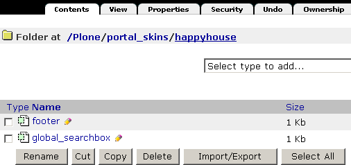

   图 13.1 在单独的文件夹中定制皮肤元素

此后定制的的皮肤元素都放置于这个happyhouse文件夹中。
并将这个文件夹的ID（happyhouse）放入各个皮肤中，
将它设置为仅次于custom的位置，如图13.2所示。

.. figure:: img/ploneskins/portal-skins-properties.png
   :alt: 调整皮肤中各层的优先级

   图 13.2 调整皮肤中各层的优先级

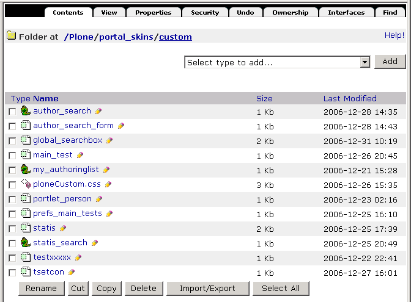

   【图 13.1】在custom文件夹中定制

在ZMI中开发的代码，还可以使用FSDump等工具导出到文件系统中，
作为专门的皮肤产品来发布。这是管理性更好的方式，关于在文件系统上的产品开发在后面
的章节会更详细地介绍。

.. TODO:
  如何和Plone现有界面集成起来，构成完整的应用?

  actions
  portlet
  模板的定制

  plone_styles: CSS层 这个层在前面的外观定制章节已有详细的解释

  cmf_legacy 旧的cmf兼容层，如TitleOrId用于与旧的CMF框架中需要的脚本
  plone_3rdParty DHTML Calendar
  plone_content 一组表现内容的模板
  plone_deprecated 标记为过时的一些外观元素，被移动到这里的文件一般仅仅是为了使用到它们的页面能正常工作，
  如is_folderish是为了其它旧的脚本中使用而保留，但通常它们会在下一个版本被删除。
  plone_ecmascript 这里有各种JavaScript脚本
  plone_form_scripts 这里有一些公用的如newsitem_edit.cpy，还有一些校验器，如validate_feedback.vpy，关于cpy和vpy将在后面介绍。
  plone_forms 表单部分，这里面是一些Plone中使用的表单，如search_form.pt，你可以根据需要定制这些部分。
  plone_images Plone自带一些图片和小图标集，如add_icon.gif，search_icon.gif等，这些也都可以使用在自己的程序中。
  plone_login 处理用户登录的部分
  plone_scripts 这里提供一些通用的Python脚本，可以看到里面都是
  plone_styles 定制外观所需的部分，里面的内容在前面章节已讲述
  plone_tableless 无table的用户界面
  plone_templates Plone主模板
  plone_wysiwyg 提供所见即所得编辑器

新建Plone模板页面
================================
介绍了一些通用的Plone脚本开发的概念之后，下面以一些示例开始叙述。

主模板的介绍
---------------------
Plone站点中，大多数页面都有相同的首页logo、搜索栏、个人工具栏、左列面板等内容，
不同的内容是中间的正文区域。

Plone在这个模版结构，是在一个主模板main_template中定义的。
它位于portal_skins/plone_templates/main_template，如图13.3所示。

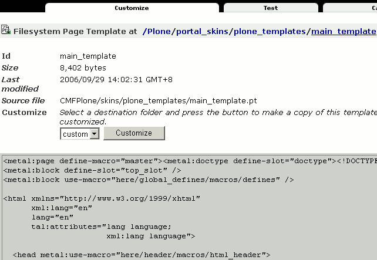

   图 13.3 在Zope管理界面中查看Plone主模板

如果直接查看它的代码可以发现其中定义了很多宏和槽，
其中最外层是master宏，正文区有main槽。
同时主模版也使用了其他的很多的宏，所以主模版自身的代码量并不多。

Plone所提供的所有能显示这个一致外观的页面都是使用主模板来实现的。
因此如果你想制作一个页面让它符合Plone的页面风格，就要使用到这个模板了。
下面以使用示例来介绍它的用法。

编写空的Plone模版页面
----------------------------
使用一个空的主模板很简单，直接使用一个主模板所提供的宏就可以了。
这里我们只是简单的示例应用，因此将它定制在custom层中。
打开Zope管理界面，找到portal_skins/custom，
在其中添加一个页面模板，命名为 ``main_test`` ，将其内容修改成如下::

  <html metal:use-macro="context/main_template/macros/master">
  </html>

这里只包含了2行代码，使用metal宏指令use-macro直接调用了主模版main_template的master宏。

因为Plone皮肤中的元素都是可以在Plone站点下的任意路径上调用的，
因此我们直接在浏览器地址栏输入 ``http://localhost:8080/Plone/main_test`` ，
也就是直接在Plone站点根上调用，可以看到正是一个空的页面，如图13.4所示。
其中所有边框元素，如logo，搜索框，左右列面板和页脚也都有了，只是缺少内容。

..
  TODO: 图片截图，不必太大

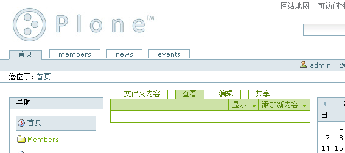

   图 13.4 空的主模板

添加正文
--------------
下一步就是在这个空的模板中添加内容，
添加内容也就是填充其中的main槽::

  <html metal:use-macro="context/main_template/macros/master">
    <metal:main fill-slot="main">
      <h1>内容区</h1>
      
这是一段填充文字。

    </metal:main>
  </html>

这里使用了metal宏属性中的填充指令: fill-slot，用于填充master宏中的main槽。

再次在浏览器中打开 ``http://localhost:8080/Plone/main_test`` 检查，
运行结果如图13.5所示。
可以看到，这回在内容区有了一个一级标题和一段文字。

..
  TODO: 截图

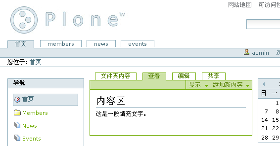

   图 13.5 测试主模板宏

.. note::
   如果你在默认的Plone版本上调试有可能发现显示页面时提示错误，如字符0xe6不能被ascii编码之类，
   这是Python的默认编码被设置为ascii所引起的，不能直接在页面模板中写入中文字。
   安装润普公司贡献的ZopeChinaPak产品可以解决这个问题。
   润普提供的中文版Plone安装包因为包含了ZopeChinaPak产品，所以也不存在这个问题。

使用Plone提供的全局变量
------------------------
主模板宏中使用到了global_defines模板的defines宏::

  <metal:block use-macro="here/global_defines/macros/defines" />

这个宏中定义了一组全局变量。
因此只要使用Plone的主模板，就可以象页面模版的绑定变量那样，直接使用这些全局变量。

.. hint::
  如果你直接查看Plone2.5的global_defines文件会发现其中并没有定义很多的全局变量，
  这是因为Plone2.5为了提高运行效率将它们转移到了Python代码中直接执行，
  有兴趣可以直接查看CMFPlone/browser/plone.py中的代码。
  在Plone2.5中大多数全局变量都在这里定义，但这并不影响我们在页面模板中使用全局变量。

如这是一个简单的例子::

  <html use-macro="here/main_template/macros/master">
    <metal:fill fill-slot="main">
      <h1>站点标题</h1>
      

      

      <h2>当前登录用户是</h2>
      

    </metal:fill>
  </html>

这个例子打印了站点、当前内容的标题和当前用户信息。
在这里，portal_title引用了站点的名字，object_title是引用到当前调用对象的名字，
它在Plone的全局定义中是从当前对象context上读取信息的，因此可以在不同的对象上调用，
你可以将 ``main_test`` 在不同的对象上调用，可以看到它打印出的内容是不一样的。
后面的member全局变量在Plone定义为登录用户，当没有用户登录时显示为 Anonymous User ，
虽然在这里你可以使用Zope的绑定变量 ``user`` ，但Plone提供的member变量上有更多的功能。

.. csv-table:: 【表 13.1】本章中将使用到的全局变量
   :header: 变量名, 说明

   portal_title, 返回Plone站点标题
   object_title, 当前对象标题
   isAnon, 判断是否为匿名用户
   here_url, 定义为here/absolute_url，即为当前调用路径
   checkPermission, 检查权限
   mtool, Plone站点根上的portal_membership对象，在这里可以读出关于指定用户的更多信息
   normalizeString, "正规化字符串函数，可以将一个任意的字符串以过滤非法字符，
   转换大写至小写的方式转换为可作为合法id形式的字符串。"
   isStructuralFolder, 判断当前对象(context)是否为结构式文件夹
   isContextDefaultPage, 检查当前对象(context)是否是所在文件夹对象的默认页面
   toLocalizedTime, 转换时间为本地时间函数，可接受一个日期日间字符串或一个DateTime对象
   view_template_id, "返回当前对象的默认查看方法的模板id，
   如文件夹对象未设置默认页面时是folder_listing，一般对象则是view"
   tabindex, "这个变量是一个Iterator对象，一般调用它的next方法返回下一个数字，
   用在设置各输入控件的TAB顺序上。"

此外还有一个 ``plone_view`` 全局变量很有用，可称作Plone视图变量。它采用在后面要讲的five章节中的技术实现。
上面所定义的一些全局变量有很多是plone_view对象所提供的功能，
只是为了使用的简单以及向后兼容而定义为了全局变量。
plone_view还有一些没有定义为全局变量的也有很有用，比如:

.. csv-table:: 【表 13.2】plone_view上其它有用的方法或变量
   :header: 名称, 说明

   getParentObject, 获取当前对象的父对象
   getCurrentFolder, "获取当前对象的所在文件夹，即如果当前对象是文件夹则返回本身，
   如果不是则返回父对象"
   getViewTemplateId, "返回当前对象的默认查看方法的模板id，
   如文件夹对象未设置默认页面时是folder_listing，一般对象则是view"

这些方法或变量的调用方法是使用路径表达式，如 ``plone_view/getParentObject``
或 ``plone_view/getCurrentFolder`` 。
另外，你还是可以直接通过 ``context/@@plone`` 的方式来使用plone_view变量。
关于这些全局变量的更为详细的说明请参考附录。

介绍了Plone定义的全局变量之后就可以使用这些全局变量做出更丰富的页面内容了，
但我们先继续看完Plone主模板所提供的其它功能，
然后再看一个综合的例子使用所有Plone主模板技术。

去除边框
--------------
注意到上面的例子中定制的内容是在内容标签包围的一个框架中，
有"文件夹内容"、"查看"、"编辑"、"共享"这几个标签页，
还和内容标签和内容菜单栏，
一般来说这对自己定制的页面是不需要的。
可以填充top_slot槽，添加一段代码可以去除这个边框::

  <html metal:use-macro="context/main_template/macros/master">
    <metal:top_slot fill-slot="top_slot"
                tal:define="dummy python:request.set('disable_border', 1)" />
    <metal:main fill-slot="main">
      <h1>内容区</h1>
      
这是一段填充文字。

    </metal:main>
  </html>

它实际上就是在request上定义一个disable_border变量，设置为一个逻辑真值，
在主模板上显示的部分会检查这个变量来决定是否显示边框，当其真时不显示边框。
这时可以再到浏览器上测试，可以发现内容标签和内容菜单栏和它的边框都不见了。

..
  TODO: 截图

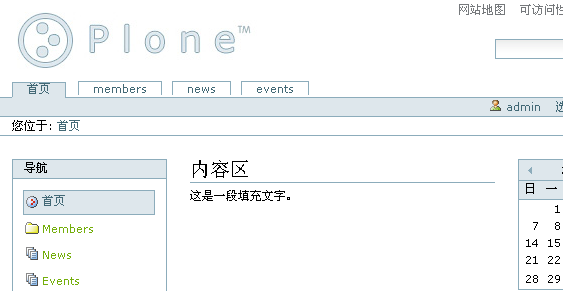

   图 13.6 去除编辑的边框

添加css
--------------
在Plone外观风格定制中，我们知道可以在portal_css中注册新的css。
这里介绍如何在单独的一个页面中添加css。

下一步就是你可能想为自己的段落添加特殊的显示效果，
这就要使用到css来控制了。
你可以使用style_slot来直接写嵌入的样式::

 <html use-macro="context/main_template/macros/master">
  <metal:style_slot fill-slot="style_slot">
    
  </metal:style_slot>
  <metal:main fill-slot="main">
      ...
   </metal:main>
 </html>

也可以import其它现有的css文件(another_css.css)::

  <metal:fill fill-slot="style_slot">
    
  </metal:fill>

注意到这里使用了 ``portal_url`` 正是Plone所提供的一个全局变量，
这里用来引用站点根的URL。

注意，在主模板中还有一个css_slot，使用css_slot槽也可以添加自定义css，
它的作用与style_slot是一样的。
但css_slot在Plone2.5中已被标记为过时了，新写的模板应该不要使用css_slot。

添加javascript
---------------------
javascript_head_slot
这个槽用于填充页面所需要的特别增加的javascript代码，如::

  <metal:javascript fill-slot="javascript_head_slot">
    
  </metal:javascript>

.. hide
  要加一个模版元素的定制方法：包括对搜索隐藏、当前文件夹搜索

更多有用的定制
-----------------------------
查看主模板还可以发现其它一些有用的槽，
如在定义一个需要占用很多页宽的页面，可以填充column_two_slot将右列不显示::

  <metal:column_two fill-slot="column_two_slot" />

同理，如果不想显示左列则可以将 ``column_one_slot`` 填充为空。

事实上，Plone提供了非常多的模板或脚本等可以作为开发的基础，
因此合理使用这些皮肤元素也很重要。

..
  plone_styles: CSS层 这个层在前面的外观定制章节已有详细的解释

.. csv-table:: 【表 13.3】Plone提供的其它层的说明
  :header: 层, 内容描述

  cmf_legacy, 旧的cmf兼容层，如其中的TitleOrId用于与旧的CMF框架中需要的脚本
  plone_3rdParty, DHTML Calendar
  plone_content, 一组表现内容的模板
  plone_deprecated, "标记为过时的一些外观元素，被移动到这里的文件一般仅仅是为了使用到它们的页面能正常工作，
  如is_folderish是为了其它旧的脚本中使用而保留，但通常它们会在下一个版本被删除。"
  plone_ecmascript, 这里有各种JavaScript脚本
  plone_form_scripts, 这里有一些公用的如newsitem_edit.cpy，还有一些校验器，如validate_feedback.vpy，关于cpy和vpy将在后面介绍。
  plone_forms, 表单部分，这里面是一些Plone中使用的表单，如search_form.pt，你可以根据需要定制这些部分。
  plone_images, Plone自带一些图片和小图标集，如add_icon.gif，search_icon.gif等，这些也都可以使用在自己的程序中。
  plone_login, 处理用户登录的部分
  plone_scripts, 这里提供一些通用的Python脚本，可以看到里面都是
  plone_styles, 定制外观所需的部分，里面的内容在前面章节已讲述
  plone_tableless, 无table的用户界面
  plone_templates, Plone主模板
  plone_wysiwyg, 提供所见即所得编辑器

..
  完整的使用主模板示例
  --------------------
  一个完工的页面如下所示::

  <metal:page use-macro="context/main_template/macros/master">

    <metal:fill fill-slot="top_slot"
                tal:define="dummy python:request.set('disable_border', 1)" />

    <metal:fill fill-slot="style_slot">
      
    </metal:fill>

    <metal:fill fill-slot="column_two_slot" tal:content="nothing" />

    <metal:fill fill-slot="main">
      <form method="post"
            tal:attributes="action template_id">
        

        <label for="content-title">命名</label>
        <input type="text" id="content-title"
               class="custom-content-type"
               name="title"
               tal:attributes="value request/form/title | nothing;" />
        

        

        <label for="content-textarea">内容</label>
        <textarea id="content-textarea"
                  name="content" rows="20"
                  tal:content="structure request/form">
        </textarea>
        

        <input type="submit" />
      </form>
    </metal:fill>

  </metal:page>

  它使用了top_slot去除边框，自定义了一段嵌入式css，在main槽中显示一段内容。
  当然这个页面不是很有用，但你可以针对自己的需要来制作特别的页面。

模板元素的定制
=============================
上面是对Plone脚本开发的总体概述和主模板的一些特性，这一节讨论几个简单的应用：
定制Plone本身的一些元素。
默认安装的Plone站点的功能很多，但有时你可能不需要这么多功能，或需要增加一些功能，
如搜索功能，你可能觉得Plone提供的搜索功能太复杂，可以定制模板来从根本上就不显示它，
或者觉得那个搜索框太简单了，你可以定制它以增强它的功能。

去除某个模板元素
-----------------------
首先我们以去除搜索框作为示例来讨论如何去除某个页面元素。
注意这与以前介绍的通过设置某个页面元素的css属性中增加 ``display: none`` 的方式有着根本的不同，
在这一节介绍的方法中是使服务器到浏览器的输出上根本就不含有搜索框这个元素。
这是更为彻底的定制方法。

在Zope管理界面中来到portal_skins的管理页，可以看到有 Find 标签，
我们使用它来查找具体的页面。
在 With ids: 域输入 ``global_searchbox`` ，点击 Find 按钮，
可以看到一个类似于以下的界面：

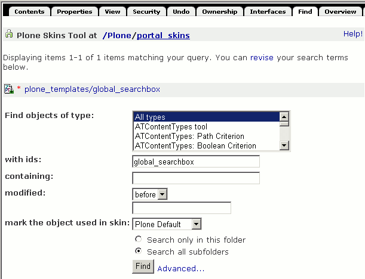

   图 13.7 使用 Find 标签页搜索

搜索到的是 plone_templates/global_searchbox ，
我们就对它进行定制。打开它，可以发现它本身是不可编辑的，因为它是在文件系统上的文件，
点击 Customize 按钮，这会进入到一个可以编辑的界面了，
这个过程实际上就是将它复制到优先级最高的 custom 层中，而且 custom 是存储于ZODB中的对象，因此是可编辑的。

可以看到的是里面有一个div上使用metal:define-macro定义了quick_search宏，
它正是在各个页面中引用到的搜索框，因此我们只要把修改为空就可以了。
修改之后是这样的::

  <html xmlns="http://www.w3.org/1999/xhtml" xml:lang="en" lang="en"
        i18n:domain="plone">

  <body>

  <!-- THE SEARCHBOX DEFINITION -->
  

  

  </body>
  </html>

保存之后再到Plone的显示界面中可以看到搜索框消失了，
选择某些子目录，并转到各个不同的页面，都可以看到没有搜索框了。

..
  TODO: 局部界面

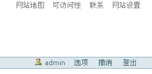

   图 13.8 定制去除搜索框

还可以尝试其它的一些定制，如global_siteactions是站点标签，
就是Plone站点最右上角的 "网站地图 可访问性 联系" 等链接。

还有其它一些可定制项：
             
.. csv-table:: 【表 13.4】全局定制项一览表
   :header: "id", "说明"

   global_cache_settings, 全局的Cache设置
   global_logo, 定义站点logo
   global_siteactions, 站点标签
   global_searchbox, 搜索框
   global_skinswitcher, 皮肤切换
   global_sections, 页首标签
   global_personalbar, 个人工具栏
   global_pathbar, 使用路径栏
   global_statusmessage, 状态消息
   global_contentviews, 内容区视图
   global_contentmenu, 内容编辑区的各种下拉式菜单

主模板中通过宏引用，包含了这些小的元素。
所以也可以直接对主模板进行定制，去除其中对某个元素的引用，
这也同样可以达到目的。不过一般的原则是定制小的元素而非大的元素，
定制小的元素可管理性更好一些。

示例：搜索当前文件夹
------------------------
上面的例子仅仅是简单地定制去除某个元素，但更常见的任务是给它增加功能，
如我们可以定制搜索框，增加一个按钮让它只在当前路径及以下层路径上搜索。

我们已知了搜索框global_searchbox就是定义了默认的搜索栏，
在这个例子中我们对这个文件进行定制以增强它的功能，让它支持直接搜索当前文件夹下的内容，界面如下图所示。

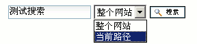

  图 13.9 定制搜索框的运行效果

同样是在Zope管理界面中找到plone_skins工具，在其 Find 标签页，按照id查找global_searchbox，
可以找到是plone_templates/global_searchbox，打开它，选择 Customize 定制到custom文件夹。
将它的内容修改为::

  <html xmlns="http://www.w3.org/1999/xhtml" xml:lang="en" lang="en"
        i18n:domain="plone">

  <body>

  <!-- THE SEARCHBOX DEFINITION -->
  

      <form name="searchform"
            action="search"
            tal:define="livesearch site_properties/enable_livesearch|nothing"
            tal:attributes="action string:${portal_url}/search;
                            onsubmit python:test(livesearch==True,'return liveSearchSubmit()','')"
            style="white-space:nowrap">

          <label for="searchGadget" class="hiddenStructure"
                      i18n:translate="text_search">Search Site</label>

          

          <input id="searchGadget"
                 tabindex=""
                 name="SearchableText"
                 type="text"
                 size="15"
                 value=""
                 title="Search Site"
                 accesskey="4"
                 i18n:attributes="title title_search_site;"
                 tal:attributes="value request/SearchableText|nothing;
                                 tabindex tabindex/next"
                 class="visibility:visible" />

          <select name="path" tal:attributes="tabindex tabindex/next">
                  <option value="">整个网站</option>
                  <option value=""
                          tal:define="folder plone_view/getCurrentFolder"
                          tal:attributes="value python:'/'.join(folder.getPhysicalPath())"
                  >当前路径</option>
          </select>

          <input class="searchButton"
                 type="submit"
                 tabindex=""
                 value="Search"
                 tal:attributes="tabindex tabindex/next"
                 i18n:attributes="value label_search;" />

          

          

      </form>

      

          <a href="#"
             tal:attributes="href string:$portal_url/search_form"
             i18n:translate="label_advanced_search"
             accesskey="5">
              Advanced Search&hellip;
          </a>
      

  

  </body>
  </html>

这里其实只对它作了少许的修改，也就是只增加了一个select元素::

          <select name="path" tal:attributes="tabindex tabindex/next">
                  <option value="">整个网站</option>
                  <option value=""
                          tal:define="folder plone_view/getCurrentFolder"
                          tal:attributes="value python:'/'.join(folder.getPhysicalPath())"
                  >当前路径</option>
          </select>

可以看到这段代码是在表单中增加了一个name为path的选择元素，
这个元素中有多点个选择option的值是根据用户当前正在浏览的路径而计算出来的。

..
  TODO button 在IE上似乎不能工作，
  就是这里需要一个能将value与显示文字分离开的提交按钮。

  TODO
  测试发现这个button示例不能在IE中运行，
  因为IE中的button提交还是将button中的文字作为value提交了过去，
  需要找到一种更好显示文字与value相分离的input类型。

这一段代码中为了取得当前的文件夹对象使用了 ``plone_view/getCurrentFolder`` ，
这正是使用上一节介绍的全局变量plone_view，并且在tal:attributes中替换了value值。

在portal_skins的plone_template中还可以看到其它很多的文件，
这里每一个文件都有它的用处，其中很多也都是可以定制的：

.. csv-table:: 【表 13.5】plone_templates中其它有用的定制
   :header: "id", "说明"

   accessibility-info, 显示accesskey信息页面
   colophon, "页脚上的显示各种符合的网页标准的小图标，默认状态下Plone所生成的页面都符合Section508,
   W3C AA, W3C XHTML, W3C CSS, Any browser这些标准"
   contact-info, 显示站点联系人信息页面，即站点标签中的联系会转到这个页面
   default_error_message, "站点错误信息显示页面，如当用户想查看一个不存在的路径时，会显示403错误，
   你通常可以定制这个页面让错误消息更为人性化，或者还可以在其中发邮件通知站点管理员或记录到日志中等。"
   folder_contents, 列出文件夹内容的页面
   footer, 显示页脚信息，通常可以修改这个文件以改变默认的页脚信息
   full_review_list, 列出当前用户可以审核的所有文件
   header, 文件头，这个模板在main_template中被使用到
   homePageText, "为用户登录所创建的默认页面，
   在这里默认状态下是使用tal:condition="nothing"不显示它，在这里你可以去除tal:condition属性来启用这个功能。"
   index_html, "这个文件是为了兼容那些没有默认查看的方法，可以引用到index_html，
   这个文件中仅仅是使用main_template来显示一段欢迎信息。"
   mail_password_template, 邮寄密码，即当用户忘了自己的密码时可以使用这个功能将密码发邮件至自己的邮箱
   main_template, 主模板
   news_listing, 列出站点上所有新闻的页面
   events_listing, 列出站点上所有事件的页面
   recently_modified, 站点的最近修改列表
   recently_published, 站点的最近发布列表
   registered_notify_template, 注册用户激活通知邮件模板，你可以定制这个模板来向新注册的用户显示更多的信息
   RSS, 这个模板是用来生成rdf规范的xml文件，用户可以使用它来订阅你的站点，修改这个文件需要注意遵守rdf规范。
   rss_template, "这是RSS使用的模板，也就是说RSS文件实际上使用这个文件提供的功能，
   因此你想给订阅用户提供特别的信息最好是定制这个文件"
   search_rss, 搜索结果的rss文件，这也是使用rss_template中的宏
   author_feedback_template, 对文章反馈信息时使用的邮件模板
   send_feedback_confirm, 发送反馈信息的确认，即反馈信息发送成功后所转到的页面
   sendto_template, 发送邮件的模板，通常定制这个文件以不同的格式发送邮件
   site_feedback_template, 站点标签的联系是一个表单，当用户提交后会使用这个模板来给管理员发送通知
   sitemap, 生成站点地图
   test_rendering, 这是用于测试渲染是否正常的一个文件，一般不会定制它
   viewThreadsAtBottom, 在有评论的文章下以不同层级缩进的格式来显示评论信息
   calendar_macros, 这个页面模板中定义了calendarDatePickerBox这个宏，主模板中使用它来显示日历控件。
   macro_renderer, "这个文件中只有一行，是用来生成其它宏引用的路径表达式，
   你可以调用这个页面模板，传入页面模板的名字和其中的宏的名字，它使用路径表达式来生成正确的语法，
   但通常不是很有用。"
   portlets_fetcher, 这个页面模板中定义了两个宏，分别是左列面板和右列面板。
   batch_macros, 这个是在folder_listing等需要分布显示的页面中用来显示分页工具条。

面板(portlet)的定制
=========================
使用主模板宏可以制作定制的主页面，但是如果想要修改左右列中的内容怎么做呢？

在Plone的术语中将左右列上的小面板称之为portlet，这里称为小面板。
注意在其它Web应用程序中也有portlet的概念，在google上搜索到的一个portlet定义如下：

  Portlet是生成片段（遵守特定规范的标记语言（如HTML、XML）的片段）的Web组件。

在Plone中使用的portlet概念也是这样的，它就是一段生成HTML片段的页面模板，
用在Plone站点中随意搭配显示在左列或右列上，使得页面结构的组装或需要改变都极为容易。

具体到页面模板技术中来说，只需要按照一定规范制作页面模板，在其中定义一个宏，
就可以称之为portlet，并且都可以安装到面板上显示。

Plone也提供了一些portlet在portal_skins/plone_portlets文件夹，下面的表格是一个概述：

.. csv-table:: 【表 13.6】Plone提供的一些portlet
  :header: id, 说明

  portlet_calendar, 这是日历小面板
  portlet_events, 这是事件小面板
  portlet_favorites, 个人收藏小面板
  portlet_login, 登录
  portlet_navigation, 导航
  portlet_navtree_macro, 导航树，这里提供了被portlet_navigation所使用的导航树
  portlet_news, 站点新闻
  portlet_prefs, 控制面板
  portlet_recent, 站点的近期更改内容
  portlet_review, 最近的评论内容

作为对Plone的常见定制任务是在首页增加一个小面板，
下面一节将以示例说明。

示例：我的工作台面板
----------------------

..
  TODO: 先说清楚面板的用途

制作portlet只需要在custom中创建一个新的页面模板，在其中定义一个宏即可，
习惯上都命名为portlet。

以下这个示例是定制一个人工作栏，将个人最近的工作更新文件以portlet方式显示，
这里我们直接添加在custom文件夹中，命名为portlet_personal::

  <html xmlns:tal="http://xml.zope.org/namespaces/tal"
        xmlns:metal="http://xml.zope.org/namespaces/metal"
        i18n:domain="plone">
  <body>
  

  <dl class="portlet" id="portlet-person">

      <dt class="portletHeader">
          
          <a href="#"
             tal:attributes="href string:${portal_url}/full_work_list"
          >个人工作栏<a>
          
      </dt>

      <tal:items repeat="o results">
      <dd class="portletItem"
          tal:define="oddrow repeat/o/odd"
          tal:attributes="class python:test(oddrow, 'portletItem even','portletItem odd')">

          

          <a href="#"
             class="visualIconPadding tile"
             tal:attributes="href string:${o/getPath}/view;
                             title o/Description;">
              
              Extended Calendar Product
              
              May 5
          </a>
          

      </dd>
      </tal:items>

      <dd class="portletFooter">
          <a href="#" 
             class="tile"
             tal:attributes="href string:${portal_url}/full_work_list"
             >完整清单&hellip;</a>
          
          
      </dd>
  </dl>

  

  </body>
  </html>

可以看到其中使用了一些class如portlet portletItem等，这些是为了与整个站点风格保持一致，
也就是说这是定制的portlet只要使用了这些属性就可以与整个站点的风格保持一致，
即使在前面的章节中定制过css它也随着整个站点的风格变化而变化。

可以看到整段代码的思路是在div中定义宏，宏的内部以dl标题列表元素来控制，
dl元素的class应该使用portlet，
在dl中使用一个dt来显示标题，这个dt使用的class是portletHeader，dt中以a元素显示一个标题链接，
a元素的上下分别有一个span只是为了控制边框。
后面是一个循环中显示dd元素，在这里从循环变量上读取odd信息判断是奇行还是偶行，以使用不同的class，
奇数行使用portletItem odd，而偶数行使用portletItem even，
最后是portlet尾部的链接，在这里也是一个a元素和两个空的span，
同理两个空的span也是为了显示与Plone站点风格一致的边框。

注意到这里的tal:define部分"results context/my_authoringlist"，
也就是说循环显示results的数据是从my_authoringlist上读到的，
我们这里添加一个Script(Python)对象名为my_authoringlist来获取数据：

::

  # Script (Python) my_authoringlist

  mtool = context.portal_membership

  if mtool.isAnonymousUser():
      return []

  user = mtool.getAuthenticatedMember().getUserName()

  return context.portal_catalog.searchResults(Creator=user,
                  sort_on="modified",
                  sort_order="reverse",
                  sort_limit=4)

这段代码首先根据获取规则取得portal_membership作为查询用户名的工具，
检查是否为匿名用户，因为这个portlet只用在已登录的用户上，所以对匿名访问者不显示任何东西。
对于已登录用户，从portal_membership上取得其用户名，
然后在porttal_catalog上搜索其所创建的所有文件，
注意搜索时使用了modified关键字作为排序，并且是逆向排序，搜索限制只显示最近的四条。

同样的是还有full_work_list也还没有写好，可以是一个页面模板或是任何其它的页面，
你可以在其中显示搜索到的所有最近工作的完全列表，这一般使用到主模板来做到，
这里作为一个练习留给读者。

将制作的portlet安装到Plone站点上
--------------------------------
在Zope管理界面中回到Plone站点根上，点击 Properties 属性页，
可以看到有left_slots和right_slots这两个属性，分别是页面中左列和右列的小面板，
在这里我们将它安装在左面板列中，放到第一个位置::

  here/portlet_personal/macros/portlet
  here/portlet_navigation/macros/portlet
  here/portlet_login/macros/portlet
  here/portlet_recent/macros/portlet
  here/portlet_related/macros/portlet

它是一个类型为lines的属性，即为多行，其中每一行分别是一个portlet宏的完整路径。
修改后保存，在浏览器中即可查看，如果当前登录用户有创建的文件，即会显示在这个小面板中。

.. figure:: img/ploneskins/custom-portlet-in-plone.png
   :alt: 定制 portlet 运行效果

   图 13.10 定制 portlet 运行效果

控制面板的设置模版
==========================
在Plone所提供的宏中，还有一类是针对管理员使用的，就是这一节要讲到的控制面板宏。
这里提供的是Plone控制面板宏，使用这些宏可以制作与Plone控制面板风格一致的页面。

制作一个控制面板页
----------------------------
与主模板不同的是，在控制面板中的定制中使用的是prefs_main_template主模板。

先测试一个空的控制面板页：添加一个页面模板，命名为prefs_test，在其中仅仅使用master宏::

  <metal:page use-macro="context/prefs_main_template/macros/master">
  </metal:page>

在浏览器的Plone站点根上直接测试 ``http://localhost:8080/Plone/prefs_test`` ，
已可以看到一个控制面板的页面。同样是左列的各控制面板页都已有了，只是内容区是空的。

在Plone模板开发中，使用控制面板主模板与使用Plone主模板极为类似，
如控制面板页主模板中也同样定义了这样几个槽：

base, head_slot, css_slot, javascript_head_slot 这几个与主模板中的作用相同，
分别用于定义变量以及包含css和javascript。
prefs_configlet_content是内容区，但一般使用prefs_configlet_main来填充，如::

  <metal:page use-macro="context/prefs_main_template/macros/master">
    <metal:fil fill-slot="prefs_configlet_main">

  
<strong tal:content="portal_title" />中当前一共有
  <tal:def define="objs context/portal_catalog"
           content="python:len(objs)" />个文件。

    </metal:fil>
  </metal:page>

这个例子填充了"prefs_configlet_main"槽。
同时也展示了在控制面板页中也可以使用Plone模板开发的全局变量，
这里从全局变量portal_title上得到了站点名称。
并使用portal_catalog工具统计出系统中当前所有的对象个数。

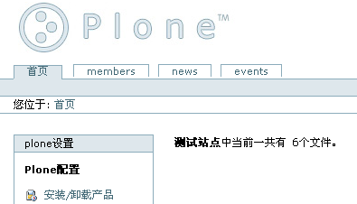

   图 13.11 制作好的控制面板页运行效果

因为在prefs_main_template模板内部，也是使用了Plone的主模板，
因此控制面板中也同样也可以使用Plone所定义的全局变量和工具函数等。

将制作好的控制面板页安装到Plone控制面板上
-----------------------------------------
..
  TODO: 先展示最终的效果图

控制面板页制做好后，下一步就是把它安装到系统中去。
这是最终的运行效果图：

.. figure:: img/ploneskins/prefs-test-in-control-panel.png
   :alt: 定制控制面板页效果

   图 13.12 定制控制面板页效果

安装的过程也很简单，在Zope管理界面上找到Plone站点根上的portal_controlpanel，
可以看到在其中定义了很多已有的控制面板页，
这里只需要将自定义的页面加在最后面即可。

这个页面一般比较长，在最下面可以看到名为 Add an action 的一个小的表单，
在这里的Name域输入一个描述性的名字，如测试控制面板页，id为所写的页面模板名，如pref_test，
action则使用字符串表达式"string:$portal_url/prefs_test" ，
condition可以保持为空，权限Permission中选择一个管理员权限，
一般选择"Manage Portal"，目的是保持只对管理员可见，
Catageory则有三种， Plone Configuration是用于Plone所提供的控制面板页，
Add-on Product Configuration一般用于第三方软件所增加的控制面板页，
Member Preferences则是针对成员管理方面，它是所有成员都可见的。
因此这里选择 Add-on Product Configuration ，点击Add按钮之后就添加上了。

..
  TODO: 一个截图，注意需要包含输入文字

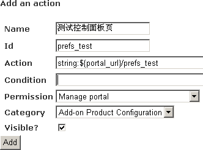

   图 13.13 向portal_controlpanel中添加控制面板页

这时从Plone首页上的网站设置链接打开就可以看到了"测试"的链接了。

但是这时它还没有图标，图标可以在站点的portal_actionicons上设置。
同样是找到portal_actionicons的配置界面，在最后一行上添加，
category设置为controlpanel，id为刚才设置过的id， Icon URL Expression 上设置icon的链接，
你可以使用Plone所提供的在portal_skins/plone_images中的图标，
或者自己制作一个放在custom或皮肤的其它层，并在这里使用它的id就可以了。
这里使用Plone系统所提供的logoIcon.gif小图标。

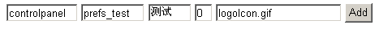

   图 13.14 给prefs_test增加图标

再次从Plone界面的网站设置中打开，可以看到如上面的最终运行图了，
这样控制面板页和图标都已安装到系统中了。

..
  TODO: 图标的局部截图

简单的表单交互
=============================
在更多与用户交互的场合中，很典型的是需要制作表单，传统的方式是使用html直接制作表单结构，
再使用cgi编程或其它类似的方式如php,asp等作为action响应用户输入，
在Zope中可以使用这种方式就是以页面模板制作表单并使用一个Script(Python)作为action来响应用户输入。
在简单的表单结构中可以应用这种结构。

在Plone中有更为高级的方式是使用控制表单，用于需要多处校验和多个提交按钮这种复杂的情况。
但针对简单的应用只需要这种表单页面和逻辑脚本的简单结构就可以了，这一节我们先看看这种简单的情况。

普通表单处理流程是这样的::

   用户       表单页面     逻辑脚本      结果页面
 (浏览器)       (.pt)        (.py)        (.pt)

    | 点击链接   |             |            |
    |----------->|             |            |
    | 显示表单   |             |            |
    |<-----------|             |            |
    | 填写提交   |             |            |
    |------------------------->|            |
    | 重新输入   | 校验失败    |            |
    |<:::::::::::::::::::::::::|            |
    |            |             | 校验成功   |
    |            |             |----------->|
    |            返回结果                   |
    |<--------------------------------------|

.. TODO: py/pt 相结合的表单例子
  制作一个查询表单，按照用户输入一定的条件查询出结果，

注意到它的流程中心是其中的逻辑脚本，它负责着校验输入是否合法并根据输入条件来转向结果页面。

下面我们制作应用这样的流程的一个简单例子。
这个例子中使用两个文本类型的输入域，分别用于输入作者名和天数，
以查找出在最近天数内该作者所发表的文章。

..
  TODO: 先说例子的用途。

添加一个页面模板，命名为author_search_form，将其内容修改为使用Plone主模板::

  <metal:page use-macro="context/main_template/macros/master">
    <metal:fill fill-slot="top_slot"
                tal:define="dummy python:request.set('disable_border', 1);" />

    <metal:fill fill-slot="main">
      <form action="author_search" method="post">
        

          <label>作者id</label>
          
请输入想要查找的作者的英文id

          <input type="text" name="author_id" />
        

        

          <label>最近几天</label>
          
请输入想要查找在最近几天内创建的文档，请输入一个数字

          <input type="text" name="recent_days:int" />
        

        

          <input type="submit" />
        

      </form>
    </metal:fill>

  </metal:page>

注意到其中有两个命名的input域，其中一个recent_days在命名时使用了 ``:int`` 作为后缀以使用表单变量的自动类型转换。

并且可以看到input域使用class为field的div所包围，还有一些提示信息是以formHelp为class的，
这些class是Plone所提供的css中所定义的，使用它可以将自己制作的表单达到与Plone的表单风格相一致。
最后做好的查询界面如图13.15所示：

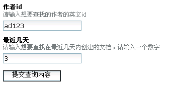

   图 13.15 简单查询表单

再添加一个脚本作为它的action响应，命名为author_search::

  from DateTime import DateTime

  request = container.REQUEST
  RESPONSE =  request.RESPONSE

  author_id = request.form["author_id"]
  recent_days = request.form["recent_days"]

  now = DateTime()
  created = now - recent_days
  created_day = created.Date()

  RESPONSE.redirect("search?"
          "created:list:date=%s&"
          "created_usage=range:min&"
          "Creator=%s" % (created_day, author_id))

在这段脚本中根据输入的日期数来计算好一个日期并重定向到Plone所提供的统一的查询结果页面上。

这个简单的例子只是为了说明这种以页面作为显示表单和Script(Python)作为执行动作的简单表单式应用。
但是注意到在这段脚本中只为了简单而直接从request上读取提交的信息，但对异常处理不严谨。
可以在表单上需要输入日期数字的域输入一段字符串测试一下，这时转到了Zope的一个异常信息页面，
这种界面对于最终用户来说并不友好。
如果要做成更友好的方式，可在表单定义中不使用 ``:int`` 后缀而在处理脚本中自己转换并捕捉异常，
可以预想的是，如果表单的输入域比较多时这种检查代码将会使处理脚本变得很长，代码的可维护性变差。
因此这种简单脚本并不适合处理大型任务。

表单控制器（FormController）
=============================
上面的例子中只是针对简单的应用，实际的大型应用中的表单常常很复杂，
需要校验多个输入域的值是否符合要求，对多个提交按钮使用不同的流程操作等等，
为此，Plone专门引入了表单控制器。
它是CMFFormController产品所增加的一项功能，现已为Plone发行所包含。
注意它是Plone所提供的功能，在没有安装Plone的Zope中是没有表单控制器的功能的。

普通表单处理的问题
---------------------------
普通表单处理的问题是几乎所有表单处理，都需要大量不直观的重复代码处理，
处理前需要检验表单输入(validation)，
处理后需要根据输入判断后续处理的流程转向(action)。
在校验输入中，很多个表单具有相同类型的输入，需要的校验代码也是相同的，
在普通表单流程中，校验部分是写在逻辑脚本中，
这样多个表单就要分别写多次校验代码，
这些分别写在多个逻辑脚本中的校验代码是不可重用的。

为此，Plone引入了表单控制器的概念。

表单控制器原理
---------------------------------
表单控制器产品注册了三种新的文件类型，在Zope管理界面上的添加下拉列表中都可以看到，
如图：

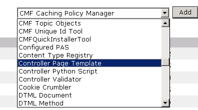

   图 13.16 表单控制器增加的三种类型

表单控制器产品(CMFFormController)所引入的这三种类型分别是：

.. csv-table:: 【表 13.7】控制表单引入的新对象(cpt,cpy,vpy)
  :header: 类型, 在文件系统上的扩展名, 用途

  Controller Page Template, cpt, "控制页面模板，用于表单页面，所以在这里也称为控制表单，
  在其元信息中可定制校验(validator)和动作(action)"
  Controller Python Script, cpy, 控制脚本，它的元信息中也可设置校验(validator)和动作(action)
  Controller Validator, vpy, "校验脚本，用于控制表单和控制脚本中设置为校验器(validator)，
  它与普通脚本类似，只是用于校验用途，但需要单独设置为一种文件类型是因为它比普通脚本多了一个state绑定变量。"

.. note::
   表中的文件系统上的扩展名一列是为文件系统上的开发而准备的，
   因为表单控制器一般是在大型的应用中写在文件系统上以更直接的方式利用Zope/Plone的优点。
   关于文件系统上的开发，详见后面的章节。
   这一节里面只对在文件系统上应用表单控制器作简单的说明。

表单控制器的解决思路是使用配置文件来定义复杂的流程，分离校验代码，使得校验部分代码可重用。
它还通过简化表单的校验来帮助开发者，
并且网站管理员可以不修改代码就能改变某些表单控制的特性，升级的过程也得以简化。

因为网站管理员和软件产品的开发者对于表单的应用常常是不一样的，
为此表单控制器的设计是开发者可以在文件系统上的代码中为他们的页面模板设置一些默认的参数如校验器和流程处理器，
同时站点管理员还可以在Web上定制校验器和流程动作，
因为校验器和流程定义都是与表单和逻辑脚本代码相分离的，
校验和流程转向信息不仅可以存储于文件系统上，还可以存储于ZODB中，
并且存储于ZODB中的信息的优先级高一些。
而ZODB中的内容都是网站管理员在Web界面上就可以修改的，
因此使用表单控制器还有一个额外的优点就是网站管理员可以不需要知道怎样编写程序就能修改校验器和流程转向信息。

在这种技术中，控制表单页面成为流程的核心，它的流程执行过程如下图：

::

   用户     控制表单页面    校验脚本1  校验脚本2  逻辑脚本   结果页面
 (浏览器)      (.cpt)        (.vpy)     (.vpy)   (.py/.cpy) (.cpt/.pt)

    | 点击链接   |             |           |         |         |
    |----------->|             |           |         |         |
    | 显示表单   |             |           |         |         |
    |<-----------|             |           |         |         |
    | 填写提交   |             |           |         |         |
    |----------->| 输入校验1   |           |         |         |
    |            |------------>|           |         |         |
    |            | 输入校验2   |           |         |         |
    |            |------------------------>|         |         |
    | 校验失败   |             |           |         |         |
    |<:::::::::::|                                   |         |
    |            | 校验成功 (点击按钮1)              |         |
    |            |---------------------------------->|         |
    |                                                |-------->|
    |            返回结果                            |         |
    |<---------------------------------------------------------|

可以看到控制表单页面成为了这个流程的核心，
用户提交之表单之后，由控制表单页面分别去调用各个校验脚本，
如果校验失败则停止流程直接提示用户错误信息，
如果所有校验都成功则根据用户所点击的按钮或文件类型分别转向到不同的结果页面中。

同样，如果流程是转向控制脚本(cpy)中，则控制中心就转到了控制脚本上，
由控制脚本分别去调用设置在控制脚本的元信息中的校验器，校验失败的话流程也会停止，
所有校验都成功则流程继续转向其元信息所定义的转向页面中。

在下面的例子中就可以看到在实际中可以设置多种状态，而不仅仅是失败和成功这么简单的两种，
它使用的是字符串类型来保存状态而非简单的逻辑真或假值，
因此可以看到实际应用中它在状态的设置和判断不同状态分别转向上是非常灵活的。

state变量
--------------------
表单控制器之所以要添加新的类型是因为它定义了更多的功能，
控制表单继承了页面模板的特性，控制脚本和校验脚本则继承了Script(Python)的特性，
除此之外，它们还有一个共同的特性就是多了一个绑定变量，名为 **state** 。

state变量是流程转向的关键变量，它用于在流程转向中保存状态信息。

一般在控制表单和校验脚本中用它来设置和获取错误信息，如设置错误信息一般用于校验过程检查到输入有错误的情况::

 # 各个表单输入的错误提示信息
 state.setError(变量名, 错误说明, new_status='failure')

而在返回的控制表单中，获取错误信息就很有用::

 state.getError(变量名)
 state.getErrors()：得到各个输入项错误信息的字典

可以看到getErrors的调用是没有参数的，因此在控制表单中可以看到直接的路径表达式的写法，
就是 ``options/state/getErrors`` 。

设置状态，和任意多个属性::

 state.set(status='failure', portal_status_message="Please correct the errors.") 

在控制脚本中还可以更直接地设置下一个action::

 state.setNextAction('redirect_to:string:view')

控制页面模版(cpt)
--------------------------
为了应用表单控制器的优点，你应该使用控制页面模板(cpt)而不是普通的页面模板，
它像普通的页面模板一样的工作，但它提供的功能比普通页面模板更多。

使用控制表单的基本形式是::

  <form tal:define="errors options/state/getErrors"
        tal:attributes="action string:${context/absolute_url}/${template/id};"
        method="post">
    <input type="hidden" name="form.submitted" value="1" />
    

    <input type="text"
           name="foo"
           tal:define="val request/foo|nothing"
           tal:attributes="value val" />
    <input type="submit" name="submit" value="submit" />
  </form>

从这一段中可以看出它与普通表单的几处不同：

- 它是提交到它自己的，可以看到表单的action属性是 ``${context/absolute_url}/${template/id}`` ，
  这个字符串表达式正是引用到它本身

- 有一个类型为hidden的input，名为form.submitted，页面据此以分析出是普通的表单查看链接到达，还是要处理提交的表单，
  因为提交过的变量都可以在request上面读取到。

- 需要设置变量errors，这个变量一般从state中读取的

因为添加一个新的有用的控制表单涉及到几个对象的添加，并且它一般用于比较复杂的应用中，
因此这一节先来查看Plone中现有的一个页面： ``login_form`` ，
它在Plone中的用途是为匿名用户显示登录的表单，在这里很显然的是要校验用户名密码是否合法。

同样是在portal_skins的Find标签页中查找，输入这个id，可以找到位于
portal_skins/plone_login/login_form ，可以直接查看它的代码，
但同时我们知道这是一个处在文件系统目录视图中的对象，因此也可以从文件系统上找到它的代码，
从 Source file 信息为 CMFPlone/skins/plone_login/login_form.cpt 上可以知道，
它就位于文件系统上的Zope实例目录的的Products目录中的这个路径上。
在文件系统上，你可以用任何你喜爱的编辑器来打开它。
在这里我们只分析它使用到了控制表单关键技术的几段代码。
注意这里添加的行号是原文中没有的。

控制表单也是一种页面模板，可以看到在文件头的部分它使用了Plone主模板宏，
在填充其main槽的过程中，它定义了errors变量，正是从state变量上读取::

    16  

定义表单的开始，可以看到其action属性设置为它自己::

    67	<form tal:attributes="action python:context.absolute_url()+'/'+template.id"
    68	      method="post"
    69	      id="login_form"
    70	      tal:condition="python:auth">

这是隐藏的以form.submitted命名的input输入::

    81	        <input type="hidden" name="form.submitted" value="1" />

后面还有一些隐藏的和文本类型还有提交按钮等各种类型input域，但是在这里省略。

再查看这个控制表单所定义的校验器和动作信息，
在Zope管理界面中可以直接从 Validation 标签页和 Actions 标签页上查看到，
因为这个页面比较长，下面分成几个部分查看。

这是表头部分，上面可以看到 Validation 和 Actions 标签页：

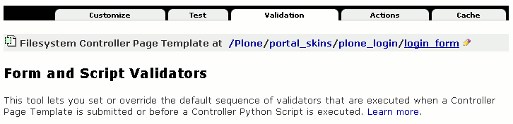

   图 13.17 在Zope管理界面上查看控制表单的表头部分

在 Validators 标签页上可以看到主要的三个部分，以横线分隔开的，
上面是 Edit Form / Script Validator Overrides 部分和
中间的 Add a New Form / Script Validator Override 的部分是可编辑的，
使用Add可以为表单增加校验属性，使用Edit可以编辑现有的属性。
这部分是表单的校验信息存储在ZODB中的部分，
而下面还有 Default Validators 的部分是开发人员在文件系统上定义的默认校验信息，
这部分是不可修改的：

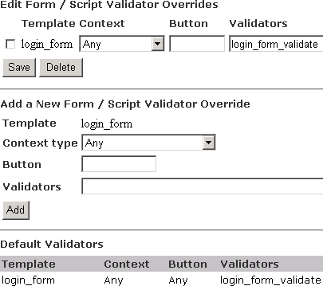

   图 13.18 在Zope管理界面上控制表单的validators属性

再看 Actions 标签页，这是一个类似的界面，也是以横线分隔成三个隔离的部分，
上面的 Edit Form/Script Action Overrides 是用于编辑现有的定制动作信息，
中间的 Add a New Form Action Override 是用于增加动作信息，
下面的 Default Actions 是不可编辑的，用于显示开发人员的定义的默认动作信息。

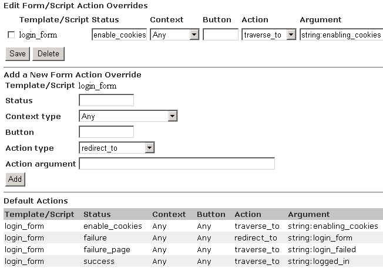

   图 13.19 在Zope管理界面上控制表单的actions属性

可以看到其中为login_form定义了一个校验器和四种不同的流程转向。
在定义校验信息时有 ``Template    Context   Button    Validators`` 这四个参数才定义一行校验信息，
其中Template是指定页面模板的名字，也就是当前的login_form，
Context可以针对所操作的对象类型，如果不选择则默认是Any意味着针对任何对象类型，
Button是按钮的名字，在表单定义中针对submit类型的按钮可以指定诸如 ``form.button.button1`` 这样的名字，
多个按钮可以设定不同的名字以区分按钮，于是在这里就可以设置特定的按钮才使用特定的校验信息，
但如果保留为空则是针对任何按钮的校验信息。

校验脚本(vpy)
---------------------
先看这里定义的校验脚本，是login_form_validate，从Zope管理界面的portal_skins的Find页上找到它，
位于portal_skins/plone_login中，打开查看它的源代码，
也可以根据 Source file 信息从文件系统上找到它打开查看。

这也是一个Python的源代码文件，限于篇幅这里也只分析其中的几段。
从文件头上可以发现多了一个绑定变量是state::

     1	## Script (Python) "validate_login_form"
     2	##bind container=container
     3	##bind context=context
     4	##bind namespace=
     5	##bind script=script
     6	##bind state=state
     7	##bind subpath=traverse_subpath
     8	##parameters=
     9	##title=Validate login
    10	##

中间省去一些段落，但可以看到条件之一的返回语句，校验脚本中都是返回state变量::

    20	if js_enabled and not cookies_enabled:
    21	    context.plone_utils.addPortalMessage(_(u'You must enable cookies before you can log in.'))
    22	    state.set(status='enable_cookies')
    23	    return state
    24	

针对是否匿名用户分别作一些设置::

    25	mt=context.portal_membership
    26	if mt.isAnonymousUser():
    27	    if js_enabled: # javascript is enabled - we can diagnose the failure
                ...
    48	        state.set(status='failure')
    49	    else: # no javascript - do low tech login failure
    50	        context.plone_utils.addPortalMessage(_(u'Login failed'))
    51	        state.set(status='failure_page')
    52	

校验脚本最后是返回state变量::

    53	return state

可以看到其中有几处调用到了state.set方法设置状态::

      state.set(status='enable_cookies')
      state.set(status='failure')
      state.set(status='failure_page')

如果没有设置状态则默认状态为成功，就是字符串 'success' 。

再看设置这几种不同的状态正好对应流程定义中的action中的状态。
从 Actions 标签页的 Default Actions 一段中可以看到定义了四种动作信息。
可以看到使用 ``Template/Script   Status    Context   Button    Action    Argument`` 六个参数才定义一行动作信息，
这里使用 ``Template/Script`` 是因为控制页面模板和控制脚本都可以设置动作信息，
``Status`` 是在校验脚本中设置好的状态， ``Context`` 和 ``Button`` 也和在校验信息中的意义相同，
分别是针对对象类型和按钮命名，
不同的在于这里还有 ``Action`` 和 ``Argument`` 信息。

在 ``Add a New Form Action Override`` 这一部分中可以看到 Action Type 中有四种不同的值：

- redirect_to 是以页面重定向的方式转到另一个页面，参数是一个URL，可以是绝对链接或相对链接
- redirect_to_action 是以页面重定向的方式转到另一个页面的action
- traverse_to 是以路径漫游的方式找到目标对象，参数也是URL，但只能是相对链接
- traverse_to_action 是以路径漫游的方式找到目标对象并调用该对象上的一个action

而 ``Argument`` 信息则是要转到的显示页面，表单控制器产品会使用TALES表达式来解释它，
所以这里可以使用任何合法的TALES表达式形式，但一般为了产生字符串以字符串表达式最好合适。

再看这个login_form控制表单的流程转向，它在四种不同的设置状态上分别漫游或重定向到其它页面，
同样可以在portal_skins的Find标签页上查找这些id，可以找到：
logged_in是一个控制脚本，
login_form返回控制表单本身，
login_failed和enabling_cookies是其它的普通页面模板。

控制脚本(cpy)
------------------------
现在只有控制脚本类型的还没有见过，于是打开logged_in查看。

文件头上比普通的脚本的不同也是多了state绑定变量::

     1	## Controller Python Script "logged_in"
     2	##bind container=container
     3	##bind context=context
     4	##bind namespace=
     5	##bind script=script
     6	##bind state=state
     7	##bind subpath=traverse_subpath
     8	##parameters=
     9	##title=Initial post-login actions
    10	##
    11	

这一段是处理特定情况，设置状态为失败并返回::

    20	if membership_tool.isAnonymousUser():
    21	    REQUEST.RESPONSE.expireCookie('__ac', path='/')
    22	    context.plone_utils.addPortalMessage(_(u'Login failed'))
    23	    return state.set(status='failure')

如果没有失败则流程继续，但其中还可以再设置不同的状态::

    33	if initial_login:
    34	    state.set(status='initial_login')
    35	elif must_change_password:
    36	    state.set(status='change_password')

结束时仍然返回state变量::

    41	return state

它比校验脚本更多的功能是控制脚本也可以作为流程的中心，
在Zope管理界面上查看也会发现控制脚本也有 Validation 和 Actions 标签页，
但这个logged_in并没有设置校验信息，它只设置了四种状态下的动作信息，
在action中设置了四种状态下的流程转向，分别对应在控制脚本中所设置的各种状态。
可以看到它在不同的状态下分别转向 ``login_next, login_initial, login_password, login_failed``
这些页面模板或脚本之类，如果有兴趣还可以沿这个流程找下去，
直到某个非控制对象上流程才会结束。
从这个运行的流程上可以看到在登录过程中Plone所做的所有工作。

控制表单小节
------------------
因为表单控制器通常用于大型的应用任务，
做好一个控制表单需要定义好相应的校验信息和流程转向信息，需要写好多个控制对象和校验对象等，
所以在这一章就不做单独的例子来演示了，
但从上面对Plone的登录表单中你已经掌握了使用控制表单的要点就是：

- 创建时使用控制页面模板(cpt)而非普通页面模板(pt)，在使用控制页面模板定义表单时，
  需要按照上面提供的框架开始，在保持了它的三个原则即定义errors变量、
  和action属性、还有一个名为form.submitted的input之后，
  你可以在其中应用所页面模板上可用的技术，还包括Plone上可用的模板宏和全局变量。
- 写好控制表单后至少需要定义它的流程信息，检验信息则是可选的。
  定义流程时至少要定义一个success状态的后续流程。
  使用校验脚本时需要注意使用state变量控制状态并且必须返回state变量。
  如果在校验脚本或控制脚本中自己设置了新的状态则还需要为其设置相应的后续流程。

除了这少数几个约束之外，你可以在其中使用任何在前面章节中学到的技术，
如脚本和页面模板章节中学到的技术，还有本章介绍的Plone的模板宏和全局变量等。

.. comment

   控制表单设置(.cpt.metdata) TODO 这个属于文件系统开发范畴

   [validators] 
   validators = validate_script1, validate_script2
   validators.Document = validate_script2 
   validators..button1 = validate_script1, validate_script3
   validators..button2 = validate_script2, validate_script4

   [actions]
   action.success = traverse_to:string:script1
   action.success.Document = traverse_to:string:document_script
   action.success..button1 = redirect_to:string:script1 
   action.success..button2 = traverse_to:string:script2

   # redirect_to/redirect_to_action
   # traverse_to/traverse_to_action

metadata属性文件
===================
..
  TODO: 本节和其他内容似乎有点脱节。。。 至少需要说明下？

上面一节讲到控制表单和控制脚本都可以由开发者设置默认的校验和流程转向信息，
在Zope中，这些默认的信息是由扩展产品的开发者在文件系统上以特殊文件名的文件实现的。

关于什么是扩展产品，在后面的章节中会有介绍，这里简单地说，
就是在文件系统上开发(区别于本章中在浏览器上直接开发)的Zope产品。

注意，这一小节的内容实际上是扩展产品开发的一个任务。
因为这一节的介绍都是对文件系统上的文件的内容介绍。

在扩展产品开发中，使用".metadata"后缀的文件控制元数据，
如脚本"register.cpt"的元数据使用"register.cpt.metadata"文件控制。
这些".metadata"文件都是纯文本文件，
它的格式要求是 Python 的 ConfigParser 解析器可以解析，
实际上如果你熟悉Windows上常用的ini配置文件格式就会发现它与ini配置文件格式是相同的。

这种类型的配置文件格式使用 ``[]`` 来区分不同的节(section)，常见的属性写在 ``[default]`` 节中，
校验器和动作信息则分别写在 ``[validators]`` 和 ``[actions]`` 中。

事实上这部分内容不仅仅是对表单控制器产品有效，
对前面章节讲过的脚本和页面模板也同样有效。

- [default]

  在 ``[default]`` 节中通常写有 title 属性，
  对应着在ZMI中设置一个对象的title属性。

  这个default节不仅仅是控制表单和控制脚本才有的，
  在文件系统上的开发中，任何类型的皮肤元素都可以有相应的 ``.metadata`` 文件并在其中使用这个节。

  对于脚本而言，proxy信息也可以在default节中定义，如：

  .. (TODO: Script一章中应该增加proxy使用)

  ::

    proxy=Manager

  相对来说，下面这两个节则是控制表单和控制脚本所特有的属性：

- [validators]

  在这个节中定义不同的校验器，如::

    validators=login_form_validate

  校验器还可以针对特定类型的，如只有当对Document类型操作时才进行validate_script2校验::

    validators.Document = validate_script2

  或者针对特定的按钮使用不同的校验，如对button1和button2分别作不同的校验::

    validators..button1 = validate_script1, validate_script3
    validators..button2 = validate_script2, validate_script4

  注意其中有两个点，即类型字段是空的，保留这个占位符可以针对不同按钮但是所有类型，
  但也可以两者都指定，就是针对特定类型并且是特定按钮::

    validators.Document.button2 = validate_script5

  这个例子是针对Document类型并且是当由button2按钮提交表单时才执行validate_script5校验。

- [actions]

  这个节中定义不同的流程转向信息，如上面的login_form.cpt.metadata中定义了四行::

    action.success=traverse_to:string:logged_in
    action.failure=redirect_to:string:login_form
    action.failure_page=traverse_to:string:login_failed
    action.enable_cookies=traverse_to:string:enabling_cookies

  同样地，动作信息也可以是针对特定的按钮或文档类型或两者都指定::

    action.success..button2 = traverse_to:string:script2
    action.success.Document = traverse_to:string:document_script2
    action.success.Document.button2 = traverse_to:string:document_script2

小结
====
这一章是综合了前面章节介绍的开发技术来介绍Plone脚本开发的理论和实践，
它主要是在浏览器上通过Web界面就可以进行，
最后小节也附带介绍了表单控制器的元数据，为扩展产品开发人员提供了设置元数据信息的方法。
