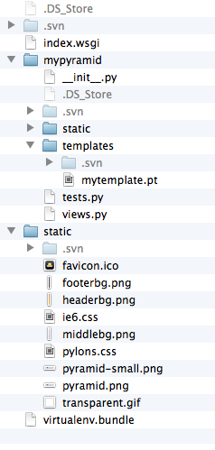
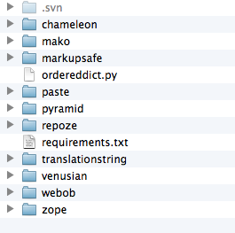

========================================
在SAE上部署Pyramid应用（Python应用）
========================================

SAE是国内做的比较出色的PaaS平台，而且很早就推出了Python支持。不过因为没有内置Pyramid框架的支持（一大堆杂七杂八的包，支持也不易啊～～），要将一个Pyramid应用部署到还是要花点时间的。

一、创建应用
---------------

1. 按照SAE手册，在“我的首页”创建新应用：pyramidkoans。

2. svn co https://svn.sinaapp.com/pyramidkoans

3. 创建目录1

二、加入Pyramid应用
--------------------------

1. 新建一个Pyramid应用：mypyramid

2. 将mypyramid/mypyramid目录拷贝到1目录

3. 将mypyramid/mypyramid/static 目录拷贝到1目录（SAE处理了/static开始的请求，不过不能删除原来目录下的static目录及内容，否则pyramid在生成static_url的时候会出错。）

4. 编辑index.wsgi文件为

.. code::

    import sae

    import os
    import sys

    app_root = os.path.dirname(__file__)
    sys.path.insert(0, os.path.join(app_root, 'virtualenv.bundle'))

    from pyramid.config import Configurator

    settings = {"pyramid.reload_templates":"false",
                "pyramid.debug_authorization":"false",
                "pyramid.debug_notfound":"false",
                "pyramid.debug_routematch":"false",
                "pyramid.default_locale_name":"en"
                }

    config = Configurator(settings=settings)
    config.add_static_view('static', 'mypyramid:static', cache_max_age=3600)
    config.add_route('home', '/')
    config.scan("mypyramid")

    app = config.make_wsgi_app()

    application = sae.create_wsgi_app(app)

三、整理Pyramid支持包
----------------------

1. 打包

SAE提供的bundle_local.py在处理

    zope.deprecation-3.5.1-py2.7.egg
    zope.interface-3.8.0-py2.7-macosx-10.7-intel.egg

这两个包的时候会出错（zope目录已经建立。。。，没判断。）。

因此自己一个一个拷贝到virtualenv.bundle吧。

2. 修改

因SAE不支持载入.so文件，因此需要对

    zope.interface-3.8.0-py2.7-macosx-10.7-intel.egg
    MarkupSafe-0.15-py2.7-macosx-10.7-intel.egg

这两个包进行修改，修改内容为：
删除 zope.interface-3.8.0-py2.7-macosx-10.7-intel.egg包中的 _zope_interface_coptimizations.c  _zope_interface_coptimizations.py
删除 MarkupSafe-0.15-py2.7-macosx-10.7-intel.egg包中的 _speedups.c _speedups.py

3. 下载ordereddict-1.1包，解开将其中的ordereddict.py放入virtualenv.bundle根目录。http://pypi.python.org/pypi/ordereddict

4. 最终的项目目录结构如下：

 
virtualenv.bundle中目录结构如下：

5. 因考虑到可能需要修改一些包中的文件，这次测试没有用egg、zip包（SAE提到了可以将全部第三方代码打成一个zip包，没提每个第三方能否分别用一个egg包的方式），全部解开上传的。

四、上传到SAE
-----------------

在pyramidkoans运行svn add 1，然后运行svn ci -m "my first pyramid app"即可。

然后就可以通过SAE提供的URL进行访问了。
