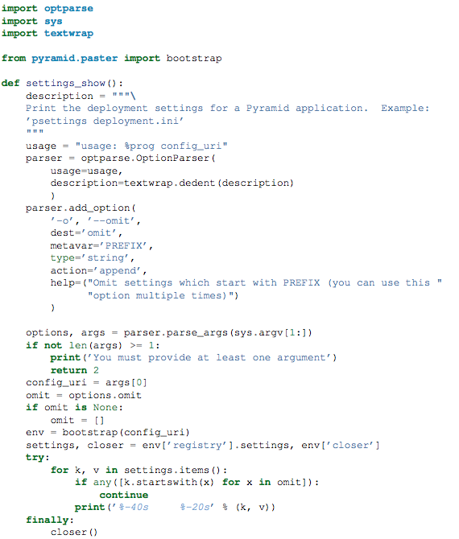

===========================
命令行调测Pyramid（下）
===========================

虽然Pyramid已经提供了比较丰富的命令行工具，但作为一个程序员，开发自己的命令行工具还是一件比较酷的事情。

三、开发定制脚本
--------------------

1. bootstrap

我们知道，如果我们只是在我们的脚本中import了Pyramid项目中的代码来调用它，这时候我们是无法得到request的数据的，而很有可能我们的程序恰恰依赖于它。

为了解决这种问题，Pyramid推出了一个小功能Pyramid.paster.bootstrap()。如

.. code:: python

    from pyramid.paster import bootstrap
    env = bootstrap('/path/to/my/development.ini')
    print env['request'].route_url('home')

如上例，bootstrap返回一个带有Pyramid框架相关信息的一个字典。我们就可以利用他们进行一系列的程序剖析工作了。

env字典中包含的信息如下：

- request：代表当前请求的request
- app：WSGI应用
- root：根资源
- registry：应用注册表
- closer：脚本介绍时用来清理现场（thread local 栈）

2. 改变Request请求

Pyramid默认生成的env中的request对象是针对http://localhost:80/这个URL的，这显然不能满足我们的需要，因此首要的任务就是改变这个request对象。

假如我们的应用中有一条路由是这么定义的：

  config.add_route('verify', '/verify/{code}')

同时，我们的应用加载点为：https://example.com/prefix。下面我们就来构造合适的request：

.. code:: python

    from pyramid.paster import bootstrap
    from pyramid.request import Request

    request = Request.blank('/', base_url='https://example.com/prefix')
    env = bootstrap('/path/to/my/development.ini#another', request=request)
    print env['request'].application_url

我们可以看到打印出https://example.com/prefix这个URL了。现在输入

    env[’request’].route_url('verify', code='1337')

就可以得到URL https://example.com/prefix/verify/1337

3. 启动日志配置

默认情况下，bootstrap没有配置日志，因此也打印不出程序日志。可以通过如下语句打开日志（前提是配置文件中有日志配置内容）

.. code:: python

    import logging.config
    logging.config.fileConfig('/path/to/my/development.ini')

4. 清理现场

当脚本处理结束时，记得要清理现场，调用

    env['closer']()

四、加入到console 脚本中
-----------------------------

现在，你写出来的程序还只是一个独立运行的python文件。怎么做成类似pserve这样的脚本呢？

1. console script

console script是setuptools的专有名词，带有该脚本的应用包被安装之后，该脚本将会安装到虚拟环境的bin目录或系统python环境中（其实并不是整个脚本复制过去，而是建立了一个便捷载入方式的脚本）。因为它被安装到了bin目录下，比告诉最终用户怎么用py程序，选择什么python环境要来的简单。而且安装到bin目录下的文件里面已经包含了python环境的指向以及必要的包，用户只要运行该命令即可。

因此，推荐将自己做的脚本转成console script以方便客户使用。

2. 编写console script的步骤

* 在myproject/script目录下建立需要的脚本文件。
* 在setup.py的entry_points参数中增加一个console script
* 运行python setup.py develop（正式安装可以直接python setup.py install）

3. 一个实例

首先在script目录下建立脚本文件：

其次，修改setup.py 文件中的entry_points参数为：

.. code::

    entry_points = """\ [paste.app_factory]
          main = myproject:main
          [console_scripts]
          show_settings = myproject.scripts:settings_show
          """

最后，运行python setup.py develop。

接下来就可以用show_settings development.ini来查看配置文件了，跟之前的pviews之类很像吧！

