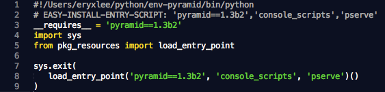
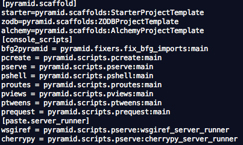
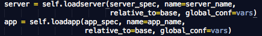
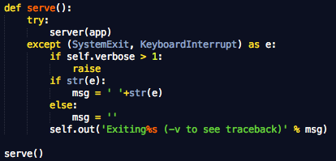
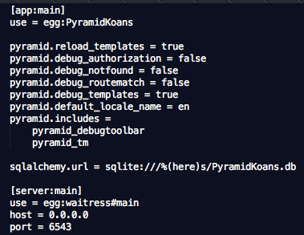
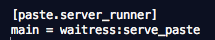
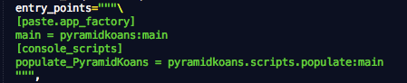

===============================
Pyramid项目是怎么启动起来的？
===============================

Pyramid 官方文档上专门有一个章节解释了Pyramid项目的启动过程，不过因为整个启动过程还涉及到一些非pyramid模块，光看那个说明未必能很好理解清楚整个启动过程。下面，我们通过一个小例子简单看看一个Pyramid项目是怎么一步一步启动起来的。

一、创建好项目，配置好开发环境。
---------------------------------------

按照pyramid的介绍，我们用如下命令很快就可以创建一个演示项目。

.. code::

    pcreate -s alchemy PyramidKoans
    python setup.py develop

Ok，现在就可以用
pserve development.ini来启动这个项目了。

二、pserve是啥？
---------------------------------------

问题来了，为什么是用pserve来启动？pserve又是怎么启动载入的呢？
我们知道，pyramid安装的时候会在<virtualenv>/bin目录下（如果你用virtualenv的话）生成一堆的执行文件，pserve就是其中一个，我们打开看看先：

这堆文件基本都是这个样子，只是里面参数有差异而已，其实这些都是easy_install根据egg包中的egg_info自动生成的，所以当然都差不多啦。

下面我们再打开pyramid EGG_INFO中的entry_points.txt文件对比一下：

可以看到在<virtualenv>/bin下生成的执行文件跟上面console_scripts是一一对应的。

所以，我们就可以很好理解 load_entry_point('pyramid==1.3b2', 'console_scripts', 'pserve')() 这语句了，它就是来pyramid 1.3b2这个egg包中来找'console_scripts', 'pserve'这个入口，然后载入其对应的程序，这里就是pyramid.scripts.pserve:main。

再打开pyramid包script目录下，找到pserve.py找到main函数，刚才的pserve命令就是启动了这个main函数而已。（其实这个script就是原来的paste script内容，基本原封不动的转到这里来了。）

二、paste deploy来了
------------------------

既然用了paste script，那当然就要用到paste deploy啦。

找到PServeCommand类的run方法，很容易就可以找到

这就是用了paste deploy中的loadserver，loadapp方法。

paste deploy是一个很常用定位、配置WSGI应用/服务器的工具包，它可以从一个定制的配置文件里面载入你所定义的app和server。这里这个配置文件就是上面启动命令里面提到的development.ini。加载了app和server之后，马上可以看到

因为这里的server跟app都是符合WSGI标准的，所有将app丢给server即可启动啦。

三、development.ini
--------------------------

上面已经找到了server和app的载入，那么又是怎么找到你所需要的那个server跟app呢？要理解这点，就需要看development.ini这个配置文件了。

这是一个基本上算标准的ini配置文件，不过paste deploy还是在上面做了一些定制。比如server:main、app:main、use这些定义。

server:main
这里的server是一个固定用法，表示下面的配置用于启动一个WSGI server。
server:main这一配置块定义了WSGI server启动方式以及它的启动参数，如host、port。
这里的第一行use = egg:waitress#main就是定义了如何启动WSGI server。这里use也是个固定用法，egg:waitress#main表示找到waitress这个egg包，找到里面的entry_points中main定义项：

然后查看waitress这个包中的serve_paste这个方法即可，这个方法就是将waitress这个WSGI server启动起来。具体的waitress内容这里就不详细讨论了。
在定义waitressa参数的时候要注意下，我们经常还需要定义一个threads参数，它表示需要启动多少线程来提供服务，默认是4个，如果需要在正式环境用的话是不够的。
当然，我们也可以通过修改配置重新使用paste来替换waitress提供服务。

app:main
这里app也是固定用法，表示app_factory，表示由这里的信息来生成WSGI app。main是配置块名字，在使用pipeline的时候用得到。
app:main块定义了app中所能使用的参数（除了use），如pyramid.reload_templates、pyramid.debug_templates、sqlalchemy.url…这些都是pyramid本身或app程序中需要使用的配置，如果app需要定义自己的配置，也可以放在这里。
这里我们要着重看一下的是use = egg:PyramidKoans这句。egg:PyramidKoans表示从PyramidKoans这个egg包找到app的入口，这里省略了#main（默认就是它啦）。所以，又要找entry point啦，打开PyramidKoans项目中的setup.py文件（没打包发行之前，entry_points存在这里面。）

我们在这里也找到了entry_points，看[paste.app_factory]这里的定义，paste deploy就是来找这一段配置，再看main = pyramidkoans:main，这里第一个main就是我们刚才说的省略了的那个main，然后它指向了 pyramidkoans:main，表示需要到paramidkoans这个包里去找main这个方法。
