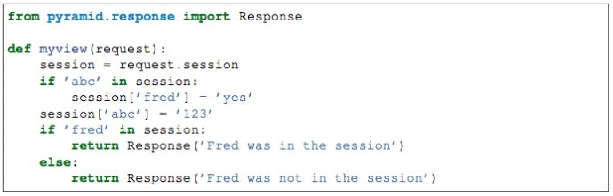

==========================
Pyramid session的使用
==========================

session是大部分web应用都采用的一项技术，Pyramid也同样提供了灵活的session支持。

一、session factory
----------------------

在Pyramid中，要使用session，必须先给Pyramid配置一个session factory。如

.. code:: python

    from pyramid.session import UnencryptedCookieSessionFactoryConfig
    my_session_factory = UnencryptedCookieSessionFactoryConfig('itsaseekreet')

    from pyramid.config import Configurator
    config = Configurator(session_factory = my_session_factory)

这里的UnencryptedCookieSessionFactoryConfig是Pyramid提供的一个最基本、非加密的session factory，它使用cookie来存储session信息。因其是不加密的，所以容易让人伪造而进行非法访问，并且其存储大小也受限。不推荐生产环境使用。

Pyramid还提供了一个叫pyramid_beaker的插件，用来提供更安全、复杂的session支持。 

二、session对象的使用
--------------------------

一旦配置好了session factory，即可通过request.session来使用session。如

session 的使用跟dict很类似，除了dict基本用法之外，还增加了一些session相关的额外属性和方法：

- created属性：session创建时间戳
- new属性：是否新创建的，还是已经序列化过的（即已存储）
- changed方法：标明session中的数据已经通过其他方式变更，需要重新序列化。直接对session对象的操作会自动设置更新状态，无需调用此方法。
- invalidate方法：作废session，清空数据

在使用session时注意：session的key和value数据必须都是可以用Pickle序列化的。

三、一种特殊的session —— Flash Messages
-------------------------------------------

Flash Messages是一直特殊的session，Pyramid在UnencryptedCookieSessionFactoryConfig 这个session factory中，提供了一个字符串队列的特殊session。主要用于页面重定向，或非视图代码向页面传递信息。它主要提供了如下操作：

- request.session.flash(’mymessage’)    传递一个信息
- request.session.pop_flash()  取出所有信息，并清空队列
- request.session.peek_flash()  取出所有信息，不清空队列

四、CSRF攻击及防范
----------------------

CSRF（Cross-site request forgery跨站请求伪造，也被称成为“one click attack”或者session riding，通常缩写为CSRF或者XSRF，是一种对网站的恶意利用。http://baike.baidu.com/view/1609487.htm

Pyramid提供了CSRF令牌机制来防范这种攻击方式。

- token = request.session.get_csrf_token()  取回令牌，如果当前session没有令牌，则创建一个。

- token = request.session.new_csrf_token()  创建一个新令牌，原令牌作废。

开发者可以在Form表单中加一个隐藏字段，并创建一个令牌传递给这个字段，然后在表单提交时检验提交过来的令牌是否与session中的一致来防止CSRF攻击。
   
