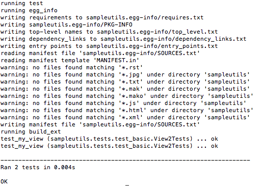
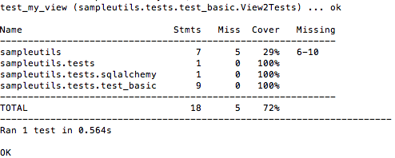
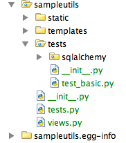
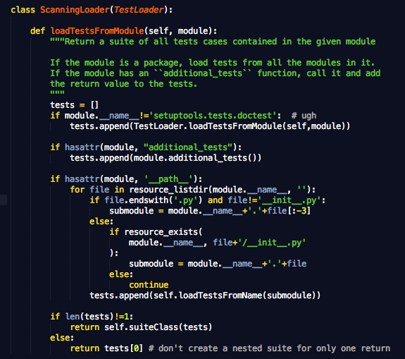

===============================================
python setuptools test command 的一点小问题
===============================================

为了测试一点小程序，用pcreate -t starter sampleutils 命令生成了一个项目框架。然后在sampleutils package中建了一个tests package，然后在这个package中放置了一个test_basic.py，程序如下：

.. code::

   import unittest

   from pyramid import testing

   class View2Tests(unittest.TestCase):
       def setUp(self):
           self.config = testing.setUp()

       def tearDown(self):
           testing.tearDown()

       def test_my_view(self):
           pass

很简单，里面仅有一个testcase。现在就可以用python setup.py test来有运行单元测试了。

运行结果如下

很奇怪吧，竟然运行了两次同一个testcase。

再换nosetests运行看看：

这里明确显示是一个testcase。究竟哪里发生了问题呢？

很快，我们就可以发现，pcreate生成的tests.py文件我们并没有删掉，而且这个module的名字跟tests package的名字重复了。这就是造成这次问题的原因。

但一般的，就算多了这个文件，也应该仅仅是忽略它啊，就像nosetests运行结果一样，不会去tests.py中查找任何test case。

为什么在python setup.py test 命令中会出现载入两次test_basic.py中的test case呢？

我们再来看python setup.py test这个命令的运行机制，该命令是setuptools中的一个命令之一，它通过读取setup.py文件中的配置信息，在指定目录中查找所有的testcase，然后运行。

找到setuptools的源码，打开command中的test.py程序，这个程序定义了setuptools中test command运行流程。

上面这段程序就是test case的查找过程。

从 if file.endswith('.py') and file!='__init__.py' 这一段就可以看出，它将tests.py 跟tests 混为一谈了，并且没有检查该模块是否已经载入，从而导致了在扫描tests的时候，载入了一次sampleutils.tests包，在扫描tests.py的时候，再次载入了sampleutils.tests这个包。这样也就很好的解释了在运行python setup.py test 命令的时候运行了两次相同的test case.

虽然是一个错误造成的问题，但也可以看出 setuptools中的代码还是值得推敲的。
