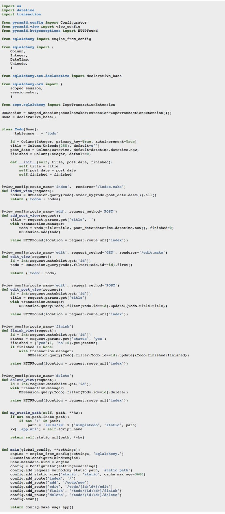

=================================
Simple-TODO Pyramid实现版
=================================

看到@python4cn 网站上有个专栏列了各个python框架的SimpleTODO实现，唯独没有Pyramid，就随手写了一个，使用了Pyramid、SQLAlchemy，略做补充。 具体的项目地址在 https://github.com/eryxlee/pyramid_koans/tree/master/Simple-TODO

