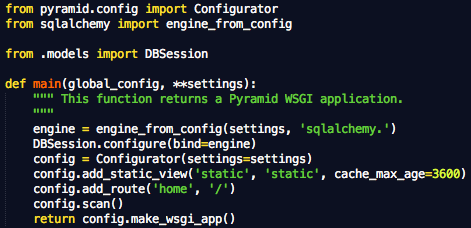

=====================================
Pyramid启动时都能干些啥？
=====================================

Pyramid找到我们项目的main函数之后，一切就相对简单了。

一、项目参数的传递
--------------------

我们打开项目中的__init__.py文件，找到自动生成的main函数如下：

我们可以看到，main函数带了两个参数，global_config和setting。这是由Paste deploy传递过来的解析自development.ini的参数项。

其中global_config是development.ini中[DEFAULT]这一节中的参数定义，在我们自动生成的例子中，我们没有使用default节，所以也就没有传入自定义的参数，系统默认在global_config这个字典对象中加了两个参数项定义：
here: 表示development.ini文件所在目录的绝对路径
__file__: 表示development.ini文件的绝对路径

setting字典则包含了所有定义在[app:main]中的参数项（除了use），在我们的例子中，就包含了pyramid.reload_templates、pyramid.debug_authorization、sqlalchemy.url等的参数项。这些参数项都可以直接在我们的程序中使用。我们也可以在[app:main]中定义自定义的参数项，如mytest=testconfig。那么我们在view中就可以用如下程序取得定义的值。

.. code::

    settings = request.registry.settings 
    mytest = settings[’mytest’]

这里注意一下，放在其他section中的参数是传不进来的，如果一定要这样用，需要在程序中取到ini文件路径（global_config中的__file__），然后自行使用ConfigParser读取解析。

二、Configurator的配置
-------------------------

就如上面的程序，main函数做的最主要的工作就是做整合项目的配置，形成注册表。在Pyramid中可以配置的东西很多，我们可以简单看下几个常用的配置：

1. 静态资源
通过config.add_static_view('static', 'static', cache_max_age=3600)加入一个静态资源目录，一般写成config.add_static_view(name=’static’, path=’/var/www/static’) 或 config.add_static_view(name=’static’, path=’mypackage:a/b/c/static’) 这样的方式更清晰。
在add_static_view中，name代表了静态文件URL的前缀，如果我们使用了上面前一个例子，那么URL /static/foo.css 就会取指向文件/var/www/static/foo.css。后一个例子是相对与项目包结构的相对路径。
不过现在很多程序都是用外部资源来做静态资源的，也可以用config.add_static_view(name=’http://example.com/images’,  path=’mypackage:static’)这种方式将静态文件指向外部服务器。
在程序中，就可以用static_url('pyramidkoans:static/favicon.ico') 或 static_path('pyramidkoans:static/favicon.ico') 这样的方式来引用静态资源。按照之前不同的定义，这里会解析出不同的结果。

2. add_route、add_view、view_config、scan
这几个函数定义了从URL到view的映射关系，add_route只在Route模式才会使用，traversal模式下不用。
view的配置可以使用add_view手工加入，也可以使用view_config标注+scan函数合作完成。

3. 权限
pyramid整合了一套ACL权限管理体系，也需要在configurtor中进行配置才能生效。pyramid权限管理划分了认证、授权两个部分，需要分别配置。

.. code::

    authn_policy = AuthTktAuthenticationPolicy('sosecret', callback=groupfinder)
    authz_policy = ACLAuthorizationPolicy()

    config.set_authentication_policy(authn_policy)
    config.set_authorization_policy(authz_policy)

4. 用include包含子模块
项目大了之后，可以划分成多个子模块，然后用include包含子模块。

5.subscriber
Pyramid定义了一套简单的事件系统，开发者可以通过订阅一些特定的事件来改变框架的一些默认行为。

三、app的生成
----------------

完成了configurator的配置之后，pyramid就调用make_wsgi_app来生成一个符合WSGI规范的app，以便提供服务。
不过这个app是一个叫Router的类的实例，很奇怪吧。

好了，接下来就等待访问链接的来临吧
