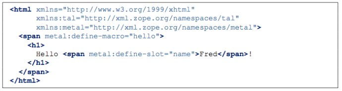
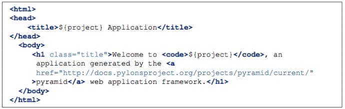

===========================
Pyramid中模版的使用
===========================

模版技术基本上是web技术框架中必备的一环。Pyramid中，提供了Chameleon和Mako两种模版语言的支持，用户还可以通过一些插件方式增加自己需要的模版语言支持。

一、直接调用模版进行渲染
--------------------------

对于模版的使用，最直接的方式就是直接调用相关模版、渲染器中提供的方法。例如：

.. code:: python

    from pyramid.renderers import render_to_response

    def sample_view(request):
        return render_to_response('templates/foo.pt',
                                  {'foo':1, 'bar':2},
                                  request=request)

这个例子就是用templates目录下的foo.pt模版以及相关参数生成一个Response。注意，这里用的是相对目录，是相对于当前view文件。这里的目录可以是相对目录、绝对目录或类似some.dotted.package_name:relative/path这样的包目录结构。

另外需要注意的是，如果在模版中使用了request、context等系统变量，则在调用render_*方法时需要指定request参数。

有的时候，我们并不需要直接返回一个Response对象，比如生成一封mail的内容等情况。这时，我们就需要使用render方法了。例如：

.. code:: python

    from pyramid.renderers import render
    from pyramid.response import Response

    def sample_view(request):
        result = render('mypackage:templates/foo.pt',
                        {'foo':1, 'bar':2},
                        request=request)
        response = Response(result)
        return response

也可以跳过renderer，直接使用任何已经安装的模版语言，比如，可以如下例这样直接调用模版提供的API。

.. code:: python

    from mako.template import Template
    from pyramid.response import Response

    def make_view(request):
        template = Template(filename='/templates/template.mak')
        result = template.render(name=request.params['name'])
        response = Response(result)
        return response

二、通过view_config来使用模版
-------------------------------

除了特殊情况需要直接调用模版API来使用模版外，普通应用一般通过view_config的renderer参数直接配置模版。例如

.. code:: python

    from pyramid.view import view_config
    @view_config(renderer='templates/foo.pt')
    def my_view(request):
        return {'foo':1, 'bar':2}

这里涉及到的参数基本与第一节中类似，值得注意的是，这里view的返回值是一个dict，就是第一节中render方法的第二个参数。

在这种情况下，也可以通过request.response对象设置特定的response属性，比如context-type等

三、渲染时添加的系统变量
-------------------------

当使用render_to_response或render等方法时，渲染器会自动往模版中添加以下系统变量：

- context：如果request中有context值，则可在模版中直接使用context变量，否则，该变量为None
- request：Pyramid的请求对象
- renderer_name：渲染器名，如
- renderer_info：渲染器信息对象，包含名字、包、类型等信息

四、Chameleon模版
---------------------

1. txt模版

Chameleon支持纯文本模版，可以在模版里直接只用${var}形式来引用传入模版的参数。如mytemplate.txt文件内容为：

    Hello, ${name}!

则通过配置如下view之后：

.. code:: python

    from pyramid.view import view_config

    @view_config(renderer='templates/mytemplate.txt')
    def my_view(request):
        return {'name':'world'}

访问该view显示 Hello, world!

2. ZPT模版

在ZPT模版中，也支持${var}这样的方式进行参数引用。同时，也支持经典的基于属性的ZPT语法结构，比如tal:content, tal:replace等语法，具体可以查看Chameleon官方语法说明。

3. ZPT宏定义

Pyramid同样提供了ZPT宏的支持，不过不同于Zope的是，在Pyramid中，context是一个resource对象，因此，无法从context得到模版。因此，在Pyramid中，需要将宏/宏模版作为参数直接传入被渲染的模版。如下：

.. code:: python

    from pyramid.renderers import get_renderer
    from pyramid.view import view_config

    @view_config(renderer='templates/mytemplate.pt')
    def my_view(request):
        main = get_renderer('templates/master.pt').implementation()
        return {'main':main}

在这个例子中，使用了get_renderer方法取到宏模版，然后将其作为参数返回给被渲染的模版。

而这里的master.pt可以如下：

这里通过define-macro定义了一个名字叫hello的宏，并且可以传入一个叫name的参数

最终调用这个宏的被渲染模版如下：

.. image:: imgs/renderer_template.jpeg

通过use-macro来调用刚才定义的宏。

五、Mako模版
--------------

Mako是以前Pylons一直采用的默认模版。虽然评测说Chameleon性能高于Mako，不过就模版文件简洁性，页面布局能力上，个人更喜欢Mako。

使用Mako模版需要在ini文件中指定模版根路径，如mako.directories = mypackage:templates

Mako也是需要用${var}来引用传入的参数的，如：

