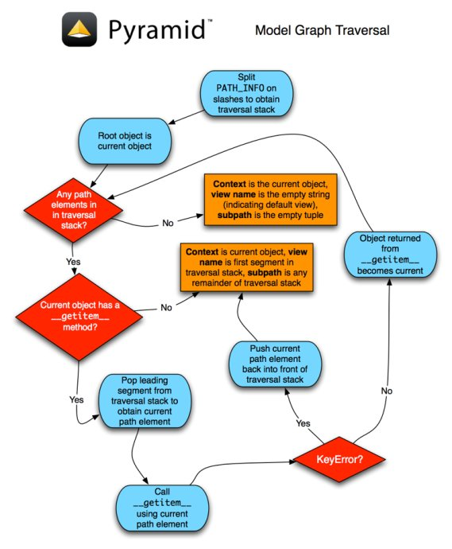

=======================================================
使用Traversal来配置Pyramid项目（二）Traversal算法
=======================================================

二、Traversal
------------------

1. root factory配置
~~~~~~~~~~~~~~~~~~~~~

理解清楚resource树之后，我们就可以自己按照需要构建定制的resource树，并在Pyramid项目中的__init__模块的main函数中将这棵树的根节点传给Pyramid配置方法Configurator。如果调用该方法的时候，没有root_factory参数或root_factory参数为None，系统会使用一个默认的root_factory，它永远返回一个不带子节点的resource。

2. 算法参考案例
~~~~~~~~~~~~~~~~~~

.. code:: python

    class Resource(dict):
        pass

    def get_root(request):
        return Resource({'a': Resource({'b': Resource({'c': Resource()})})})

可能地访问URL：/a/b/c

3. traversal算法
~~~~~~~~~~~~~~~~~~~

当一个用户对一个使用了Traversal算法的应用发起一次请求时，系统采用了如下算法来找到一个上下文resource和view名字。

1) request请求通过WSGI服务器，形成标准的WSGI请求，传递给router程序。
2) router 根据WSGI环境变量构造一个request对象。
3) 调用root_factory（get_root），得到root resource。
4) router采用WSGI中的PATH_INFO变量作为traverse（漫游）的路径。首先，去掉前导的'/'，并将后续的路径片段按'/'切分形成一个漫游序列，如[u'a', u'b', u'c']。 注意我们这里的内容都是经过url unquote以及unicode decode的，所有数据值都是以unicode方式存在的。
5) 现在我们有一个root resource，以及一个漫游序列。我们从漫游序列中取出一个数据：'a'，并将它传给root resource地__getitem__方法，我们可以得到另外一个resource(我们就叫它resource ‘A')。然后再从漫游序列中取出一个数据：'b'，然后传给resource 'A'的__getitem__方法，我们又得到了一个新地resource（resource 'B'）。再从漫游序列取出一个数据：’c'，传给resource 'B'的__getitem__方法，则得到resource 'C'。
6) 一旦整个漫游序列用完，或任何一次__getitem__调用抛出一个KeyError异常、AttributeError异常的时候，以及遇到任何一个以@@开头的路径片段时，漫游过程即中止。
7) 不论以上任何一种情况终止了漫游，最后一个发现的resource即为我们需要的上下文（context）。如果这个时候漫游序列耗尽了，则view名字为‘’。否则紧邻的一个路径片段将被当作view名字。
8) 在view名字之后的任何路径片段极为subpath。

一旦得到了context，view名，subpath，漫游的所有任务即结束了，这些参数将传递给router，以便进行下一步的view定位工作。

