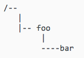
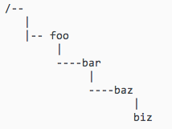
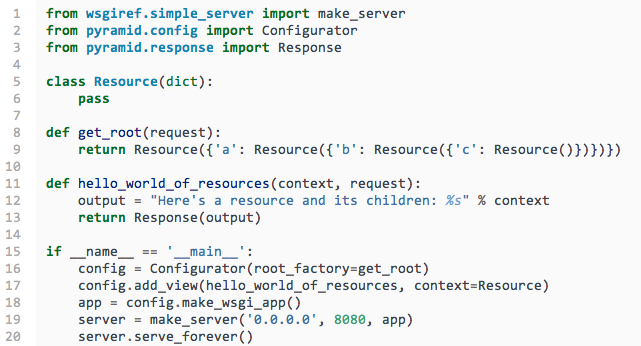
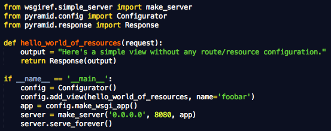

=======================================================
使用Traversal来配置Pyramid项目（三）Traversal案例
=======================================================

三、案例
--------------

1. 漫游示例

假如我们需要访问一个链接http://example.com/foo/bar/baz/biz/buz.txt。那么这个访问请求的PATH_INFO即为/foo/bar/baz/biz/buz.txt。
同时假如我们有如下的resource tree

整个漫游过程如下：

 - 找到root resource，查询foo
 - 找到foo resource，查询bar
 - 找到bar resource，查找baz，找不到，抛出KeyError

得到 context 为bar resource
view 名 为 baz
subpath 为 (u'biz', u'buz.txt')
随即，漫游结束，开始view定位。

下面我们将resource树改成如下形状：

访问同样的链接http://example.com/foo/bar/baz/biz/buz.txt
整个漫游过程如下：

 - 找到root resource，查询foo
 - 找到foo resource，查询bar
 - 找到bar resource，查询baz
 - 找到baz resource，查询biz
 - 找到biz resource，查找bux.txt，找不到，抛出KeyError异常

得到context为biz resource
view名为buz.txt
subpath为()

2. 完整案例

上例中：

- 5-6行，创建了一个简单的resouce类

- 8-9行，创建了一个resource 树

- 11-13行，定义了一个view

- 16行，创建带root_factory的configurator

- 17行，将view加入注册配置，并指定上下文为Resource类

下面我们就可以启动这个程序，然后访问如下URL：

- http://localhost:8080/，浏览器即显示Here's a resource and its children: {'a': {'b': {'c': {}}}}

- http://localhost:8080/a/b，浏览器即显示Here's a resource and its children: {'c': {}}

- http://localhost:8080/a/b/c，浏览器即显示Here's a resource and its children: {}

- http://localhost:8080/xyz，浏览器即显示 404 Not Found

- http://localhost:8080/a/b/c/d，浏览器即显示 404 Not Found

3. 进一步改变

我们删去resource树的构建，让系统使用默认的root_factory，则我们可以得到下面的例子：

现在我们再访问如下URL

http://localhost:8080/foobar，浏览器显示Here's a simple view without any route/resource configuration.

这是一个traversal地变种，只有root resource，而且foobar是view名字，这种情况比较适合做简单地小程序来测试熟悉系统。
