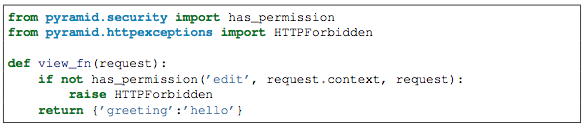
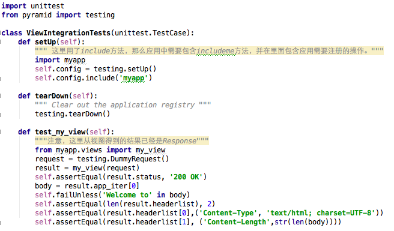
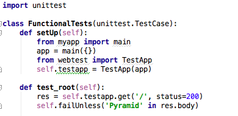

=================================
在Pyramid中做unit testing
=================================

Pyramid支持Python unittest模块。Pyramid为单元测试、集成测试、功能测试提供了一系列便利功能。

一、setUp与tearDown
-------------------------

Pyramid为了支持get_current_reqeust、get_current_registry等功能，在框架中使用了thread local 机制，因此在单元测试中，推荐在setUp方法中调用pyramid.testing.setUp，在tearDown调用pyramid.testing.tearDown以进行thread local的设置和清除。如果在应用中使用了get_current_request功能，还需要在setUp中创建一个request对象。如：

.. code:: python

    import unittest
    from pyramid import testing

    class MyTest(unittest.TestCase):
        def setUp(self):
            request = testing.DummyRequest()
            self.config = testing.setUp(request=request)

        def tearDown(self): 
            testing.tearDown()

通过这样配置之后，在单元测试中直接引用get_current_request即可返回一个request对象，而非None。

二、利用Pyramid提供的API编写单元测试
--------------------------------------

在Pyramid Configurator API和pyramid.testing模块中为单元测试提供了许多便利功能。如在应用注册表中注入一些测试桩，而非实际的功能。

下面我们用一个带权限的视图的例子来简单说明其用法。

上例中，定义了一个视图，该视图中的程序首先判断是否具有权限，如果没有权限，则抛出HTTPForbidden异常。

现在我们构造一个简单的单元测试，如：

.. code:: python

        from my.package.views import view_fn
        request = testing.DummyRequest()
        info = view_fn(request)

运行之后我们发现，这程序始终没法模拟没有权限的过程。因为我们在__init__.py中的main中配置了权限策略，但在单元测试中，我们没有做任何配置。因此Pyramid提供了这方面的一些桩功能来专门为单元测试服务。如下面的程序：

.. image:: imgs/test2.png

在这个例子中，test_view_fn_forbidden单元测试直接指定了当前用户无权限的策略，从而引发HTTPForbidden异常。在这种情况下，在视图中用pyramid.security.authenticated_userid(request)得到当前用户名即为hank。

在上例中，我们在setUp中通过testing.setUp()构建了一个config，它是一个Configurator对象，可以在测试程序中往这个对象中设置需要的测试桩。Pyramid在Configurator对象上提供了如下几种测试桩：

testing_add_renderer(path, renderer=None)  注册渲染器

testing_add_subscripber(event_iface=None) 注册订阅者

testing_resource(resource)  提供一个资源字典供pyramid.traversal.find_resource使用。

testing_securitypolicy(usesrid=None, groupids=(), permissive=True) 提供权限控制策略

同时在pyramid.testing模块里面提供了：

DummyResource(__name__=None, __parent__=None, __provides__=None, \**kw)

DummyRequest(params=None, environ=None, headers=None, path=’/’, cookies=None, post=None, \**kw)

DummyTemplateRenderer(string_response='')

三、如何写集成测试用例
-----------------------

在Pyramid中，单元测试基本上都是基于mock或dummy来完成测试的。而集成测试更多的是针对程序段及其需要的Pyramid架构支持整合在一起的测试。

我们经常用includeme方法来进行集成测试，在这种方式下，运行测试用例时会通过setUp建立整个Pyramid环境，并在tearDown时清除。

下面我们再用个例子说明。假设我们有一个应用，名字为myapp，其中有个叫my_view的视图，其输出‘Welcome to this application’。那么它的集成测试用例如下：

除非必要，建议更多采用Configurator API和注册mock对象的方法来做单元测试，单元测试的速度远快于集成测试。

四、如何写功能测试
--------------------

功能测试主要是为了测试应用是否完成了其应该的功能。如下例：

在这个例子中，我们用了webtest模块来直接启动app，从而发起类似实际的request请求，并查看其结果。

Pyramid官方文档里面单元测试部分的内容还是写的比较简单的，感觉很多东西不够深入，以后有机会多写点实际的例子看看。
