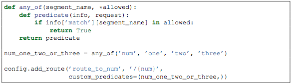
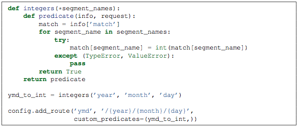
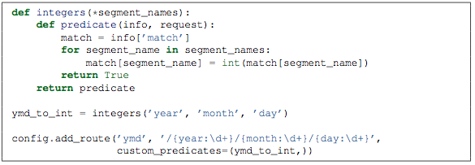
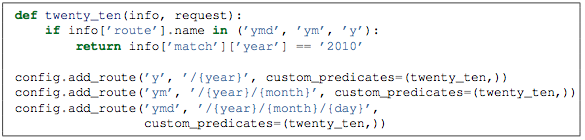

===============================================
使用URL分发方式配置Pyramid项目（下）
===============================================

五、匹配规则案例
--------------------

下面通过几种可能的案例及其匹配之后的matchdict内容来解释一下这个匹配规则。

1. 规则 foo/{baz}/{bar}

    foo/1/2              -> {’baz’:u’1’, ’bar’:u’2’}     最普通的匹配方式

    foo/abc/def      -> {’baz’:u’abc’, ’bar’:u’def’}   注意，这里的值是unicode的

    foo/1/2/             -> 不匹配，因为最后有一个'/'

    bar/abc/def      -> 第一段就无法匹配

2. 规则 foo/{name}.{ext}

    foo/biz.html   -> {’name’: u’biz’, ’ext’: u’html’}

    /foo/biz         -> 不匹配，没有'.'

3. 规则 /Foo Bar/{baz}

    /Foo Bar/abc  -> {'baz': u'abc'}

4. 规则 foo/{baz}/{bar}*fizzle

    foo/1/2/                   -> {’baz’:u’1’, ’bar’:u’2’, ’fizzle’:()}

    foo/abc/def/a/b/c   -> {’baz’:u’abc’, ’bar’:u’def’, ’fizzle’:(u’a’, u’b’, u’c’)}

5. 规则 foo/\*fizzle

    /foo/La Peña/a/b/c    -> {'fizzle':(u'La Pe\xf1a', u’a', u'b', u'c')}

6. 规则 foo/{baz}/{bar}{fizzle:.*}

    foo/1/2/                  -> {’baz’:u’1’, ’bar’:u’2’, ’fizzle’:()}

foo/abc/def/a/b/c  -> {’baz’:u’abc’, ’bar’:u’def’, ’fizzle’: u’a/b/c’)}

这里的.*是正则表达式，表示通配所有字符，跟例子4是不一样的，而且这里需要{}将占位符包含起来。

六、生成URL
--------------

在程序开发中，经常需要跳转到一个route对应的URL，这个时候就需要有一种方式来将route的定义转成一个实际的url了。Pyramid提供了url、path两种声称方式，url是指包含了当前protocol与hostname在内完整url。如果要生成不包含protocol与hostname的url则需要使用path方式。

如，定义了一个规则'{a}/{b}/{c}'，那么

- request.route_url(’foo’, a=’1’, b=’2’, c=’3’)可以得到http://example.com/1/2/3

- request.route_path(’foo’, a=’1’, b=’2’, c=’3’)可以得到/1/2/3

在生成url的时候也要注意unicode，例如加了一条规则config.add_route(’la’, u’/La Peña/{city}’)

那么request.route_path(’la’, city=u’Québec’) 可以得到/La Peña/Québec

使用了\*通配符的规则，例如加了一条规则config.add_route(’abc’, ’a/b/c/\*foo’)

- request.route_path(’abc’, foo=u’Québec/biz’)   可以得到/a/b/c/Québec/biz

- request.route_path(’abc’, foo=(u’Québec’, u’biz’))  也可以得到 /a/b/c/Québec/biz

与route_url类似的还有static_url，经常需要在模版中使用它。

七、定制断言
---------------

有的时候，为了更精确的定位route，除了系统自带的断言之外，我们还会使用一些自定义的断言。这个时候就需要使用custom_predicates这个参数了。custom_predicates参数是一个包含了一个或多个断言的tuple。每一个断言接受两个参数，第一个参数是一个字典，一般叫info，其中有包含了一个叫match的字典，其内容为URL分解后的占位符名值对；还包含一个名为route的对象，指向当前匹配的Route。断言的第二个参数就是当前处理的request。

例如，我们需要某一个url片段是在'one'，'two'，'three'三者选其一。我们可以写如下的程序段：

从这个程序片段，我们可以看出：
1. 因需要动态传入'one'，'two'，'three'这些参数，所以定义了一个any_of函数。
2. any_of返回的是一个predicte可执行对象，该对象接受info，request两个参数。就是我们需要的断言。
3. 该断言查找到match中有否num这个字段，并且其值在'one'，'two'，'three'之中，则断言为真
4. custom_predicates接受一个tuple，可以一次传入多个断言，断言之间是 并且 的关系。任何一个断言不匹配，则不匹配该route。

另外，定制的断言还可以变更match这个字典中的值，从而可以完成一些更有趣的事情。例如

该程序判断match中的名值对，如果其名字是year、month、day中之一，就将其值转为整型。注意，这里必须返回True，以确保断言的要求。

进一步，我们可以将上面的程序做如下改写：

这段程序中，直接在匹配规则中定义了正则表达式以确保符合的URL中的year、month、day一定是数字，因此在断言里面就不需要用try/catch了。不过因为这里变更了match字典中的值，因此要严格注意断言的顺序，以免几个断言之间产生冲突，建议变更内容的断言放在断言tuple的最后。

我们再来看看info中另外一个属性: route，它指向了当前操作中的route，因此，它有name，pattern等route特有的属性，因此我们可以得到下面的程序

该程序就是判定如果route名是'y'、'ym'、'ymd'三者之一，就断言其year值必须是2010。
