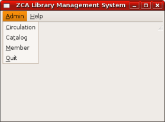
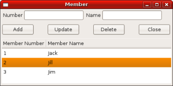
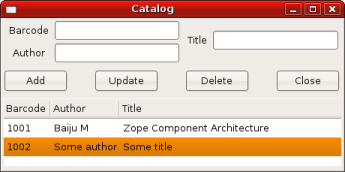
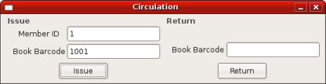

.. Contents::
.. sectnum::

.. note::

  This chapter is not yet completed.  Please send your suggestions !

:原文: http://www.muthukadan.net/docs/zca.html#case-study

介绍
~~~~~~~~~~~~

This chapter demonstrates creating a desktop application using PyGTK
GUI library and the ZCA.  This application also use two different
kinds of data persistence mechanisms, one object database (ZODB) & and
another relational database (SQLite).  However, practically, only one
storage can be used for a particular installation.  The reason for
using two different persistence mechanisms is to demonstrate how to
use the ZCA to glue components.  Majority of the code in this
application is related to PyGTK.

As the application grows you may use the ZCA components wherever you
want pluggability or extensibility.  Use plain Python objects directly
where you do not required pluggability or extensibility.

There is no difference in using ZCA for web or desktop or any other
kind of application or framework.  It is better to follow a
convention for the location from where you are going to register
components.  This application use a convention, which can be extended
by putting registration of similar components in separate modules and
later import them from main registration module.  In this application
the main component registration module is `register.py`.

Source code of this application can be downloaded from:
http://www.muthukadan.net/downloads/zcalib.tar.bz2

使用案例
~~~~~~~~~

The application we are going to discuss here is a library management
system with minimal features.  The requirements can be summarized like
this:

  - Add members with a unique number and name.

  - Add books with barcode, author & title

  - Issue books

  - Return books

The application can be designed in such a way that major features can
be accessed from a single window.  The main window for accessing all
these features can be designed like this:

From member window, user should be able to manage members.  So, it
should be possible to *add*, *update* and *delete* members as shown
in the below picture:

Similar to member window, the catalog window allows user to *add*,
*edit* and *delete* books:

The circulation window should have the facility for issuing and
returning books:

PyGTK代理概览
~~~~~~~~~~~~~~~~~~~~~~

As you can see in the code, most of the code are related to PyGTK.
The code structure is very similar for different windows.  The windows
of this application are designed using Glade GUI builder.  You should
give proper names for widgets you are going to use from code.  In the
main window, all menu entries has names like: circulation, catalog,
member, quit & about.

The ``gtk.glade.XML`` class is used to parse glade file, this will
create GUI widget objects.  This is how to parse and access objects::

  import gtk.glade
  xmlobj = gtk.glade.XML('/path/to/file.glade')
  widget = xmlobj.get_widget('widget_name')

In the mainwindow.py, you can see code like this::

  curdir = os.path.abspath(os.path.dirname(__file__))
  xml = os.path.join(curdir, 'glade', 'mainwindow.glade')
  xmlobj = gtk.glade.XML(xml)

  self.mainwindow = xmlobj.get_widget('mainwindow')

The name of main window widget is `mainwindow`.  Similarly, other
widgets are retrieved like this::

  circulation = xmlobj.get_widget('circulation')
  member = xmlobj.get_widget('member')
  quit = xmlobj.get_widget('quit')
  catalog = xmlobj.get_widget('catalog')
  about = xmlobj.get_widget('about')

Then, these widgets are connected for some events::

  self.mainwindow.connect('delete_event', self.delete_event)
  quit.connect('activate', self.delete_event)
  circulation.connect('activate', self.on_circulation_activate)
  member.connect('activate', self.on_member_activate)
  catalog.connect('activate', self.on_catalog_activate)
  about.connect('activate', self.on_about_activate)

The `delete_event` is the event when the window is closing using the
window close button.  The `activate` event is emitted when the menu is
selected.  The widgets are connected to some callback functions for
some events.

You can see from the above code that, main window is connected to
`on_delete_event` method for `delete_event`.  The `quit` widget is
also connected to same method for `activate` event::

    def on_delete_event(self, *args):
        gtk.main_quit()

The callback function just call `main_quit` function

代码
~~~~~~~~

This is the `zcalib.py`::

  import registry
  import mainwindow

  if __name__ == '__main__':
      registry.initialize()
      try:
          mainwindow.main()
      except KeyboardInterrupt:
          import sys
          sys.exit(1)

Here, two modules are imported `registry` and `mainwindow`.  Then,
registry is initialized and mainwindow's `main` function is called.
If user is trying to exit application using `Ctrl+C`, system will exit
normally, that's why we catched `KeyboardInterrupt` exception.

This is the `registry.py`::

  import sys
  from zope.component import getGlobalSiteManager

  from interfaces import IMember
  from interfaces import IBook
  from interfaces import ICirculation
  from interfaces import IDbOperation

  def initialize_rdb():
      from interfaces import IRelationalDatabase
      from relationaldatabase import RelationalDatabase
      from member import MemberRDbOperation
      from catalog import BookRDbOperation
      from circulation import CirculationRDbOperation

      gsm = getGlobalSiteManager()
      db = RelationalDatabase()
      gsm.registerUtility(db, IRelationalDatabase)

      gsm.registerAdapter(MemberRDbOperation,
                          (IMember,),
                          IDbOperation)

      gsm.registerAdapter(BookRDbOperation,
                          (IBook,),
                          IDbOperation)

      gsm.registerAdapter(CirculationRDbOperation,
                          (ICirculation,),
                          IDbOperation)

  def initialize_odb():
      from interfaces import IObjectDatabase
      from objectdatabase import ObjectDatabase
      from member import MemberODbOperation
      from catalog import BookODbOperation
      from circulation import CirculationODbOperation

      gsm = getGlobalSiteManager()
      db = ObjectDatabase()
      gsm.registerUtility(db, IObjectDatabase)

      gsm.registerAdapter(MemberODbOperation,
                          (IMember,),
                          IDbOperation)

      gsm.registerAdapter(BookODbOperation,
                          (IBook,),
                          IDbOperation)

      gsm.registerAdapter(CirculationODbOperation,
                          (ICirculation,),
                          IDbOperation)

  def check_use_relational_db():
      use_rdb = False
      try:
          arg = sys.argv[1]
          if arg == '-r':
              return True
      except IndexError:
          pass
      return use_rdb

  def initialize():
      use_rdb = check_use_relational_db()
      if use_rdb:
          initialize_rdb()
      else:
          initialize_odb()

Look at the `initialize` function which we are calling from the main
module, `zcalib.py`.  The `initialize` function first check which db
to use, relational database (RDB) or object database (ODB) and this
checking is done at `check_use_relational_db` function.  If `-r`
option is given at command line, it will call `initialize_rdb`
otherwise, `initialize_odb`.  If the RDB function is called, it will
setup all components related to RDB.  On the other hand, if the ODB
function is called, it will setup all components related to ODB.

Here is the `mainwindow.py`::

  import os
  import gtk
  import gtk.glade

  from circulationwindow import circulationwindow
  from catalogwindow import catalogwindow
  from memberwindow import memberwindow

  class MainWindow(object):

      def __init__(self):
          curdir = os.path.abspath(os.path.dirname(__file__))
          xml = os.path.join(curdir, 'glade', 'mainwindow.glade')
          xmlobj = gtk.glade.XML(xml)

          self.mainwindow = xmlobj.get_widget('mainwindow')
          circulation = xmlobj.get_widget('circulation')
          member = xmlobj.get_widget('member')
          quit = xmlobj.get_widget('quit')
          catalog = xmlobj.get_widget('catalog')
          about = xmlobj.get_widget('about')

          self.mainwindow.connect('delete_event', self.delete_event)
          quit.connect('activate', self.delete_event)

          circulation.connect('activate', self.on_circulation_activate)
          member.connect('activate', self.on_member_activate)
          catalog.connect('activate', self.on_catalog_activate)
          about.connect('activate', self.on_about_activate)

      def delete_event(self, *args):
          gtk.main_quit()

      def on_circulation_activate(self, *args):
          circulationwindow.show_all()

      def on_member_activate(self, *args):
          memberwindow.show_all()

      def on_catalog_activate(self, *args):
          catalogwindow.show_all()

      def on_about_activate(self, *args):
          pass

      def run(self):
          self.mainwindow.show_all()

  def main():
      mainwindow = MainWindow()
      mainwindow.run()
      gtk.main()

The `main` function here creates an instance of `MainWindow` class,
which will initialize all widgets.

Here is the `memberwindow.py`::

  import os
  import gtk
  import gtk.glade

  from zope.component import getAdapter

  from components import Member
  from interfaces import IDbOperation

  class MemberWindow(object):

      def __init__(self):
          curdir = os.path.abspath(os.path.dirname(__file__))
          xml = os.path.join(curdir, 'glade', 'memberwindow.glade')
          xmlobj = gtk.glade.XML(xml)

          self.memberwindow = xmlobj.get_widget('memberwindow')
          self.number = xmlobj.get_widget('number')
          self.name = xmlobj.get_widget('name')
          add = xmlobj.get_widget('add')
          update = xmlobj.get_widget('update')
          delete = xmlobj.get_widget('delete')
          close = xmlobj.get_widget('close')
          self.treeview = xmlobj.get_widget('treeview')

          self.memberwindow.connect('delete_event', self.on_delete_event)
          add.connect('clicked', self.on_add_clicked)
          update.connect('clicked', self.on_update_clicked)
          delete.connect('clicked', self.on_delete_clicked)
          close.connect('clicked', self.on_delete_event)

          self.initialize_list()

      def show_all(self):
          self.populate_list_store()
          self.memberwindow.show_all()

      def populate_list_store(self):
          self.list_store.clear()
          member = Member()
          memberdboperation = getAdapter(member, IDbOperation)
          members = memberdboperation.get()
          for member in members:
              number = member.number
              name = member.name
              self.list_store.append((member, number, name,))

      def on_delete_event(self, *args):
          self.memberwindow.hide()
          return True

      def initialize_list(self):
          self.list_store = gtk.ListStore(object, str, str)
          self.treeview.set_model(self.list_store)
          tvcolumn = gtk.TreeViewColumn('Member Number')
          self.treeview.append_column(tvcolumn)

          cell = gtk.CellRendererText()
          tvcolumn.pack_start(cell, True)
          tvcolumn.add_attribute(cell, 'text', 1)

          tvcolumn = gtk.TreeViewColumn('Member Name')
          self.treeview.append_column(tvcolumn)

          cell = gtk.CellRendererText()
          tvcolumn.pack_start(cell, True)
          tvcolumn.add_attribute(cell, 'text', 2)

      def on_add_clicked(self, *args):
          number = self.number.get_text()
          name = self.name.get_text()
          member = Member()
          member.number = number
          member.name = name
          self.add(member)
          self.list_store.append((member, number, name,))

      def add(self, member):
          memberdboperation = getAdapter(member, IDbOperation)
          memberdboperation.add()

      def on_update_clicked(self, *args):
          number = self.number.get_text()
          name = self.name.get_text()
          treeselection = self.treeview.get_selection()
          model, iter = treeselection.get_selected()
          if not iter:
              return
          member = self.list_store.get_value(iter, 0)
          member.number = number
          member.name = name
          self.update(member)
          self.list_store.set(iter, 1, number, 2, name)

      def update(self, member):
          memberdboperation = getAdapter(member, IDbOperation)
          memberdboperation.update()

      def on_delete_clicked(self, *args):
          treeselection = self.treeview.get_selection()
          model, iter = treeselection.get_selected()
          if not iter:
              return
          member = self.list_store.get_value(iter, 0)
          self.delete(member)
          self.list_store.remove(iter)

      def delete(self, member):
          memberdboperation = getAdapter(member, IDbOperation)
          memberdboperation.delete()

  memberwindow = MemberWindow()

Here is the `components.py`::

  from zope.interface import implements

  from interfaces import IBook
  from interfaces import IMember
  from interfaces import ICirculation

  class Book(object):

      implements(IBook)

      barcode = ""
      title = ""
      author = ""

  class Member(object):

      implements(IMember)

      number = ""
      name = ""

  class Circulation(object):

      implements(ICirculation)

      book = Book()
      member = Member()

Here is the `interfaces.py`::

  from zope.interface import Interface
  from zope.interface import Attribute

  class IBook(Interface):

      barcode = Attribute("Barcode")
      author = Attribute("Author of book")
      title = Attribute("Title of book")

  class IMember(Interface):

      number = Attribute("ID number")
      name = Attribute("Name of member")

  class ICirculation(Interface):

      book = Attribute("A book")
      member = Attribute("A member")

  class IRelationalDatabase(Interface):

      def commit():
          pass

      def rollback():
          pass

      def cursor():
          pass

      def get_next_id():
          pass

  class IObjectDatabase(Interface):

      def commit():
          pass

      def rollback():
          pass

      def container():
          pass

      def get_next_id():
          pass

  class IDbOperation(Interface):

      def get():
          pass

      def add():
          pass

      def update():
          pass

      def delete():
          pass

Here is the `member.py`::

  from zope.interface import implements
  from zope.component import getUtility
  from zope.component import adapts

  from components import Member

  from interfaces import IRelationalDatabase
  from interfaces import IObjectDatabase
  from interfaces import IMember
  from interfaces import IDbOperation

  class MemberRDbOperation(object):

      implements(IDbOperation)
      adapts(IMember)

      def __init__(self, member):
          self.member = member

      def get(self):
          db = getUtility(IRelationalDatabase)
          cr = db.cursor()
          number = self.member.number
          if number:
              cr.execute("""SELECT
                              id,
                              number,
                              name
                            FROM members
                            WHERE number = ?""",
                         (number,))
          else:
              cr.execute("""SELECT
                              id,
                              number,
                              name
                            FROM members""")
          rst = cr.fetchall()
          cr.close()
          members = []
          for record in rst:
              id = record['id']
              number = record['number']
              name = record['name']
              member = Member()
              member.id = id
              member.number = number
              member.name = name
              members.append(member)
          return members

      def add(self):
          db = getUtility(IRelationalDatabase)
          cr = db.cursor()
          next_id = db.get_next_id("members")
          number = self.member.number
          name = self.member.name
          cr.execute("""INSERT INTO members
                          (id, number, name)
                        VALUES (?, ?, ?)""",
                     (next_id, number, name))
          cr.close()
          db.commit()
          self.member.id = next_id

      def update(self):
          db = getUtility(IRelationalDatabase)
          cr = db.cursor()
          number = self.member.number
          name = self.member.name
          id = self.member.id
          cr.execute("""UPDATE members
                          SET
                             number = ?,
                             name = ?
                        WHERE id = ?""",
                     (number, name, id))
          cr.close()
          db.commit()

      def delete(self):
          db = getUtility(IRelationalDatabase)
          cr = db.cursor()
          id = self.member.id
          cr.execute("""DELETE FROM members
                        WHERE id = ?""",
                     (id,))
          cr.close()
          db.commit()

  class MemberODbOperation(object):

      implements(IDbOperation)
      adapts(IMember)

      def __init__(self, member):
          self.member = member

      def get(self):
          db = getUtility(IObjectDatabase)
          zcalibdb = db.container()
          members = zcalibdb['members']
          return members.values()

      def add(self):
          db = getUtility(IObjectDatabase)
          zcalibdb = db.container()
          members = zcalibdb['members']
          number = self.member.number
          if number in [x.number for x in members.values()]:
              db.rollback()
              raise Exception("Duplicate key")
          next_id = db.get_next_id('members')
          self.member.id = next_id
          members[next_id] = self.member
          db.commit()

      def update(self):
          db = getUtility(IObjectDatabase)
          zcalibdb = db.container()
          members = zcalibdb['members']
          id = self.member.id
          members[id] = self.member
          db.commit()

      def delete(self):
          db = getUtility(IObjectDatabase)
          zcalibdb = db.container()
          members = zcalibdb['members']
          id = self.member.id
          del members[id]
          db.commit()

PySQLite
~~~~~~~~

ZODB
~~~~

Conclusions
~~~~~~~~~~~

